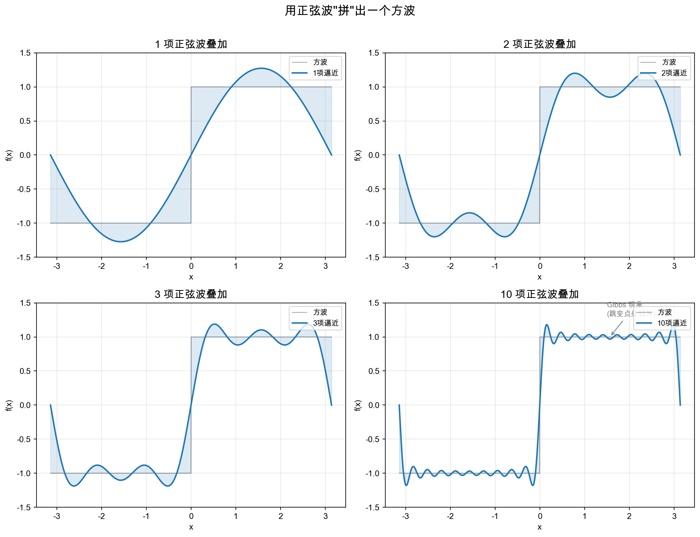
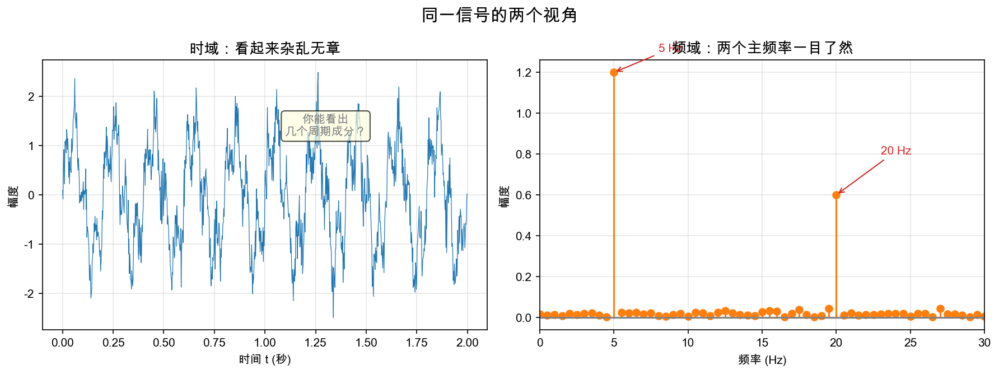
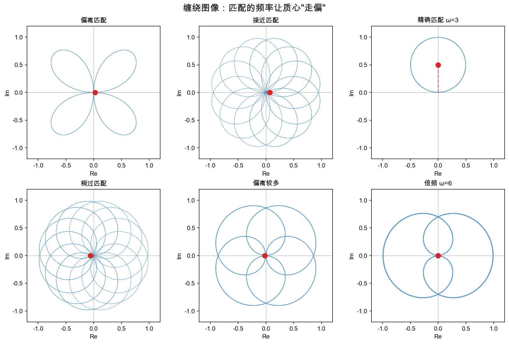
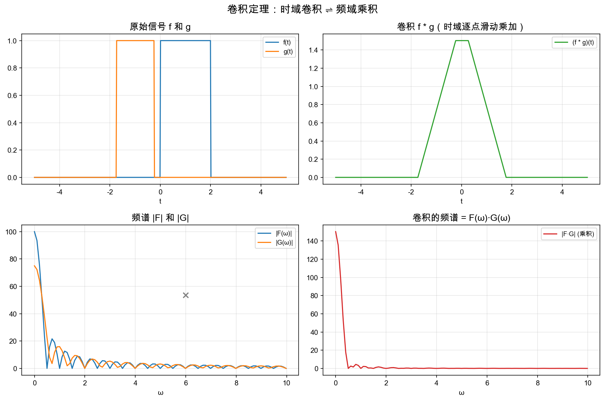

# 重学数学之一: 傅里叶变换

## 一、一个大胆的问题

1807 年，约瑟夫·傅里叶向法国科学院提交了一篇论文。在这篇论文里，他提出了一个在当时看来近乎狂妄的主张：

> **非常广泛的一类周期函数，都可以用正弦波与余弦波的叠加来表示。**

傅里叶当年的说法比现代定理更大胆，常被概括成“任何周期函数都可以这样展开”。

现代数学必须立刻追问：函数属于什么空间，“写成”又是哪一种收敛？例如，平方可积的周期函数可以在 $L^2$ 的平方平均意义下由 Fourier 级数逼近；若希望逐点或一致收敛，还要增加别的条件。傅里叶当年的大胆之处，在于先抓住了正确的结构直觉，而严格的收敛理论后来才由 Dirichlet、Riemann、Lebesgue、Hilbert 等人逐步补齐。

今天我们回头看，这个主张几乎定义了整个信号处理、现代物理学、以及一大块应用数学。但在当时，拉格朗日和拉普拉斯等数学界权威认为这显然是错的——你怎么能用光滑的正弦波拼出一个有尖角的函数？

傅里叶最终在 1822 年的《热的解析理论》中系统地展开了他的想法。顺带一提，他研究这个问题的出发点非常具体：**热传导方程**——一个偏微分方程。他是为了解决物理问题才发明了这套数学工具。这并非孤例：数学里最伟大的发明，几乎从来没有在纯粹的形式推导中诞生，它们总是从某个具体问题中获得生命。

## 二、如果你是傅里叶，你会怎么想？

让我们暂时忘掉所有的公式和定理。假设你活在 1800 年，面对这样一个问题：

一根金属棒，一端加热，你知道棒上任何一点的温度 `u(x, t)` 满足热传导方程：

$$
\frac{\partial u}{\partial t} = \alpha \frac{\partial^2 u}{\partial x^2}
$$

初始时刻的温度分布 `u(x, 0)` 是已知的。你怎么解这个方程？

### 2.1 先解决最简单的情况

你可能会想："如果我把困难的问题化简为一些基本情况的组合呢？"

正弦函数有一个极其美妙的性质：它在求导之后**仍然是正弦函数**（顶多差一个常数因子和相位）。具体来说：

$$
\frac{d}{dx} \sin(kx) = k \cos(kx) = k \sin(kx + \frac{\pi}{2})
$$

二阶导数更简单——函数形式完全不变：

$$
\frac{d^2}{dx^2} \sin(kx) = -k^2 \sin(kx)
$$

这就意味着：**如果初始温度分布恰好是一个正弦波，那么热方程的解就是另一个正弦波衰减**——问题变得极度简化！

实际上，代入 $u(x,t) = A(t) \sin(kx)$ 到热方程：

$$
A'(t) \sin(kx) = -\alpha k^2 A(t) \sin(kx) \quad\Rightarrow\quad A(t) = A(0) e^{-\alpha k^2 t}
$$

所以一个以频率 `k` 振荡的温度分布，就按照 $e^{-\alpha k^2 t}$ 的速率衰减。高频分量衰减得比低频快得多——热扩散平滑掉尖锐的温度变化，这就是其数学本质。

### 2.2 关键一跃

现在的问题是：任意的初始温度分布 $u(x,0)$ 通常**不是**一个正弦波。

但如果我们能把它写成很多正弦波的和呢？

$$
u(x,0) = A_1 \sin(x) + A_2 \sin(2x) + A_3 \sin(3x) + \cdots
$$

那我们就已经解决问题了！因为每个分量独立地按照 $e^{-\alpha k^2 t}$ 衰减：

$$
u(x,t) = A_1 \sin(x) e^{-\alpha \cdot 1^2 \cdot t} + A_2 \sin(2x) e^{-\alpha \cdot 2^2 \cdot t} + A_3 \sin(3x) e^{-\alpha \cdot 3^2 \cdot t} + \cdots
$$

这正是**线性叠加原理**的威力：把复杂输入分解为简单输入的线性组合，分别处理后再合并。这个方法后来演变为整个数学物理的核心范式。

上图展示了这个思想在几何上是什么样子的：一个尖锐的方波，仅用几个最低频率的正弦波就能大致逼近。随着我们加入更多高频项，逼近越来越精确——尽管在跳变点处总会留有过冲（Gibbs 现象），但它在平方平均的意义上确实收敛。

## 三、换个角度看：函数空间上的基底变换

### 3.1 函数也是向量

我们在线性代数中学过：一个 n 维向量可以用一组标准基底表示：

$$
v = c_1 e_1 + c_2 e_2 + \cdots + c_n e_n
$$

系数 $c_i$ 通过内积得到：$c_i = \langle v, e_i \rangle$。

傅里叶做的事情本质上一模一样——只不过基底变成了无穷多个正弦函数：

$$
f(x) = \sum_{k=1}^{\infty} b_k \sin(kx) \quad\text{（对奇函数）}
$$

系数通过**函数内积**得到：

$$
b_k = \frac{2}{\pi} \int_0^{\pi} f(x) \sin(kx) \, dx
$$

为什么是内积？因为函数空间上的内积定义为：

$$
\langle f, g \rangle = \int f(x) g(x) \, dx
$$

而正弦函数（以及余弦函数）恰好构成一组**正交基底**：

$$
\int_{-\pi}^{\pi} \sin(mx) \sin(nx) \, dx = 0 \quad (m \neq n)
$$

这不是巧合——正弦函数的正交性是傅里叶方法的数学根基。它意味着每个频率分量可以独立提取，不会互相干扰。

### 3.2 从级数到变换：连续频谱

傅里叶级数处理的是周期函数，得到的是**离散频谱**（频率为基本频率的整数倍）。但如果我们把周期推到无穷大——函数不再重复，我们需要**所有频率**（包括非整数倍）来合成它。系数序列变成了关于连续频率的函数：

$$
\hat{f}(\omega) = \int_{-\infty}^{\infty} f(t) \, e^{-i\omega t} \, dt
$$

逆变换：

$$
f(t) = \frac{1}{2\pi} \int_{-\infty}^{\infty} \hat{f}(\omega) \, e^{i\omega t} \, d\omega
$$

这里我把正弦/余弦合并成了复指数 $e^{i\omega t} = \cos(\omega t) + i \sin(\omega t)$。这不改变本质（只是基底从正弦换成了复指数），但大大简化了符号。

上图说明了傅里叶变换的核心功能：**在时间域里看起来复杂到无法分析的信号，一旦送到频率域，其内部结构就暴露无遗。** 两个主频率一目了然，而时域里你连有几个周期分量都数不清。

## 四、缠绕机：一种几何直觉

前面的定义是用积分和公式给出的——它们正确，但不够直观。如果我们不想过早跳入代数，有没有更好的方式理解傅里叶变换？

有。3Blue1Brown 的视频给出了一个绝佳的几何视角。

想象你把信号 `f(t)` 缠绕到一个旋转的圆周上：信号的值决定缠绕点离圆心多远，而缠绕的角速度由你选择的 "测试频率" ω 控制。在每一个时刻 t，缠绕点的位置是：

$$
f(t) \cdot e^{-i\omega t}
$$

现在取所有这些缠绕点的**质心**（即时间平均）：

$$
\text{质心} = \int f(t) \, e^{-i\omega t} \, dt
$$

这恰好就是傅里叶变换的公式。

**当测试频率 ω 恰好等于信号中的某个频率分量时**，所有的缠绕点会偏向同一个方向，质心显著偏离原点——表现为频谱上的一个峰值。当测试频率不匹配时，缠绕点均匀散开，质心靠近原点。

这个几何图像解释了傅里叶变换到底在做什么：**它在用不同速度将信号缠绕到圆周上，并测量每次缠绕后图样的"偏置"程度**。这是一个纯粹的几何操作——没有魔法，只有旋转和平均。

## 五、卷积定理：傅里叶变换的杀手锏

如果说傅里叶变换只有一个性质值得你永远记住，那就是这个：

$$
\mathcal{F}[f * g] = \mathcal{F}[f] \cdot \mathcal{F}[g]
$$

**时域中的卷积 = 频域中的乘积。**

反过来也成立：

$$
\mathcal{F}[f \cdot g] = \mathcal{F}[f] * \mathcal{F}[g]
$$

为什么这个性质如此重要？因为**卷积描述了所有线性时不变系统的行为**。当你对信号施加一个滤波器，你就是在做卷积；当你让声音穿过房间产生混响，你就是在做卷积；当你用相机拍照（镜头模糊），你还是在做卷积。

卷积的直接计算很笨重——每个输出点都需要 O(n) 次乘加运算，总共 O(n²)。但有了卷积定理，你可以：

1. 对信号和滤波器分别做 FFT → O(n log n)
2. 在频域逐点相乘 → O(n)
3. 逆 FFT 得到卷积结果 → O(n log n)

总复杂度从 O(n²) 降到 O(n log n)。这不仅是一个算法技巧——在周期边界或离散循环卷积的设置下，**傅里叶基底将卷积算子对角化了**。在频率域中，卷积不再是复杂的"滑动乘加"，而退化为逐点的乘法；对有限区间、非周期边界或一般边界条件，则要改用相应的变换和算子分析。

## 六、Discrete 通向 Computable：DFT 和 FFT

到目前为止的讨论都在连续域进行。但计算机处理的是离散的、有限的采样点。把连续傅里叶变换搬到离散世界，得到的是**离散傅里叶变换（DFT）**：

$$
X[k] = \sum_{n=0}^{N-1} x[n] \, e^{-i 2\pi k n / N}
$$

这本质上是将长度为 N 的向量乘以一个 N×N 的矩阵 $W_{kn} = e^{-i 2\pi k n / N}$。暴力计算一个长度为 N 的 DFT 需要 O(N²) 次运算。

**快速傅里叶变换（FFT）** 将这个复杂度降低到 O(N log N)。核心思想极其优雅——**分治**：

把长度为 N 的信号拆成奇数位置和偶数位置两部分：

$$
X[k] = E[k] + e^{-i 2\pi k / N} \cdot O[k]
$$

其中 `E[k]` 是偶数位置的 DFT，`O[k]` 是奇数位置的 DFT。然后递归地对两个长度为 N/2 的子问题做同样的事。因为 $e^{-i 2\pi (k+N/2) / N} = -e^{-i 2\pi k / N}$，我们可以重用一半的计算结果。

这就是 Cooley-Tukey 算法的核心——也是为什么你的 JPEG 图片、MP3 音乐、以及每一次 4G/5G 通信中都能看到傅里叶变换的身影。FFT 把数学上的优雅变成了工程上的可行。

## 七、应用场景

傅里叶变换是现代技术中渗透得最深的一个数学概念，没有之一。以下是它的主战场：

### 信号与图像处理

| 应用 | 傅里叶变换扮演的角色 |
|------|-------------------|
| JPEG 压缩 | 将图像切成 8×8 块，对每块做 DCT（离散余弦变换，傅里叶的近亲），丢弃高频分量实现压缩 |
| MP3 / AAC 音频压缩 | 将音频帧变换到频域，利用人耳的心理声学掩蔽效应丢弃听不见的频率分量 |
| 降噪 | 在频域中将低幅度的频率分量归零（噪声通常分布在所有频率上，信号集中在少数频率） |
| 图像锐化/模糊 | 在频域中对高频做增强或抑制 |
| 通信（OFDM） | 4G LTE 和 Wi-Fi 使用 OFDM，将高速数据流分配到多个正交的子载波上——正是利用了不同频率正弦波的正交性 |

### 物理与工程

| 领域 | 傅里叶变换的角色 |
|------|----------------|
| 量子力学 | 位置表象和动量表象之间通过傅里叶变换联系；海森堡不确定性原理本质上就是傅里叶变换的时频不确定性 |
| 光学 | 透镜天然执行二维傅里叶变换——焦平面上的光强分布恰好是入射光的空间频谱 |
| 振动分析 | 机械系统的振动信号做 FFT 后，频谱中的峰值直接对应特定物理故障（轴承磨损、齿轮缺陷） |
| 核磁共振（MRI） | k-空间（原始扫描数据）到实际图像的转换就是一次二维傅里叶逆变换 |
| X 射线晶体学 | 晶体的衍射图样就是其电子密度的傅里叶变换——从衍射图反推分子结构 = 反傅里叶变换 |

### 纯粹数学

傅里叶变换在调和分析（函数空间分解）、偏微分方程（基本解和 Green 函数）、数论（Poisson 求和公式与模形式）等领域都是基础工具。它开启了不止一个数学分支——而是贯穿了分析、代数、几何和数论。

## 八、前沿展望

### 8.1 图傅里叶变换：当信号不再生活在直线上

经典傅里叶变换依赖一个很强的背景假设：信号定义在直线、平面或周期空间上，因此"平移"是清楚的。

但很多现代数据不在规则网格上，而在图上：

- 社交网络中的用户信号。
- 交通网络中的拥堵状态。
- 分子图上的原子特征。
- 传感器网络中的空间读数。

在图上没有普通意义的正弦波，也没有天然平移。图傅里叶变换的做法是用图 Laplacian 的特征向量代替正弦基：

$$
L u_k=\lambda_k u_k
$$

小的 $\lambda_k$ 对应在图上变化缓慢的模式，大的 $\lambda_k$ 对应振荡剧烈的模式。于是频率不再来自"每秒振动几次"，而来自"沿图边变化得有多快"。

这条线索直接通向图信号处理和图神经网络。图卷积的一个来源，就是把经典卷积定理搬到图谱域中：先按 Laplacian 特征向量分解，再在频域设计滤波器。

### 8.2 Fourier Neural Operator：学习函数到函数的映射

传统神经网络通常学习有限维映射：

$$
\mathbb R^n\to\mathbb R^m
$$

但 PDE 问题更自然的对象是算子：

$$
a(x)\mapsto u(x)
$$

也就是从一个函数映到另一个函数。

Fourier Neural Operator（Li 等，2020）的关键做法是在频域中参数化积分核。每一层大致做三件事：

1. 把函数变到傅里叶域。
2. 只在低频或有限频率上学习变换。
3. 逆变换回物理空间，再加非线性。

这不是简单地"把 FFT 塞进网络"，而是继承了傅里叶方法最核心的思想：许多 PDE 解算子在频域中有更清晰的结构。

它也说明第一章的主题没有停留在经典信号处理。傅里叶变换正在成为科学机器学习中学习算子、加速 PDE surrogate、做跨分辨率预测的基础部件。

### 8.3 压缩感知：采样不一定要按 Nyquist 规则硬来

Nyquist 采样定理说，如果信号最高频率有限，就要用足够高的采样率避免混叠。

压缩感知换了一个问题：

> **如果信号在某个基底下是稀疏的，能不能用远少于传统采样数的数据恢复它？**

许多真实信号在傅里叶、小波或其他字典下确实是稀疏的。于是恢复问题可以写成：

$$
\min_x \|x\|_1 \quad \text{s.t.}\quad Ax=y
$$

$\ell^1$ 正则化倾向于选择稀疏解。MRI、雷达成像、天文观测和单像素相机都受益于这种思想。

这也把傅里叶分析、凸优化和统计学习接在一起：频域给出稀疏表示，随机采样提供可恢复性，凸优化负责从不完整观测中重建。

### 8.4 快速调和分析：不规则数据上的傅里叶计算

FFT 之所以快，是因为采样点在规则网格上，频率也有严格结构。

但现实中常常不是这样：

- MRI 的 k-space 采样轨迹可能不规则。
- 天文和地球物理数据常在非均匀位置采样。
- 高频波传播会出现复杂相位函数。
- PDE 与反问题中会遇到 Fourier integral operator。

这推动了非均匀 FFT（NUFFT）、butterfly factorization、快速多极子方法等快速调和分析算法的发展。

它们共同回答一个问题：

> **当傅里叶结构还在，但规则网格不在时，怎样保留 FFT 的计算优势？**

这条路线让傅里叶分析从"规则信号的频谱工具"扩展成了处理不规则几何、快速积分、成像反演和高频 PDE 的通用计算语言。

## 九、总结：傅里叶变换究竟是什么

用一句话说：

> **傅里叶变换是从函数空间到频率空间的基底变换，在这个新基底下，平移不变的算子（卷积）被对角化了。**

拆解这句话的每一层：

1. **基底变换** —— 从"逐点看函数"变为"按频率成分看函数"。时域和频域是同一种信息在不同坐标系下的表达。
2. **对角化** —— 傅里叶基底是卷积算子的特征向量。在这个基底下，卷积变成乘法。这是线代原理在无穷维函数空间上的延伸。
3. **频率成分** —— 在这组基底下，坐标的含义是"该频率的幅度和相位"。这组坐标值就是频谱。

傅里叶变换之所以如此普遍和重要，恰恰是因为：**自然界里大量的系统都是线性时不变的**——或者说，在足够小的尺度上可以近似为线性时不变。而对这些系统来说，傅里叶基底就是天然的"语言"。用这种语言说话，复杂的问题就变得简单。

---

*下一章预告：我们将看到傅里叶变换如何自然地推广到局部频率分析——即小波变换。傅里叶变换能告诉你信号中有哪些频率，但它说不清这些频率**何时**出现。小波变换同时回答"什么频率"和"在什么时候"。*
