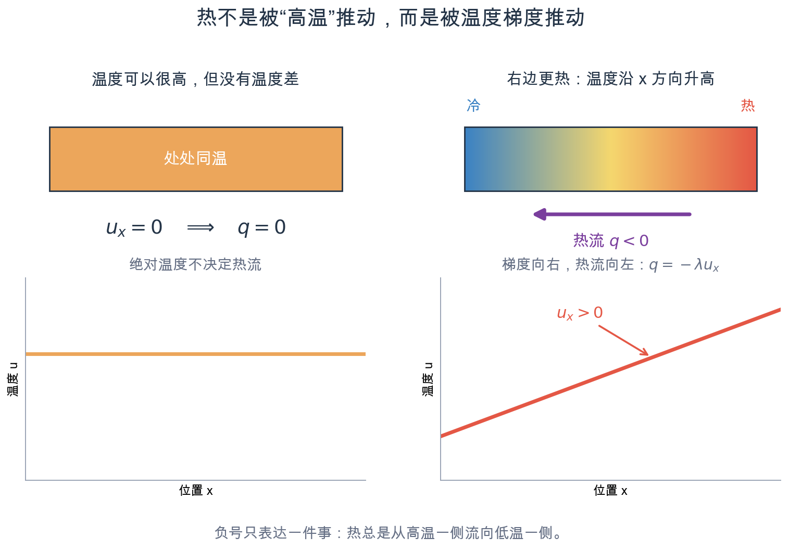
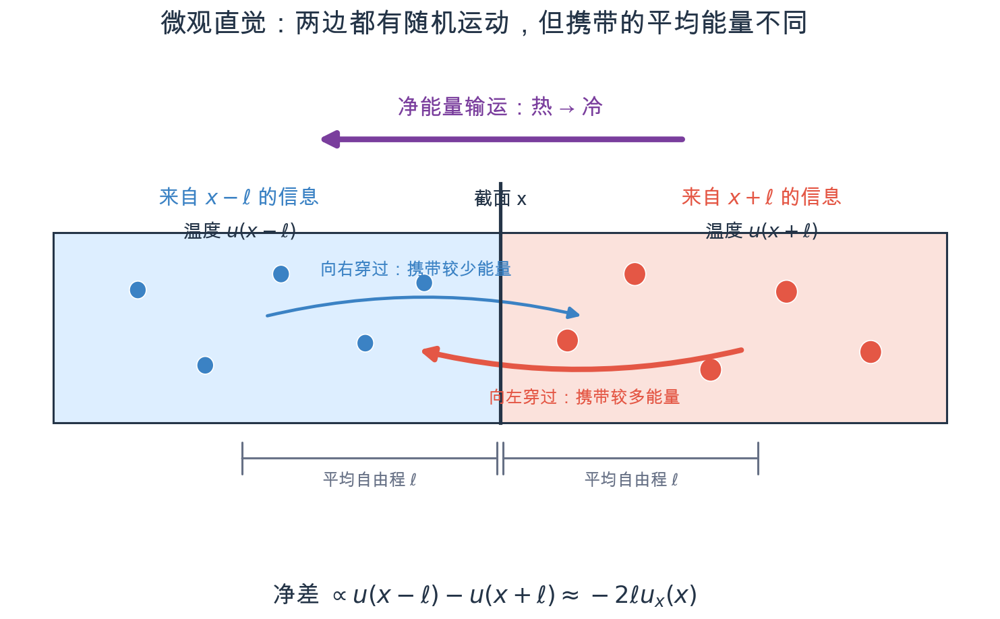
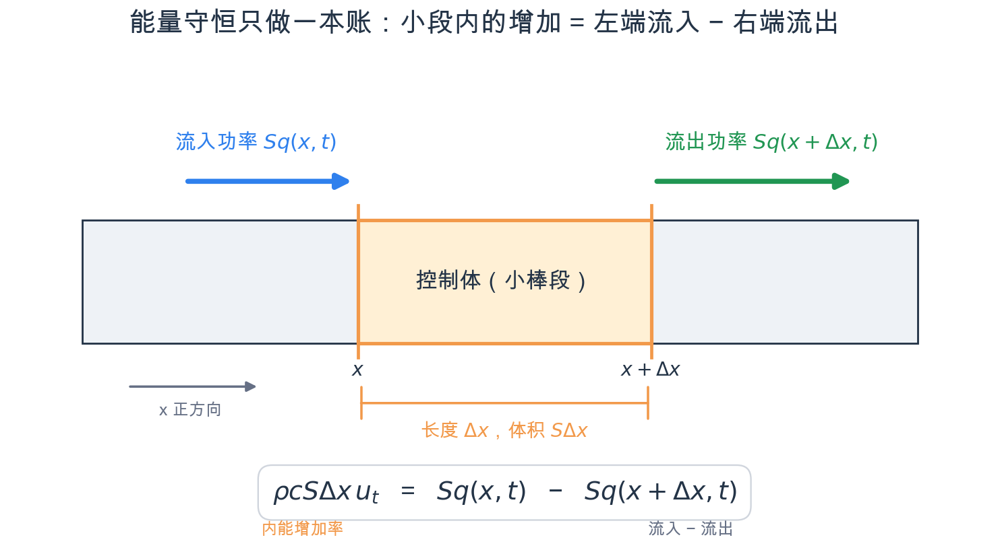
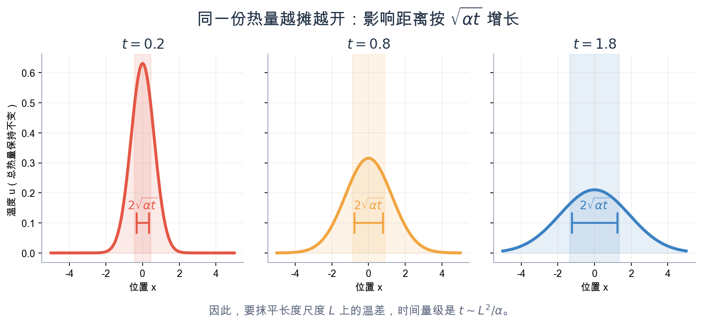
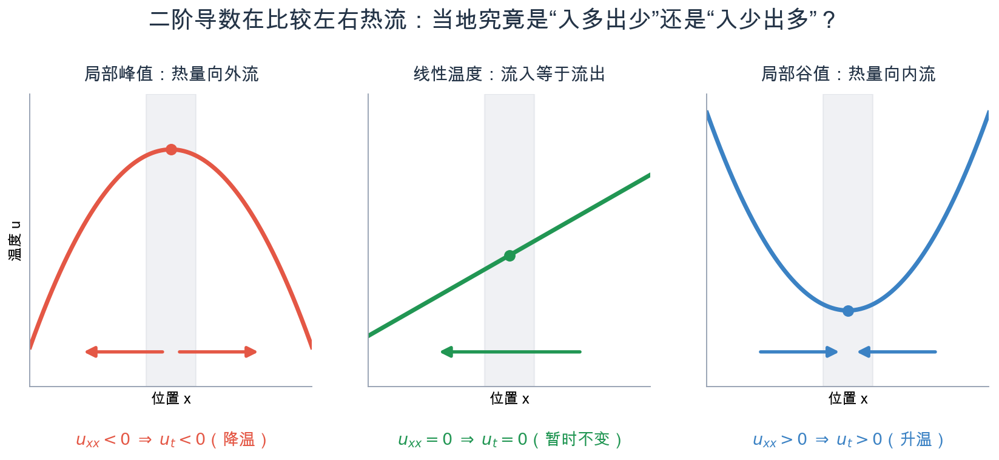
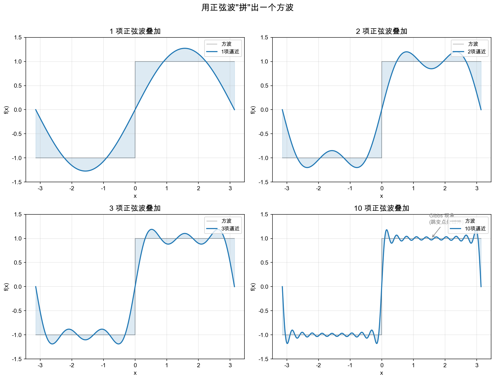
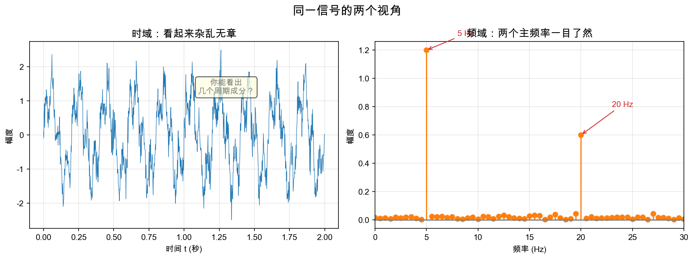
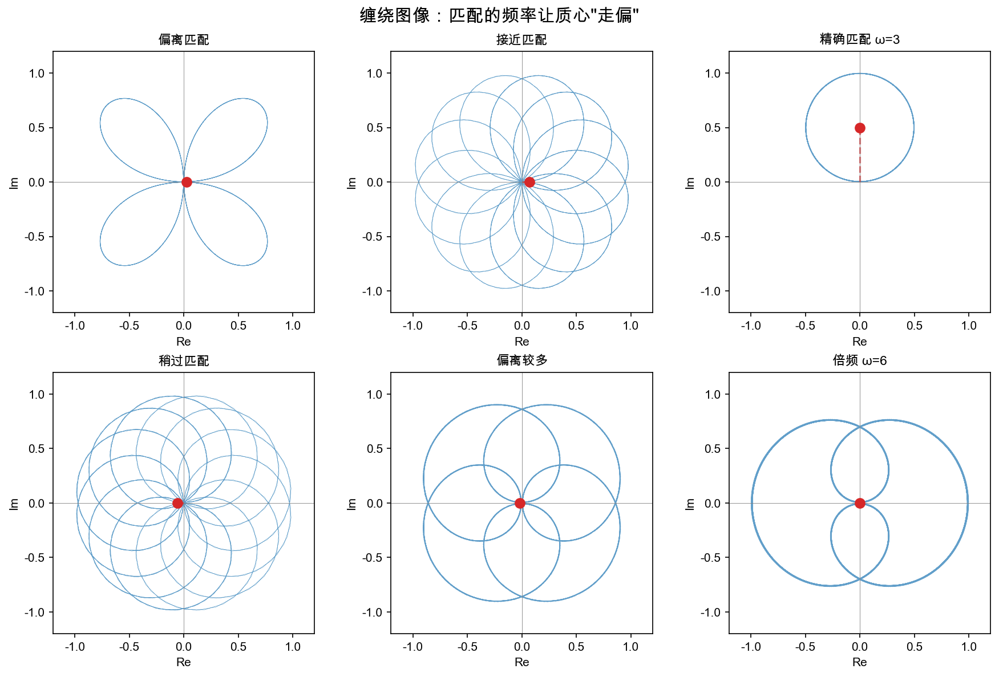
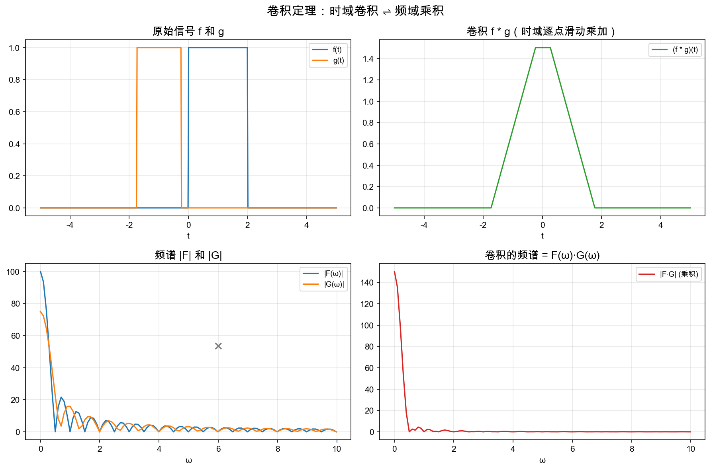

# 重学数学之一：傅里叶变换

## 阅读说明

| 项目 | 内容 |
| --- | --- |
| 主问题 | 为什么正弦、余弦能够分解热扩散与信号问题？连续 Fourier 变换、DFT 和 FFT 之间是什么关系？ |
| 预备知识 | 一元与多元微积分、常微分方程、复数、线性代数中的内积与正交基；接触过偏微分方程会更顺畅，但不是必需。 |
| 核心结果 | 正弦系统在 $L^2(0,L)$ 中的完备性；热方程的 Fourier 级数解；Schwartz 函数的 Fourier 反演；卷积定理；DFT 反演与 radix-2 FFT 分解。 |
| 本章边界 | 重点讨论一维 Fourier 分析。一般 $L^p$ 乘子、分布、抽象局部紧群上的调和分析只作提示。 |

除非另有说明，本章函数取复值；实值函数是其特例。连续 Fourier 变换统一采用角频率约定

$$
\widehat f(\omega)=\int_{\mathbb R}f(t)e^{-i\omega t}\mkern3mu dt,
\qquad
f(t)=\frac{1}{2\pi}\int_{\mathbb R}\widehat f(\omega)e^{i\omega t}\mkern3mu d\omega.
$$

在复 Hilbert 空间中使用对第一个变量线性的内积

$$
\langle f,g\rangle=\int f(x)\overline{g(x)}\mkern3mu dx.
$$

$\mathcal S(\mathbb R)$ 表示 Schwartz 空间：其中的函数无限可微，并且函数及其每阶导数都比任意多项式倒数衰减得更快。需要交换积分、求和、极限或微分时，正文会明确说明条件。

## 一、一个大胆的问题

1807 年，约瑟夫·傅里叶向法国科学院提交了关于固体热传播的论文；1811 年的扩充稿获得科学院征文奖，但评审仍指出论证的严格性与一般性不足。1822 年，他在《热的解析理论》中系统整理了这套方法（见参考资料 [1, 2]）。

傅里叶方法的核心主张可以用现代语言谨慎地概括为：

> **相当广泛的一类周期函数，可以用正弦、余弦的叠加表示；但“表示”的含义取决于函数空间与收敛方式。**

现代数学必须继续追问：函数属于什么空间？等式是逐点成立、几乎处处成立，还是仅在 $L^2$ 的平方平均意义下成立？例如，平方可积周期函数的 Fourier 级数在 $L^2$ 意义下收敛；若要保证逐点或一致收敛，则必须增加正则性条件。早期争论不宜简化成“光滑正弦不能拼出尖角”，真正困难在于如何界定可展开的函数类，以及如何证明相应的收敛。

这套理论的起点不是抽象的频谱概念，而是一个具体的偏微分方程：给定物体最初的温度分布，怎样预测热量随时间传播？

## 二、如果你是傅里叶，你会怎么想？

让我们暂时忘掉所有的公式和定理。假设你活在 1800 年，面对这样一个问题：

一根细长的金属棒上有一段不均匀的温度分布。我们用 $u(x,t)$ 表示位置 $x$ 在时刻 $t$ 的温度。傅里叶要解决的问题是：给定初始温度和金属棒两端的情况，之后的温度会怎样变化？

通常教材会直接写出热传导方程：

$$
\frac{\partial u}{\partial t} = \alpha \frac{\partial^2 u}{\partial x^2}
$$

但这个式子不是凭空猜出来的。它是**能量守恒**和**傅里叶热传导定律**合在一起的结果。先把它从物理图景中推出来，再讨论怎样求解。

### 2.1 热传导方程从哪里来？

先作几个理想化假设：金属棒很细，横截面积为 $S$，所以同一个横截面上的温度近似相同；材料均匀且各向同性；棒的侧面绝热，内部也没有热源。材料的三个参数是：

| 符号 | 物理量 | 单位 |
|------|--------|------|
| $\rho$ | 密度 | $\mathrm{kg/m^3}$ |
| $c$ | 比热容 | $\mathrm{J/(kg\cdot K)}$ |
| $\lambda$ | 热导率 | $\mathrm{W/(m\cdot K)}$ |

在棒上截取一个很短的小段 $[x,x+\Delta x]$。它的体积是 $S\Delta x$，质量是 $\rho S\Delta x$。温度每升高 $\Delta u$，这段金属增加的内能近似为

$$
\Delta E=\rho cS\Delta x\mkern3mu \Delta u.
$$

因此，它在单位时间内储存内能的速率是

$$
\frac{\partial E}{\partial t}
=\rho cS\Delta x\frac{\partial u}{\partial t}.
$$

内能为什么会变化？因为热量从小段两端流入或流出。设 $q(x,t)$ 是沿 $x$ 正方向、单位面积上的热流密度，单位为 $\mathrm{W/m^2}$。傅里叶热传导定律说

$$
q(x,t)=-\lambda\frac{\partial u}{\partial x}.
$$

这里需要区分两类物理规律：**能量守恒只规定热量不能凭空产生或消失，却没有规定热怎样流动**；$q=-\lambda u_x$ 是额外引入的**本构定律**。

“本构”可以理解为“材料由什么构成，决定它怎样响应外界”。本构定律就是把某种外界作用与材料产生的响应联系起来的关系：在这里，外界作用是温度梯度 $u_x$，材料响应是热流 $q$。它不像能量守恒那样对所有材料都普遍成立，而是对某类材料在一定条件下行为的实验概括或近似模型。可以简单地记成：**守恒律负责记账，本构定律说明账里的能量具体怎样流动**。不同材料都要遵守同一条能量守恒律，却可以有不同的热导率 $\lambda$，甚至采用不同于 $q=-\lambda u_x$ 的本构关系。

傅里叶热传导定律最初来自实验，但它的形式并不神秘。

首先，热流不应取决于温度的绝对数值，而应取决于邻近位置的温度差。如果整根棒温度处处相同，即使温度很高，也不会产生净热流。因此，在局部模型中应把热流写成温度梯度 $g=u_x$ 的函数：

$$
q=F(g),\qquad F(0)=0.
$$

把金属棒的方向反过来看，梯度和热流都应反号，所以对均匀、各向同性的材料有 $F(-g)=-F(g)$。在温度变化不太剧烈、系统接近局部热平衡时，可以在 $g=0$ 附近作一阶展开：

$$
F(g)=F'(0)g+o(g).
$$

实验和热力学第二定律都告诉我们，热从高温流向低温，因此 $F'(0)<0$。记正数 $\lambda=-F'(0)>0$，忽略高阶项，便得到

$$
q=-\lambda u_x.
$$

负号的含义可以直接检查：若 $u_x>0$，说明右边比左边热，公式给出 $q<0$，即热沿 $x$ 的负方向流动。量纲也吻合：

$$
\underbrace{\lambda}_{\mathrm{W/(m\cdot K)}}
\underbrace{u_x}_{\mathrm{K/m}}
=\underbrace{q}_{\mathrm{W/m^2}}.
$$

还可以从微观随机运动获得更具体的直觉。金属中的电子和晶格振动（声子）会携带能量，并在运动中不断散射。考察位置 $x$ 处的一个截面：从左向右穿过截面的粒子，平均带来大约来自 $x-\ell$ 处的热运动信息；从右向左穿过的粒子，平均带来大约来自 $x+\ell$ 处的信息，其中 $\ell$ 是平均自由程。两个方向的净能量输运因而近似正比于

$$
u(x-\ell)-u(x+\ell)
=-2\ell u_x(x)+o(\ell).
$$

粒子密度、运动速度、携带热量的能力和平均自由程等因素都被吸收到系数 $\lambda$ 中。这不是对所有材料的严格微观推导，却解释了为什么大量近平衡系统在宏观尺度上都会出现“热流正比于负温度梯度”的规律。

傅里叶定律也有适用范围。若材料不均匀，$\lambda$ 可以依赖位置和温度；若材料各向异性，三维关系应写成 $\boldsymbol q=-K\nabla u$，其中 $K$ 是热导率矩阵；在极短时间或纳米尺度上，局部、瞬时的线性关系也可能失效。

现在回到小棒段。它左端每秒流入的热量是 $Sq(x,t)$，右端每秒流出的热量是 $Sq(x+\Delta x,t)$。由能量守恒，

$$
\underbrace{\rho cS\Delta x\frac{\partial u}{\partial t}}_{\text{小段内能的增加率}}
=\underbrace{Sq(x,t)-Sq(x+\Delta x,t)}_{\text{流入功率}-\text{流出功率}}.
$$

对右端的热流作一阶展开：

$$
q(x+\Delta x,t)=q(x,t)+\frac{\partial q}{\partial x}\Delta x+o(\Delta x).
$$

代回能量守恒式，约去 $S\Delta x$，再令 $\Delta x\to0$，得到局部守恒律

$$
\rho c\frac{\partial u}{\partial t}=-\frac{\partial q}{\partial x}.
$$

最后代入 $q=-\lambda u_x$。当材料均匀、$\lambda$ 为常数时，

$$
\rho c\frac{\partial u}{\partial t}
=\lambda\frac{\partial^2 u}{\partial x^2},
$$

也就是

$$
\boxed{\frac{\partial u}{\partial t}=\alpha\frac{\partial^2u}{\partial x^2}},
\qquad
\alpha=\frac{\lambda}{\rho c}.
$$

$\alpha$ 叫作**热扩散率**，单位是 $\mathrm{m^2/s}$。热导率 $\lambda$ 越大，热越容易传开；体积热容 $\rho c$ 越大，同样多的热量造成的温升越小。因此 $\alpha$ 衡量的是“温度不均匀被抹平得有多快”。

只看量纲也能得到一个有用的估计：经过时间 $t$，热扩散影响的典型距离约为 $\sqrt{\alpha t}$；反过来，抹平长度尺度为 $L$ 的温度差，大约需要 $L^2/\alpha$ 量级的时间。这个尺度关系稍后会以指数因子 $e^{-\alpha k^2t}$ 的形式再次出现。

现在也可以直接读懂二阶导数的物理意义：

- 若某处是温度的局部峰值，则 $u_{xx}<0$，所以 $u_t<0$，该处降温；
- 若某处是温度的局部谷值，则 $u_{xx}>0$，所以 $u_t>0$，该处升温；
- 若一段温度呈线性分布，则 $u_{xx}=0$，流入和流出的热量相等，局部温度暂时不变。

所以热方程中的二阶导数不是抽象的形式操作。$u_x$ 决定热往哪里流，$u_{xx}$ 衡量一个小区域的热流是否“入多出少”；后者才决定当地温度的升降。

在三维空间中，同一个推导给出

$$
\rho c\frac{\partial u}{\partial t}=\nabla\cdot(\lambda\nabla u).
$$

若材料均匀且各向同性，就化为 $u_t=\alpha\Delta u$。若材料不均匀，$\lambda$ 随位置变化，就不能把它直接移到散度号外；若内部有体热源 $Q$，右边还要加上 $Q$。

偏微分方程本身还不足以唯一确定温度。对长度为 $L$ 的棒，还需给出初始条件 $u(x,0)=f(x)$ 和两端的**边界条件**。例如：

- 两端温度固定：$u(0,t)=u(L,t)=0$。这里也可以把 $u$ 理解为“相对于端点温度的温差”；
- 两端绝热：$u_x(0,t)=u_x(L,t)=0$，表示边界没有热流；
- 一端持续加热：给定该端的温度或输入热流。这时通常先减去一个稳态温度分布，再对剩余部分作傅里叶展开。

边界条件会决定接下来应该使用哪些正弦或余弦模式。为把主线说清楚，下面采用最简单的固定端点条件。

### 2.2 先解决最简单的情况

你可能会想：“如果我把困难的问题化简为一些基本情况的组合呢？”

正弦函数有一个极其美妙的性质：它在求导之后**仍然是正弦函数**（顶多差一个常数因子和相位）。具体来说：

$$
\frac{d}{dx} \sin(kx) = k \cos(kx) = k \sin(kx + \frac{\pi}{2})
$$

二阶导数更简单——函数形式完全不变：

$$
\frac{d^2}{dx^2} \sin(kx) = -k^2 \sin(kx)
$$

这就意味着：**如果初始温度分布恰好是一个正弦波，那么热方程的解就是另一个正弦波衰减**——问题变得极度简化！

为什么固定端点会选出离散的波数？对二阶微分算子的一个波数为 $k$ 的空间模式，有特征方程 $X''=-k^2X$，其一般解是

$$
X(x)=A\sin(kx)+B\cos(kx).
$$

左端条件 $X(0)=0$ 给出 $B=0$；右端条件 $X(L)=0$ 随后要求

$$
A\sin(kL)=0.
$$

我们寻找的不是处处为零的解，所以 $A\ne0$，只能有

$$
\sin(kL)=0
\quad\Longrightarrow\quad
kL=n\pi.
$$

因此，对于长度为 $L$、两端温度固定为零的棒，满足边界条件的非零基本模式是

$$
\sin(k_nx),\qquad k_n=\frac{n\pi}{L},\quad n=1,2,\ldots
$$

也可以用周期来理解，但要说得稍微精确一些。$\sin(k_nx)$ 的基本周期是

$$
T_n=\frac{2\pi}{k_n}=\frac{2L}{n}.
$$

所以只有第一模态 $n=1$ 的基本周期是 $2L$；第 $n$ 个模态是在长度 $L$ 内放入 $n$ 个半波，其基本周期为 $2L/n$。不过 $2L$ 是所有这些模态的共同周期。如果把定义在 $[0,L]$ 上的初始温度先关于原点作奇延拓，再以 $2L$ 为周期重复，就会自然得到这组正弦模式。这就是“棒长为 $L$，对应周期为 $2L$”这一说法背后的准确含义。

这里 $k_n$ 是**空间频率**（更准确地说是波数）：它描述温度沿金属棒变化得有多快，而不是温度随时间周期振荡。代入 $u(x,t) = A_n(t) \sin(k_nx)$ 到热方程：

$$
A_n'(t) \sin(k_nx) = -\alpha k_n^2 A_n(t) \sin(k_nx)
\quad\Rightarrow\quad
A_n(t) = A_n(0) e^{-\alpha k_n^2 t}.
$$

所以一个波数为 $k_n$ 的温度模式，会按照 $e^{-\alpha k_n^2t}$ 衰减。注意它没有像波那样来回传播，空间形状也没有平移；只是整条正弦曲线的振幅越来越小。空间变化越剧烈，$k_n$ 越大，衰减就越快——热扩散平滑掉尖锐的温度变化，这就是其数学本质。

### 2.3 关键一跃

现在的问题是：任意的初始温度分布 $u(x,0)$ 通常**不是**一个正弦波。

但如果我们能把它写成很多正弦波的和呢？

$$
u(x,0)=f(x)=\sum_{n=1}^{\infty}b_n\sin\left(\frac{n\pi x}{L}\right).
$$

那我们就已经解决问题了！因为热方程是线性的，每个分量可以独立演化，最后再相加：

$$
u(x,t)=\sum_{n=1}^{\infty}
b_n\sin\left(\frac{n\pi x}{L}\right)
e^{-\alpha(n\pi/L)^2t},
$$

其中初始温度在第 $n$ 个模式上的系数是

$$
b_n=\frac{2}{L}\int_0^L f(x)\sin\left(\frac{n\pi x}{L}\right)\mkern3mu dx.
$$

这正是**线性叠加原理**的威力：把复杂初始状态分解为算子的基本模式，分别演化后再合并。用线性代数的语言说，$\sin(n\pi x/L)$ 是二阶微分算子在固定端点边界条件下的特征函数，特征值是 $-(n\pi/L)^2$；热方程只是让每个特征方向乘上相应的指数衰减因子。这个方法后来演变为整个数学物理的核心范式。

### 2.4 核心定理：热方程的正弦级数解

先从有限个模式开始，这样所有求导与求和都不涉及极限交换。

**定理 1（有限 Fourier 模式的热方程解）**  
设 $L>0$、$\alpha>0$，并令

$$
f_N(x)=\sum_{n=1}^{N}b_n\sin\left(\frac{n\pi x}{L}\right).
$$

则初边值问题

$$
u_t=\alpha u_{xx}\qquad (0<x<L,\ t>0).
$$

$$
u(0,t)=u(L,t)=0\qquad (t\ge 0).
$$

$$
u(x,0)=f_N(x)\qquad (0\le x\le L).
$$

在 $C([0,L]\times[0,\infty))\cap C^{2,1}([0,L]\times(0,\infty))$ 中有唯一经典解

$$
u_N(x,t)=\sum_{n=1}^{N}
b_n e^{-\alpha(n\pi/L)^2t}
\sin\left(\frac{n\pi x}{L}\right).
$$

**证明。**

**存在性。** 上式是有限和，所以可以逐项求导。记 $k_n=n\pi/L$，则

$$
\partial_t u_N
=\sum_{n=1}^{N}(-\alpha k_n^2)b_ne^{-\alpha k_n^2t}\sin(k_nx).
$$

$$
\partial_{xx}u_N
=\sum_{n=1}^{N}(-k_n^2)b_ne^{-\alpha k_n^2t}\sin(k_nx).
$$

因此 $\partial_tu_N=\alpha\partial_{xx}u_N$。又因 $\sin(0)=0$ 且 $\sin(n\pi)=0$，有 $u_N(0,t)=u_N(L,t)=0$；令 $t=0$ 则 $u_N(x,0)=f_N(x)$。存在性得证。

**唯一性。** 若 $u$ 与 $v$ 是两个经典解，令 $w=u-v$。则 $w$ 满足齐次热方程、齐次边界条件和零初值。定义能量

$$
E(t)=\frac12\int_0^L|w(x,t)|^2\mkern3mu dx.
$$

对复值解应取实部；利用分部积分和 $w(0,t)=w(L,t)=0$，

$$
E'(t)=\mathrm{Re}\int_0^L w_t\overline w\mkern3mu dx.
$$

$$
E'(t)=\alpha\mathrm{Re}\int_0^L w_{xx}\overline w\mkern3mu dx.
$$

$$
E'(t)=\alpha\mathrm{Re}\left([w_x\overline w]_0^L-\int_0^L|w_x|^2\mkern3mu dx\right).
$$

$$
E'(t)=-\alpha\int_0^L|w_x|^2\mkern3mu dx\le 0.
$$

对任意 $0<\varepsilon<t$，上述不等式给出 $E(t)\le E(\varepsilon)$。又因 $w$ 在 $t=0$ 连续且初值为零，$E(\varepsilon)\to E(0)=0$。因此 $E(t)=0$；于是 $w(\cdot,t)=0$，即 $u=v$。证毕。

**从有限和到一般初值。** 定理 2 将证明归一化正弦函数构成 $L^2(0,L)$ 的正交基。因此任意 $f\in L^2(0,L)$ 都有 $L^2$ 收敛的正弦展开。相同公式定义热半群解；由 Parseval 等式，

$$
\|u(\cdot,t)-f\|_2^2
=\frac L2\sum_{n=1}^{\infty}|b_n|^2
\left|e^{-\alpha(n\pi/L)^2t}-1\right|^2\longrightarrow0
$$

当 $t\downarrow0$。这里可用支配收敛，因为括号内绝对值不超过 $2$，而 $\sum |b_n|^2<\infty$。对每个 $t>0$，指数衰减还保证级数可以任意次逐项求导，所以解立即变得光滑。这一“粗糙初值被瞬间平滑”的性质正是热方程的典型特征。

上图展示了这个思想在几何上是什么样子的：一个尖锐的方波，仅用几个最低频率的正弦波就能大致逼近。随着我们加入更多高频项，逼近越来越精确——尽管在跳变点处总会留有过冲（Gibbs 现象），但它在平方平均的意义上确实收敛。

## 三、换个角度看：函数空间上的基底变换

### 3.1 函数也是向量

我们在线性代数中学过：一个 $n$ 维向量可以用一组正交基底表示：

$$
v = c_1 e_1 + c_2 e_2 + \cdots + c_n e_n
$$

取等式两边与 $e_j$ 的内积，正交性会消掉所有 $i\ne j$ 的项：

$$
\langle v,e_j\rangle
=\sum_i c_i\langle e_i,e_j\rangle
=c_j\langle e_j,e_j\rangle.
$$

所以一般的正交基坐标是

$$
c_j=\frac{\langle v,e_j\rangle}{\langle e_j,e_j\rangle}.
$$

只有当基底已经归一化，即 $\langle e_j,e_j\rangle=1$ 时，才能简写成 $c_j=\langle v,e_j\rangle$。

傅里叶做的事情本质上一模一样——只不过基底变成了无穷多个正弦函数：

$$
f(x) = \sum_{k=1}^{\infty} b_k \sin(kx),\qquad 0<x<\pi.
$$

这里可以把 $f$ 看作定义在 $[0,\pi]$ 上的函数；如果要把它看成 $[-\pi,\pi]$ 上的傅里叶级数，就先对 $f$ 作奇延拓，因此只出现正弦项。

函数空间 $L^2(0,\pi;\mathbb C)$ 上的内积定义为

$$
\langle f,g\rangle=\int_0^\pi f(x)\overline{g(x)}\mkern3mu dx.
$$

若只讨论实值函数，共轭号可以省略。这里的 $L^2$ 元素严格说是“几乎处处相等”的函数等价类；积分与范数不区分代表元。

正弦函数满足

$$
\int_0^\pi\sin(kx)\sin(mx)\mkern3mu dx=0\qquad (k\ne m).
$$

$$
\int_0^\pi\sin^2(mx)\mkern3mu dx=\frac{\pi}{2}.
$$

第一行可以由积化和差公式看出：当 $k\ne m$ 时，

$$
\sin(kx)\sin(mx)
=\frac{1}{2}\bigl[\cos((k-m)x)-\cos((k+m)x)\bigr],
$$

右边两个余弦在 $[0,\pi]$ 上的积分都为零。第二行则来自 $\sin^2(mx)=(1-\cos(2mx))/2$。这说明 $\sin(kx)$ 彼此正交，但它们的范数不是 1，而是

$$
\|\sin(kx)\|^2=\frac{\pi}{2}.
$$

现在固定一个频率 $m$，将级数两边同时乘以 $\sin(mx)$ 并在 $[0,\pi]$ 上积分：

$$
\int_0^\pi f(x)\sin(mx)\mkern3mu dx
=\sum_{k=1}^\infty b_k\int_0^\pi\sin(kx)\sin(mx)\mkern3mu dx.
$$

$$
\int_0^\pi f(x)\sin(mx)\mkern3mu dx=b_m\frac{\pi}{2}.
$$

其他频率全部因正交性变成零，只剩下第 $m$ 项。因此

$$
\boxed{
b_m=\frac{2}{\pi}\int_0^\pi f(x)\sin(mx)\mkern3mu dx
}.
$$

所以 $2/\pi$ 并不是额外记忆出来的常数，它就是基函数范数平方 $\pi/2$ 的倒数。若使用已经归一化的基函数

$$
\phi_m(x)=\sqrt{\frac{2}{\pi}}\sin(mx),
$$

坐标就可以直接写成 $\langle f,\phi_m\rangle$。

正交性只能说明系数彼此不混淆，还不能说明这些函数足以逼近所有 $L^2$ 函数；后者需要完备性。

**定理 2（正弦系统的完备性）**  

$$
\lbrace\mkern3mu \sqrt{\frac{2}{\pi}}\sin(nx):n=1,2,\ldots\mkern3mu \rbrace
$$

是 $L^2(0,\pi)$ 的一组完备正交系统。等价地，对每个 $f\in L^2(0,\pi)$，其部分和

$$
S_Nf=\sum_{n=1}^{N}\left\langle f,\sqrt{\frac2\pi}\sin(n\mkern3mu \cdot)\right\rangle
\sqrt{\frac2\pi}\sin(nx)
$$

满足 $\|S_Nf-f\|_2\to0$。

**证明。** 正交归一性已经由前面的积分计算得到。只需证明：若 $h\in L^2(0,\pi)$ 与所有 $\sin(nx)$ 正交，则 $h=0$。

把 $h$ 奇延拓到 $(-\pi,\pi)$，得到 $2\pi$-周期函数（在 $x=0$ 处的取值任意，不影响 $L^2$ 等价类）

$$
H(x)=h(x)\qquad (0<x<\pi).
$$

$$
H(x)=-h(-x)\qquad (-\pi<x<0).
$$

因为 $H$ 是奇函数，它与常数及所有 $\cos(nx)$ 正交；由假设，

$$
\int_{-\pi}^{\pi}H(x)\sin(nx)\mkern3mu dx
=2\int_0^\pi h(x)\sin(nx)\mkern3mu dx=0.
$$

所以 $H$ 的全部复 Fourier 系数都为零。

现在令 Fejér 核为

$$
K_N(t)=\frac1{N+1}
\left(\frac{\sin((N+1)t/2)}{\sin(t/2)}\right)^2,
$$

并在 $t=0$ 处取连续延拓值 $K_N(0)=N+1$。由有限等比和，

$$
K_N(t)=\frac1{N+1}\left|\sum_{j=0}^{N}e^{ijt}\right|^2
=\sum_{k=-N}^{N}\left(1-\frac{|k|}{N+1}\right)e^{ikt}.
$$

因此 $K_N\ge0$，且积分只保留常数项，从而
$\frac1{2\pi}\int_{-\pi}^{\pi}K_N(t)\mkern3mu dt=1$。Fejér 平均

$$
\sigma_NH(x)=\frac1{2\pi}\int_{-\pi}^{\pi}H(x-t)K_N(t)\mkern3mu dt
$$

的 Fourier 系数是 $H$ 的 Fourier 系数乘以三角权重 $1-|k|/(N+1)$，故此处 $\sigma_NH=0$。

另一方面，平移在 $L^2$ 中连续，即
$\|H(\mkern3mu \cdot-t)-H\|_2\to0$ 当 $t\to0$。这个事实可先对连续周期函数由一致连续性证明，再利用连续函数在 $L^2$ 中稠密推广。由 Minkowski 积分不等式，

$$
\|\sigma_NH-H\|_2
\le\frac1{2\pi}\int_{-\pi}^{\pi}
K_N(t)\|H(\mkern3mu \cdot-t)-H\|_2\mkern3mu dt.
$$

给定 $\varepsilon>0$，先选 $\delta>0$，使 $|t|<\delta$ 时平移差的 $L^2$ 范数小于 $\varepsilon$。这部分积分不超过 $\varepsilon$。当 $\delta\le|t|\le\pi$ 时，

$$
K_N(t)\le
\frac{1}{(N+1)\sin^2(\delta/2)},
$$

而平移差不超过 $2\|H\|_2$，所以剩余积分随 $N\to\infty$ 趋于零。因此 $\sigma_NH\to H$ 于 $L^2$。但每个 $\sigma_NH=0$，故 $H=0$，进而 $h=0$。证毕。

把变量作线性缩放，立即得到
$\lbrace \sqrt{2/L}\sin(n\pi x/L)\rbrace_{n\ge1}$
是 $L^2(0,L)$ 的完备正交系统。

严格来说，对无穷级数直接交换求和与积分需要收敛条件。更稳妥的理解是：先在前 $N$ 个正弦函数张成的空间中寻找 $f$ 的正交投影，要求误差

$$
f-\sum_{k=1}^N b_k\sin(kx)
$$

与每个 $\sin(mx)$ 都正交，就会得到同一个系数公式；再利用正弦系统在 $L^2(0,\pi)$ 中的完备性令 $N\to\infty$。这正是有限维正交投影向函数空间的延伸。

对于前面长度为 $L$ 的金属棒，只需把基函数换成 $\sin(n\pi x/L)$。由于它在 $[0,L]$ 上的范数平方是 $L/2$，相同推导就给出

$$
b_n=\frac{2}{L}\int_0^L f(x)\sin\left(\frac{n\pi x}{L}\right)\mkern3mu dx.
$$

正弦函数的正交性意味着每个频率分量都可以被单独投影出来，不会受到其他频率的干扰。这就是傅里叶方法的数学根基。

### 3.2 从级数到变换：连续频谱

傅里叶级数处理的是周期函数，得到的是**离散频谱**。但“把周期推到无穷大，求和就变成积分”具体是怎样发生的？关键是跟踪相邻频率之间的间隔。

先暂时只考虑一个周期为 $T$ 的函数 $f_T$。这不是在假定一般信号天然具有周期，而是先建立一个容易处理的中间模型；后面会把 $T$ 逐渐增大，恢复非周期函数。

如果一个正弦波要以 $T$ 为周期，那么长度 $T$ 内必须恰好放入整数个完整周期。第 $n$ 个模式在长度 $T$ 内振荡 $n$ 次，因此其角频率是

$$
\omega_n=\frac{2\pi n}{T},\qquad n=1,2,\ldots
$$

所以实值函数的 Fourier 级数先写成

$$
f_T(t)=\frac{a_0}{2}
+\sum_{n=1}^\infty
\left[a_n\cos(\omega_nt)+b_n\sin(\omega_nt)\right].
$$

到这里仍然只有普通的正弦和余弦。接下来使用 Euler 公式

$$
\cos(\omega t)=\frac{e^{i\omega t}+e^{-i\omega t}}{2},
\qquad
\sin(\omega t)=\frac{e^{i\omega t}-e^{-i\omega t}}{2i}.
$$

于是同一频率的一对正弦、余弦可以合并为

$$
a_n\cos(\omega_nt)+b_n\sin(\omega_nt)
=c_ne^{i\omega_nt}+c_{-n}e^{-i\omega_nt},
$$

其中

$$
c_n=\frac{a_n-ib_n}{2},
\qquad
c_{-n}=\frac{a_n+ib_n}{2}.
$$

因此，整个级数可以简写成

$$
f_T(t)=\sum_{n\in\mathbb Z}c_ne^{i\omega_nt},
\qquad
\omega_n=\frac{2\pi n}{T}.
$$

这里的负下标只是记录 $e^{-i\omega_nt}$ 那一半。若 $f_T$ 是实值函数，就有 $c_{-n}=\overline{c_n}$，所以负频率并没有增加一份独立信息。使用复指数也没有改变问题，只是把“正弦、余弦两套基函数”统一成了 $e^{i\omega_nt}$ 一套记号。

现在看最关键的量：相邻两个允许频率之间的间隔是

$$
\Delta\omega=\omega_{n+1}-\omega_n=\frac{2\pi}{T}.
$$

这就是后面取极限时真正要跟踪的量。复指数在长度为 $T$ 的区间上正交，因此像上一节一样作投影，可以得到

$$
c_n=\frac{1}{T}\int_{-T/2}^{T/2}
f_T(s)e^{-i\omega_ns}\mkern3mu ds.
$$

这里合成时使用 $e^{i\omega_nt}$，提取系数时使用它的复共轭 $e^{-i\omega_nt}$，正如复内积会对第二个向量取共轭。

现在从一个非周期函数 $f$ 出发：先只取它在 $[-T/2,T/2]$ 上的部分，再把这一段以周期 $T$ 重复，得到 $f_T$。定义

$$
\widehat f_T(\omega_n)
=\int_{-T/2}^{T/2}f(s)e^{-i\omega_ns}\mkern3mu ds.
$$

由于 $f_T$ 在中央区间内就是 $f$，级数系数满足

$$
c_n=\frac{1}{T}\widehat f_T(\omega_n)
=\frac{\Delta\omega}{2\pi}\widehat f_T(\omega_n),
$$

其中最后一步使用了 $1/T=\Delta\omega/(2\pi)$。代回 Fourier 级数：

$$
f_T(t)
=\frac{1}{2\pi}
\sum_{n\in\mathbb Z}
\widehat f_T(\omega_n)e^{i\omega_nt}\mkern3mu \Delta\omega.
$$

这个式子已经是一个黎曼和。当 $T\to\infty$ 时，会同时发生三件事：

1. 区间 $[-T/2,T/2]$ 扩张为整条实线；
2. 频率间隔 $\Delta\omega=2\pi/T\to0$，离散频率变成连续频率；
3. 对固定的 $t$，周期延拓 $f_T(t)$ 回到原函数 $f(t)$。

于是

$$
\widehat f_T(\omega_n)
\longrightarrow
\widehat f(\omega)
=\int_{-\infty}^{\infty}f(s)e^{-i\omega s}\mkern3mu ds,
$$

而上面的求和式变成积分：

$$
f(t)=\frac{1}{2\pi}\int_{-\infty}^{\infty}
\widehat f(\omega)e^{i\omega t}\mkern3mu d\omega.
$$

因此得到 Fourier 变换对

$
\boxed{
\widehat f(\omega)
=\int_{-\infty}^{\infty}f(t)e^{-i\omega t}\mkern3mu dt
}.
$

$
\boxed{
f(t)
=\frac{1}{2\pi}\int_{-\infty}^{\infty}\widehat f(\omega)e^{i\omega t}\mkern3mu d\omega
}.
$

这里所谓“系数序列变成连续频率的函数”，更准确地说是：离散系数 $c_n$ 变成了频谱密度。由

$$
c_n=\frac{\Delta\omega}{2\pi}\widehat f_T(\omega_n)
$$

可见，当频率格子宽度 $\Delta\omega$ 趋于零时，单个格子的系数 $c_n$ 也趋于零；不趋于零的是除去格子宽度后留下的密度 $\widehat f(\omega)$。积分 $\widehat f(\omega)\mkern3mu d\omega/(2\pi)$ 才是一个无穷小频带对原函数的贡献。

上面的“周期趋于无穷”解释了公式的来源和归一化，却还不是反演定理的证明：黎曼和是否收敛、极限能否交换，都需要统一控制。下面在 Schwartz 空间中给出一个不依赖形式 $\delta$ 计算的严格版本。

**定理 3（Schwartz 函数的 Fourier 反演）**  
若 $f\in\mathcal S(\mathbb R)$，则 $\widehat f\in L^1(\mathbb R)$，并且对每个 $x\in\mathbb R$，

$$
f(x)=\frac1{2\pi}\int_{\mathbb R}\widehat f(\omega)e^{i\omega x}\mkern3mu d\omega.
$$

**证明。**

首先证明逆变换积分绝对收敛。由定义，
$|\widehat f(\omega)|\le\|f\|_1$。当 $\omega\ne0$ 时，对定义积分分部积分两次；Schwartz 衰减保证边界项为零，因此

$$
|\widehat f(\omega)|
=\frac1{\omega^2}\left|
\int_{\mathbb R}f''(t)e^{-i\omega t}\mkern3mu dt
\right|
\le\frac{\|f''\|_1}{\omega^2}.
$$

在 $|\omega|\le1$ 使用第一个界，在 $|\omega|>1$ 使用第二个界，便得 $\widehat f\in L^1$。

对 $\varepsilon>0$，在逆变换中加入 Gaussian 截止：

$$
I_\varepsilon(x)=\frac1{2\pi}\int_{\mathbb R}
\widehat f(\omega)e^{i\omega x}
e^{-\varepsilon\omega^2/2}\mkern3mu d\omega.
$$

先计算 Gaussian 的逆变换。令

$$
J_\varepsilon(y)=\frac1{2\pi}\int_{\mathbb R}
e^{-\varepsilon\omega^2/2}e^{i\omega y}\mkern3mu d\omega.
$$

由于被积函数乘上任意一次 $\omega$ 后仍绝对可积，可以对 $y$ 求导；再对 $\omega$ 分部积分，得到
$J_\varepsilon'(y)=-(y/\varepsilon)J_\varepsilon(y)$；又由 Gaussian 积分
$J_\varepsilon(0)=1/\sqrt{2\pi\varepsilon}$。解这个一阶方程可得

$$
J_\varepsilon(y)
=\frac1{\sqrt{2\pi\varepsilon}}
e^{-y^2/(2\varepsilon)}
=:\varphi_\varepsilon(y).
$$

把 $\widehat f$ 的定义代入 $I_\varepsilon$。因为

$$
\int_{\mathbb R}\int_{\mathbb R}
|f(t)|e^{-\varepsilon\omega^2/2}\mkern3mu dt\mkern3mu d\omega
=\|f\|_1\sqrt{\frac{2\pi}{\varepsilon}}<\infty,
$$

Fubini 定理允许交换积分次序，于是

$$
I_\varepsilon(x)
=\int_{\mathbb R}f(t)
\left[\frac1{2\pi}\int_{\mathbb R}
e^{-\varepsilon\omega^2/2}e^{i\omega(x-t)}\mkern3mu d\omega\right]dt.
$$

$$
I_\varepsilon(x)=\int_{\mathbb R}f(t)\varphi_\varepsilon(x-t)\mkern3mu dt.
$$

$$
I_\varepsilon(x)=(f*\varphi_\varepsilon)(x).
$$

$\varphi_\varepsilon\ge0$、$\int\varphi_\varepsilon=1$，而且其质量随 $\varepsilon\downarrow0$ 集中到原点。由于 Schwartz 函数有界且一致连续，

$$
|I_\varepsilon(x)-f(x)|
\le\int_{\mathbb R}\varphi_\varepsilon(y)
|f(x-y)-f(x)|\mkern3mu dy\longrightarrow0.
$$

具体地，先选 $\delta$ 使 $|y|<\delta$ 时函数差小于任意给定的 $\eta$，再用
$\int_{|y|\ge\delta}\varphi_\varepsilon(y)\mkern3mu dy\to0$
控制尾部。

另一方面，$\widehat f\in L^1$，且
$|e^{-\varepsilon\omega^2/2}|\le1$。支配收敛定理给出

$$
I_\varepsilon(x)\longrightarrow
\frac1{2\pi}\int_{\mathbb R}
\widehat f(\omega)e^{i\omega x}\mkern3mu d\omega.
$$

同一个 $I_\varepsilon(x)$ 的两个极限必须相等，反演公式得证。

**Dirac $\delta$ 的逻辑地位。** 现在可以把常见的形式计算理解为上述证明的压缩写法：

$$
\frac1{2\pi}\int_{\mathbb R}e^{i\omega(t-s)}\mkern3mu d\omega
=\delta(t-s).
$$

这个等式不在普通函数意义下成立，而是在温和分布意义下成立。Gaussian 因子
$e^{-\varepsilon\omega^2/2}$
把形式积分正则化为普通函数 $\varphi_\varepsilon(t-s)$，再令
$\varepsilon\downarrow0$ 才得到 $\delta$。因此 $\delta$ 可以提供直觉，却不能代替上面对 Fubini、支配收敛和近似恒等核的检查。

$1/(2\pi)$ 的位置只是归一化约定，不是新的物理常数。也可以在正、逆变换两边各放一个 $1/\sqrt{2\pi}$；若用普通频率 $\nu=\omega/(2\pi)$ 而不是角频率 $\omega$，指数写成 $e^{-i2\pi\nu t}$，逆变换前也不再需要 $1/(2\pi)$。无论采用哪种约定，正逆变换的归一化因子乘积必须匹配。

上述极限在快速衰减的光滑函数（Schwartz 函数）上可以放心进行。更一般地，Fourier 反演需要适当的可积性条件；对 $L^2$ 函数，则通过 Plancherel 定理把变换理解为均方意义下的等距延拓。公式不变，但等号所表达的收敛意义需要随函数空间一起说明。

上图说明了傅里叶变换的核心功能：**在时间域里看起来复杂到无法分析的信号，一旦送到频率域，其内部结构就暴露无遗。** 两个主频率一目了然，而时域里你连有几个周期分量都数不清。

## 四、缠绕机：一种几何直觉

前面的定义是用积分和公式给出的——它们正确，但不够直观。如果我们不想过早跳入代数，有没有更好的方式理解傅里叶变换？

有。3Blue1Brown 的视频 [《But what is the Fourier Transform? A visual introduction》](https://www.youtube.com/watch?v=spUNpyF58BY) 给出了一个绝佳的几何视角。

先在有限观察区间 $[0,T]$ 上理解这个图像。把每个时刻的信号值 $f(t)$ 乘上旋转因子 $e^{-i\omega t}$，得到复平面上的点

$$
f(t)e^{-i\omega t}.
$$

这些点的时间平均是

$$
C_T(\omega)=\frac1T\int_0^T f(t)e^{-i\omega t}\mkern3mu dt.
$$

因此，截断信号的 Fourier 变换等于 $T C_T(\omega)$。严格说，只有 $C_T$ 才是“质心”；Fourier 积分本身是未除以区间长度的加权总和。

若 $f(t)$ 含有 $Ae^{i\omega_0t}$，测试频率取 $\omega=\omega_0$ 时，这一分量变成常数 $A$，不会在平均中互相抵消；若频率相差较大而观察窗口足够长，相位会绕许多圈，平均往往较小。有限窗口会带来谱泄漏，所以“不匹配就严格为零”只在特定正交频率格点上成立。

这个几何图像表达了 Fourier 变换的核心动作：用不同旋转速度测试信号，并测量旋转后的净偏置。它适合建立直觉，但峰宽、泄漏与分辨率仍应由积分公式和窗口长度定量分析。

## 五、卷积定理：为什么换到频域会更简单

到目前为止，傅里叶变换似乎只是换了一种观察函数的方式。它真正的威力在于：有些在原坐标中很复杂的运算，换到频率坐标后会变得极其简单。卷积就是最重要的例子。

先看卷积描述的是什么。两个函数 $f$ 和 $g$ 的卷积定义为

$$
(f*g)(t)=\int_{-\infty}^{\infty}f(\tau)g(t-\tau)\mkern3mu d\tau.
$$

可以把 $f$ 看成输入信号，把 $g$ 看成系统对一个瞬时输入的响应。输入在时刻 $\tau$ 的大小是 $f(\tau)$，它会在之后产生一份平移到 $\tau$ 的响应 $f(\tau)g(t-\tau)$；把所有时刻产生的响应相加，就得到上面的积分。

这个直觉常用 Dirac $\delta$ 记号表达。下面的计算要求 $H$ 能连续地作用在一个包含 $\delta$ 的函数或分布空间上，并且与平移相容；如果没有指定这样的空间，它只能视为工程直觉，而不是“所有线性时不变算子”的无条件定理。对足够规则的输入，可以在分布意义下写成

$$
f(t)=\int_{-\infty}^{\infty}f(\tau)\delta(t-\tau)\mkern3mu d\tau.
$$

把它写成函数恒等式，就是

$$
f=\int_{-\infty}^{\infty}
f(\tau)\delta(\mkern3mu \cdot-\tau)\mkern3mu d\tau.
$$

这里的 $\cdot$ 是函数自变量的占位符：对每个固定的 $\tau$，$\delta(\mkern3mu \cdot-\tau)$ 表示在 $\tau$ 处的单位瞬时输入。

设线性时不变系统为 $H$，并记它对单位瞬时输入的响应为 $g=H\delta$。将上面的分解代入 $Hf$，再在时刻 $t$ 读取输出，得到

$$
(Hf)(t)
=H\left(\int_{-\infty}^{\infty}
f(\tau)\delta(\cdot-\tau)\mkern3mu d\tau\right)(t).
$$

$$
(Hf)(t)
=\int_{-\infty}^{\infty}f(\tau)
H\bigl(\delta(\cdot-\tau)\bigr)(t)\mkern3mu d\tau
\qquad\text{（线性性与连续性）}.
$$

$$
(Hf)(t)=\int_{-\infty}^{\infty}f(\tau)g(t-\tau)\mkern3mu d\tau.
$$

$$
(Hf)(t)=(f*g)(t).
$$

第三行用的是时不变性。因为 $\delta(\mkern3mu \cdot-\tau)$ 是把 $\delta$ 延迟了 $\tau$，输出也只是把 $g=H\delta$ 延迟同样的时间：

$$
H\bigl(\delta(\cdot-\tau)\bigr)(t)
=(H\delta)(t-\tau)=g(t-\tau).
$$

为什么第二个等号中的 $H$ 可以移进积分？可以先在分布意义下把积分想成黎曼和：

$$
f\approx\sum_j f(\tau_j)
\delta(\mkern3mu \cdot-\tau_j)\mkern3mu \Delta\tau.
$$

线性性保证 $H$ 可以逐项作用于这个有限和；当分割越来越细时，如果 $H$ 在所采用的函数或分布空间上连续，就可以让 $H$ 与这个极限交换，从而得到积分形式。仅有代数意义上的线性还不够，这里确实隐含了连续性条件。

所以，在适当的连续性条件下，卷积不是偶然出现的计算技巧，而是线性时不变系统必然具有的形式。声音经过房间产生混响、图像经过镜头产生模糊、信号经过滤波器，都是这个结构。

现在问题变成：傅里叶变换为什么能简化卷积？

**定理 4（$L^1$ 卷积定理）**  
若 $f,g\in L^1(\mathbb R)$，则 $f*g$ 几乎处处有定义且属于 $L^1(\mathbb R)$，并且对每个 $\omega\in\mathbb R$，

$$
\widehat{f*g}(\omega)=\widehat f(\omega)\widehat g(\omega).
$$

**证明。** 先用 Tonelli 定理检查绝对可积性：

$$
\int_{\mathbb R}\int_{\mathbb R}
|f(\tau)g(t-\tau)|\mkern3mu d\tau\mkern3mu dt
=\int_{\mathbb R}|f(\tau)|
\left(\int_{\mathbb R}|g(t-\tau)|\mkern3mu dt\right)d\tau.
$$

$$
\int_{\mathbb R}\int_{\mathbb R}
|f(\tau)g(t-\tau)|\mkern3mu d\tau\mkern3mu dt
=\|f\|_1\|g\|_1<\infty.
$$

因此 $f*g$ 几乎处处有定义，且
$\|f*g\|_1\le\|f\|_1\|g\|_1$。同一个估计也保证下面乘上模长为 $1$ 的 $e^{-i\omega t}$ 后仍可用 Fubini 定理交换积分。沿用前面的变换约定，

$$
\widehat{f*g}(\omega)
=\int_{-\infty}^{\infty}
\left[\int_{-\infty}^{\infty}
f(\tau)g(t-\tau)\mkern3mu d\tau\right]
e^{-i\omega t}\mkern3mu dt.
$$

$$
\widehat{f*g}(\omega)
=\int_{-\infty}^{\infty}f(\tau)
\left[\int_{-\infty}^{\infty}
g(t-\tau)e^{-i\omega t}\mkern3mu dt\right]d\tau.
$$

在内层积分中令 $s=t-\tau$，则

$$
\int_{-\infty}^{\infty}g(t-\tau)e^{-i\omega t}\mkern3mu dt
=e^{-i\omega\tau}
\int_{-\infty}^{\infty}g(s)e^{-i\omega s}\mkern3mu ds.
$$

$$
\int_{-\infty}^{\infty}g(t-\tau)e^{-i\omega t}\mkern3mu dt
=e^{-i\omega\tau}\widehat g(\omega).
$$

代回去便得到

$$
\widehat{f*g}(\omega)
=\widehat g(\omega)
\int_{-\infty}^{\infty}f(\tau)e^{-i\omega\tau}\mkern3mu d\tau.
$$

$$
\widehat{f*g}(\omega)=\widehat f(\omega)\widehat g(\omega).
$$

也就是

$$
\boxed{\mathcal F[f*g]=\widehat f\mkern3mu \widehat g}.
$$

证毕。

现在“时域中的卷积 = 频域中的乘积”就不再是一个孤立结论。卷积原本需要把无穷多个平移响应叠加起来；Fourier 变换后，每个频率只需乘上一个数 $\widehat g(\omega)$。用线性代数的语言说，复指数是卷积算子的特征函数：

$$
\bigl(e^{i\omega\mkern3mu \cdot}*g\bigr)(t)
=\widehat g(\omega)e^{i\omega t}.
$$

因此 Fourier 变换把卷积算子对角化了，而 $\widehat g(\omega)$ 就是系统对频率 $\omega$ 的增益和相位响应。

第一节的热扩散其实已经包含这个结构。在无限长直线上，时刻 $t$ 的温度可以写成初始温度与高斯热核的卷积：

$$
u(\mkern3mu \cdot,t)=G_t*u_0,
\qquad
G_t(x)=\frac{1}{\sqrt{4\pi\alpha t}}
e^{-x^2/(4\alpha t)}.
$$

由于 $\widehat G_t(\omega)=e^{-\alpha\omega^2t}$，卷积定理给出

$$
\widehat u(\omega,t)
=e^{-\alpha\omega^2t}\widehat u_0(\omega).
$$

这正是前面看到的结论：每个空间频率独立演化，高频比低频衰减得更快。所谓“高斯模糊”，在频域中只是给第 $\omega$ 个坐标乘上 $e^{-\alpha\omega^2t}$。

乘积也有相应的对偶公式。若 $f,g\in\mathcal S(\mathbb R)$，定理 3 和定理 4 可合法地应用于 $\widehat f,\widehat g$，从而得到

$$
\widehat{fg}(\omega)
=\frac{1}{2\pi}(\widehat f*\widehat g)(\omega).
$$

其中 $1/(2\pi)$ 来自归一化约定；若采用另一种 Fourier 变换约定，这个因子的位置也会改变。

## 六、从连续到可计算：DFT 和 FFT

前面讨论的对象是定义在连续变量上的函数，Fourier 系数也由积分给出。但计算机既不能存储整条实线上的函数，也不能直接执行无穷积分。要把这套思想搬进计算机，需要先作两步有限化：只观察一段长度为 $T$ 的信号，并在这段区间上均匀取得 $N$ 个样本。

令采样间隔为

$$
\Delta t=\frac{T}{N},
$$

并记

$$
x[n]=f(n\Delta t),\qquad n=0,1,\ldots,N-1.
$$

函数 $f$ 于是变成了一个长度为 $N$ 的向量 $x$。为了在这 $N$ 个数上建立 Fourier 基底，我们把这一段数据视为以 $N$ 个采样点为周期，也就是令下标按模 $N$ 计算。这个周期约定稍后正是 DFT 对应循环卷积的原因。

### 6.1 离散 Fourier 基底从哪里来？

长度为 $T$ 的区间允许的连续角频率是

$$
\omega_k=\frac{2\pi k}{T}.
$$

在采样点 $t_n=n\Delta t$ 上观察这个模式，得到

$$
e^{i\omega_kt_n}
=e^{i(2\pi k/T)(nT/N)}
=e^{i2\pi kn/N}.
$$

因此第 $k$ 个离散 Fourier 基向量是

$$
\phi_k[n]=e^{i2\pi kn/N}.
$$

为什么只需要 $k=0,1,\ldots,N-1$？因为在这些离散采样点上，

$$
\phi_{k+N}[n]
=e^{i2\pi(k+N)n/N}
=e^{i2\pi kn/N}
=\phi_k[n].
$$

频率下标相差 $N$ 的模式产生完全相同的样本，无法再被区分。所以长度为 $N$ 的向量空间只有 $N$ 个不同的离散频率方向。这里也包含负频率：例如 $k=N-r$ 的模式满足

$$
e^{i2\pi(N-r)n/N}=e^{-i2\pi rn/N},
$$

它就是频率下标 $-r$ 的另一种写法。

这组基向量仍然正交。采用离散内积，有

$$
\langle\phi_k,\phi_\ell\rangle=N\qquad (k=\ell).
$$

$$
\langle\phi_k,\phi_\ell\rangle=0\qquad (k\ne\ell).
$$

当 $k\ne\ell$ 时，令 $q=e^{i2\pi(k-\ell)/N}$。此时 $q\ne1$ 而 $q^N=1$，所以等比数列求和给出

$$
\sum_{n=0}^{N-1}q^n=\frac{1-q^N}{1-q}=0.
$$

有限维情形不存在收敛方式的歧义，反演公式可以直接由单位根正交性证明。

**定理 5（DFT 反演）**  
设 $x[0],\ldots,x[N-1]\in\mathbb C$，定义

$$
X[k]=\sum_{n=0}^{N-1}x[n]e^{-i2\pi kn/N},
\qquad k=0,\ldots,N-1.
$$

则对每个 $n=0,\ldots,N-1$，

$$
x[n]=\frac1N\sum_{k=0}^{N-1}X[k]e^{i2\pi kn/N}.
$$

**证明。** 把 $X[k]$ 的定义代入右端，因为所有和均为有限和，可以任意交换次序：

$$
\frac1N\sum_{k=0}^{N-1}X[k]e^{i2\pi kn/N}
=\frac1N\sum_{k=0}^{N-1}\sum_{m=0}^{N-1}
x[m]e^{-i2\pi km/N}e^{i2\pi kn/N}.
$$

$$
\frac1N\sum_{k=0}^{N-1}X[k]e^{i2\pi kn/N}
=\sum_{m=0}^{N-1}x[m]
\left(\frac1N\sum_{k=0}^{N-1}
e^{i2\pi k(n-m)/N}\right).
$$

括号中的单位根和在 $n=m$ 时等于 $1$，在 $n\ne m$ 时等于 $0$。因此整个表达式只留下 $m=n$ 一项，等于 $x[n]$。证毕。

所以 DFT 是 $\mathbb C^N$ 在离散复指数正交基下的可逆坐标变换；正变换不带系数时，逆变换必须带 $1/N$。这一定理同时说明 $N$ 个离散频率向量线性无关并张成整个 $\mathbb C^N$。

如果用群论语言重述同一件事，也会经常看到“DFT 是循环群 $\mathbb Z/N\mathbb Z$ 上的 Fourier 变换”这句话。它没有引入新的计算，只是给前面的对象换了名字：

- DFT 把下标按模 $N$ 计算，所以 $0,1,\ldots,N-1$ 在模 $N$ 加法下组成群 $\mathbb Z/N\mathbb Z$；它由元素 $1$ 反复相加生成，因此叫循环群。
- 长度为 $N$ 的序列可以看成这个群上的函数 $x:\mathbb Z/N\mathbb Z\to\mathbb C$。
第 $k$ 个离散复指数由下式给出：

$
\chi_k(n)=e^{i2\pi kn/N}.
$

它满足

$
\chi_k((n+m)\bmod N)=\chi_k(n)\chi_k(m).
$

所以它是从 $\mathbb Z/N\mathbb Z$ 到单位圆的群同态，称为这个群的一个**特征标**。

循环群的特征标恰好就是前面得到的 $N$ 个离散 Fourier 基函数。DFT 公式也可以写成

$$
X[k]=\sum_{n=0}^{N-1}x[n]\overline{\chi_k(n)},
$$

即把函数 $x$ 投影到第 $k$ 个特征标上。因此“循环群上的 Fourier 变换”与“离散复指数基下的坐标变换”是同一件事的两种说法；前者只是揭示了这组基函数来自模 $N$ 平移的代数结构。

它与连续 Fourier 变换的关系可以由黎曼和说明，但必须固定极限方式。设 $f$ 在 $[0,T]$ 上 Riemann 可积；固定整数 $k$，令 $N\to\infty$ 而 $\Delta t=T/N\to0$。先把 $f$ 截断在观察区间 $[0,T]$ 内，并记这段数据在频率 $\omega_k=2\pi k/T$ 处的 Fourier 变换为

$$
\widehat f_{[0,T]}(\omega_k)
=\int_0^T f(t)e^{-i\omega_kt}\mkern3mu dt.
$$

$$
\widehat f_{[0,T]}(\omega_k)
\approx\Delta t\sum_{n=0}^{N-1}
x[n]e^{-i2\pi kn/N}.
$$

$$
\widehat f_{[0,T]}(\omega_k)=\Delta t\mkern3mu X[k].
$$

如果 $f$ 在区间外为零，这就是它在整条实线上的 Fourier 变换；否则它是加窗截断后的变换。DFT 因而既是一个精确的有限维基底变换，也能在上述极限下近似加窗信号的连续 Fourier 变换。若同时改变 (T)、(N) 或频率下标 (k)，则还需分别分析截断误差、离散化误差和混叠，不能仅凭这一条黎曼和公式下结论。

### 6.2 FFT 只是更快的 DFT 算法

按照定义直接计算 DFT，需要为 $N$ 个输出 $X[k]$ 分别累加 $N$ 项，所以总共需要 $O(N^2)$ 次运算。快速 Fourier 变换（FFT）并不是另一种变换，而是一类利用指数结构、以更少运算计算同一个 DFT 的算法。

以最基本的 radix-2 Cooley–Tukey 算法为例。为使下面的二分递归一直进行到长度 (1)，假设 $N=2^m$，并记

$$
W_N=e^{-i2\pi/N}.
$$

从 DFT 定义出发，把输入下标分成偶数 $n=2r$ 和奇数 $n=2r+1$：

$$
X[k]=\sum_{n=0}^{N-1}x[n]W_N^{kn}.
$$

$$
X[k]
=\sum_{r=0}^{N/2-1}x[2r]W_N^{2kr}
+\sum_{r=0}^{N/2-1}x[2r+1]W_N^{k(2r+1)}.
$$

$$
X[k]
=\underbrace{\sum_{r=0}^{N/2-1}
x[2r]W_{N/2}^{kr}}_{E[k]}
+W_N^k
\underbrace{\sum_{r=0}^{N/2-1}
x[2r+1]W_{N/2}^{kr}}_{O[k]}.
$$

$E[k]$ 和 $O[k]$ 分别是偶数位置、奇数位置组成的两个长度为 $N/2$ 的 DFT。因此一个长度为 $N$ 的问题，被拆成了两个同类的半尺寸问题。长度为 $N/2$ 的 DFT 对频率下标以 $N/2$ 为周期，所以 $E[k+N/2]=E[k]$、$O[k+N/2]=O[k]$；同时 $W_N^{k+N/2}=-W_N^k$。因此，对 $k=0,1,\ldots,N/2-1$，同一对 $E[k],O[k]$ 可以给出两个输出：

$$
X[k]=E[k]+W_N^kO[k].
$$

$$
X[k+N/2]=E[k]-W_N^kO[k].
$$

继续递归拆分，直到长度为 1，就得到递推关系

$$
C(N)=2C(N/2)+O(N),
$$

它的解是

$$
C(N)=O(N\log N).
$$

这个基本版本最适合 $N$ 为 2 的幂；其他长度可以使用混合基 Cooley-Tukey、Bluestein 等算法。无论具体实现怎样，DFT 是要计算的数学变换，FFT 是计算它的方法。至此，上一节的卷积定理、这一节的 DFT 和 FFT 才具备组合成快速卷积算法的全部条件。

### 6.3 用 FFT 计算卷积

现在可以回到上一节的卷积定理，看看它怎样变成一个算法。设序列 $x$ 和 $h$ 的长度分别为 $N$ 和 $M$，并约定有效下标以外的值为 $0$。它们的**线性卷积**是

$$
y[n]=\sum_{m\in\mathbb Z}x[m]h[n-m].
$$

只有当两个序列的下标都有效时，对应项才参与求和，因此输出下标从 $0$ 到 $N+M-2$，总长度为 $N+M-1$。逐个计算这些输出，通常需要 $O(NM)$ 次乘加；若 $N$ 与 $M$ 同量级，就是 $O(N^2)$。

DFT 版本的卷积定理确实能加速它，但这里有一个边界问题。长度为 $P$ 的 DFT 把序列视为以 $P$ 为周期，因此它直接对应的是**循环卷积**：

$$
(x*_P h)[n]
=\sum_{m=0}^{P-1}x[m]
h[(n-m)\bmod P].
$$

离散卷积定理可以直接验证。若 $X,H$ 分别是 $x,h$ 的长度 $P$ DFT，则

$$
\mathrm{DFT}(x*_Ph)[k]
=\sum_{n=0}^{P-1}\sum_{m=0}^{P-1}
x[m]h[(n-m)\bmod P]e^{-i2\pi kn/P}.
$$

$$
\mathrm{DFT}(x*_Ph)[k]
=\sum_{m=0}^{P-1}x[m]e^{-i2\pi km/P}
\sum_{r=0}^{P-1}h[r]e^{-i2\pi kr/P}.
$$

$$
\mathrm{DFT}(x*_Ph)[k]=X[k]H[k].
$$

第二行令 $r=(n-m)\bmod P$；当 $n$ 遍历全部剩余类时，$r$ 也恰好遍历一次。所有求和均有限，因此不存在换序问题。再应用定理 5 的 DFT 反演，就得到
$x*_Ph=\mathrm{IDFT}(XH)$。

下标中的模 $P$ 意味着：超过右端的部分会绕回左端。如果直接对长度不足的序列做 DFT，线性卷积末尾的结果就会叠加到开头，产生时域混叠。

解决办法是先在两个序列末尾补零。线性卷积的最大有效下标是 $N+M-2$，所以只要选择

$$
P\ge N+M-1,
$$

所有非零结果就都能放进一个长度为 $P$ 的周期内，不会发生绕回。实际实现通常选择不小于 $N+M-1$、且 FFT 计算较快的长度 $P$。算法于是变成：

1. 将 $x$ 和 $h$ 补零到长度 $P$；
2. 分别作长度为 $P$ 的 FFT，得到 $X[k]$ 和 $H[k]$；
3. 在频域逐点相乘：$Y[k]=X[k]H[k]$；
4. 对 $Y$ 作逆 FFT，并保留前 $N+M-1$ 项。

两次正 FFT 和一次逆 FFT 都是 $O(P\log P)$，逐点乘法是 $O(P)$，所以总复杂度为 $O(P\log P)$。当 $N$ 与 $M$ 同量级时，$P$ 也与它们同量级，复杂度就从 $O(N^2)$ 降为 $O(N\log N)$。

## 七、应用场景

傅里叶变换是现代科学与工程中最常用的数学工具之一。下面列出若干典型场景，同时标明常被忽略的建模条件：

### 信号与图像处理

| 应用 | 傅里叶变换扮演的角色 |
|------|-------------------|
| JPEG 压缩 | 将图像切成 8×8 块，对每块做 DCT（离散余弦变换，傅里叶的近亲），丢弃高频分量实现压缩 |
| MP3 / AAC 音频压缩 | 将音频帧变换到频域，利用人耳的心理声学掩蔽效应丢弃听不见的频率分量 |
| 降噪 | 当信号与噪声的频谱可区分时设计频域滤波器；若二者频带重叠，简单阈值并不能可靠分离 |
| 图像锐化/模糊 | 在频域中对高频做增强或抑制 |
| 通信（OFDM） | 4G LTE 和 Wi-Fi 使用 OFDM，将高速数据流分配到多个正交的子载波上——正是利用了不同频率正弦波的正交性 |

### 物理与工程

| 领域 | 傅里叶变换的角色 |
|------|----------------|
| 量子力学 | 位置表象与动量表象由带有物理常数归一化的 Fourier 变换联系；位置—动量不确定性可由 Fourier 不确定性推出 |
| 光学 | 在标量、傍轴和薄透镜近似下，透镜后焦平面的复振幅与入射场的二维 Fourier 变换成比例；探测器通常记录其强度 |
| 振动分析 | FFT 揭示频率峰与边带；把峰归因于具体故障还需要转速、传递路径和噪声模型 |
| 核磁共振（MRI） | 在理想 Cartesian 编码模型下，图像可由 k 空间数据作逆 Fourier 变换重建；非均匀采样、线圈灵敏度与欠采样需要额外处理 |
| X 射线晶体学 | 衍射强度给出电子密度 Fourier 系数的模平方而不直接给出相位；结构重建还必须处理“相位问题” |

### 纯粹数学

傅里叶变换在调和分析（函数空间分解）、偏微分方程（基本解和 Green 函数）、数论（Poisson 求和公式与模形式）等领域都是基础工具。它开启了不止一个数学分支——而是贯穿了分析、代数、几何和数论。

## 八、前沿展望

### 8.1 图傅里叶变换：当信号不再生活在直线上

经典傅里叶变换依赖一个很强的背景假设：信号定义在直线、平面或周期空间上，因此“平移”是清楚的。

但很多现代数据不在规则网格上，而在图上：

- 社交网络中的用户信号。
- 交通网络中的拥堵状态。
- 分子图上的原子特征。
- 传感器网络中的空间读数。

在图上没有普通意义的正弦波，也没有天然平移。图傅里叶变换的做法是用图 Laplacian 的特征向量代替正弦基：

$$
L u_k=\lambda_k u_k
$$

小的 $\lambda_k$ 对应在图上变化缓慢的模式，大的 $\lambda_k$ 对应振荡剧烈的模式。于是频率不再来自“每秒振动几次”，而来自“沿图边变化得有多快”。

这条线索直接通向图信号处理和图神经网络。谱图卷积的一条路线，是把经典卷积定理类比到图谱域：先按 Laplacian 特征向量分解，再在谱域设计滤波器（见参考资料 [8]）。

### 8.2 Fourier Neural Operator：学习函数到函数的映射

传统神经网络通常学习有限维映射：

$$
\mathbb R^n\to\mathbb R^m
$$

但 PDE 问题更自然的对象是算子：

$$
a(x)\mapsto u(x)
$$

也就是从一个函数映到另一个函数。

Fourier Neural Operator（Li 等，2020；见参考资料 [6]）的关键做法是在频域中参数化积分核。每一层大致做三件事：

1. 把函数变到傅里叶域。
2. 只在低频或有限频率上学习变换。
3. 逆变换回物理空间，再加非线性。

这不是简单地“把 FFT 塞进网络”，而是继承了傅里叶方法最核心的思想：许多 PDE 解算子在频域中有更清晰的结构。

它也说明第一章的主题没有停留在经典信号处理。傅里叶变换正在成为科学机器学习中学习算子、加速 PDE surrogate、做跨分辨率预测的基础部件。

### 8.3 压缩感知：加入稀疏先验后能否减少观测？

Nyquist–Shannon 采样定理讨论的是：怎样从均匀样本恢复任意带限连续信号。压缩感知改变了问题的假设，不与采样定理矛盾：

> **若有限维信号在已知基底或字典下稀疏，并且测量算子与该稀疏结构足够“不相干”，能否用少于环境维数的观测恢复它？**

无噪声模型常写成

$$
y=Ax,\qquad
\min_z\|z\|_1\quad\text{s.t.}\quad Az=y.
$$

稀疏性本身不够：例如 $A$ 若直接丢弃了某个可能非零的坐标，就不可能恢复该坐标。典型理论还要求 $A$ 满足零空间性质、受限等距性质（RIP）或相干性界；有噪声时则把等式约束放宽，并得到近似恢复误差界（见参考资料 [7]）。

因此这里真正的交换是“较少观测 + 较强先验与测量设计”，而不是无条件突破 Nyquist–Shannon 极限。这条路线把 Fourier 或小波稀疏表示、随机矩阵与凸优化连接起来，并应用于 MRI、雷达、天文观测等反问题。

### 8.4 快速调和分析：不规则数据上的傅里叶计算

FFT 之所以快，是因为采样点在规则网格上，频率也有严格结构。

但现实中常常不是这样：

- MRI 的 k-space 采样轨迹可能不规则。
- 天文和地球物理数据常在非均匀位置采样。
- 高频波传播会出现复杂相位函数。
- PDE 与反问题中会遇到 Fourier integral operator。

这推动了非均匀 FFT（NUFFT）、butterfly factorization、快速多极子方法等快速算法的发展；它们解决的算子并不完全相同，不能把三者视为同一个算法的别名（NUFFT 的经典工作见参考资料 [10]）。

它们共同回答一个问题：

> **当傅里叶结构还在，但规则网格不在时，怎样保留 FFT 的计算优势？**

这条路线让傅里叶分析从“规则信号的频谱工具”扩展成了处理不规则几何、快速积分、成像反演和高频 PDE 的通用计算语言。

## 九、总结：傅里叶变换究竟是什么

本章建立了下面这条推理链：

1. 能量守恒与 Fourier 本构定律给出热方程；
2. 固定端点边界条件选出正弦特征函数，每个模式独立指数衰减；
3. 正弦系统的完备性保证任意 $L^2$ 初值都能由这些模式逼近；
4. 在整条实线上，离散频率变成连续频谱；反演定理说明变换没有丢失信息；
5. 卷积在频域中化为逐点乘法；
6. 采样与周期化把问题变成 DFT，FFT 则利用单位根结构更快地计算同一个 DFT。

需要保留一个重要区别：在有限周期区间或 $\mathbb C^N$ 中，Fourier 分解确实是普通正交基变换；在 $\mathbb R$ 上，$e^{i\omega x}$ 本身不属于 $L^2(\mathbb R)$，连续 Fourier 变换更准确地说是相对于连续谱的广义坐标变换。把二者统称为“换基”很有启发性，但严格对象并不完全相同。

Fourier 方法特别适合线性、平移不变的算子，因为复指数是平移的广义特征函数，卷积算子因此被对角化。实际系统若只近似线性、只在局部平稳，或边界破坏了平移不变性，就必须结合窗口、小波、其他算子特征函数或数值方法；这正是后续章节要继续处理的问题。

## 十、参考资料

1. Joseph Fourier, *The Analytical Theory of Heat*, Alexander Freeman 英译，Cambridge University Press, 1878，尤其是第二章。[Internet Archive 扫描版](https://archive.org/details/analyticaltheory00fourrich)
2. I. Grattan-Guinness 与 J. R. Ravetz, *Joseph Fourier, 1768–1830: A Survey of His Life and Work*, MIT Press, 1972。用于 1807 年论文、1811 年评奖与早期接受史。
3. Elias M. Stein 与 Rami Shakarchi, *Fourier Analysis: An Introduction*, Princeton University Press, 2003，第 1–3 章。用于 Fourier 级数、Schwartz 空间、反演与卷积。
4. NIST Digital Library of Mathematical Functions, [§1.14 Integral Transforms](https://dlmf.nist.gov/1.14)。用于核对 Fourier 变换约定、反演与卷积公式；不同来源的归一化约定可能不同。
5. James W. Cooley 与 John W. Tukey, “An Algorithm for the Machine Calculation of Complex Fourier Series,” *Mathematics of Computation* 19 (1965), 297–301。[DOI](https://doi.org/10.1090/S0025-5718-1965-0178586-1)
6. Zongyi Li 等, “Fourier Neural Operator for Parametric Partial Differential Equations,” 2020/2021。[arXiv:2010.08895](https://arxiv.org/abs/2010.08895)
7. Emmanuel Candès, Justin Romberg 与 Terence Tao, “Robust Uncertainty Principles: Exact Signal Reconstruction from Highly Incomplete Frequency Information,” *IEEE Transactions on Information Theory* 52 (2006), 489–509。[IEEE](https://ieeexplore.ieee.org/document/1580791/)
8. David K. Hammond, Pierre Vandergheynst 与 Rémi Gribonval, “Wavelets on Graphs via Spectral Graph Theory,” *Applied and Computational Harmonic Analysis* 30 (2011), 129–150。[DOI](https://doi.org/10.1016/j.acha.2010.04.005)
9. William L. Briggs 与 Van Emden Henson, *The DFT: An Owner’s Manual for the Discrete Fourier Transform*, SIAM, 1995。[SIAM](https://epubs.siam.org/doi/book/10.1137/1.9781611971514)
10. Alok Dutt 与 Vladimir Rokhlin, “Fast Fourier Transforms for Nonequispaced Data,” *SIAM Journal on Scientific Computing* 14 (1993), 1368–1393。[DOI](https://doi.org/10.1137/0914081)
11. 3Blue1Brown, [*But what is the Fourier Transform? A Visual Introduction*](https://www.youtube.com/watch?v=spUNpyF58BY)。仅用于第四节的几何直觉，不作为严格证明来源。

---

*下一章预告：我们将看到傅里叶变换如何自然地推广到局部频率分析——即小波变换。傅里叶变换能告诉你信号中有哪些频率，但它说不清这些频率**何时**出现。小波变换同时回答“什么频率”和“在什么时候”。*
