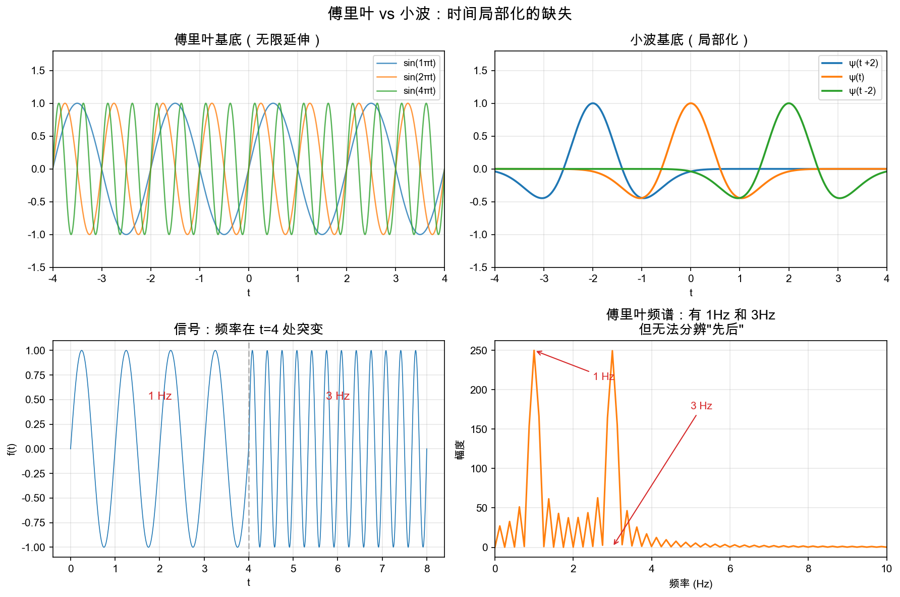
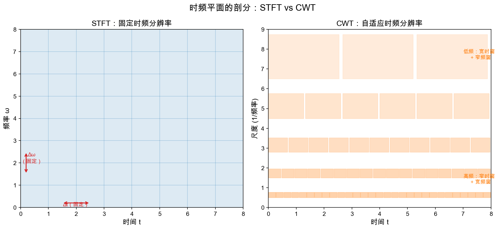
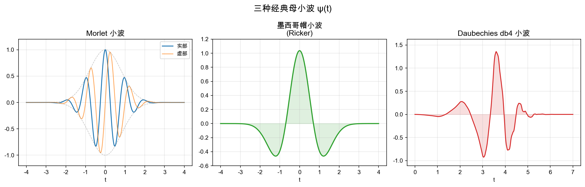
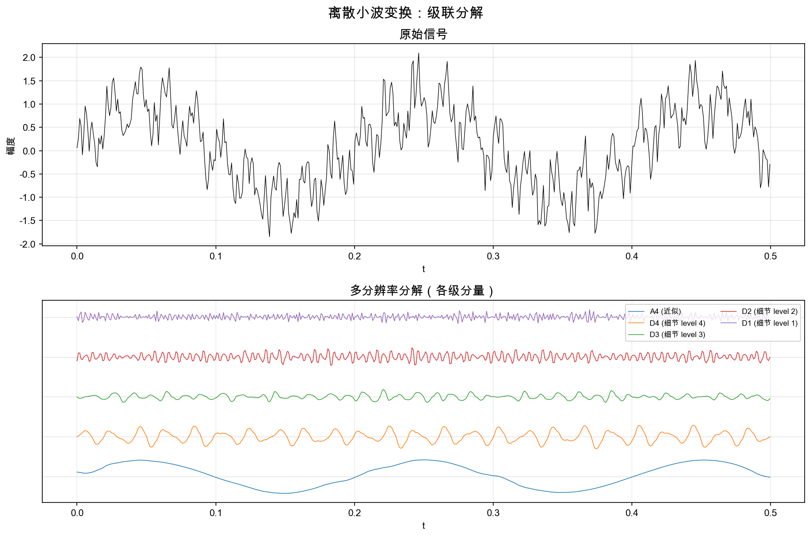
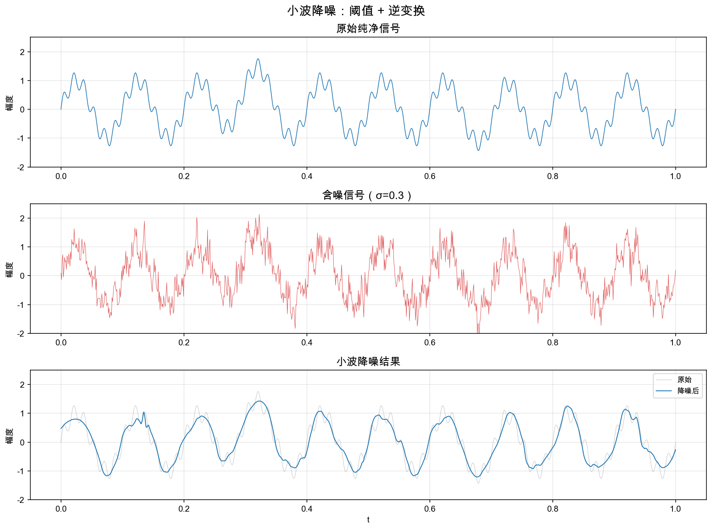

# 重学数学之二: 小波变换

## 一、傅里叶的盲点

上一章我们建立了一个认知：傅里叶变换把信号从时域搬到频域，揭示其频率结构。这个工具极其强大——但它有一个致命的盲点。

考虑这样一个信号：前半段是 1Hz 的低频振荡，后半段突然变成 3Hz 的高频振荡。



对这个信号做傅里叶变换，频谱图上出现 1Hz 和 3Hz 两个峰。但你完全无法判断这两个频率**分别在什么时候出现**——是先有 1Hz 再有 3Hz，还是两者同时存在，还是交替出现？傅里叶频谱给不出答案。

这不是傅里叶变换的 bug，而是它的 feature：**傅里叶基底是无限延伸的正弦波**，每个基底函数在时间轴上贯穿始终。当你用内积提取某个频率分量时，你是在与整个时间轴上的信号做积分——过去和未来的所有信息被压进了一个数字。时间信息被**彻底抹去**了。

### 什么时候"只有频率"不够？

| 场景 | 为什么需要时间局部性 |
|------|---------------------|
| 音乐信号 | 旋律随时间变化，你需要知道"哪一拍的音高是什么" |
| 地震波 | 地震能量到达的时刻和频率成分同样关键 |
| 心电图 (ECG) | PQRST 波群的到达时机携带着诊断信息 |
| 图像处理 | 边缘是空间中的局部事件——不同位置的边缘有不同的尺度 |
| 语音识别 | 音素的时序结构是语义的基础 |

所有这些场景的共同诉求是：**同时知道"什么频率"和"在什么时候"**。

## 二、第一次尝试：短时傅里叶变换 (STFT)

最简单的直觉是：**加一个滑动窗口**，在每个窗口里做局部傅里叶变换。

### 2.1 Gabor 变换（1946 年）

Dennis Gabor 的短时傅里叶变换 (STFT) 就是这个思路。选择一个窗函数 $w(t)$（比如一个高斯窗），把它沿着时间轴滑动，在每个位置 $\tau$ 取窗口内的信号做傅里叶变换：

$$
\text{STFT}(\tau, \omega) = \int_{-\infty}^{\infty} f(t) \, w(t - \tau) \, e^{-i\omega t} \, dt
$$

这就好比你透过一个**固定大小的窗口**看信号——你只能看到窗口内的频率内容。

### 2.2 STFT 的根本局限

窗口一旦选定，它的时间宽度 $\Delta t$ 和频率宽度 $\Delta \omega$ 就固定了。海森堡不确定性原理设下了硬性下限：

$$
\Delta t \cdot \Delta \omega \geq \frac{1}{2}
$$

> **类比**：STFT 就像用固定倍数的放大镜观察一根分形曲线。低倍镜看不清细节，高倍镜看不到整体。而你只能选一个倍数。

这引发了一个两难：

- **窄窗口** → 时间定位好（你知道事件何时发生），但频率分辨率差（相近的频率分不开）
- **宽窗口** → 频率定位好（能精细区分频率），但时间分辨率差（事件的时间点模糊）

对于大多数真实信号，**不同频率成分对时间分辨率的需求是不同的**——高频事件（如信号中的尖峰）需要窄窗口来精确定位，低频趋势则需要宽窗口来准确测量。



上图揭示了问题的本质：STFT 把时频平面剖分成大小完全相同的矩形（左图）。但自然信号需要的是**自适应剖分**——低频区域用矮宽矩形（强调频率分辨率），高频区域用窄高矩形（强调时间分辨率）。

这就是小波变换的核心动机。

## 三、核心洞察：缩放而非切割

### 3.1 重新发明"局部频率"

面对 STFT 的困境，你会怎么改进？

一个自然的想法是：**不固定窗口大小，而是让窗口随频率自适应变化**。具体来说：

- 分析高频时用窄窗口 → 时间分辨率高
- 分析低频时用宽窗口 → 频率分辨率高

怎样系统地实现这个想法？1980 年代初，法国地质工程师 Jean Morlet 在分析地震回波信号时找到了答案：**不要用"缩放了的正弦波"，而用一个"局部化了的小波浪"——母小波 (mother wavelet)**。

### 3.2 母小波与它的孩子们

一个母小波 $\psi(t)$ 是一个时间局部化的振荡函数。它必须具备两个性质：

1. **局部性**：$\int |\psi(t)|^2 dt < \infty$，即能量有限
2. **零均值**：$\int \psi(t) dt = 0$——它必须上下振荡，总体积分为零

有了母小波，通过**缩放**和**平移**就可以生成一整个小波家族：

$$
\psi_{a,b}(t) = \frac{1}{\sqrt{a}} \, \psi\left(\frac{t - b}{a}\right)
$$

- $a > 0$ 控制**尺度**（scale）：$a < 1$ 压窄小波 → 分析高频细节；$a > 1$ 拉宽小波 → 分析低频全局
- $b \in \mathbb{R}$ 控制**位置**（translation）：小波沿着时间轴移动

> 这个公式是小波变换的核心。它表达了一个简单但深刻的几何操作：**用同一个形状的"放大镜"，通过缩放和平移，去审视信号的不同尺度和位置。**

系数 $1/\sqrt{a}$ 保证所有尺度的小波有相同的能量（L² 范数归一化）。



### 3.3 连续小波变换 (CWT)

把小波基底代入傅里叶变换的"内积提取系数"框架：

$$
W_f(a, b) = \langle f, \psi_{a,b} \rangle = \frac{1}{\sqrt{a}} \int_{-\infty}^{\infty} f(t) \, \psi^*\left(\frac{t-b}{a}\right) \, dt
$$

**这就是连续小波变换。** 形式上它和傅里叶变换几乎一模一样——用内积提取信号在某个基函数上的分量。差别在于：

| 特性 | 傅里叶变换 | 连续小波变换 |
|---|---|---|
| 基底 | 无限延伸的正弦波 $e^{i\omega t}$ | 局部化的小波 $\psi_{a,b}(t)$ |
| 参数 | 频率 $\omega$（一个参数） | 尺度 $a$ + 位置 $b$（两个参数） |
| 输出 | 频率的函数 $\hat{f}(\omega)$ | 尺度-位置的函数 $W_f(a,b)$ |
| 分辨率 | 频率域无限精细，时间域无信息 | 时频平面自适应剖分 |

逆变换（重建公式）：

$$
f(t) = \frac{1}{C_\psi} \int_{0}^{\infty} \int_{-\infty}^{\infty} W_f(a,b) \, \psi_{a,b}(t) \, \frac{da \, db}{a^2}
$$

其中 $C_\psi = \int_0^\infty \frac{|\hat{\psi}(\omega)|^2}{\omega} d\omega < \infty$ 称为**可容许性条件**（admissibility condition）。它的核心含义是：小波不能含有直流分量，必须像一个真正的"波"那样上下抵消。对足够好的函数来说，这会迫使 $\hat{\psi}(0)=0$，也就是 $\int \psi(t)dt=0$。严格地说，可容许性还要求频域在零频附近和无穷远处表现得足够好；零均值是它最重要、最直观的部分，而不是全部技术内容。

## 四、离散化：Mallat 的算法之美

### 4.1 从连续到离散

CWT 的 $a$ 和 $b$ 是连续参数，产生大量冗余信息——实际上你不需要在所有可能的尺度和位置上计算小波系数。

最优雅的离散化方案是**二进离散**：

$$
a = 2^j, \quad b = k \cdot 2^j
$$

其中 $j, k \in \mathbb{Z}$。这给出了**离散小波变换 (DWT)**：

$$
\psi_{j,k}(t) = 2^{-j/2} \, \psi(2^{-j} t - k)
$$

> 注意尺度参数变成 $2^j$——每一层尺度都恰好是上一层的两倍。这意味着你每次"放大"都是按 2 的幂次进行的。这是 Mallat 算法的关键。

### 4.2 多分辨率分析：级联的滤波器组

1989 年，Stéphane Mallat 将小波理论与子带编码 (subband coding) 联系起来，给出了 DWT 的一个极其高效的实现——**Mallat 算法**。

核心思想：用一对互补的滤波器——低通滤波器（提取**近似系数**）和高通滤波器（提取**细节系数**）——对信号逐层分解。

```
原始信号 (N 个采样点)
    │
    ├── 低通滤波 + 下采样 → 近似 A1 (N/2 点) ──→ 继续分解
    │
    └── 高通滤波 + 下采样 → 细节 D1 (N/2 点) ──→ 保存
```

每一层，近似系数被进一步分解为更粗的近似和更细的细节。最终得到：

$$
信号 ≈ A_n + D_n + D_{n-1} + ... + D_1
$$

- **$A_n$**（最粗尺度的近似）：信号的"轮廓"——低频全局信息
- **$D_k$**（第 k 层细节）：信号在该尺度下的"纹理"——高频局部信息



上图中，原始信号被分解为 5 个分量：最底的近似 A4 捕捉信号的大尺度趋势，往上每一层的细节 D4、D3、D2、D1 分别捕捉逐渐变细的局部变化。高频尖刺出现在 D1 和 D2，低频振荡周期分量被 D3 和 D4 拿到。

### 4.3 与 FFT 的类比

Mallat 算法之于小波，正如 Cooley-Tukey 算法之于傅里叶：

| 特性 | FFT | Mallat 算法 |
|---|---|---|
| 复杂度 | $O(N \log N)$ | $O(N)$ |
| 核心操作 | 蝶形运算 (butterfly) | 卷积 + 下采样 |
| 分治方式 | 按奇偶位置拆分 | 按频率高低拆分 |
| 输出 | 复数的频谱 | 实数的近似 + 细节系数 |

Mallat 算法的 $O(N)$ 复杂度甚至比 FFT 的 $O(N \log N)$ 还快——这也是小波变换在工程上大规模可行的关键原因。

### 4.4 Daubechies 的紧支撑正交小波

1988 年，Ingrid Daubechies 构造出了一族**紧支撑的、正交的小波**——这被公认为小波理论成熟的标志。

紧支撑意味着小波函数在有限区间外恒为零。这直接对应**有限脉冲响应 (FIR) 滤波器**——可以在没有截断误差的情况下精确实现。Daubechies 小波是离散小波变换实际应用中最常用的基底，包括 JPEG2000 和 FBI 指纹数据库。

Daubechies dbN 系列中，N 是**消失矩**的数目：

> 如果一个小波有 $p$ 个消失矩，即 $\int t^k \psi(t) dt = 0$ 对 $k = 0, \dots, p-1$ 成立，那么信号的 $p$ 次以下的局部多项式分量会被小波变换完全压缩到近似系数中——细节系数只记录偏离多项式的部分。消失矩越多，小波越光滑，但对信号的局部化能力越弱。

这揭示了小波设计中一个根本性的权衡：**紧支撑 vs 光滑性**。Daubechies 给出了一条完整的帕累托前沿。

## 五、小波降噪：最直接的应用

小波降噪的流程只有三步，但极其有效：

1. **DWT**：将含噪信号做多级小波分解
2. **阈值处理**：对每层细节系数做软/硬阈值——小幅值的系数（被认为来自噪声）归零或收缩
3. **逆 DWT**：重建降噪后的信号

为什么这个简单的想法有效？**因为信号的能量集中在少数大系数上（稀疏性），而白噪声的能量均匀散布在所有系数上。** 小波基底的"去相关性"使得有意义的结构和随机噪声在系数分布上泾渭分明。



上图展示了小波降噪的威力：含噪信号中的随机抖动被大幅抑制，同时信号中的尖峰和振荡结构被完好地保留——这是传统傅里叶低通滤波做不到的。傅里叶滤波会同时把尖峰和噪声一起抹平。

## 六、应用场景

小波变换在需要**同时做时间和频率/尺度分析**的领域不可替代。

| 领域 | 应用 | 小波变换的角色 |
|------|------|--------------|
| 图像压缩 | JPEG2000 | 替代 JPEG 的 DCT，用小波变换避免了 8×8 分块带来的块效应；渐进传输（先看到模糊全图再逐步清晰） |
| 指纹识别 | FBI 指纹数据库 | 30TB 的指纹卡扫描件使用 WSQ 算法（基于 Daubechies 小波）压缩至 15:1，保留指纹脊线细节 |
| 信号降噪 | ECG/EEG 去噪、地震信号净化 | 阈值去噪在高噪声环境下仍能保留尖峰和局部突变 |
| 边缘检测 | 计算机视觉 | 小波变换的多尺度分解天然适合在不同尺度检测边缘和纹理 |
| 故障诊断 | 轴承/齿轮振动分析 | 非平稳振动信号中，故障特征（如周期性冲击）在小波时频图上表现为特定尺度的突发能量 |
| 数值分析 | 偏微分方程 | 小波 Galerkin 方法——用小波基底做函数空间离散化，对局部变化的解（如激波）有天然的适应性 |
| 金融 | 波动率分析 | 不同时间尺度的市场波动（日内 vs 周度 vs 月度）可通过小波分解各自分离 |
| 天文 | 宇宙微波背景辐射 | 宇宙学信号的非高斯特征和小尺度结构分析 |

## 七、小波变换究竟解决了什么问题

如果用一句话来回答"为什么要小波"：

> **傅里叶变换把时间信息压缩进了相位——理论上在，但实际上不可用。小波变换用一个额外的维度（位置/尺度）把时间和频率同时展开给你看。**

更深一层的结构视角：

傅里叶基底的优点也是它的缺点——完全在频率域对角化。这意味着每个频率分量是一个独立的、全局的特征。**小波基底在这种"频率对角化"和"时间对角化"之间找到了一个中间地带**——它不完全对角化任何一个，但在两者上都保持了一定程度的稀疏性。这正是"多分辨率分析"这个名字的含义：不是只有一种分辨率，而是在所有尺度上同时工作。

从算子理论的角度：傅里叶基底对角化了**所有**平移不变算子（卷积）。小波基底没有这么干净地对角化一大类算子，但它特别适合表示具有**尺度局部性**或**近似自相似性**的对象：很多积分算子、拟微分算子、分形信号和湍流数据，在小波基底下会变得稀疏或近似稀疏。这解释了为什么小波在多尺度物理和非平稳信号中格外有用。

## 八、前沿展望

### 8.1 散射变换：不用训练的深层小波网络

Bruna 与 Mallat（2012）提出的 scattering transform，把小波变换、模长非线性和局部平均级联起来：

$$
f \xrightarrow{\psi_{\lambda_1}} |f*\psi_{\lambda_1}|
\xrightarrow{\psi_{\lambda_2}}
\big||f*\psi_{\lambda_1}|*\psi_{\lambda_2}\big|
\xrightarrow{\text{average}}
S f
$$

它看起来像一个卷积神经网络，但滤波器不是训练出来的，而是预先设计的小波滤波器。

散射变换最重要的理论性质是：

1. 对平移逐渐不变。
2. 对小形变稳定。
3. 保留高频纹理信息。

这让它成为理解 CNN 的一个"可证明模型"：CNN 里许多经验上有效的结构，例如卷积、模长/非线性、池化、多层级联，在散射变换中都有清楚的调和分析解释。

### 8.2 图小波与扩散小波：多尺度分析进入网络

经典小波依赖时间轴或欧氏空间中的平移和缩放。但图、流形、点云没有天然的平移操作。

图小波的做法是用图 Laplacian 或扩散算子来定义尺度。粗略地说：

$$
T,\ T^2,\ T^4,\ T^8,\dots
$$

这些扩散算子的二进幂描述越来越大的邻域。低尺度看局部，高尺度看全局。

Coifman 与 Maggioni 的 diffusion wavelets，以及 Hammond、Vandergheynst、Gribonval 的 spectral graph wavelets，都在回答同一个问题：

> **如果空间本身是不规则的，怎样仍然做多尺度分析？**

这条线现在和图神经网络、传感器网络、分子建模、脑连接组分析都有直接关系。小波不再只是时间信号工具，而变成了"不规则结构上的局部分辨率"。

### 8.3 曲线波、剪切波与几何多尺度

二维图像里的奇异性通常不是孤立尖点，而是边缘曲线。

普通小波是各向同性的：放大或缩小时，各个方向一起缩放。这对点状奇异性很好，但对边缘曲线并不最优。

curvelet、shearlet 等几何多尺度系统引入方向性和各向异性缩放。它们使用细长的、带方向的基函数，更适合表达图像边缘、波前和纹理。

直觉上，傅里叶看全局频率，小波看局部尺度，而 shearlet/curvelet 进一步看：

> **局部结构朝哪个方向延伸？**

这类方法在医学成像、地震数据解释、边缘保持去噪和稀疏表示中很重要，也和微局部分析中的"奇异性传播方向"相连。

### 8.4 可学习小波：从手工基到底层归纳偏置

传统小波强调手工设计：紧支撑、正交性、消失矩、光滑性。

现代机器学习则提出另一个问题：

> **能否让模型自己学习适合数据的小波或多尺度滤波器，同时保留稳定性和可解释性？**

这产生了几类方向：

- 在神经网络中加入小波分解层，提升对多尺度纹理和边缘的建模能力。
- 学习 wavelet packet 或字典，使基函数适配具体数据分布。
- 在扩散模型、图神经网络和神经算子中引入多尺度滤波，减少只靠黑箱卷积带来的不稳定。

这说明小波理论的前沿不只是"发明一个新小波"。更重要的是把多尺度、局部性、稀疏性这些结构作为归纳偏置，放进现代学习系统。

## 九、总结

| 维度 | 傅里叶变换 | 小波变换 |
|------|----------|---------|
| 核心问题 | 信号中有哪些频率？ | 信号中频率何时/何地出现？ |
| 基底特性 | 无限延伸、全局 | 局部化、紧支撑 |
| 参数 | 1 个（频率） | 2 个（尺度 + 位置） |
| 时频分辨率 | 频率无限精细，时间无信息 | 自适应：高频好时间、低频好频率 |
| 计算复杂度 | $O(N \log N)$ (FFT) | $O(N)$ (Mallat 算法) |
| 基底的自由度 | 唯一的（复指数） | 可设计的（通过选择母小波） |
| 核心操作的不变性 | 平移不变（对角化卷积） | 平移 + 缩放协变 |

小波变换没有"推翻"傅里叶变换——它填补了傅里叶变换留下的空白。傅里叶告诉你**有什么**，小波告诉你**在哪/何时**。两者互补，而非对立。

理解小波的最好方式，就是反复回到这个简单的几何操作：**用一个局部化的小波浪，缩放它、平移它，然后用它去"匹配"信号的每个局部片段。** 所有复杂的理论——多分辨率分析、滤波器组、消失矩——都是为了让这个简单的操作在数学上严格、在计算上高效。

---

*下一章预告：我们离开具体变换，进入更抽象但更统一的语言——泛函分析。Banach 空间、Hilbert 空间、对偶空间……这些看似遥远的概念，其实就是把傅里叶变换和小波变换中反复出现的模式（基底、内积、正交、投影）抽象到最一般的形式。掌握了泛函的视角，你会发现傅里叶和小波不过是一个更大的图景中的两个特例。*
