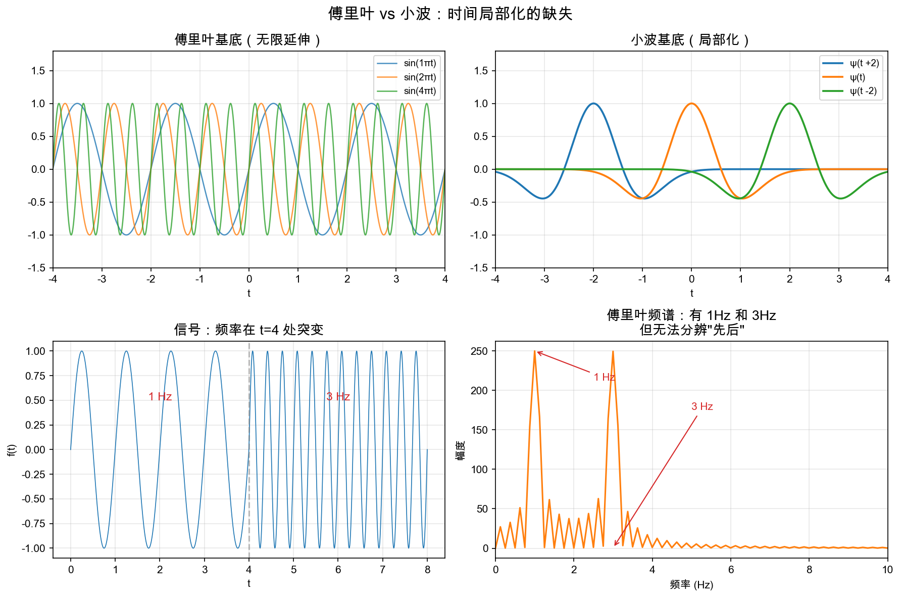
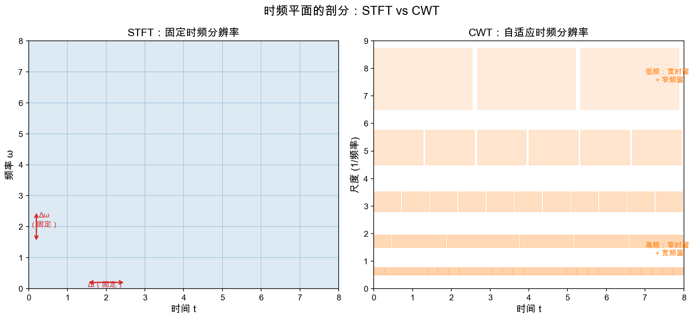
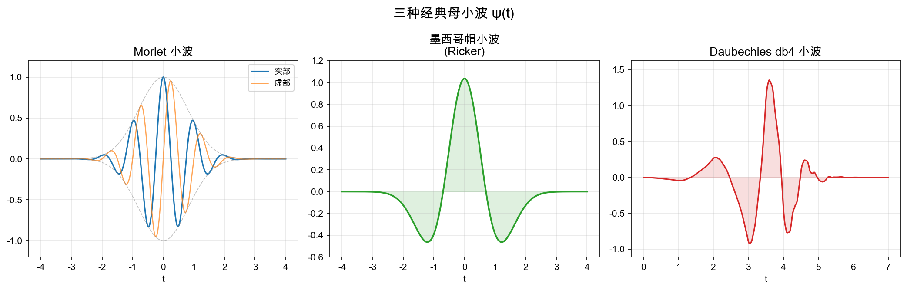
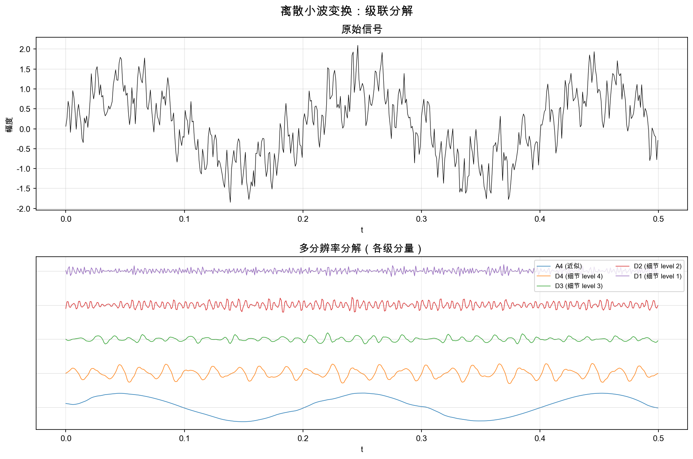
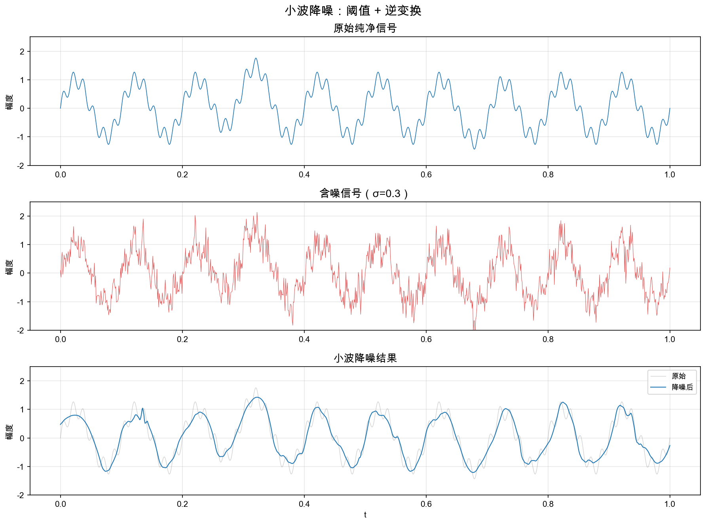

# 重学数学之二：小波变换

## 阅读说明

| 项目 | 内容 |
| --- | --- |
| 主问题 | 怎样用可重建、可计算的坐标，同时描述信号出现的位置与尺度？ |
| 预备知识 | 复数、积分、线性代数中的正交投影；本章使用[第 1 章](../chapter-01-fourier-transform/chapter.md)的 Fourier 变换、Plancherel 恒等式与卷积定理。 |
| 核心结果 | STFT 的时间—频率不确定性；连续小波变换的能量恒等式与弱重建；多分辨率分析的正交分解；消失矩对多项式的消去；正交 DWT 下白噪声的分布与阈值界。 |
| 本章边界 | 重点讨论一维复值 $L^2(\mathbb R)$ 信号和有限维正交 DWT。双正交小波、边界延拓、二维方向性系统及图小波只说明接口。 |

除非另有说明，函数取复值，等式在几乎处处意义下理解。沿用第 1 章的约定

$$
\widehat f(\omega)=\int_{\mathbb R}f(t)e^{-i\omega t}\,dt,
$$

$$
f(t)=\frac{1}{2\pi}\int_{\mathbb R}\widehat f(\omega)e^{i\omega t}\,d\omega,
$$

以及对第一个变量线性的内积

$$
\langle f,g\rangle=\int_{\mathbb R}f(t)\overline{g(t)}\,dt.
$$

$L^2(\mathbb R)$ 表示平方可积函数按“几乎处处相等”得到的等价类。$\|f\|_2$ 是其范数，$\mathcal S(\mathbb R)$ 是 Schwartz 空间。

本章要区分三个对象：连续小波族通常是冗余的**连续框架**，正交离散小波族可以成为 $L^2$ 的**可数正交基**，工程中的有限长 DWT 则是边界规则确定后的**有限维线性变换**。三者有关联，却不能直接混为一谈。

## 一、全局频率为什么不够直接

考虑一段先以 1 Hz、后以 3 Hz 振荡的信号。

完整 Fourier 变换保留幅度和相位，原则上能够重建信号；问题不是“时间信息消失了”，而是时间位置没有成为显式坐标。只看幅度谱时，这一局限尤其清楚。

设局部振荡 $g$ 的两个平移为

$$
f_1(t)=g(t-t_1),
$$

$$
f_2(t)=g(t-t_2).
$$

由 Fourier 变换的平移性质，

$$
\widehat f_2(\omega)=e^{-i\omega(t_2-t_1)}\widehat f_1(\omega),
$$

所以

$$
|\widehat f_2(\omega)|=|\widehat f_1(\omega)|.
$$

幅度谱能回答“有哪些频率”，却不能区分同一事件出现在 $t_1$ 还是 $t_2$。相位保存了平移信息，但多个局部事件的位置被分散编码在全部频率的相位关系中，并不便于直接读取。

我们因此提出一个比“介绍小波”更具体的问题：

> 给定 $f\in L^2(\mathbb R)$，能否构造带有位置和尺度参数的系数，使局部事件易于定位，同时仍能控制能量并重建 $f$？

后文以能量恒等式和重建公式作为“解决”的标准。有限维算法还必须说明正交性、边界条件与复杂度。本章不声称小波在所有任务上优于 Fourier 方法；平稳信号、卷积算子和精确频率估计仍可能更适合 Fourier 坐标。

## 二、固定窗口：短时 Fourier 变换

### 2.1 定义与局部坐标

取归一化窗函数 $w\in\mathcal S(\mathbb R)$，满足 $\|w\|_2=1$。短时 Fourier 变换（short-time Fourier transform，STFT）定义为

$$
V_wf(\tau,\omega)=\int_{\mathbb R}f(t)\overline{w(t-\tau)}e^{-i\omega t}\,dt.
$$

$\tau$ 是窗口中心，$\omega$ 是角频率。STFT 在每个位置使用同一个窗口，因此所有频率共享同一种时间分辨率。

Dennis Gabor 1946 年的工作用时间—频率单元分析通信信号，是这一思想的重要起点 [1]。历史来源不改变一个数学事实：窗口不可能同时在时间和频率上任意集中。

### 2.2 核心定理 1：时间—频率不确定性

对 $f\in\mathcal S(\mathbb R)$ 且 $\|f\|_2=1$，定义时间中心与频率中心

$$
t_0=\int_{\mathbb R}t|f(t)|^2\,dt,
$$

$$
\omega_0=\frac{1}{2\pi}\int_{\mathbb R}\omega|\widehat f(\omega)|^2\,d\omega.
$$

相应方差为

$$
(\Delta t)^2=\int_{\mathbb R}(t-t_0)^2|f(t)|^2\,dt,
$$

$$
(\Delta\omega)^2=\frac{1}{2\pi}\int_{\mathbb R}(\omega-\omega_0)^2|\widehat f(\omega)|^2\,d\omega.
$$

**定理 1（Heisenberg 不确定性）**
对上述 $f$，有

$$
\Delta t\,\Delta\omega\geq\frac12.
$$

等号可由适当平移、调制和缩放的高斯函数取得。

**证明。** 平移 $f$ 只改变 $t_0$，调制 $f(t)e^{-i\omega_0t}$ 只改变频率中心，并且都不改变两个方差。因此只需证明 $t_0=\omega_0=0$ 的情形。

由 Fourier 变换的微分性质和 Plancherel 恒等式，

$$
\|f'\|_2^2=\frac{1}{2\pi}\int_{\mathbb R}\omega^2|\widehat f(\omega)|^2\,d\omega=(\Delta\omega)^2.
$$

因为 $f$ 是 Schwartz 函数，边界项趋于零。对 $t|f(t)|^2$ 积分并分部积分，得到

$$
0=\int_{\mathbb R}\frac{d}{dt}\bigl(t|f(t)|^2\bigr)\,dt.
$$

展开导数并使用 $\|f\|_2=1$，可得

$$
2\,\mathrm{Re}\int_{\mathbb R}t f'(t)\overline{f(t)}\,dt=-1.
$$

于是 Cauchy–Schwarz 不等式给出

$$
\frac12\leq\|tf\|_2\,\|f'\|_2=\Delta t\,\Delta\omega.
$$

取高斯函数直接代入，可验证 Cauchy–Schwarz 在此取等，故常数 $1/2$ 最优。证毕。

定理说明 STFT 的固定窗口存在不可消除的权衡：窄窗改善时间定位，却扩大频率分布；宽窗反之。它并没有证明“小波必然更好”，只说明单一固定分辨率不能同时适应所有尺度。

## 三、连续小波变换：缩放与平移

### 3.1 小波原子与归一化

给定非零函数 $\psi\in L^2(\mathbb R)$。对尺度 $a>0$ 和位置 $b\in\mathbb R$，定义

$$
\psi_{a,b}(t)=a^{-1/2}\psi\left(\frac{t-b}{a}\right).
$$

$a<1$ 时原子变窄，适合检测快速变化；$a>1$ 时原子变宽，适合描述慢变化。参数 $a$ 本身不是频率。只有在指定母小波中心频率后，才能把尺度近似换算为“伪频率”。

**命题 1（归一化与协变性）**
若 $\psi\in L^2(\mathbb R)$，则对任意 $a>0$、$b\in\mathbb R$，有 $\|\psi_{a,b}\|_2=\|\psi\|_2$。此外，若

$$
(T_cf)(t)=f(t-c),
$$

$$
(D_sf)(t)=s^{-1/2}f(t/s),
$$

则 $T_c$ 与 $D_s$ 都是 $L^2(\mathbb R)$ 上的酉算子，且 $\psi_{a,b}=T_bD_a\psi$。

**证明。** 令 $u=(t-b)/a$，则 $dt=a\,du$，所以

$$
\|\psi_{a,b}\|_2^2=\int_{\mathbb R}a^{-1}\left|\psi\left(\frac{t-b}{a}\right)\right|^2dt=\int_{\mathbb R}|\psi(u)|^2du.
$$

同一换元分别证明 $T_c$ 与 $D_s$ 保持范数。它们显然线性，并且逆算子分别是 $T_{-c}$ 与 $D_{1/s}$，故为酉算子。最后把定义代入即可得到 $\psi_{a,b}=T_bD_a\psi$。证毕。

$a^{-1/2}$ 不是装饰性常数；没有它，不同尺度的原子能量会不同，系数大小便混入尺度引起的归一化偏差。

### 3.2 可容许性、零均值与反例

本章为简化正负频率常数，先讨论实值母小波。设 $\psi\in L^2(\mathbb R)$ 为实值函数，定义单边可容许常数

$$
C_\psi=\int_0^\infty\frac{|\widehat\psi(\omega)|^2}{\omega}\,d\omega.
$$

**定义（可容许小波）**
若 $0<C_\psi<\infty$，则称 $\psi$ 对本章的连续小波变换是可容许的。

若复值小波的正、负频率能量不对称，应分别使用两个半轴上的常数，或限制到相应 Hardy 空间；不能直接套用下面的单常数公式。

**可容许性为什么迫使零均值？** 若进一步有 $\psi\in L^1(\mathbb R)$，则 $\widehat\psi$ 连续，且

$$
\widehat\psi(0)=\int_{\mathbb R}\psi(t)\,dt.
$$

假如 $\widehat\psi(0)\neq0$，连续性保证 $|\widehat\psi(\omega)|$ 在零点附近有正下界，从而 $C_\psi$ 包含一个发散的 $\int_0^\varepsilon d\omega/\omega$。因此可容许性蕴含

$$
\int_{\mathbb R}\psi(t)\,dt=0.
$$

零均值是可容许性的必要结果之一，不是对任意 $L^2$ 函数都可直接书写的先验条件，因为一般 $L^2$ 函数未必可积。

**例 1（Haar 小波）。** 定义

$$
\psi_{mathrm H}(t)=\mathbf 1_{[0,1/2)}(t)-\mathbf 1_{[1/2,1)}(t).
$$

它属于 $L^1\cap L^2$，范数为 1，积分为 0。其 Fourier 变换在零点附近是一阶小量，在无穷远处按 $1/|\omega|$ 衰减，因此 $0<C_{\psi_{\mathrm H}}<\infty$。

**非例 1（高斯本身）。** $e^{-t^2/2}$ 虽然同时属于 $L^1$ 和 $L^2$，却有正的积分，所以其可容许常数在零频附近发散。高斯的一阶导数具有零均值，可以构成可容许小波；这说明“局部化”不等于“小波”。

图中的 Morlet 型曲线用于展示“振荡乘高斯包络”的形状。若直接使用未校正的高斯调制，它的积分通常只接近零而非严格等于零；严格 CWT 应减去直流校正项，或直接核验 $C_\psi<\infty$。

### 3.3 连续小波系数

对 $f\in L^2(\mathbb R)$，定义连续小波变换（continuous wavelet transform，CWT）

$$
W_\psi f(a,b)=\langle f,\psi_{a,b}\rangle.
$$

由 Cauchy–Schwarz 不等式，

$$
|W_\psi f(a,b)|\leq\|f\|_2\|\psi\|_2,
$$

所以每个系数都有定义。连续参数族一般不是正交基，而是冗余表示；同一个 $f$ 会产生二维系数面。

### 3.4 核心定理 2：CWT 能量恒等式与弱重建

**定理 2（CWT 的 Plancherel 恒等式与弱重建）**
设 $\psi\in L^2(\mathbb R)$ 是实值可容许小波。则对任意 $f\in L^2(\mathbb R)$，

$$
\int_0^\infty\int_{\mathbb R}|W_\psi f(a,b)|^2\,db\,\frac{da}{a^2}=C_\psi\|f\|_2^2.
$$

并且对任意 $g\in L^2(\mathbb R)$，

$$
\langle f,g\rangle=\frac{1}{C_\psi}\int_0^\infty\int_{\mathbb R}W_\psi f(a,b)\overline{W_\psi g(a,b)}\,db\,\frac{da}{a^2}.
$$

因而下面的重建公式在 $L^2$ 弱意义下成立：

$$
f=\frac{1}{C_\psi}\int_0^\infty\int_{\mathbb R}W_\psi f(a,b)\psi_{a,b}\,db\,\frac{da}{a^2}.
$$

这里“弱意义”是指重建式两边与任意 $g\in L^2$ 作内积后相等；它不自动保证二重积分逐点绝对收敛。

**证明。** 先取 $f\in\mathcal S(\mathbb R)$。把 $W_\psi f(a,b)$ 看成变量 $b$ 的函数。由卷积定理以及缩放、反射的 Fourier 公式，

$$
\widehat{W_\psi f(a,\mathord\cdot)}(\omega)=\sqrt a\,\widehat f(\omega)\overline{\widehat\psi(a\omega)}.
$$

对 $b$ 使用 Plancherel 恒等式，得到

$$
\int_{\mathbb R}|W_\psi f(a,b)|^2db=\frac{1}{2\pi}\int_{\mathbb R}|\widehat f(\omega)|^2a|\widehat\psi(a\omega)|^2d\omega.
$$

被积函数非负，因此 Tonelli 定理允许交换 $a$ 与 $\omega$ 的积分：

$$
\int_0^\infty\int_{\mathbb R}|W_\psi f(a,b)|^2db\,\frac{da}{a^2}
=\frac{1}{2\pi}\int_{\mathbb R}|\widehat f(\omega)|^2I(\omega)d\omega,
$$

其中

$$
I(\omega)=\int_0^\infty|\widehat\psi(a\omega)|^2\frac{da}{a}.
$$

当 $\omega>0$ 时令 $s=a\omega$，得到 $I(\omega)=C_\psi$。当 $\omega<0$ 时，实值性给出 $|\widehat\psi(-s)|=|\widehat\psi(s)|$，故仍有 $I(\omega)=C_\psi$。零频点不影响 Lebesgue 积分。因此再次使用 Plancherel 恒等式，

$$
\int_0^\infty\int_{\mathbb R}|W_\psi f(a,b)|^2db\,\frac{da}{a^2}=C_\psi\|f\|_2^2.
$$

$\mathcal S(\mathbb R)$ 在 $L^2(\mathbb R)$ 中稠密，而刚得到的等距关系表明 $f\mapsto C_\psi^{-1/2}W_\psi f$ 连续，所以恒等式延拓到全部 $L^2$。

对这个二次恒等式使用复内积空间的极化恒等式，得到任意 $f,g\in L^2$ 的交叉内积公式。右端绝对值由系数空间中的 Cauchy–Schwarz 不等式控制，因此积分有意义。

最后，将形式重建式的右端与任意 $g$ 作内积。由内积对第一个变量线性，结果正是交叉内积公式的右端，也就是 $\langle f,g\rangle$。因此重建式在弱意义下成立。证毕。

这一定理给出三个重要边界：可容许性负责排除不可重建的直流分量；测度是 $db\,da/a^2$，不能随意换成 $db\,da$；一般 $L^2$ 信号只保证弱重建，要得到逐点重建必须增加正则性和可积性假设。Grossmann 与 Morlet 的经典工作系统阐述了这类连续小波分解 [2]。

## 四、从连续框架到离散正交基

仅把连续参数取成 $a=2^{-j}$、$b=k2^{-j}$，并不能自动保证所得函数完整、正交或稳定。离散小波变换需要多分辨率分析提供结构。

### 4.1 多分辨率分析

**定义（多分辨率分析）**
$L^2(\mathbb R)$ 的一族闭子空间 $\bigl\{V_j:j\in\mathbb Z\bigr\}$ 称为一个二进多分辨率分析（multiresolution analysis，MRA），若满足：

1. $V_j\subset V_{j+1}$；
2. $f\in V_j$ 当且仅当 $f(2\mathord\cdot)\in V_{j+1}$；
3. $\bigcap_jV_j=\{0\}$；
4. $\overline{\bigcup_jV_j}=L^2(\mathbb R)$；
5. 存在尺度函数 $\phi\in V_0$，使 $\bigl\{\phi(t-k):k\in\mathbb Z\bigr\}$ 成为 $V_0$ 的正交规范基。

记

$$
\phi_{j,k}(t)=2^{j/2}\phi(2^jt-k).
$$

则 $\bigl\{\phi_{j,k}:k\in\mathbb Z\bigr\}$ 是 $V_j$ 的正交规范基。这里 $j$ 越大表示越细的分辨率；有些工程库使用相反的层号约定，比较公式时必须先核对索引方向。

令 $W_j$ 是 $V_j$ 在 $V_{j+1}$ 中的正交补，即

$$
V_{j+1}=V_j\mathbin\oplus W_j.
$$

若存在 $\psi$ 使

$$
\psi_{j,k}(t)=2^{j/2}\psi(2^jt-k)
$$

对固定 $j$ 构成 $W_j$ 的正交规范基，则 $\psi$ 是该 MRA 关联的正交母小波。

### 4.2 核心定理 3：MRA 的正交分解

设 $P_j$ 和 $Q_j$ 分别是到 $V_j$ 和 $W_j$ 的正交投影。

**定理 3（多分辨率正交分解）**
对任意 $f\in L^2(\mathbb R)$ 以及整数 $J_0<J$，有

$$
P_Jf=P_{J_0}f+\sum_{j=J_0}^{J-1}Q_jf.
$$

当 $J\to\infty$ 时，$P_Jf\to f$；当 $J_0\to-\infty$ 时，$P_{J_0}f\to0$，收敛均在 $L^2$ 范数下。因此

$$
f=\sum_{j\in\mathbb Z}Q_jf
$$

在 $L^2$ 中成立。若每个 $W_j$ 由上述 $\psi_{j,k}$ 张成，则 $\bigl\{\psi_{j,k}:j,k\in\mathbb Z\bigr\}$ 是 $L^2(\mathbb R)$ 的正交规范基，并有

$$
\|f\|_2^2=\sum_{j\in\mathbb Z}\sum_{k\in\mathbb Z}|\langle f,\psi_{j,k}\rangle|^2.
$$

**证明。** 由 $V_{j+1}=V_j\mathbin\oplus W_j$，对每个 $j$ 都有

$$
P_{j+1}f=P_jf+Q_jf.
$$

从 $j=J_0$ 到 $J-1$ 相加，得到有限层分解式。

下面证明极限。因为 $\bigcup_jV_j$ 在 $L^2$ 中稠密，给定 $\varepsilon>0$，可取某个 $v\in V_m$ 使 $\|f-v\|_2<\varepsilon$。当 $J\geq m$ 时，$v\in V_J$。正交投影给出最佳逼近，所以

$$
\|f-P_Jf\|_2\leq\|f-v\|_2<\varepsilon.
$$

故 $P_Jf\to f$。

另一方面，$\|P_jf\|_2$ 随 $j$ 减小单调下降，因此它有极限。取严格递减且趋于负无穷的整数列 $j_n$。当 $n>m$ 时，$V_{j_n}\subset V_{j_m}$，正交投影的勾股关系给出

$$
\|P_{j_m}f-P_{j_n}f\|_2^2=\|P_{j_m}f\|_2^2-\|P_{j_n}f\|_2^2.
$$

右端随 $m,n\to\infty$ 趋于零，所以 $P_{j_n}f$ 是 Cauchy 列，设其极限为 $h$。对任意固定整数 $r$，充分大的 $n$ 满足 $j_n\leq r$，故 $P_{j_n}f\in V_r$。$V_r$ 闭，因此 $h\in V_r$。这对所有 $r$ 都成立，所以

$$
h\in\bigcap_rV_r=\{0\}.
$$

任意趋于负无穷的整数列都只能收敛到零，故 $P_jf\to0$。

令两个端点分别趋于正、负无穷，就得到 $f$ 的正交细节和。若 $\psi_{j,k}$ 是每个 $W_j$ 的正交规范基，不同 $W_j$ 又彼此正交，所有 $\psi_{j,k}$ 的并集便是 $L^2$ 的完备正交规范系。最后应用 Parseval 恒等式得到能量公式。证毕。

定理把“近似加细节”从示意图变成了严格等式：保留到有限尺度得到的是正交投影 $P_Jf$，不是含义不明的“约等于”。

### 4.3 Haar MRA 与滤波器组

Haar 尺度函数和母小波分别为

$$
\phi(t)=\mathbf 1_{[0,1)}(t),
$$

$$
\psi(t)=\mathbf 1_{[0,1/2)}(t)-\mathbf 1_{[1/2,1)}(t).
$$

尺度函数满足两尺度关系

$$
\phi(t)=\phi(2t)+\phi(2t-1),
$$

而小波满足

$$
\psi(t)=\phi(2t)-\phi(2t-1).
$$

这两条关系在离散系数上变成一对低通、高通运算。对偶数长度向量 $x$，定义

$$
a_k=\frac{x_{2k}+x_{2k+1}}{\sqrt2},
$$

$$
d_k=\frac{x_{2k}-x_{2k+1}}{\sqrt2}.
$$

逆变换为

$$
x_{2k}=\frac{a_k+d_k}{\sqrt2},
$$

$$
x_{2k+1}=\frac{a_k-d_k}{\sqrt2}.
$$

直接展开可得每一对样本的能量守恒：

$$
|x_{2k}|^2+|x_{2k+1}|^2=|a_k|^2+|d_k|^2.
$$

因此一层 Haar 变换是正交变换且可精确重建。若 $N=2^J$，继续只分解近似系数，每层处理的元素数依次为 $N,N/2,N/4,\ldots$，总操作数由几何级数控制在 $O(N)$。一般紧支撑滤波器长度固定时，Mallat 金字塔算法同样是 $O(N)$；若滤波器长度随 $N$ 增长，则不能直接沿用这个复杂度结论。Mallat 1989 年的论文给出了 MRA、正交小波和金字塔滤波算法之间的系统联系 [3]。

有限信号还必须选择周期延拓、零延拓、对称延拓或专门的边界小波。不同规则会改变端点附近的系数；无限轴上的正交性不能自动消除有限区间的边界效应。

### 4.4 消失矩为什么检测突变

**定义（消失矩）**
若 $\psi$ 满足

$$
\int_{\mathbb R}t^m\psi(t)\,dt=0
$$

对 $m=0,1,\ldots,p-1$ 都成立，则称 $\psi$ 有 $p$ 个消失矩。

**命题 2（局部多项式消去）**
设 $\psi$ 为实值紧支撑函数并有 $p$ 个消失矩。若多项式 $q$ 的次数小于 $p$，则对任意 $a>0$、$b\in\mathbb R$，

$$
\langle q,\psi_{a,b}\rangle=0.
$$

更一般地，若函数 $f$ 在 $\psi_{a,b}$ 的支撑上恰好等于这样的多项式，则对应的局部小波系数为零。

**证明。** 令 $t=b+as$。因为 $\psi$ 紧支撑，积分有限，并且

$$
\langle q,\psi_{a,b}\rangle=\sqrt a\int_{\mathbb R}q(b+as)\psi(s)\,ds.
$$

$q(b+as)$ 仍是关于 $s$ 的次数小于 $p$ 的多项式，可写成 $\sum_{m=0}^{p-1}c_ms^m$。逐项积分后，每一项都由消失矩条件变成零。证毕。

这一定理说的是“精确多项式被精确消去”。对一般光滑函数，只能通过 Taylor 余项得到“小系数”的定量估计；若小波支撑跨过跳跃点，单个多项式展开失效，系数便可能显著。这才是小波检测边缘与突变的数学来源。

Daubechies 1988 年构造了具有紧支撑、高消失矩和正交性的非平凡小波族 [4]。但紧支撑、正交、实值对称、高光滑性与短滤波器之间存在约束，不应把所有优点同时归给任意“dbN”。双正交系统允许分析与合成使用不同滤波器，从而获得对称紧支撑构造 [5]。

## 五、小波阈值降噪：条件而不是魔法

设有限观测模型为

$$
y=x+\varepsilon,
$$

其中 $x\in\mathbb R^N$ 是未知信号，$\varepsilon$ 是噪声。对正交 DWT 矩阵 $U$，变换后有

$$
Uy=Ux+U\varepsilon.
$$

### 5.1 核心定理 4：白噪声在正交 DWT 下保持白噪声

**定理 4（正交变换下的高斯白噪声）**
若 $\varepsilon\sim N(0,\sigma^2I_N)$ 且 $U^TU=I_N$，则

$$
U\varepsilon\sim N(0,\sigma^2I_N).
$$

进一步，对任意 $0<\delta<1$，令

$$
\lambda_\delta=\sigma\sqrt{2\log\frac{2N}{\delta}}.
$$

则

$$
\mathbb P\left(\max_{1\leq k\leq N}|(U\varepsilon)_k|>\lambda_\delta\right)\leq\delta.
$$

**证明。** 线性变换保持高斯性。$U\varepsilon$ 的均值为零，协方差为

$$
\mathrm{Cov}(U\varepsilon)=U(\sigma^2I_N)U^T=\sigma^2I_N.
$$

因此各坐标独立且服从 $N(0,\sigma^2)$。若 $Z\sim N(0,1)$，标准尾界给出

$$
\mathbb P(|Z|>u)\leq2e^{-u^2/2}.
$$

对 $N$ 个坐标使用并集界，

$$
\mathbb P\left(\max_k|(U\varepsilon)_k|>\lambda_\delta\right)
\leq2N\exp\left(-\frac{\lambda_\delta^2}{2\sigma^2}\right)=\delta.
$$

证毕。

定理解释了阈值的概率来源：纯噪声系数以至少 $1-\delta$ 的概率全部落在 $[-\lambda_\delta,\lambda_\delta]$ 内。它没有保证所有小系数都是噪声，也没有保证阈值后必然保留所有真实结构。

硬阈值与软阈值分别定义为

$$
T_{\mathrm{hard},\lambda}(z)=z\,\mathbf 1_{\{|z|>\lambda\}},
$$

$$
T_{\mathrm{soft},\lambda}(z)=\mathrm{sgn}(z)(|z|-\lambda)_+.
$$

典型流程是：对 $y$ 做 DWT；对选定的细节层阈值化；再做逆 DWT。软阈值连续但会收缩大系数，硬阈值不收缩保留系数却在阈值处不连续。Donoho 与 Johnstone 的工作给出了小波收缩估计的重要统计理论 [6]。

上图只是一组特定信号、噪声、小波、分解层数和阈值下的数值例子，不构成“小波总比低通滤波好”的证明。阈值法效果好通常依赖三个条件：信号在所选小波坐标中近似稀疏；噪声模型与阈值规则匹配；边界与尺度选择合理。对有色噪声、非高斯噪声或双正交变换，系数相关性和方差会改变，需要重新估计噪声协方差。

## 六、应用、选择与失败边界

| 任务 | 小波提供的结构 | 必须额外决定的事项 |
| --- | --- | --- |
| JPEG 2000 图像编码 | 多尺度子带、局部化系数、渐进解码 | 有损或无损路径、量化、码率控制、边界处理；标准细节见 ISO/IEC 15444-1 [7] |
| 指纹图像 WSQ | 面向摩擦脊灰度图像的 wavelet scalar quantization | 采样分辨率、规范版本和认证；NIST 资料明确其适用对象 [8] |
| 瞬态检测 | 位置—尺度系数突出局部突变 | 母小波、尺度网格、检测阈值与多重检验 |
| 数值 PDE | 局部基和消失矩可能带来稀疏算子 | 函数空间、边界小波、条件数与自适应误差估计 |
| 图与流形数据 | 用 Laplacian 或扩散算子替代欧氏平移和缩放 | 图权重、谱核、尺度与可逆性条件 [10, 11] |

选择小波时至少检查：

- **任务目标**：重建、压缩、去噪、检测还是估计正则性；
- **代数性质**：正交、双正交还是一般框架；
- **几何性质**：紧支撑、对称性、光滑性和方向性；
- **消失矩**：希望消去多高阶的局部多项式；
- **数据接口**：采样率、有限区间边界、缺失值和噪声模型。

以下反例有助于阻止过度概括：

1. 高斯函数局部化很好，却因非零均值而不是可容许小波。
2. 任意抽取二进尺度与平移，不保证得到基；可能不完备，也可能严重冗余。
3. 白噪声在正交变换下仍为白噪声，但在一般非正交分析算子下会变成相关噪声。
4. 消失矩只对低阶多项式给出精确消去；对振荡纹理、边界和奇异点必须另行分析。
5. 小波擅长局部多尺度结构，不意味着它适合精确分离所有相邻纯频率。

## 七、从经典小波到现代多尺度表示

下面只说明研究接口，不把引用结果冒充本章已证明的定理。

### 7.1 散射变换

散射变换把小波卷积、复模长和低通平均逐层级联。Bruna 与 Mallat 证明了适当构造具有平移不变性和对小形变的稳定性，并用它解释一部分卷积网络结构 [9]。这里的性质依赖具体小波框架、路径集合和平均尺度，不能简化成“任意小波网络都稳定”。

### 7.2 图小波与扩散小波

图上没有天然平移。扩散小波用扩散算子的幂建立多尺度空间 [10]；谱图小波则以图 Laplacian 的函数 $g(sL)$ 定义尺度滤波 [11]。两者都把“尺度”改写为算子的谱或扩散时间，而不是在图上生硬复制 $t\mapsto(t-b)/a$。

### 7.3 几何多尺度系统

二维边缘通常沿曲线延伸，各向同性小波未必能最稀疏地表示这类方向性奇异。curvelet、shearlet 等系统加入方向参数与各向异性缩放。它们不是普通一维小波的简单换名，而是为几何结构重新设计的表示系统。

## 八、总结：一条可检查的推理链

本章从一个明确问题开始：怎样把位置和尺度变成显式坐标，同时保持能量控制与可重建性？答案分为四层：

1. STFT 增加位置坐标，但固定窗口受不确定性约束，只提供单一分辨率。
2. CWT 用酉缩放和平移生成连续原子；可容许性带来能量恒等式和 $L^2$ 弱重建。
3. MRA 把连续尺度组织成嵌套子空间，正交补给出可数小波基与精确的“近似加细节”分解。
4. 有限维正交 DWT 保持能量和高斯白噪声分布；当信号系数近似稀疏时，阈值化才获得统计上的合理性。

| 表示 | 参数 | 重建结构 | 典型优势 | 主要边界 |
| --- | --- | --- | --- | --- |
| Fourier 变换 | 频率 | Fourier 反演 | 全局频谱、卷积对角化 | 局部位置不显式 |
| STFT | 位置、频率 | Gabor 框架条件 | 固定分辨率时频分析 | 窗宽固定 |
| CWT | 位置、尺度 | 可容许连续框架 | 自适应位置—尺度观察 | 冗余、尺度不等于频率 |
| 正交 DWT | 离散位置、离散尺度 | MRA 正交基 | 精确重建、$O(N)$ 滤波器组 | 边界和小波选择敏感 |

小波没有推翻 Fourier 分析。它把第 1 章的内积、Plancherel 恒等式、卷积和正交展开重新组织到局部、多尺度的坐标中。下一章的泛函分析将进一步解释：为什么正交投影、完备性、基与框架是这些变换共同的语言。

## 参考资料

1. D. Gabor, “Theory of Communication. Part 1: The Analysis of Information,” *Journal of the Institution of Electrical Engineers—Part III*, 93(26), 429–441, 1946. [doi:10.1049/ji-3-2.1946.0074](https://doi.org/10.1049/ji-3-2.1946.0074).
2. A. Grossmann and J. Morlet, “Decomposition of Hardy Functions into Square Integrable Wavelets of Constant Shape,” *SIAM Journal on Mathematical Analysis*, 15(4), 723–736, 1984. [doi:10.1137/0515056](https://doi.org/10.1137/0515056).
3. S. G. Mallat, “A Theory for Multiresolution Signal Decomposition: The Wavelet Representation,” *IEEE Transactions on Pattern Analysis and Machine Intelligence*, 11(7), 674–693, 1989. [doi:10.1109/34.192463](https://doi.org/10.1109/34.192463).
4. I. Daubechies, “Orthonormal Bases of Compactly Supported Wavelets,” *Communications on Pure and Applied Mathematics*, 41(7), 909–996, 1988. [doi:10.1002/cpa.3160410705](https://doi.org/10.1002/cpa.3160410705).
5. A. Cohen, I. Daubechies, and J.-C. Feauveau, “Biorthogonal Bases of Compactly Supported Wavelets,” *Communications on Pure and Applied Mathematics*, 45(5), 485–560, 1992. [doi:10.1002/cpa.3160450502](https://doi.org/10.1002/cpa.3160450502).
6. D. L. Donoho and I. M. Johnstone, “Ideal Spatial Adaptation by Wavelet Shrinkage,” *Biometrika*, 81(3), 425–455, 1994. [doi:10.1093/biomet/81.3.425](https://doi.org/10.1093/biomet/81.3.425).
7. ISO/IEC, *ISO/IEC 15444-1:2024, Information Technology—JPEG 2000 Image Coding System—Part 1: Core Coding System*, 5th ed., 2024. [标准页面](https://www.iso.org/standard/87632.html).
8. NIST, “WSQ Bibliography,” 2014；页面说明 WSQ 的设计对象与规范沿革，访问日期 2026-08-10. [NIST 页面](https://www.nist.gov/itl/iad/btg/wsq-bibliography).
9. J. Bruna and S. Mallat, “Invariant Scattering Convolution Networks,” *IEEE Transactions on Pattern Analysis and Machine Intelligence*, 35(8), 1872–1886, 2013. [doi:10.1109/TPAMI.2012.230](https://doi.org/10.1109/TPAMI.2012.230).
10. R. R. Coifman and M. Maggioni, “Diffusion Wavelets,” *Applied and Computational Harmonic Analysis*, 21(1), 53–94, 2006. [doi:10.1016/j.acha.2006.04.004](https://doi.org/10.1016/j.acha.2006.04.004).
11. D. K. Hammond, P. Vandergheynst, and R. Gribonval, “Wavelets on Graphs via Spectral Graph Theory,” *Applied and Computational Harmonic Analysis*, 30(2), 129–150, 2011. [doi:10.1016/j.acha.2010.04.005](https://doi.org/10.1016/j.acha.2010.04.005).
12. I. Daubechies, *Ten Lectures on Wavelets*, CBMS-NSF Regional Conference Series in Applied Mathematics 61, SIAM, 1992, especially Chapters 3, 5, and 6. [SIAM 书目页](https://epubs.siam.org/doi/book/10.1137/1.9781611970104).
