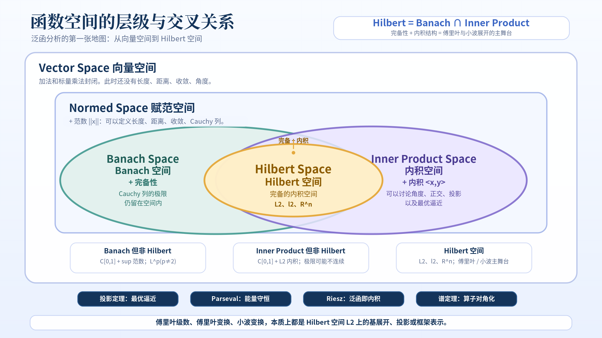
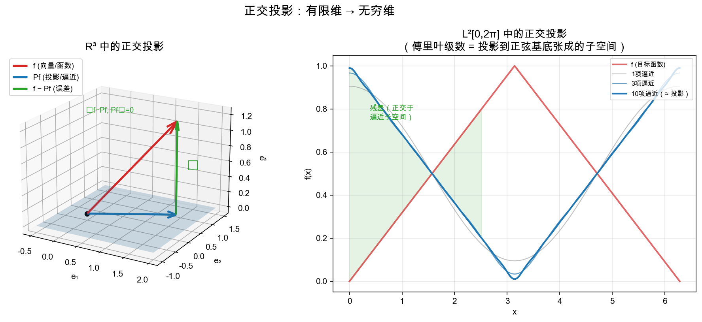
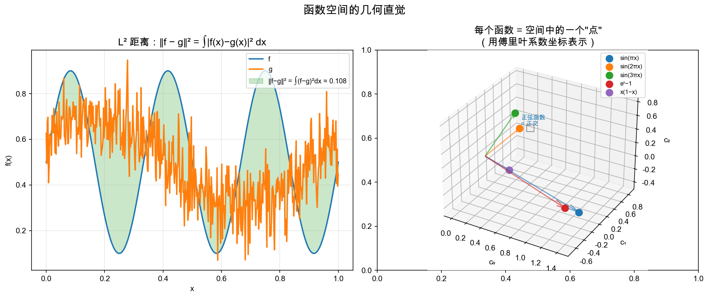

# 重学数学之三: 泛函分析——所有变换的统一语言

## 一、一种重复出现的模式

回顾前两章，你会发现自己在反复做同样的事：

**傅里叶变换**：把函数 $f$ 写成正弦波的线性组合。系数通过"函数内积"得到：
$$
\hat{f}(\omega) = \int f(t) \, e^{-i\omega t} \, dt = \langle f, e^{i\omega t} \rangle
$$

**小波变换**：把函数 $f$ 写成小波的线性组合。系数同样通过"函数内积"得到：
$$
W_f(a,b) = \frac{1}{\sqrt{a}} \int f(t) \, \psi^*\left(\frac{t-b}{a}\right) dt = \langle f, \psi_{a,b} \rangle
$$

这是同一个模板的两个实例：
1. 选择一个**基底**（正弦波、小波、或其他）
2. 计算 $f$ 和每个基函数的**内积**
3. 用内积结果做系数，**重建**原函数

这个模板如此通用，以至于自然地产生了一个问题：**把它抽象到最一般的形式，能得到什么？**

答案就是泛函分析。它不是在学新的东西，而是**给你已经会的东西起名字、找规律、并推广到你不认识的场合**。

## 二、从有限维到无穷维——小心那些裂缝

### 2.1 有限维线代的漂亮世界

在 $\mathbb{R}^n$ 中，我们习惯了很多"免费"的性质：

- 所有范数等价（$\|x\|_1$ 和 $\|x\|_2$ 和 $\|x\|_\infty$ 之间只差常数因子）
- 所有线性算子自动连续
- 有界闭集 = 紧集（Heine-Borel）
- 任何 Cauchy 列自动收敛（完备性自动满足）

一旦进入无穷维函数空间，**这四个性质全部瓦解**。这也是为什么泛函分析需要比线性代数更多的公理和条件——它必须明确地说清楚"我们假设了什么"，因为这些假设在无穷维中不再是免费的。

### 2.2 为什么需要完备性？

完备性 = 每一个 Cauchy 列都收敛。这听起来像是纯粹的技术细节，但它回答了数学中最根本的问题之一：**极限运算是否把我们留在同一个空间里？**

考虑这个 $\mathbb{Q}$（有理数）上的 Cauchy 列：
$$
3,\ 3.1,\ 3.14,\ 3.141,\ 3.1415,\ 3.14159,\ \ldots
$$

它在 $\mathbb{Q}$ 中不收敛，因为 $\pi \notin \mathbb{Q}$。$\mathbb{Q}$ 不完备。这就是为什么我们需要 $\mathbb{R}$——把 $\mathbb{Q}$ 的"洞"补上。

函数空间中同样有"洞"，但洞在哪里取决于你选择的范数。这里有一个很典型的例子：仍然看 $C([0,1])$，但不要用 sup 范数，而用 $L^2$ 范数：

$$
\|f\|_2 = \left(\int_0^1 |f(x)|^2 dx\right)^{1/2}
$$

令 $f_n$ 是一列越来越陡的连续函数，它们从 0 平滑过渡到 1，并且过渡区间越来越窄。直觉上，$f_n$ 越来越像阶跃函数：

$$
f(x)=
\begin{cases}
0, & x < 1/2 \\
1, & x > 1/2
\end{cases}
$$

这个极限函数有跳跃，不在 $C([0,1])$ 中。但在 $L^2$ 范数下，过渡区间的面积越来越小，所以 $\lbrace f_n\rbrace$ 是 Cauchy 列。也就是说：$C([0,1])$ 配上 $L^2$ 范数并不完备，它的完备化是 $L^2([0,1])$。

顺便澄清一个容易混淆的点：$C([0,1])$ 在 sup 范数下反而是完备的，所以它本身就是 Banach 空间。同一个函数集合，换一个范数，空间的几何性质会完全改变。这正是泛函分析必须认真区分"集合、范数、拓扑"的原因。

**Banach 空间 = 对范数完备的向量空间。**
**Hilbert 空间 = 对内积完备的向量空间。**

这两个定义之所以是泛函分析的起点，恰恰因为完备性保证了级数展开、极限、迭代等核心操作不会意外地把你踢出空间。

## 三、正交投影——一切围绕它转

### 3.1 有限维中的投影

在 $\mathbb{R}^n$ 中，如果你有一个子空间 $M$ 和一个不在 $M$ 中的向量 $v$，"最好的逼近"就是正交投影 $P_M v$。它的核心性质是：

$$
\langle v - P_M v, m \rangle = 0 \quad \forall m \in M
$$

即**残差与整个子空间正交**。在 $\mathbb{R}^n$ 中这是显然的——垂线是点到平面的最短距离。

### 3.2 Hilbert 空间中的投影定理

Hilbert 空间投影定理说：**如果 $M$ 是 Hilbert 空间 $H$ 的一个闭子空间，那么对任何 $x \in H$，存在唯一的 $m_0 \in M$ 使 $x - m_0 \perp M$。而且 $m_0$ 就是 $x$ 到 $M$ 的最近点。**

这个定理是泛函分析的几何核心。它把 $\mathbb{R}^n$ 中熟悉的"垂线最短"推广到了任意 Hilbert 空间的任意闭子空间。

> **傅里叶级数就是在做正交投影**：$H = L^2([0, 2\pi])$，$M_n = \text{span}\lbrace 1, \cos x, \sin x, \dots, \cos nx, \sin nx\rbrace$。第 $n$ 个部分和就是 $f$ 到 $M_n$ 的正交投影。投影定理保证了它是最优的 L² 逼近。

### 3.3 标准正交基

一组向量 $\lbrace e_n\rbrace$ 是标准正交基，如果：

1. $\langle e_i, e_j \rangle = \delta_{ij}$（正交归一）
2. 它们张成的闭包是整个空间（完备性）

在 Hilbert 空间中，每个元素可以唯一地写成：
$$
x = \sum_{n=1}^\infty \langle x, e_n \rangle \, e_n
$$

并且 Parseval 恒等式保证**能量守恒**：
$$
\|x\|^2 = \sum_{n=1}^\infty |\langle x, e_n \rangle|^2
$$

这就是傅里叶级数中 $\frac{1}{\pi} \int |f|^2 = \frac{a_0^2}{2} + \sum (a_n^2 + b_n^2)$ 的泛化版本。Parseval 恒等式等价于**变换保范**——信息不丢失，能量不泄漏。

## 四、对偶空间与 Riesz 表示

### 4.1 线性泛函是什么？

泛函分析的另一个核心对象是**线性泛函**——从向量空间到标量域的线性映射：

$$
\phi: H \to \mathbb{R} \ (\text{或 } \mathbb{C})
$$

例子要连同所在空间一起看：

- 在 $C([0,1])$ 配 sup 范数时，$\phi(f) = f(0)$ 是连续线性泛函，也就是 Dirac $\delta$ 泛函。
- 在 $L^2([0,1])$ 中，$\phi(f) = \int_0^1 f(x) dx$ 是连续线性泛函，因为它等于 $\langle f, 1\rangle$。
- 在合适的函数空间中，$\phi(f) = \hat{f}(\omega_0)$ 可以理解为"取某个频率系数"的泛函；但在普通 $L^2(\mathbb{R})$ 上，逐点取 $\hat f(\omega_0)$ 并不是自动有意义的连续操作。

### 4.2 Riesz 表示定理

> **Riesz 表示定理**：设 $H$ 是 Hilbert 空间。对任意连续线性泛函 $\phi: H \to \mathbb{F}$，存在**唯一**的 $g \in H$ 使得
> $$
> \phi(x) = \langle x, g \rangle \quad \forall x \in H
> $$
> 而且 $\|\phi\| = \|g\|$。

这个定理说：在 Hilbert 空间中，**每个线性泛函"就是"与某个固定向量的内积**。它建立了 $H$ 与其对偶空间 $H^*$ 之间的**等距同构**。

在有限维中，$\mathbb{R}^n$ 的每个线性泛函可以写成 $\phi(x) = a^T x = \langle x, a \rangle$（对应一个行向量）。Riesz 定理说：在无穷维 Hilbert 空间中，同样的事成立——只要泛函是连续的。

### 4.3 不在 Hilbert 空间中的泛函

注意 Riesz 定理需要 Hilbert 空间（即内积结构）。如果你只有 Banach 空间（比如 $C([0,1])$ 配 sup 范数），事情就不一样。$C([0,1])$ 上的线性泛函 $\delta_0(f) = f(0)$ 不能通过某个连续函数 $g$ 写成 $\int f(x)g(x)dx$——因为没有连续函数能在除了 0 以外的点处处为 0，又在 0 处"集中"出有限质量。$\delta$ 更自然地是一个**测度**。这正是 Riesz-Markov-Kakutani 表示定理的结论：$C([a,b])^* \cong \lbrace \text{有界 Borel 测度}\rbrace$。

这是理解"为什么我们需要分布 (distribution) 和 Sobolev 空间"的关键一步。

## 五、基底、框架与冗余性

### 5.1 标准正交基不是唯一的答案

标准正交基很美，但要求苛刻：基函数之间两两正交，且归一化。傅里叶基底恰好满足这两个条件。但小波变换呢？

在连续小波变换中，基底 $\lbrace \psi_{a,b}\rbrace$ 是**过度完备**的——$a$ 和 $b$ 是连续参数，基底的"个数"远多于必要。这意味着表示不是唯一的：同一个信号有（连续）无穷多种小波系数表示。

这引出了比标准正交基更一般的概念。为了不让公式把表格撑坏，我们先用一句话分别抓住它们的差别：

- **标准正交基**：最理想的情况。基向量两两正交、长度为 1，并且张成整个空间。表示唯一，系数直接由内积给出。傅里叶基底在 $L^2([0,2\pi])$ 中就是典型例子。
- **Riesz 基**：可以理解为"被一个有界可逆线性变换扭了一下的标准正交基"。它不一定正交，但仍然稳定、无冗余，表示仍然唯一。
- **框架 (frame)**：允许冗余。它可能不是线性无关的，但只要系数能上下控制原向量的范数，就仍然可以稳定重建。
- **紧框架**：最接近标准正交基的冗余表示。它满足类似 Parseval 恒等式的能量守恒，重建公式特别简单。

框架的核心不等式是：

$$
A\|x\|^2 \le \sum_i |\langle x, f_i\rangle|^2 \le B\|x\|^2
$$

其中 $0 < A \le B < \infty$。左边保证你不会漏掉 $x$ 的某个方向，右边保证系数不会无限放大噪声。若 $A=B$，就是紧框架；若再加上线性无关性，就接近 Riesz 基；若进一步正交归一，就是标准正交基。

| 概念 | 是否正交 | 是否冗余 | 表示是否唯一 | 典型例子 |
|------|----------|----------|--------------|----------|
| 标准正交基 | 是 | 否 | 唯一 | 傅里叶基底 |
| Riesz 基 | 不一定 | 否 | 唯一 | 非正交但稳定的小波基 |
| 框架 | 不一定 | 可以冗余 | 通常不唯一 | 连续小波变换、Gabor 框架 |
| 紧框架 | 不一定 | 可以冗余 | 通常不唯一 | Parseval 框架 |

> 框架 (frame) 理论是小波分析的理论根基。它解释了为什么冗余的连续小波变换仍然是可逆的，以及为什么你可以设计出对不同任务更友好（但不正交）的表示基底。

### 5.2 从"找正交集"到"找好的表示"

泛函分析提供了一个重要的概念转折：基底不一定要正交。正交很漂亮，但有时**有控制的冗余**比严格的正交更有用。框架理论正是把这种直觉精确化的语言。

## 六、四大定理——泛函分析的支柱

泛函分析有几个"大定理"构成其骨架。不展开证明，只说明它们回答什么问题：

| 定理 | 回答的问题 | 一句话 |
|------|-----------|--------|
| **Hahn-Banach** | 子空间上的泛函能延拓到全空间吗？ | 能，而且保持范数不变 |
| **Banach-Steinhaus**（一致有界原理） | 一族逐点有界的线性算子是不是一致有界？ | 是——奇异行为不能"散落各处"，它必然在某处集中爆发 |
| **开映射定理** | 满的有界线性算子是否把开集映为开集？ | 是——在 Banach 空间之间，满的连续线性算子"反向连续" |
| **闭图像定理** | 什么时候闭算子自动连续？ | 当定义域是 Banach 空间时——它避免了逐个验证连续性 |

> 如果你从傅里叶和小波变换的视角来看这些定理：Hahn-Banach 让你自由地定义新的泛函（新的"内积"）；Banach-Steinhaus 保证了如果你逐频率分析信号，频谱不会在某些频率莫名其妙地爆炸；开映射定理保证了可逆变换的稳定性。

### 谱定理——算子的对角化

在有限维线代中，对称矩阵可以对角化：$A = U \Lambda U^*$。这等价于：**存在一组标准正交基，使得算子在这组基下变成纯乘法**。

无穷维 Hilbert 空间上的**谱定理**是这个思想的直接推广：

- **紧自伴算子** → 离散谱（可数个特征值，每个特征值有限重数）。Sturm-Liouville 算子、积分算子属于这一类——傅里叶级数来源于此。
- **有界自伴算子** → 可以有连续谱。典型例子是乘法算子；很多卷积算子经傅里叶变换后也会变成乘法算子。
- **无界自伴算子** → 量子力学中的位置和动量算子。它们是"几乎可以对角化但需要特别小心"的算子。

傅里叶变换的深层本质：**它是将卷积算子对角化的酉变换**。这个陈述的每一个词——酉、对角化、卷积算子、变换——都是泛函分析定义的。

## 七、应用场景

泛函分析不像傅里叶变换那样常以一个具体算法的名字出现。它更像是很多现代数学和工程方法背后的"操作系统"：你真正使用的是 PDE、优化、量子力学、机器学习，但让这些东西可证明、可逼近、可稳定计算的语言，往往是泛函分析。

| 领域 | 泛函分析扮演的角色 |
|------|-------------------|
| 偏微分方程 | 把解看成函数空间中的点，用弱解、Sobolev 空间、紧性和变分方法处理经典解不存在的问题 |
| 量子力学 | 态是 Hilbert 空间中的向量，可观测量是自伴算子，谱定理解释能量、动量等测量结果从何而来 |
| 信号处理 | 傅里叶、小波、Gabor 变换都是 Hilbert 空间中的基、框架和酉变换问题 |
| 数值分析 | 有限元方法本质上是在无穷维函数空间中选有限维子空间做 Galerkin 投影 |
| 优化与控制 | 凸分析、对偶空间、Hahn-Banach 分离定理支撑约束优化、最优控制和鲁棒控制 |
| 机器学习 | 核方法把数据映射到再生核 Hilbert 空间 (RKHS)，支持向量机和高斯过程都依赖这个结构 |
| 逆问题与成像 | MRI、CT、去卷积、压缩感知都需要理解算子的稳定性、谱性质和正则化 |

最值得记住的一点是：泛函分析让你能区分"理论上有解"、"解唯一"、"解对噪声稳定"和"解可以被数值方法逼近"。这四件事在有限维线性代数里常常被混在一起，但在无穷维问题中必须分开处理。

## 八、回到傅里叶和小波

掌握了泛函分析的语言后，傅里叶和小波之间的深层关系变得透明：

两者都在用内积分析函数，但“基展开”这句话需要区分离散与连续情形：周期 Fourier 级数和离散小波变换可以由可数基来描述；$\mathbb R$ 上的连续 Fourier 变换与连续小波变换更接近广义谱分解或连续框架。

- **Fourier 系统** $\lbrace e^{i\omega t}\rbrace$：在周期情形给出标准正交基；在 $L^2(\mathbb R)$ 上，平面波本身不平方可积，应理解为广义本征函数。Fourier 变换对角化平移不变算子，但不直接提供时间定位。
- **小波系统** $\lbrace \psi_{a,b}\rbrace$：CWT 通常形成连续框架，合适的 DWT 可以形成标准正交基或双正交基。它由**缩放 + 平移**生成，在时间和频率上都有局部性。

从群表示论的角度看：
- 傅里叶变换来源于 $\mathbb{R}$ 的**平移群**的酉表示
- 小波变换来源于 $\mathbb{R}$ 的**仿射群**（affine group：$x \mapsto ax + b$）的酉表示

不同的变换 = 不同群作用的调和分析。泛函分析提供了统一的语言，而群表示论指明了不同的变换分别从何处"生长"出来。

## 九、前沿展望

### 9.1 神经算子：直接学习无穷维空间之间的映射

传统神经网络多半学习有限维向量之间的函数：

$$
\mathbb R^n\to\mathbb R^m
$$

但很多科学问题的自然对象是算子：

$$
\mathcal A: X\to Y
$$

其中 $X,Y$ 是函数空间。例如 PDE 中，输入可能是系数场、初值或边界条件，输出是整个解函数。

DeepONet（Lu、Jin、Karniadakis 等）和 Fourier Neural Operator（Li 等）正是沿着这条路发展出来的。它们把泛函分析中的"算子"变成可训练对象：

- branch/trunk 结构学习输入函数与输出位置之间的耦合。
- Fourier layer 在频域中学习积分核。
- 训练完成后，模型试图近似整个解算子，而不是只解某一个 PDE 实例。

这说明泛函分析不只是证明工具。它正在变成科学机器学习的建模语言：网络不再只近似函数，而是在近似函数空间之间的映射。

### 9.2 神经切线核：把宽神经网络重新拉回 Hilbert 空间

Jacot、Gabriel、Hongler（2018）提出神经切线核（NTK）后，一个重要视角出现了：

> **足够宽的神经网络，在某些极限下可以用核方法描述训练动态。**

NTK 定义为：

$$
K_\theta(x,x')
=
\langle
\nabla_\theta f_\theta(x),
\nabla_\theta f_\theta(x')
\rangle
$$

它把参数空间中的梯度内积变成输入空间上的核。宽度趋于无穷时，这个核在训练中近似保持不变，神经网络训练可以看成某个再生核 Hilbert 空间中的核梯度流。

这并不能解释所有深度学习现象，因为真实网络常常会学习特征，而不是只停留在初始化附近。但它给出了一个清楚基准：至少在"惰性训练" regime 中，深度网络和经典 Hilbert 空间方法之间有严格桥梁。

### 9.3 再生核 Hilbert 空间：从 SVM 到高斯过程

再生核 Hilbert 空间（RKHS）是泛函分析在机器学习中最稳定的一条主线。

一个核函数 $K(x,y)$ 定义一个函数空间 $\mathcal H_K$，并满足再生性质：

$$
f(x)=\langle f,K(x,\cdot)\rangle_{\mathcal H_K}
$$

这意味着"在点 $x$ 取值"这个操作，可以表示为一次内积。

支持向量机、高斯过程、核岭回归、最大均值差异（MMD）都依赖这条思想。它们共同说明：

> **只要选对核，就等于选了一个函数空间；学习问题就是在这个函数空间中做正则化优化。**

在大模型时代，RKHS 没有过时。相反，它成为分析无限宽网络、随机特征、核近似和泛化误差的重要参照系。

### 9.4 无穷维优化与逆问题：稳定性比存在性更难

泛函分析最实际的前沿之一，是处理反问题：

$$
Af=y
$$

例如 CT、MRI、去卷积、地球物理反演、PDE 参数识别。问题通常不是"有没有解"，而是：

1. 解是否唯一？
2. 噪声会不会被算子逆放大？
3. 正则化怎样选择？
4. 数值离散后是否仍然逼近原问题？

Tikhonov 正则化、稀疏正则化、全变差正则化、Plug-and-Play priors 和深度展开网络，都可以看成在无穷维函数空间中为病态逆问题加入结构约束。

这条路线提醒我们：泛函分析的核心价值不是抽象本身，而是它能区分四件常被混淆的事：

- 理论上有解。
- 解唯一。
- 解对噪声稳定。
- 解可以被算法可靠逼近。

现代成像、科学计算和机器学习中的许多难题，本质上仍在这四个问题之间周旋。

## 十、总结

如果把数学比作建筑：

- **傅里叶变换、小波变换** 是你要建造的**桥梁**
- **线性代数** 给出了有限维的**梁和柱**——内积、基底、投影
- **泛函分析** 确保了这些梁柱在你可以把物体延伸到无穷维时**不会折断**——完备性、有界性、闭性，每一个概念都是为了堵住一个特定的裂缝

泛函分析本质上只做了一件事：**用公理和定理把有限维线代的直觉安全地运送到无穷维。**

有了这个语言学完之后，你会发现：
- 傅里叶级数 = Hilbert 空间中的标准正交基展开
- 傅里叶变换 = 对角化卷积算子的酉变换
- 小波变换 = 对角化仿射群作用的表示
- Parseval 等式 = 酉变换的保范性
- 正交投影 = L² 最优逼近
- 框架 = 带冗余但仍可逆的表示

---

*下一章预告：我们从线性转向非线性。傅里叶和小波都是线性变换——输出是输入的线性函数。但真实世界充满了非线性现象。微分几何提供了理解非线性空间（流形）的语言——切空间、曲率、测地线、联络……这些概念在你已经掌握了线性结构之后，恰好是自然的下一步。*
