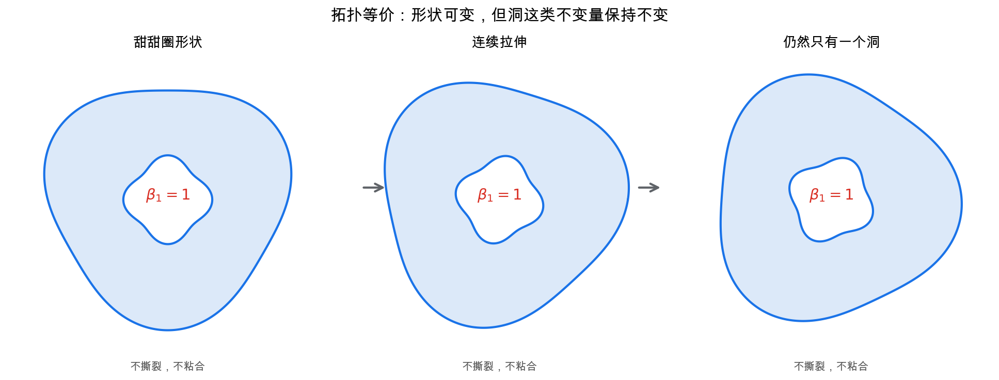
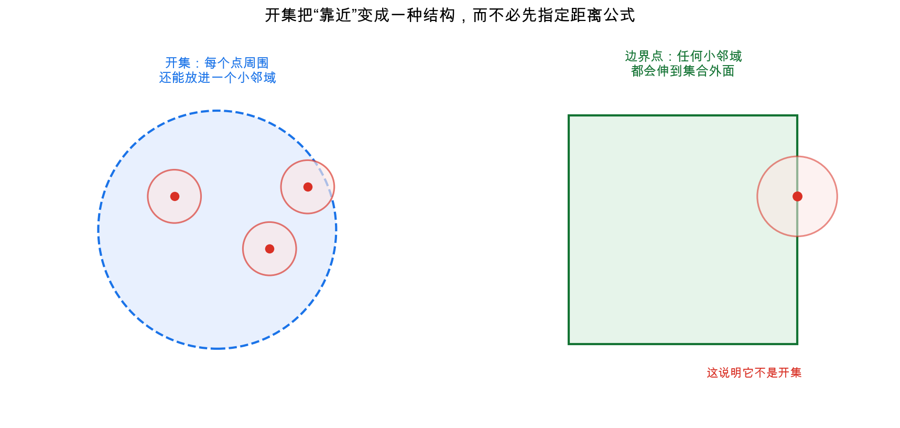
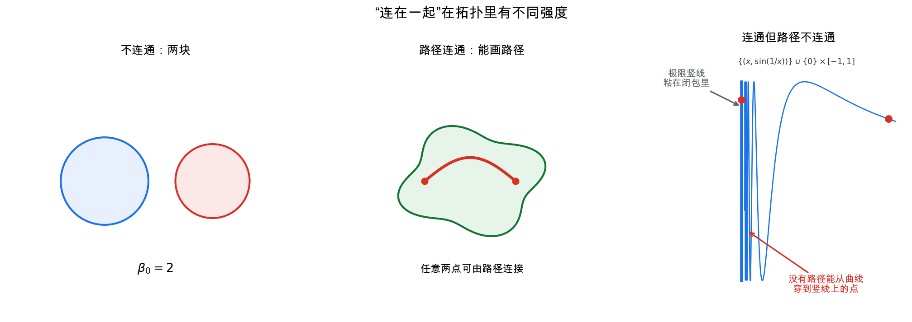
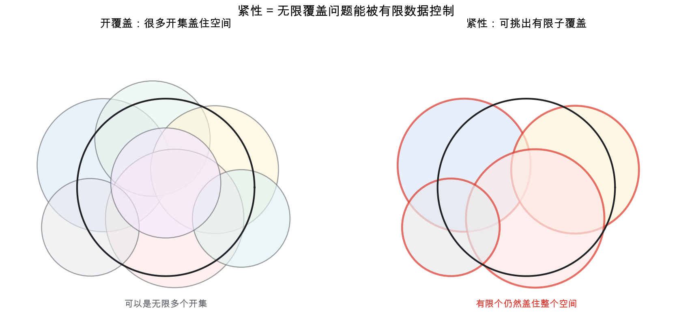
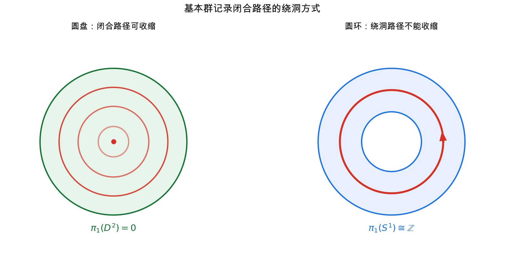
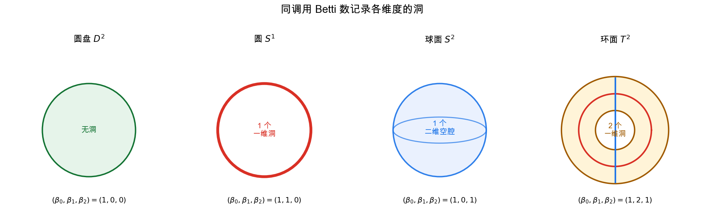

# 重学数学之五: 拓扑学——只关心连续变形中不会消失的东西
![[Pasted image 20260627001011.png]]

## 一、如果不测量长度，还剩下什么？

上一章的微分几何仍然保留了很多"测量"：长度、角度、曲率、测地线。这些都依赖 Riemann 度量。换一个度量，很多几何量会改变。

拓扑学做了一件更激进的事：

> **忘掉长度、角度、曲率，只保留连续性。**

这听起来像是把信息扔掉。但数学里经常是这样：你主动忘掉一些细节，反而能看见更稳定的结构。

一个咖啡杯和一个甜甜圈，在欧氏几何中当然完全不同：形状不同、曲率不同、体积不同。但从拓扑学看，它们都有一个洞，可以通过连续且可逆的变形对应起来，而不需要撕裂或粘合。严格说，这种"拓扑上相同"叫同胚；如果只讨论路径或映射能否连续变形到另一条路径或映射，则叫同伦。

这两个词容易混淆：**同胚**是在说两个空间本身等价；**同伦**是在说两个映射或两条路径可以连续变形到彼此。同胚通常比同伦等价更强。本章先用同胚理解"拓扑上相同"，后面讲基本群时再用同伦理解"闭合路径能否缩成一点"。

拓扑学关心的不是"这个对象具体长什么样"，而是：

- 哪些点彼此靠近？
- 哪些部分连在一起？
- 有没有洞？
- 闭合回路能不能收缩成一点？
- 连续映射能保留哪些结构？

如果说微分几何的核心句子是"全局非线性，局部线性"，那么拓扑学的核心句子是：

> **空间的本质不是距离，而是邻近关系。**

## 二、开集：把"靠近"从距离中解放出来

### 2.1 为什么不用距离定义一切

在 $\mathbb{R}^n$ 里，我们习惯用距离定义连续性：

$$
\forall \varepsilon>0,\ \exists \delta>0,\quad d(x,y)<\delta \Rightarrow d(f(x),f(y))<\varepsilon
$$

这个定义很好，但它把连续性绑死在"距离"上。问题是，很多空间天然没有一个唯一的距离：

- 函数空间可以用 sup 范数、$L^2$ 范数、弱拓扑。
- 概率分布空间可以用 total variation、KL divergence、Wasserstein 距离。
- 代数几何中的空间常常不适合先谈距离。

拓扑学的第一步，是把连续性的基础从"距离"换成"开集"。

### 2.2 拓扑空间是什么

给定一个集合 $X$，如果我们指定一族子集 $\mathcal{T}$，并把它们叫作"开集"，只要求满足三条规则：

1. $\varnothing$ 和 $X$ 是开集。
2. 任意多个开集的并仍是开集。
3. 有限多个开集的交仍是开集。

那么 $(X,\mathcal{T})$ 就叫一个**拓扑空间**。

这三条规则看起来很弱，但它们恰好保留了"局部邻域"所需的最小结构。

可以用几个极端例子感受一下拓扑在做什么。

如果所有子集都被规定为开集，这叫离散拓扑。它把每个点都分得很清楚，任何函数从这个空间出发都是连续的。

如果只有 $\varnothing$ 和 $X$ 是开集，这叫平凡拓扑。它几乎不分辨点，能说的连续结构极少。

通常欧氏空间的拓扑介于两者之间。它不是把每个点孤立出来，也不是把所有点混成一团，而是通过开球生成邻域结构。

所以拓扑不是在给集合增加“距离”，而是在指定：

> **哪些局部信息可以被连续地分辨。**

在这个语言下，连续性可以重新定义为：

> $f:X\to Y$ 连续，当且仅当 $Y$ 中任意开集 $V$ 的原像 $f^{-1}(V)$ 都是 $X$ 中的开集。

这个定义第一次看会觉得反直觉：为什么看原像，不看像？

原因是原像和集合运算相容：

$$
f^{-1}\left(\bigcup_i V_i\right)=\bigcup_i f^{-1}(V_i),\quad
f^{-1}(V_1\cap V_2)=f^{-1}(V_1)\cap f^{-1}(V_2)
$$

原像天然尊重"开集结构"。连续映射的本质，就是把目标空间中可分辨的邻域结构，拉回到源空间后仍然可分辨。

这也是为什么拓扑定义看起来抽象，却比 $\varepsilon$-$\delta$ 更稳。距离定义只适用于有度量的空间；开集定义直接抓住连续性的逻辑骨架。

### 2.3 同胚：拓扑学中的"相等"

在线性代数里，真正重要的相等不是坐标逐项相同，而是线性同构。微分几何里，真正重要的相等是微分同胚。拓扑学里，对应的概念是**同胚**。

两个拓扑空间 $X,Y$ 同胚，如果存在一个双射：

$$
f:X\to Y
$$

使得 $f$ 连续，且 $f^{-1}$ 也连续。

这表示 $X$ 和 $Y$ 的邻近结构完全一样。你可以把一个空间连续拉伸、压缩、弯曲成另一个，但不能撕裂，也不能把分开的部分粘起来。

一个常见误区是：同胚不要求保持形状、长度、角度或曲率。它只要求连续结构可逆地保持。正方形和圆盘同胚，直线和开区间同胚；但圆和线段不同胚，因为去掉一个点后，圆仍连通，线段可能被切成两段。

### 2.4 商空间：把点按规则粘起来

拓扑学里还有一个非常常见的造空间方法：粘合。

从一个正方形出发，如果把左边和右边按同方向粘起来，再把上边和下边也按同方向粘起来，就得到环面。这个环面不一定要先嵌入三维空间才能定义；它可以直接通过“边的识别关系”定义出来。

这就是商空间的思想。给定空间 $X$ 和一个等价关系 $\sim$，把等价的点视为同一个点，得到：

$$
X/{\sim}
$$

商拓扑的规则是：一个集合在商空间中开，当且仅当它的原像在 $X$ 中开。

这句话和连续映射的原像定义是同一精神。我们不是随便粘，而是用开集规则保证粘合后的空间仍然有合理的连续结构。

很多拓扑对象都是这样来的：圆可以看成区间两端点粘起来，球面可以看成圆盘边界压成一点，环面可以看成正方形对边粘合。商空间让“剪开再粘回去”的直觉变成了严格构造。

## 三、连通性：空间是否真的连在一起

### 3.1 连通不是路径连通的同义词

最直观的拓扑性质是：一个空间是否连在一起。

如果一个空间可以拆成两个互不相交、非空、同时又都是开集的部分：

$$
X = U \cup V,\quad U\cap V=\varnothing
$$

那么它就是不连通的。否则，它是连通的。

路径连通更强：任意两点之间都能用一条连续路径连接。路径连通一定连通，但连通不一定路径连通。拓扑学有很多反直觉例子，比如拓扑学家的正弦曲线：

$$
\{(x,\sin(1/x)):0<x\le 1\}\cup \{(0,y):-1\le y\le 1\}
$$

它是连通的，但不是路径连通的。

这类例子提醒我们：拓扑性质比直觉图像更精细。你以为"连在一起"只有一种含义，但在没有距离和光滑结构后，很多平时被忽略的差别会浮出来。

### 3.2 连通分支

如果空间不连通，我们可以把它分解成最大的连通部分，叫**连通分支**。

这在数据分析里很常见：给定一个点云，如果你只知道哪些点之间足够近，就能构造一个图或单纯复形，然后分析它有几个连通分支。这个数字就是最简单的拓扑不变量，通常记作：

$$
\beta_0
$$

它是第零 Betti 数，表示"有多少块"。

这也是为什么连通性常常是拓扑分析的第一步。还没开始谈洞之前，先问空间分成几块。第六章的 $H_0$ 会把这件事精确写成线性代数。

## 四、紧性：有限信息控制无限对象

紧性是拓扑学里最重要也最容易被误解的概念之一。在 $\mathbb{R}^n$ 中，Heine-Borel 定理告诉我们：

> 紧集 = 闭且有界。

但这只是欧氏空间里的幸运简化。真正的拓扑定义是：

> 对 $X$ 的任意开覆盖，都存在有限子覆盖。

如果你用一堆开集覆盖整个空间，无论这堆开集有多少个，总能挑出有限多个仍然覆盖整个空间。

为什么这重要？

因为紧性是一种"无限问题可被有限数据控制"的性质。

- 连续函数在紧集上一定取得最大值和最小值。
- 紧空间上的任意开覆盖可被有限化。
- 很多存在性定理都依赖紧性。
- 在度量空间和许多分析场景中，紧性常常等价于"任意序列都有收敛子列"这类序列紧性表述。

从泛函分析看，这一点尤其关键：有限维中有界闭集自动紧，但无穷维中不再如此。上一章提到的那些"裂缝"，很多都和紧性失效有关。

紧性最值得记住的不是“闭且有界”，而是：

> **无限对象可以被有限证据控制。**

这句话解释了很多存在性定理为什么需要紧性。你想证明最大值存在、极限子列存在、某个覆盖能被有限化，背后都在用同一种思想：虽然对象可能无限，但它不会无限逃散。

## 五、基本群：闭合路径能不能缩成一点

拓扑学真正开始变得有力量，是当我们不只问"有几块"，还问"有没有洞"。

先看最简单的一类洞：一维闭合回路绕住的洞。

在圆环或甜甜圈上，有些闭合路径无法连续收缩成一点，因为它们绕过了洞。在圆盘上，任何闭合路径都能缩成一点。

基本群 $\pi_1(X,x_0)$ 的元素，是从基点 $x_0$ 出发又回到 $x_0$ 的闭合路径，两个路径如果能连续变形到彼此，就视为同一个元素。

群运算是什么？就是把两个闭合路径首尾相接：

$$
[\gamma_1]\cdot[\gamma_2]=[\gamma_1 * \gamma_2]
$$

最简单的例子：

$$
\pi_1(S^1)\cong \mathbb{Z}
$$

整数表示绕圆的次数：逆时针绕一圈是 $1$，顺时针绕一圈是 $-1$，绕三圈是 $3$。这就是代数拓扑的基本思想：**把空间中的洞翻译成代数对象。**

### 5.1 为什么基本群有用

基本群能区分很多看起来相似的空间：

- 圆盘的基本群是平凡群，圆环的基本群不是。
- 球面 $S^2$ 的任意闭合路径都能缩成一点，所以 $\pi_1(S^2)=0$。
- 环面 $T^2$ 有两个独立方向的绕圈，所以 $\pi_1(T^2)\cong \mathbb{Z}^2$。

这给我们一种非常强的证明工具：如果两个空间同胚，那么它们的基本群同构。因此，只要基本群不同，空间就不可能同胚。

### 5.2 基点为什么出现？

基本群写作 $\pi_1(X,x_0)$，里面有一个基点 $x_0$。这不是装饰。

闭合路径需要从同一个点出发、回到同一个点，才能首尾相接形成群运算。如果空间路径连通，换一个基点通常只会得到同构的基本群；如果空间有多个路径连通分支，基点所在分支就很重要。

这提醒我们：拓扑不变量常常不是孤立的数字，而是带着选择和结构。基本群记录的是从一个观察点出发能绕出哪些不可收缩的回路。

## 六、同调：用线性代数数洞

基本群很有信息量，但它通常不是交换群，计算起来可能很难。有没有更线性、更可计算的版本？

有，这就是**同调**。

同调的核心想法是：用 $k$ 维链去探测 $k$ 维洞。

- 0-维同调 $H_0$：数连通分支。
- 1-维同调 $H_1$：数一维洞，也就是无法填上的闭合回路。
- 2-维同调 $H_2$：数二维空腔，比如球面包住的内部空洞。

用 Betti 数记这些洞的数量：

$$
\beta_k = \operatorname{rank} H_k
$$

几个典型空间：

| 空间 | $\beta_0$ | $\beta_1$ | $\beta_2$ | 含义 |
|------|-----------|-----------|-----------|------|
| 圆盘 $D^2$ | 1 | 0 | 0 | 一整块，没有洞 |
| 圆 $S^1$ | 1 | 1 | 0 | 一整块，一个环 |
| 球面 $S^2$ | 1 | 0 | 1 | 一整块，包住一个二维空腔 |
| 环面 $T^2$ | 1 | 2 | 1 | 一整块，两个独立环，一个二维壳 |

同调为什么适合计算？因为它把拓扑问题转成了线性代数问题。给一个三角剖分，我们可以构造链群和边界算子：

$$
\cdots \xrightarrow{\partial_{k+1}} C_k \xrightarrow{\partial_k} C_{k-1} \xrightarrow{\partial_{k-1}} \cdots
$$

洞的定义是：

$$
H_k = \ker \partial_k / \operatorname{im}\partial_{k+1}
$$

翻译成人话：

> **闭合但不是某个更高维对象边界的东西，就是洞。**

这句话非常值得记住。一个圆周如果是某个圆盘的边界，它就不是洞；如果没有圆盘填住它，它就是一维洞。

基本群和同调都在探测洞，但侧重点不同。

基本群保留路径拼接的非交换结构，信息更细，但也更难算。同调把问题线性化，牺牲一部分信息，换来矩阵、核、像、秩这些线性代数工具。

这就是第六章要展开的主题：拓扑学告诉我们“洞是稳定结构”，同调进一步告诉我们“洞可以被计算”。

## 七、应用场景

拓扑学看似抽象，但它的优势正是"对连续变形不敏感"。在噪声、离散采样和坐标变化不可避免的场景中，这种稳定性很有价值。

| 领域 | 拓扑学扮演的角色 |
|------|-------------------|
| 数据分析 | 持久同调用多尺度方式分析点云的连通分支、环和空腔，区分真实结构与噪声 |
| 机器人学 | 配置空间的连通性和洞决定路径规划是否可能，以及障碍物如何影响可达区域 |
| 传感器网络 | 通过覆盖和同调判断传感器是否留下覆盖空洞 |
| 动力系统 | 相空间中的不变量集、环绕数、Poincaré 截面都带有拓扑信息 |
| 计算机图形学 | 网格是否有洞、亏格是多少、是否可参数化，都是拓扑问题 |
| 物理 | 拓扑相、拓扑缺陷、规范场中的 Chern 类等说明某些物理性质受拓扑保护 |
| 程序语义与类型论 | 同伦类型论把命题、类型和空间路径联系起来，是拓扑思想进入逻辑的例子 |

这里的共同模式是：你不关心精确形状，而关心结构是否稳定。噪声可以扭曲数据点的位置，但通常不会轻易改变"有几个洞"。这就是拓扑方法在数据科学中有吸引力的原因。

## 八、与前几章的连接

现在我们有了一个更完整的层次：

1. **傅里叶变换**：在线性空间里换基。
2. **小波变换**：在线性空间里做多尺度局部表示。
3. **泛函分析**：研究无穷维线性空间和算子。
4. **微分几何**：研究局部像线性空间的非线性空间。
5. **拓扑学**：进一步忘掉长度、角度和光滑性，只保留连续结构。

这些不是彼此替代，而是不同分辨率：

- 泛函分析问：线性结构如何工作？
- 微分几何问：局部线性结构如何拼接成弯曲空间？
- 拓扑学问：如果只看连续变形下不变的东西，空间还剩什么？

从范畴论角度看，拓扑学是在研究一个新的范畴：对象是拓扑空间，态射是连续映射。同胚就是这个范畴里的同构。基本群、同调则是从拓扑空间范畴到群或向量空间范畴的函子：它们把难画的空间转成可计算的代数对象。

## 九、前沿展望

### 9.1 拓扑数据分析（TDA）与持久同调

Edelsbrunner、Harer（2008）和 Carlsson（2009）系统发展了**持久同调**（persistent homology）：给点云数据构造一族单纯复形（filtration），随尺度参数增长跟踪拓扑特征的出生与消亡，得到**条形码**（barcode）或**持久图**（persistence diagram）。

持久图是拓扑不变量，并对噪声稳定（稳定性定理：若两点云的 Hausdorff 距离为 $\varepsilon$，则其持久图的 bottleneck 距离不超过 $\varepsilon$）。基于持久图的特征提取方法（persistence images、persistence landscapes）已被用于：
- 材料科学中玻璃结构的环统计分析。
- 蛋白质结合位点的形状特征（Cang & Wei 2017）。
- 脑功能连接组数据分析。

开源库 Ripser（极快的持久同调计算）和 GUDHI 提供了生产可用的实现。

### 9.2 Mapper：点云的全局形状

Singh、Mémoli、Carlsson（2007）提出 **Mapper 算法**：将高维点云通过滤波函数投影到低维区间，对每个区间内的子集做聚类，再将不同区间的聚类按重叠粘起来，得到一个图（或单纯复形），可视化数据的全局形状。

Mapper 发现了乳腺癌基因表达数据中一个此前未知的患者亚群（Lum 等 2013），是 TDA 进入生物医学的标志性工作。

### 9.3 同伦类型论（HoTT）：把类型当空间、把证明当路径

Voevodsky（2009）和 Awodey 等提出了同伦类型论，将 Martin-Löf 依值类型论中的**相等类型** $a = b$ 解释为类型（空间）$A$ 中点 $a$ 与 $b$ 之间的路径空间。高阶路径（路径的路径）对应高维同伦群。

核心原理**单值性公理**（univalence axiom）说：等价的类型是相等的，使得数学对象的"实质同构"在类型系统中成为严格等式。这让定理证明助手（如 Lean 4、Agda）可以直接在 HoTT 语言中形式化抽象数学，并为计算机科学中的依赖类型程序设计提供了拓扑语义。

### 9.4 拓扑物质相

拓扑绝缘体（2005 年后涌现）展示了凝聚态物理中的拓扑保护：Thouless、Kohmoto、Nightingale、den Nijs 于 1982 年发现量子霍尔系统的霍尔电导由 **Chern 数**（第一 Chern 类的积分）决定，是一个整数，因此对连续微扰免疫。这个整数来自布里渊区（环面 $T^2$）上电子波函数的拓扑分类。

这是拓扑学从纯数学进入实验物理的直接案例：洞（第一 Chern 类非零）对应导电边界态，其存在性受拓扑保护而不依赖任何对称性细节。

## 十、总结

拓扑学的核心不是"橡皮膜几何"这个比喻本身，而是一个非常严肃的思想：

> **用连续性定义空间，用不变量识别空间。**

关键概念可以这样串起来：

1. **拓扑**：指定哪些集合是开集，从而定义邻近关系。
2. **连续映射**：开集的原像仍是开集。
3. **同胚**：拓扑学中的相等，允许连续变形但不允许撕裂和粘合。
4. **商空间**：通过识别和粘合构造新空间。
5. **连通性**：空间是否能被分成两个互不相干的开闭部分。
6. **紧性**：无限覆盖可被有限子覆盖控制。
7. **基本群**：闭合路径在连续变形下的等价类，探测一维洞。
8. **同调**：用线性代数系统地数各维度的洞。

拓扑学之所以强大，是因为它把几何问题降到最稳定的层面。长度可以变，角度可以变，曲率可以变，但连通性、洞、绕圈方式这些结构往往不会变。

---

*下一章预告：拓扑学告诉我们空间有什么洞，但它还没有解释这些洞如何通过代数系统地计算。下一章进入代数拓扑的核心工具：同调与上同调。我们会把"边界的边界为零"这句话展开，看看链复形、商空间、Betti 数、Euler 示性数和 de Rham 上同调如何把几何、代数与分析接在一起。*
