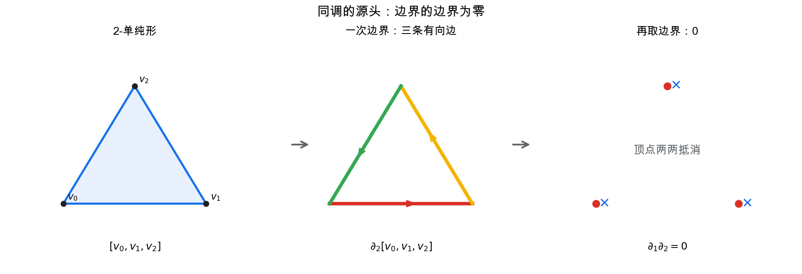
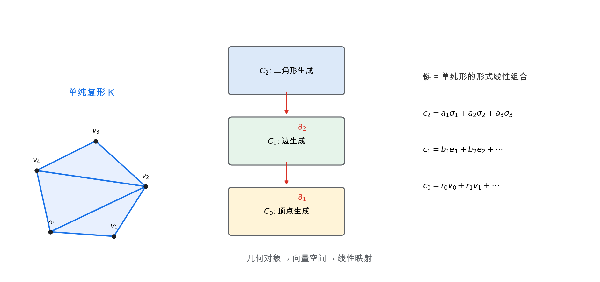
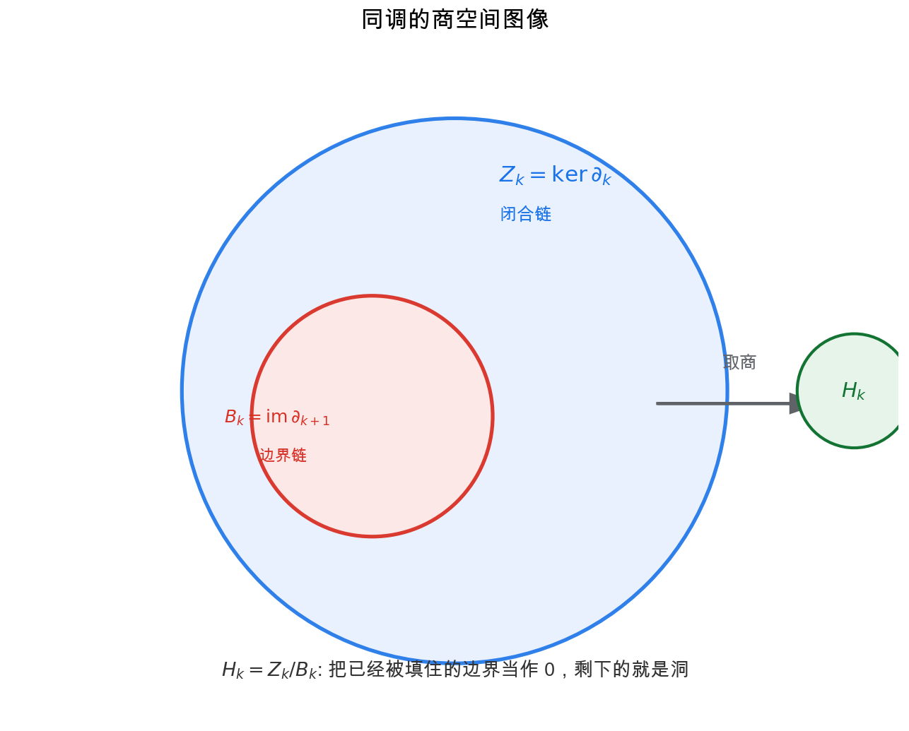
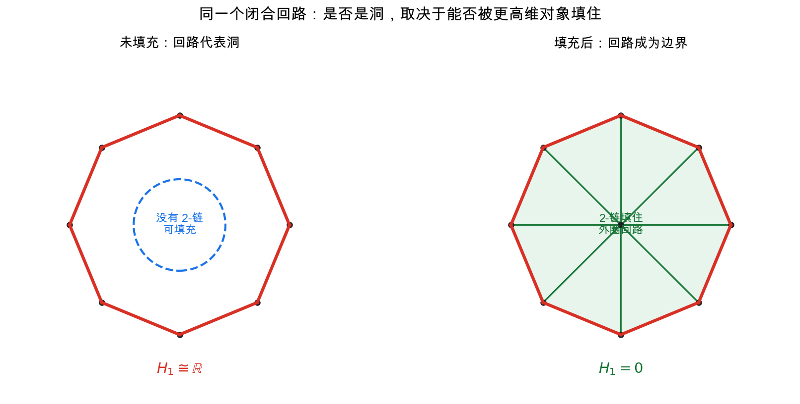
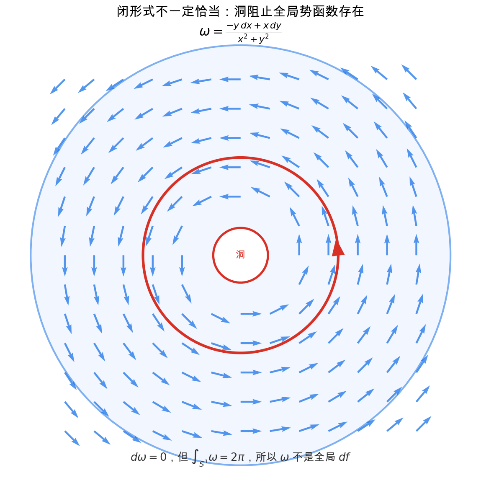

# 重学数学之六: 同调与上同调——把洞变成线性代数

## 一、从一句话开始：边界的边界为零

上一章我们已经见过同调的口头定义：

> **闭合但不是某个更高维对象边界的东西，就是洞。**

这句话听起来像几何直觉，但它其实可以被精确地翻译成线性代数。翻译的钥匙是一句极其简单的话：

$$
\partial^2 = 0
$$

也就是：

> **边界的边界为零。**

一个线段的边界是两个端点；这两个端点再取边界，没有东西了。一个三角形的边界是三条边；三条边的边界相加后，顶点会两两抵消。一个四面体的边界是四个三角面；这些三角面的边界也会互相抵消。

这不是一个技术小事实，而是同调理论的源头。因为 $\partial^2=0$ 意味着：

$$
\operatorname{im}\partial_{k+1} \subseteq \ker \partial_k
$$

每一个"边界"自动是"闭合的"。但反过来不一定：一个闭合东西未必是某个更高维东西的边界。这个差距，正是洞。

可以先把这句话翻译成最朴素的图像：

- 一条闭合曲线如果围着一个实际存在的面，它只是那个面的边界，不算洞。
- 一条闭合曲线如果围住一块空间里没有的面，它就暴露了一个洞。

同调要做的事情，就是把这两种闭合曲线区分开。

## 二、用单纯形搭空间

### 2.1 点、边、三角形、四面体

要计算空间的洞，我们先把空间离散化。最常见的积木叫**单纯形**：

| 维度 | 名字 | 几何对象 |
|------|------|----------|
| 0 | 0-单纯形 | 点 |
| 1 | 1-单纯形 | 线段 |
| 2 | 2-单纯形 | 三角形 |
| 3 | 3-单纯形 | 四面体 |

把这些单纯形按面粘起来，就得到一个**单纯复形**。它可以近似圆、球面、环面、曲面网格，甚至点云数据的邻接结构。

这一步的意义是：我们把连续空间转成了有限的组合对象。接下来就可以做线性代数。

### 2.2 链：允许形式线性组合

给定一个单纯复形，所有 $k$ 维单纯形生成一个向量空间（或 Abel 群），记作：

$$
C_k
$$

它的元素叫 $k$-链。比如一个 1-链可以是若干条有向边的形式和：

$$
c = 2e_1 - e_2 + e_5
$$

这里的系数可以取整数、有理数、实数，甚至模 2。为了抓住主线，我们可以先把它想成实向量空间。这样 $C_k$ 就只是一个有限维向量空间，基底是所有 $k$ 维单纯形。

### 2.3 边界算子

边界算子是一个线性映射：

$$
\partial_k: C_k \to C_{k-1}
$$

它把每个 $k$ 维单纯形送到它的有向边界，然后线性延拓到所有链。

例如有向线段 $[v_0,v_1]$ 的边界是：

$$
\partial_1[v_0,v_1] = [v_1]-[v_0]
$$

有向三角形 $[v_0,v_1,v_2]$ 的边界是：

$$
\partial_2[v_0,v_1,v_2]
= [v_1,v_2]-[v_0,v_2]+[v_0,v_1]
$$

符号正负号的作用，是保证相邻单纯形共享的边会以相反方向出现，从而在整体边界中抵消。这就是 $\partial_{k-1}\partial_k=0$ 的来源。

## 三、同调：闭合链除以边界链

现在我们有了一串向量空间和线性映射：

$$
\cdots \xrightarrow{\partial_{k+2}} C_{k+1}
\xrightarrow{\partial_{k+1}} C_k
\xrightarrow{\partial_k} C_{k-1}
\xrightarrow{\partial_{k-1}} \cdots
$$

并且相邻两个边界算子复合为零：

$$
\partial_k\circ\partial_{k+1}=0
$$

这叫一个**链复形**。

### 3.1 Cycle 和 Boundary

两个子空间最关键：

$$
Z_k = \ker \partial_k
$$

叫 $k$-闭链，也就是边界为零的 $k$-链。它们是"闭合的东西"。

$$
B_k = \operatorname{im}\partial_{k+1}
$$

叫 $k$-边界链，也就是某个 $(k+1)$-链的边界。它们是"已经被更高维对象填住的闭合东西"。

因为 $\partial^2=0$，一定有：

$$
B_k \subseteq Z_k
$$

于是同调群定义为商空间：

$$
H_k = Z_k / B_k
$$

这就是上一章那句话的精确版本：

> $H_k$ 记录的是那些闭合、但不能被更高维对象填住的 $k$ 维结构。

### 3.2 先看 0 维同调：它数的是连通分量

第一次看到 $H_k=Z_k/B_k$，最容易觉得它太抽象。我们先看 $k=0$。

0-链是顶点的形式和。0 维边界算子：

$$
\partial_0:C_0\to C_{-1}
$$

通常视为零映射，所以所有 0-链都是闭链：

$$
Z_0=C_0
$$

那 $B_0$ 是什么？它来自 1-链的边界。对一条有向边 $[v_0,v_1]$：

$$
\partial_1[v_0,v_1]=[v_1]-[v_0]
$$

这意味着：如果两个顶点之间有边相连，那么在商空间里：

$$
[v_1]-[v_0]=0,\quad\text{也就是}\quad [v_1]=[v_0]
$$

沿着路径不断使用这个关系，同一个连通分量里的所有顶点都会被视为同一个类。不同连通分量之间没有路径连接，就不会被这个关系合并。

所以：

$$
\dim H_0=\text{连通分量个数}
$$

这就是同调的第一个成功例子。它没有先定义“连通分量”，而是通过“顶点之间能否由边界关系连接起来”自动算出了连通分量。

### 3.3 为什么要取商

如果两个闭合回路相差一个边界，它们围住的是同一块可填充区域的不同边缘。从洞的角度看，它们不应该被算作不同洞。

所以我们把所有边界都当作"零"：

$$
z \sim z + \partial c
$$

这就是取商 $Z_k/B_k$ 的含义。商空间不是抽象技巧，而是在表达：**被填住的东西不算洞。**

更具体地说，取商做了两件事：

1. 只保留闭合对象，因为不闭合的链本来就不是洞的候选。
2. 把已经是边界的闭合对象压成零，因为它们已经被更高维对象填住。

剩下的等价类，才是无法被填充的洞。

### 3.4 Betti 数

如果系数取实数，$H_k$ 是向量空间。它的维数叫第 $k$ 个 Betti 数：

$$
\beta_k = \dim H_k
$$

它告诉你有多少个独立的 $k$ 维洞。

例如：

- 圆 $S^1$：$\beta_0=1,\ \beta_1=1$。
- 球面 $S^2$：$\beta_0=1,\ \beta_1=0,\ \beta_2=1$。
- 环面 $T^2$：$\beta_0=1,\ \beta_1=2,\ \beta_2=1$。

## 四、一个可计算例子：三角剖分的圆环

考虑一个由顶点和边构成的圆环，没有填入内部三角形。它有：

- 若干顶点，生成 $C_0$。
- 若干边，生成 $C_1$。
- 没有面，所以 $C_2=0$。

所有边首尾相接组成一个闭合 1-链 $z$，所以：

$$
z\in Z_1=\ker\partial_1
$$

但因为没有 2-链，没有任何面能把它填住，所以：

$$
B_1=\operatorname{im}\partial_2=0
$$

因此：

$$
H_1 = Z_1/B_1 \cong \mathbb{R}
$$

这说明圆环有一个一维洞。

如果我们把内部三角形填进去，变成一个圆盘，那么外圈回路就变成了这些三角形的边界和，于是它属于 $B_1$。这时：

$$
H_1=0
$$

洞消失了。

这个例子很好地说明了同调的判断逻辑：**同一个闭合回路，是否代表洞，取决于空间里有没有更高维对象填住它。**

这里还有一个很容易混淆的点：同调不是在问“图上有没有画出一圈线”。圆盘的边界也画出了一圈线，但它不是洞，因为圆盘内部的 2-链把它填住了。圆环的外圈之所以代表洞，不是因为它长得像圆，而是因为空间里缺少能把它填住的 2-链。

所以同调看的不是形状的视觉轮廓，而是链复形里的代数关系：

$$
\text{闭合} \quad \text{但} \quad \text{不是边界}
$$

## 五、Euler 示性数：交替求和的不变量

如果一个有限单纯复形有 $V$ 个顶点、$E$ 条边、$F$ 个面，那么二维情形里的 Euler 示性数是：

$$
\chi = V - E + F
$$

更一般地：

$$
\chi = \sum_k (-1)^k \dim C_k
$$

一个深刻事实是，它也等于 Betti 数的交替和：

$$
\chi = \sum_k (-1)^k \beta_k
$$

这很漂亮：左边是组合数据，右边是拓扑数据。

例如球面：

$$
\beta_0=1,\quad \beta_1=0,\quad \beta_2=1
$$

所以：

$$
\chi(S^2)=1-0+1=2
$$

环面：

$$
\beta_0=1,\quad \beta_1=2,\quad \beta_2=1
$$

所以：

$$
\chi(T^2)=1-2+1=0
$$

Euler 示性数是一个粗但非常稳定的不变量。它不能区分所有空间，但它常常是第一个应该计算的拓扑量。

它也提供了一个很好的自检。计算同调时，如果你算出的 Betti 数交替和和单纯形数量的交替和对不上，通常说明边界矩阵、秩或商空间维数哪里算错了。

## 六、上同调：从链的对偶空间看洞

同调用链群 $C_k$ 和边界算子 $\partial$。上同调则看对偶空间：

$$
C^k = \operatorname{Hom}(C_k, \mathbb{R})
$$

$C^k$ 的元素叫 $k$-上链。它不是几何对象本身，而是测量 $k$-链的线性函数。

可以把它想成探测器：

- 1-链是一堆有向边的组合。
- 1-上链给每条边赋一个数，并对整条 1-链求总读数。
- 2-上链给每个面赋一个数。

所以同调从“对象本身”出发，上同调从“如何测量对象”出发。

边界算子 $\partial_k: C_k\to C_{k-1}$ 的对偶给出上边界算子：

$$
d: C^{k-1}\to C^k
$$

方向反过来了：

$$
0 \to C^0 \xrightarrow{d} C^1 \xrightarrow{d} C^2 \xrightarrow{d} \cdots
$$

同样有：

$$
d^2=0
$$

方向为什么反过来？因为一个 $(k-1)$-上链 $\alpha$ 要变成 $k$-上链 $d\alpha$，它面对一个 $k$-链 $c$ 时，会先取边界，再测量：

$$
(d\alpha)(c)=\alpha(\partial c)
$$

也就是说，$d$ 不是凭空反向，而是“沿着边界算子拉回测量方式”。这和微积分里的拉回很像：对象往一个方向映射，函数和测量往反方向拉回。

于是定义上同调：

$$
H^k = \ker(d:C^k\to C^{k+1}) / \operatorname{im}(d:C^{k-1}\to C^k)
$$

如果只是有限维向量空间，为什么还要引入上同调？因为上同调不只是"同调的对偶版本"。它有更丰富的乘法结构，叫 cup product：

$$
H^p \times H^q \to H^{p+q}
$$

这让上同调不只是一个向量空间序列，而是一个环。它能记录洞之间如何相交、如何组合，这是同调本身不直接表达的。

还有一种更直观的说法。一个闭上链可以稳定地测量同调类：如果两个闭链只差一个边界，它们的测量值相同。一个恰当上链则对所有闭链都测不出东西。

因此上同调类可以理解为：

> **那些能探测洞、但不会被“换一条等价回路”影响的测量方式。**

## 七、de Rham 上同调：分析和拓扑的相遇

现在把视角拉回第四章的微分形式。流形上有外微分：

$$
d:\Omega^k(M)\to \Omega^{k+1}(M)
$$

并且满足：

$$
d^2=0
$$

这和上同调的结构完全一样：

$$
0 \to \Omega^0(M) \xrightarrow{d} \Omega^1(M)
\xrightarrow{d} \Omega^2(M) \xrightarrow{d} \cdots
$$

于是可以定义 de Rham 上同调：

$$
H^k_{\mathrm{dR}}(M)
= \frac{\{\text{闭 }k\text{-形式}\}}{\{\text{恰当 }k\text{-形式}\}}
= \frac{\ker d}{\operatorname{im} d}
$$

这里：

- 闭形式：$d\omega=0$。
- 恰当形式：$\omega=d\eta$。

因为 $d^2=0$，每个恰当形式都是闭形式。但闭形式未必恰当。这个差距，就是洞。

这和前面的链复形完全平行：

| 单纯上同调 | de Rham 上同调 |
|-----------|----------------|
| 上链 | 微分形式 |
| 上边界算子 $d$ | 外微分 $d$ |
| 闭上链 | 闭形式 |
| 恰当上链 | 恰当形式 |
| 闭但非恰当 | 能探测洞的形式 |

最经典的例子是去掉原点的平面 $\mathbb{R}^2\setminus\{0\}$ 上的 1-形式：

$$
\omega = \frac{-y\,dx+x\,dy}{x^2+y^2}
$$

它是闭的：

$$
d\omega=0
$$

但它不是全局恰当的。因为沿单位圆积分：

$$
\int_{S^1}\omega = 2\pi
$$

如果 $\omega=df$，那么沿任意闭合曲线积分都应该为 0。这里不为 0，说明洞阻止了全局势函数 $f$ 的存在。

这句话可以再慢一点看。

在局部小区域里，只要不绕着原点走，$\omega$ 很像某个角度函数的微分。但绕原点一圈，角度增加了 $2\pi$，没有办法定义一个全局单值函数 $f$，让 $df=\omega$。问题不在微分计算本身，而在空间少了原点，绕洞一圈之后全局势函数接不上。

所以 de Rham 上同调不是用分析“假装”在做拓扑。它真的在测量一个全局障碍：

> **局部可以写成微分，全球却不能写成微分。**

这就是 de Rham 定理背后的奇妙事实：

> **用微分形式算出的上同调，等价于用单纯复形算出的拓扑上同调。**

分析对象（微分形式）竟然能检测拓扑洞。这是微分几何、拓扑学和泛函分析交汇处最漂亮的桥之一。

## 八、真正计算时：边界矩阵、核和像

如果单纯复形是有限的，同调计算最后真的会落到矩阵上。

选定每个 $C_k$ 的基，也就是给所有 $k$-单纯形排个序。边界算子：

$$
\partial_k:C_k\to C_{k-1}
$$

就变成一个矩阵。矩阵的每一列，是一个 $k$-单纯形的边界在 $(k-1)$-单纯形基下的坐标。

于是：

$$
Z_k=\ker \partial_k
$$

靠解线性方程得到；

$$
B_k=\operatorname{im}\partial_{k+1}
$$

靠求列空间得到。

如果系数取域，比如 $\mathbb R$ 或 $\mathbb Z_2$，Betti 数可以直接用秩-零化度计算：

$$
\beta_k=\dim\ker\partial_k-\dim\operatorname{im}\partial_{k+1}
$$

也就是：

$$
\beta_k
=
\dim C_k-\operatorname{rank}\partial_k-\operatorname{rank}\partial_{k+1}
$$

这条公式很重要。它说明“洞”不是靠眼睛猜的，而是靠两个相邻边界矩阵的秩算出来的。

为什么很多计算拓扑软件能处理网格、点云和体素数据？核心就在这里：先构造复形，再写出边界矩阵，最后做矩阵化简。

## 九、应用场景

同调与上同调的价值在于：它们把几何和拓扑问题变成可计算的代数问题。

| 领域 | 同调/上同调扮演的角色 |
|------|----------------------|
| 计算拓扑 | 从三角网格、点云、体素数据中计算 Betti 数和洞结构 |
| 持久同调 | 随尺度变化跟踪拓扑特征的出生和死亡，区分真实结构与噪声 |
| 计算机图形学 | 检测网格洞、亏格、边界分量，辅助修补和参数化 |
| 传感器网络 | 用覆盖复形的同调判断监测区域是否存在未覆盖空洞 |
| 机器人路径规划 | 配置空间的洞对应障碍物约束，同调帮助区分不同路径类别 |
| 物理 | Maxwell 方程、规范场、拓扑相和 Chern 类都可用上同调语言表达 |
| 数据科学 | Mapper、persistent homology 等方法提取高维数据的稳定形状特征 |

这些应用的共同点是：你不需要完整恢复空间的几何细节，只需要知道它的结构性洞在哪里、是否稳定、如何随参数变化。

## 十、与前几章的连接

这一章把前几章的几条线合到了一起：

1. **线性代数**：链群、边界算子、核、像、商空间，全部是线代。
2. **泛函分析**：上同调是对偶空间的自然语言；de Rham 复形还涉及函数空间和微分算子。
3. **微分几何**：微分形式和外微分来自流形上的微积分。
4. **拓扑学**：同调和上同调最终测量的是空间的洞。

最重要的统一模式是：

$$
\text{结构} \xrightarrow{D} \text{结构} \xrightarrow{D} \text{结构},\quad D^2=0
$$

只要出现 $D^2=0$，就可以问：

$$
\ker D / \operatorname{im} D
$$

这个商空间测量的是"局部无变化，但无法全局解释为某个势的变化"。在拓扑里，它是洞；在微分形式里，它是闭但非恰当的形式；在物理里，它常常对应守恒量、通量或拓扑荷。

## 十一、前沿展望

### 11.1 持久同调：把尺度变成参数

持久同调是同调理论在数据分析中最重要的推广。给定一个点云，随着"连接半径"$r$ 从 0 增长，可以构造一族单纯复形（Čech 或 Vietoris-Rips 滤波）：

$$
K_0 \subseteq K_1 \subseteq \cdots \subseteq K_N
$$

每个 $k$ 维同调群 $H_k(K_r)$ 随 $r$ 变化，某个元素在 $r=b$ 时"出生"，在 $r=d$ 时"死亡"。所有这些 $(b,d)$ 对组成**持久图**（persistence diagram）。

**稳定性定理**（Cohen-Steiner 等 2007）保证：若两个点云的瓶颈距离为 $\varepsilon$，其持久图在 bottleneck 距离下相差不超过 $\varepsilon$。这使持久同调对测量噪声具有内在鲁棒性，是其进入数据科学的理论基础。

### 11.2 持久图作为机器学习特征

原始持久图不是向量，不能直接送入标准 ML 模型。近年出现了几种向量化方案：

- **持久图像**（persistence image，Adams 等 2017）：把持久图中的点用高斯核平滑成有限维向量。
- **持久 Betti 曲线**（Betti curve）：$\beta_k(r)$ 作为 $r$ 的函数，记录各维洞的数目随尺度的变化。
- **持久内核**（persistence kernel）：直接在持久图空间定义 SVM 或高斯过程所需的核函数。
- **可微拓扑层**（differentiable topological layers，Hofer 等 2020）：在计算图中端到端计算持久同调，使拓扑特征可随神经网络一起训练。

实际应用：蛋白质形状分类、材料晶体结构检测、湍流特征提取、金融时间序列的周期结构识别。

### 11.3 离散 Morse 理论

Forman（1998）在有限 CW 复形上发展了**离散 Morse 理论**：定义一个离散向量场（配对相邻单纯形），其临界点对应真正的拓扑特征。这把光滑 Morse 理论的"临界点 = 拓扑变化"结论直接搬到组合世界。

离散 Morse 理论提供了高效的同调计算算法：先化简单纯复形（折叠掉非临界单纯形），再对剩余的小复形做线性代数。Persistence 计算的主流算法（如 Ripser）都依赖这个思想。

### 11.4 层论与持久层

上同调的 cup product 结构让我们能检测洞之间如何"相交"，但有时还需要检测洞如何"依赖于位置"。**层（sheaf）**理论（Leray，Serre，Grothendieck）是处理"空间上的局部代数数据"的语言：给每个开集 $U$ 指定一个对象 $\mathcal{F}(U)$，加上限制映射。

近年，Curry、Ghrist、Hansen 等将层论引入拓扑数据分析，构造**持久层**（persistent sheaves）以描述随位置或尺度变化的特征，为传感器网络覆盖问题和信号处理提供了新工具。

## 十二、总结

同调理论的核心可以压缩成五句话：

1. 用单纯形把空间离散化。
2. 用链群把几何对象变成向量空间。
3. 用边界算子表达"边界"。
4. 用 $\ker\partial/\operatorname{im}\partial$ 测量闭合但未被填充的结构。
5. 选定基以后，边界算子就是矩阵，洞可以通过核、像和秩算出来。

上同调则是从对偶方向看同一件事：它不是直接拿链当对象，而是研究哪些测量方式能稳定地探测洞。de Rham 上同调进一步说明：拓扑洞不仅能通过组合方式计算，也能通过微分形式和积分检测。

如果上一章的拓扑学告诉我们"空间有洞"，这一章就告诉我们：

> **洞可以被计算，而且计算洞的工具是线性代数。**

---

*下一章预告：我们已经多次看到"对象和对象之间的映射"比对象本身更重要：连续映射、光滑映射、线性算子、链映射。下一章进入范畴论，用对象、态射、函子、自然变换来统一这些模式。它不会替代具体数学，但会给我们一套观察数学结构如何迁移的语言。*
