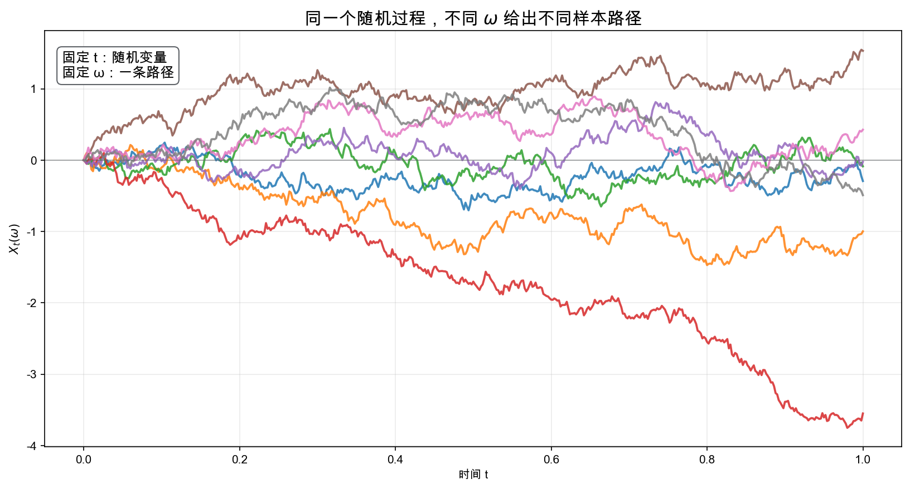
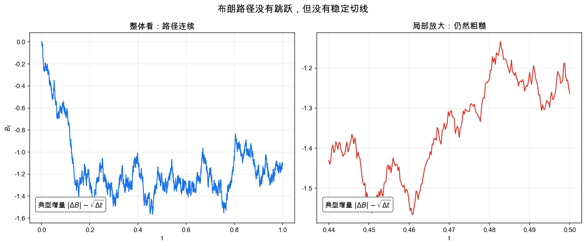
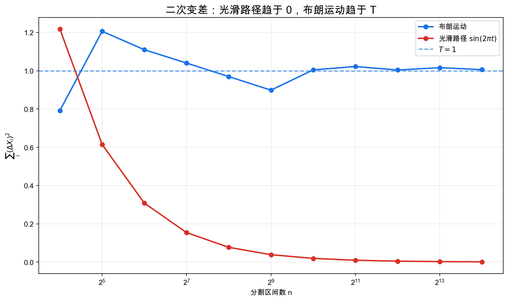
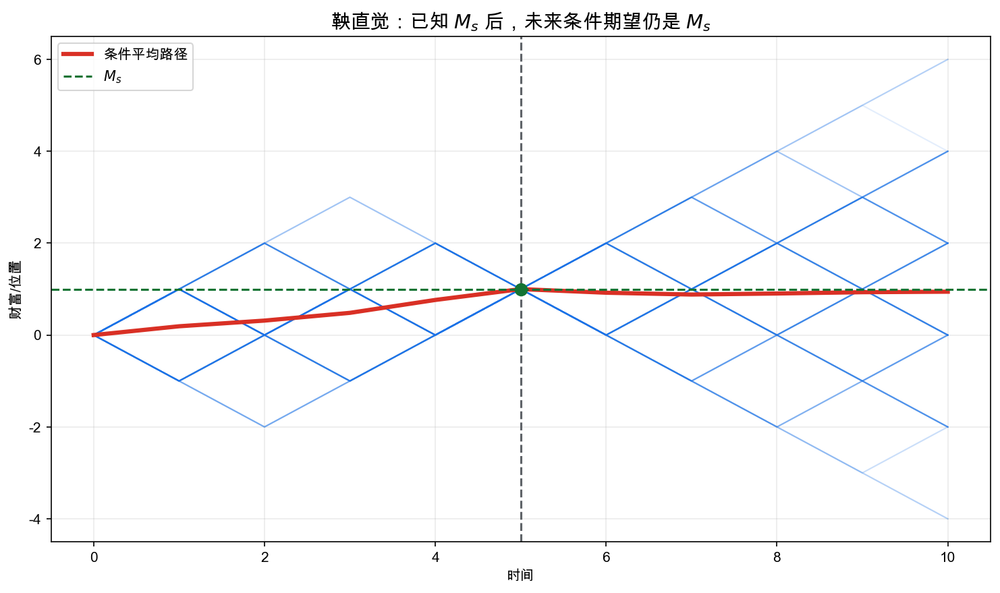
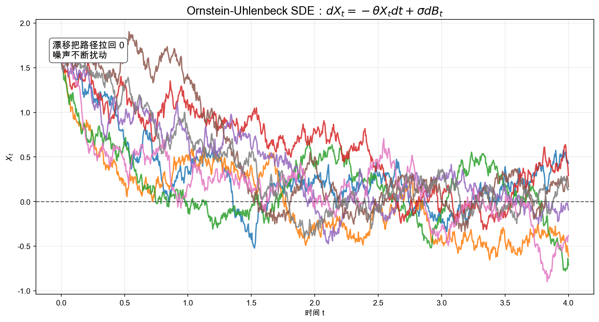

# 重学数学之八: 随机分析——当路径不可微时，微积分如何重建

## 一、微积分遇到随机性

普通微积分建立在一个安静的假设上：函数足够光滑。至少，你希望路径有导数，或者能被光滑函数很好地逼近。

但随机世界里最重要的对象之一——布朗运动——几乎处处连续，却几乎处处不可微。

这句话非常反直觉：

> **路径没有跳跃，但在任何尺度上都抖得太厉害，以至于没有切线。**

如果路径不可微，那么很多熟悉的表达式都失去意义：

$$
\frac{dB_t}{dt},\quad \int_0^T f(t)\,dB_t,\quad dX_t=\mu(X_t)dt+\sigma(X_t)dB_t
$$

随机分析就是为了解决这个问题而出现的：

> **当驱动信号本身不可微时，如何重新定义积分、微分方程和链式法则？**

这不是纯粹技术补丁。随机分析给了我们一套描述噪声驱动系统的语言：金融资产价格、粒子扩散、神经活动、流体湍流、控制系统误差、贝叶斯滤波，都可以写成随机过程或随机微分方程。

## 二、随机过程：随时间演化的随机变量

### 2.1 从随机变量到随机过程

一个随机变量是：

$$
X:\Omega\to\mathbb{R}
$$

它给每个随机结果 $\omega\in\Omega$ 分配一个数。

一个随机过程则是一族随机变量：

$$
\lbrace X_t\rbrace_{t\ge 0}
$$

也可以看成一个二元函数：

$$
X:\Omega\times [0,\infty)\to\mathbb{R}
$$

固定时间 $t$，$X_t(\omega)$ 是一个随机变量；固定样本点 $\omega$，$t\mapsto X_t(\omega)$ 是一条样本路径。

这两个视角都重要：

- 概率论关心每个时刻的分布。
- 分析关心每条路径随时间如何变化。

随机分析正是把这两件事放在一起。

这里要小心一个区分。随机过程不是一条曲线，而是一整族可能曲线的集合，再加上这些曲线出现的概率规律。

固定 $\omega$ 得到一条样本路径，这是分析视角；固定 $t$ 得到一个随机变量，这是概率视角。随机分析难就难在：你不能只看其中一个视角。只看路径，会发现路径太粗糙；只看分布，又会丢掉时间上的依赖结构。

### 2.2 滤过：信息随时间增长

随机过程不是只给出一串随机变量。我们还要描述"到时间 $t$ 为止，我们知道了什么"。

这用**滤过**表示：

$$
\mathcal{F}_t
$$

它是一族随时间增长的 $\sigma$-代数：

$$
s\le t \quad\Rightarrow\quad \mathcal{F}_s\subseteq \mathcal{F}_t
$$

直觉上，$\mathcal{F}_t$ 是时间 $t$ 之前可获得的全部信息。

一个过程 $X_t$ 如果在时间 $t$ 的值只依赖 $\mathcal{F}_t$ 中的信息，就叫**适应的**。这就是"不能偷看未来"的数学表达。

这个条件在随机积分中非常关键：你在时间 $t$ 下注或控制系统时，策略只能依赖当前和过去的信息，不能依赖未来的布朗运动。

## 三、布朗运动：随机分析的基本噪声

标准布朗运动 $B_t$ 是满足以下性质的随机过程：

1. $B_0=0$。
2. 增量独立：不同时间区间上的变化相互独立。
3. 增量平稳且正态：

$$
B_t-B_s\sim N(0,t-s)
$$

4. 样本路径连续。

这四条性质共同刻画了"连续时间白噪声的积分"。

布朗运动也可以看成随机游走的连续极限。

想象每隔 $\Delta t$ 抛一次硬币，向上或向下走一小步，步长取 $\sqrt{\Delta t}$。当 $\Delta t$ 越来越小，随机游走的折线路径会收敛到布朗运动。

这个缩放很关键。为什么步长是 $\sqrt{\Delta t}$，不是 $\Delta t$？因为大量独立小扰动相加时，标准差按平方根增长。中心极限定理背后的尺度，正是布朗运动的尺度。

所以布朗运动不是凭空定义出来的怪物。它是“许多微小独立扰动叠加后”的普遍极限。

### 3.1 为什么布朗运动不可微

看一个小时间间隔 $\Delta t$：

$$
B_{t+\Delta t}-B_t \sim N(0,\Delta t)
$$

所以典型增量大小是：

$$
|B_{t+\Delta t}-B_t|\sim \sqrt{\Delta t}
$$

如果你试图计算导数：

$$
\frac{B_{t+\Delta t}-B_t}{\Delta t}
$$

它的典型大小大约是：

$$
\frac{\sqrt{\Delta t}}{\Delta t}=\frac{1}{\sqrt{\Delta t}}\to\infty
$$

这说明布朗路径在越来越小的尺度上反而越来越陡。它连续，但没有有限斜率。

随机分析必须重建微积分，根本原因就在这里。

## 四、二次变差：随机微积分的转折点

普通光滑函数 $x(t)$ 的小增量满足：

$$
\Delta x \sim \Delta t
$$

因此：

$$
\sum (\Delta x)^2 \sim \sum (\Delta t)^2 \to 0
$$

光滑路径的二次变差为 0。

但布朗运动不同：

$$
\Delta B \sim \sqrt{\Delta t}
$$

所以：

$$
(\Delta B)^2 \sim \Delta t
$$

把所有小区间加起来：

$$
\sum_i (B_{t_{i+1}}-B_{t_i})^2 \to T
$$

这叫布朗运动的**二次变差**：

$$
[B]_T=T
$$

这是一切变化的根源。普通微积分里可以忽略二阶小量 $(dx)^2$，因为它比 $dt$ 小。但随机微积分里：

$$
(dB_t)^2 = dt
$$

这不是严格代数等式，而是一条极其有用的计算规则。它解释了为什么 Itô 公式比普通链式法则多出一个二阶项。

## 五、鞅：公平游戏的数学形式

在引入 Itô 积分之前，需要一个核心概念：**鞅**。

一个适应过程 $M_t$ 是鞅，如果：

$$
\mathbb{E}[|M_t|]<\infty
$$

并且对 $s\le t$：

$$
\mathbb{E}[M_t\mid\mathcal{F}_s]=M_s
$$

直觉是：

> **在已知当前信息的条件下，未来的期望等于现在。**

这就是公平游戏——没有可预测的上升或下降趋势。

布朗运动本身是鞅，因为未来增量均值为 0：

$$
\mathbb{E}[B_t\mid\mathcal{F}_s]=B_s
$$

鞅在随机分析中扮演类似"无漂移噪声"的角色。很多随机过程可以分解成：

$$
\text{可预测漂移}+\text{鞅噪声}
$$

这和普通分析中把函数分解成趋势项和振荡项有一点类似。

## 六、Itô 积分：不能偷看未来的随机积分

我们想定义：

$$
\int_0^T H_t\,dB_t
$$

其中 $H_t$ 是一个随机过程，表示在时间 $t$ 对布朗增量的权重。

最自然的离散近似是：

$$
\sum_i H_{t_i}(B_{t_{i+1}}-B_{t_i})
$$

注意这里用的是左端点 $H_{t_i}$，而不是右端点或中点。这不是任意选择，而是为了保证 $H_{t_i}$ 只依赖当前和过去的信息，不能偷看未来增量。

Itô 积分的核心在于：

> **被积函数必须是适应的；积分用当前策略乘以未来随机增量。**

如果 $H_t$ 足够好，Itô 积分满足等距公式：

$$
\mathbb{E}\left[\left(\int_0^T H_t\,dB_t\right)^2\right]
=
\mathbb{E}\left[\int_0^T H_t^2\,dt\right]
$$

这个公式是 Itô 积分理论的支柱。它告诉我们：随机积分的二阶矩由被积过程的能量控制。

### 6.1 Itô 积分为什么不是普通 Riemann-Stieltjes 积分

如果积分器路径有有界变差，Riemann-Stieltjes 积分可以直接定义。但布朗路径几乎必然有无限变差：

$$
\sum_i |B_{t_{i+1}}-B_{t_i}| \to \infty
$$

所以普通路径积分方法失败。Itô 积分不是逐条路径定义的普通积分，而是利用概率结构，在 $L^2$ 意义下定义的极限。

这点很重要：随机分析不是简单地把普通微积分套到随机路径上，而是换了一个收敛框架。

### 6.2 Itô 和 Stratonovich：取样点不同，微积分规则不同

如果用左端点 $H_{t_i}$，得到 Itô 积分。若用中点：

$$
H_{\frac{t_i+t_{i+1}}2}
$$

会得到 Stratonovich 积分。

这不是符号偏好，而是两种不同的建模约定。

Itô 积分强调信息流：策略不能偷看未来，所以适合金融、控制、滤波。Stratonovich 积分更接近普通链式法则，适合物理中由平滑噪声极限得到的模型。

两者可以互相转换。对同一个随机微分方程，写成 Itô 形式或 Stratonovich 形式时，漂移项通常会差一个修正项。

所以看到 $dX_t=b(X_t)dt+\sigma(X_t)dB_t$ 时，必须问清楚：这是 Itô 意义，还是 Stratonovich 意义？在随机分析里，积分符号背后藏着建模选择。

## 七、Itô 公式：随机版链式法则

普通链式法则说：

$$
df(X_t)=f'(X_t)dX_t
$$

但如果：

$$
dX_t=\mu_tdt+\sigma_t dB_t
$$

那么 Itô 公式说：

$$
df(X_t)
=f'(X_t)dX_t+\frac{1}{2}f''(X_t)(dX_t)^2
$$

由于：

$$
(dX_t)^2=\sigma_t^2dt
$$

所以：

$$
df(X_t)
=
f'(X_t)\mu_tdt
+f'(X_t)\sigma_t dB_t
+\frac{1}{2}f''(X_t)\sigma_t^2dt
$$

这个额外的二阶项是随机微积分和普通微积分的分水岭。

例如令 $X_t=B_t$，$f(x)=x^2$：

$$
d(B_t^2)=2B_t\,dB_t+dt
$$

积分得到：

$$
B_t^2 = 2\int_0^t B_s\,dB_s + t
$$

如果你用普通链式法则，会漏掉这个 $t$。它正是二次变差贡献出来的。

## 八、随机微分方程：噪声驱动的动力系统

普通微分方程写作：

$$
dX_t = b(X_t,t)\,dt
$$

随机微分方程（SDE）加入布朗噪声：

$$
dX_t = b(X_t,t)\,dt + \sigma(X_t,t)\,dB_t
$$

其中：

- $b$ 是漂移项，描述确定性趋势。
- $\sigma$ 是扩散项，描述噪声强度。
- $B_t$ 是布朗运动。

一个经典例子是 Ornstein-Uhlenbeck 过程：

$$
dX_t=-\theta X_t\,dt+\sigma dB_t
$$

漂移项 $-\theta X_t$ 把过程往 0 拉回，噪声项 $\sigma dB_t$ 不断扰动它。这是均值回复系统的基本模型，出现在物理中的 Langevin 方程、金融利率模型、神经科学和时间序列建模中。

### 8.1 SDE 的意义

SDE 不是说路径有一个普通导数等于右边。更准确地说，它是积分方程：

$$
X_t=X_0+\int_0^t b(X_s,s)\,ds+\int_0^t \sigma(X_s,s)\,dB_s
$$

第一项是普通积分，第二项是 Itô 积分。这个形式才是严格定义。

### 8.2 什么时候 SDE 有解？

写下 SDE 不等于问题已经良好定义。我们还要问：解是否存在？是否唯一？是否会在有限时间爆掉？

一个常用的充分条件是：漂移 $b$ 和扩散 $\sigma$ 对状态变量满足 Lipschitz 条件，并且增长不要太快。粗略说，如果：

$$
|b(x)-b(y)|+|\sigma(x)-\sigma(y)|\le L|x-y|
$$

并且 $b,\sigma$ 至多线性增长，那么 SDE 通常有唯一强解。

这和普通 ODE 的 Picard-Lindelof 定理很像。差别在于，这里还要处理随机积分和适应性。

如果这些条件失败，事情可能变得微妙。同一个方程可能有多个弱解，或者解的路径性质依赖概率空间如何构造。随机微分方程不是只看右边公式，还要看解的概率结构。

### 8.3 Fokker-Planck 方程：路径和密度的两种语言

SDE 描述单条随机路径怎样走。很多时候我们更关心大量样本的密度怎样演化。

如果：

$$
dX_t=b(X_t,t)dt+\sigma(X_t,t)dB_t
$$

那么概率密度 $p(x,t)$ 通常满足 Fokker-Planck 方程：

$$
\partial_t p
=-\nabla\cdot(bp)
+\frac12\sum_{i,j}\partial_i\partial_j\left((\sigma\sigma^\top)_{ij}p\right)
$$

一边是随机路径，一边是确定性 PDE。

这正是随机分析迷人的地方。微观上每条路径都被噪声推动，宏观上密度却按确定方程演化。扩散模型、Langevin 采样、物理里的热噪声，背后都在这两种语言之间来回切换。

## 九、应用场景

随机分析的优势是：它允许我们在连续时间中描述噪声、信息、决策和动态系统。

| 领域 | 随机分析扮演的角色 |
|------|-------------------|
| 金融数学 | Black-Scholes 模型、风险中性定价、对冲策略都建立在 Itô 积分和鞅方法上 |
| 物理 | Langevin 方程描述热噪声驱动下的粒子运动，Fokker-Planck 方程描述概率密度演化 |
| 控制理论 | 随机控制和滤波处理带噪声系统，Kalman-Bucy 滤波是连续时间版本 |
| 生物数学 | 神经元膜电位、基因表达、种群扩散可用 SDE 建模 |
| 机器学习 | 扩散模型、随机梯度 Langevin 动力学、连续归一化流都和 SDE/反向 SDE 相关 |
| 信号处理 | 隐状态连续演化、观测带噪声的问题可用随机滤波处理 |
| 偏微分方程 | SDE 与 Kolmogorov 方程、Feynman-Kac 公式连接概率和 PDE |

这些应用背后的共同点是：系统既有趋势，又有无法忽略的随机扰动。随机分析让我们可以在连续时间尺度上同时处理这两者。

## 十、与前几章的连接

随机分析和前面的内容有多条连接：

1. **泛函分析**：Itô 积分通常在 $L^2$ 空间中通过等距延拓构造；鞅空间也是函数空间。
2. **微分几何**：扩散过程可以定义在流形上，布朗运动和 Laplace-Beltrami 算子密切相关。
3. **拓扑与几何**：随机过程可以探测空间结构，例如热核、随机游走和谱几何。
4. **范畴论**：Markov kernel 可以看成概率化的态射，随机系统也有组合结构。
5. **傅里叶分析**：布朗运动的转移密度是热核，傅里叶变换可解热方程。

最深的联系之一是：

$$
\text{布朗运动} \quad \leftrightarrow \quad \text{热方程}
$$

布朗运动的概率密度满足：

$$
\frac{\partial p}{\partial t}=\frac{1}{2}\frac{\partial^2 p}{\partial x^2}
$$

这正是第一章热方程的概率版本。傅里叶从热传导发明频率分析；随机分析则告诉我们，热扩散也可以被理解为大量随机路径的统计结果。

## 十一、前沿展望

### 11.1 粗糙路径理论

Terry Lyons（1998）提出**粗糙路径理论**，为“对不规则信号积分”建立了系统基础：引入**签名**（signature）——路径的迭代积分序列——来编码路径。签名满足 shuffle 乘积律，可由有限阶截断近似；在适当的路径类、商掉树状等价并结合参数化约定后，它具有很强的区分能力，但不能不加条件地称为所有路径的完备不变量。

这带来三个深刻后果：
1. 在选择相应的 Itô 或 Stratonovich 提升后，随机积分可以纳入粗糙路径框架；两种积分之差由二次变差（以及相应的 Lévy 区域修正）解释。
2. 控制微分方程（CDEs）将 SDE 推广到由任意粗糙路径（不必是布朗运动）驱动的系统。
3. 路径签名的有限截断是时间序列的强大特征（Chevyrev & Kormilitzin 2016），已用于手写识别、金融时间序列和医学信号分类。

### 11.2 基于得分的生成模型与逆向 SDE

Song 与 Ermon（2019，2020），Song 等（2021）发现：扩散生成模型的训练目标是学习数据分布在不同噪声水平下的**得分函数**（score function） $\nabla_x \log p_t(x)$，采样对应运行反向 SDE

$$
dx = \bigl[f(x,t) - g(t)^2 \nabla_x \log p_t(x)\bigr]dt + g(t)\,d\bar B_t
$$

其中 $\bar B_t$ 是时间反转的布朗运动。Anderson（1982）提供了反向 SDE 的理论基础。

这个框架统一了去噪扩散（DDPM）、基于得分的生成（NCSN）和连续归一化流，并与 Fokker-Planck 方程和最优传输之间存在深刻联系（用 Schrödinger 桥（DSB）插值两个分布）。

### 11.3 神经随机微分方程

Kidger 等（2020，2021）将神经 ODE 推广为**神经 SDE**（Neural SDE）：用神经网络参数化漂移 $b_\theta$ 和扩散 $\sigma_\theta$，从而构造可端到端训练的连续随机模型。通过 Euler-Maruyama 或 Milstein 格式对 SDE 离散化，并用伴随方法（adjoint sensitivity）计算梯度。

神经 SDE 在时间序列生成（不规则采样、缺失值）和潜在 SDE 推断上优于离散递归网络，同时与贝叶斯不确定性量化天然兼容。

### 11.4 Malliavin 微积分与无穷维分析

Malliavin（1976）在 Wiener 空间（布朗运动路径空间）上建立了微积分：定义 Malliavin 导数 $D_t F$（关于布朗路径的"方向导数"）和 Ornstein-Uhlenbeck 算子 $L = -D^*D$（Wiener 空间上的无穷小生成元）。

核心应用：
- **Hörmander 条件**：通过 Malliavin 矩阵可判断 SDE 的解是否有光滑密度，推广了经典的 Hörmander 定理。
- **Clark-Ocone 公式**：把随机变量表示为关于布朗滤过的鞅积分 $F = \mathbb{E}[F] + \int_0^T \mathbb{E}[D_t F|\mathcal{F}_t]\,dB_t$，是随机控制和 Black-Scholes 对冲公式的基础。
- **Stein 方法与量化极限定理**（Nourdin & Peccati 2012）：用 Malliavin 算子估计 CLT 收敛速率，统一了多个方向的正态近似界。

## 十二、总结

随机分析的核心可以这样串起来：

1. **随机过程**：随时间演化的一族随机变量。
2. **滤过**：描述信息随时间增长，防止偷看未来。
3. **布朗运动**：连续、独立增量、正态增量的基本噪声。
4. **二次变差**：布朗运动满足 $[B]_t=t$，导致 $(dB_t)^2=dt$。
5. **鞅**：条件期望保持当前值的公平过程。
6. **Itô 积分**：用适应过程对布朗增量积分。
7. **Itô 公式**：随机链式法则，比普通链式法则多二阶项。
8. **SDE**：由漂移和扩散共同驱动的连续时间随机动力系统。
9. **Fokker-Planck 方程**：把单条随机路径的规律翻译成概率密度的 PDE。

说到底：

> **随机分析是为不可微的随机路径重新建立微积分。**

它让我们能处理一种普通分析无法直接触碰的对象：连续但无限粗糙的路径。正是这种粗糙性，带来了二次变差、Itô 公式和随机微分方程，也让随机分析成为现代金融、物理、控制、机器学习和 PDE 的共同语言。

---

*下一章转向优化与凸分析。随机分析处理噪声驱动的连续时间系统，而优化要回答的是另一个问题：什么时候"往最好的方向走一小步"能保证你找到全局最优？凸性给出的答案，会把几何、泛函分析和算法拉在一起。*
