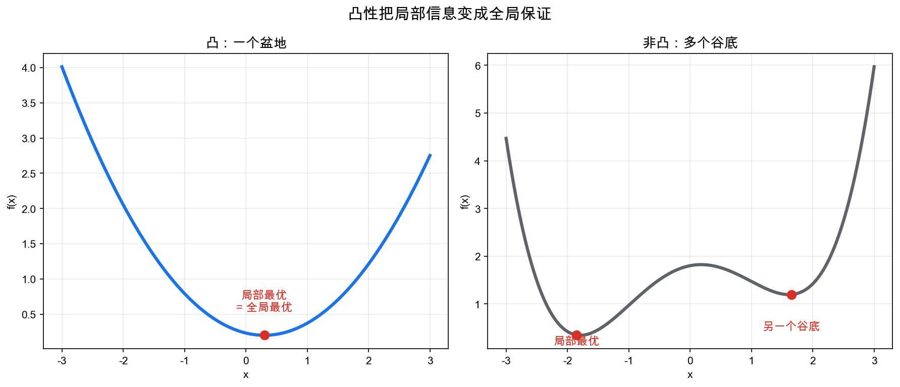
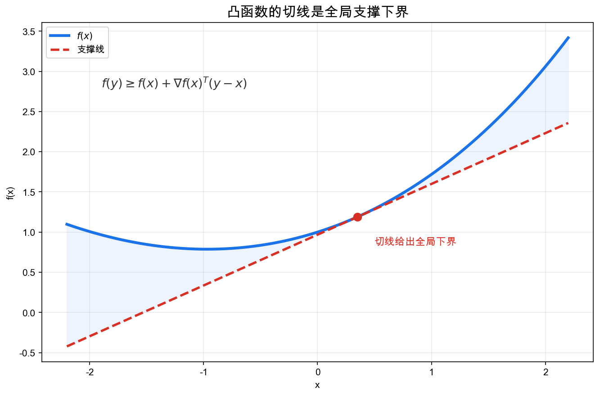
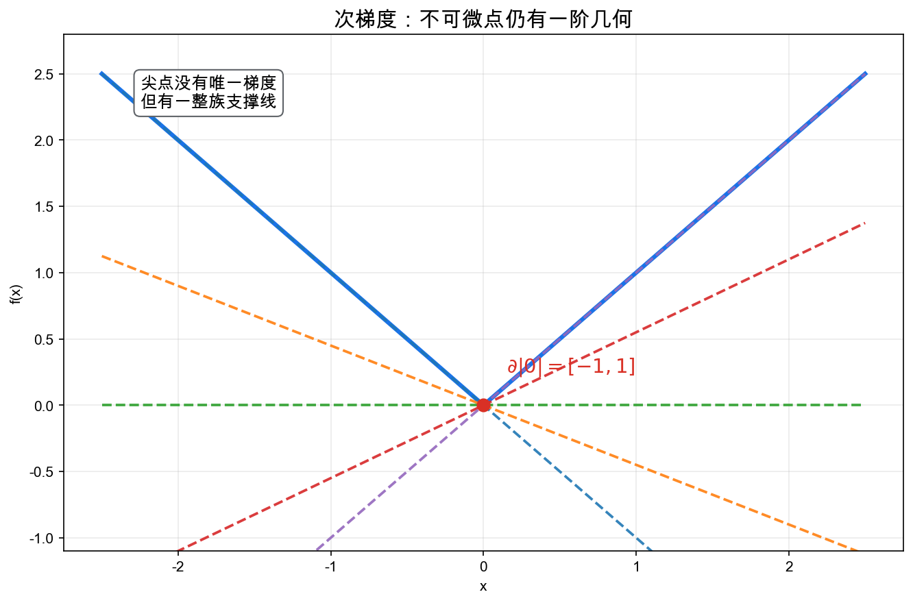
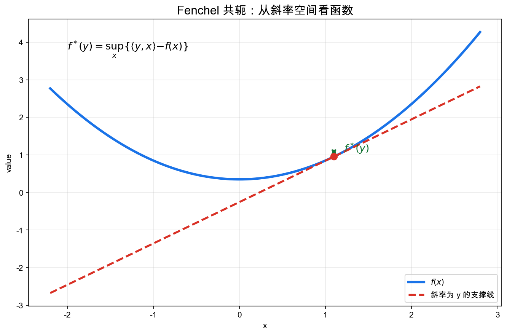
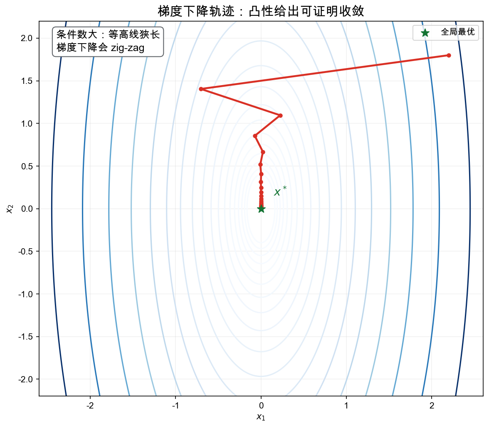

# 重学数学之九: 优化与凸分析——为什么凸性让问题变得可解

## 一、优化问题为什么难？

很多数学问题最终都会变成一句话：

> **在所有可行选择中，找一个最好的。**

写成公式：

$$
\min_{x\in C} f(x)
$$

这里 $f$ 是目标函数，$C$ 是可行域。

这句话看起来简单，但一般优化问题非常难。原因有三个：

1. **局部最优不一定是全局最优**。
2. **可行域可能很复杂**，你沿着一个方向走一步就可能跑出约束。
3. **目标函数可能有很多山谷、鞍点和平台**，算法不知道该往哪里走。

凸分析的关键想法是：

> **如果目标函数和可行域都有合适的凸性，那么局部信息可以控制全局结构。**

凸优化之所以重要，不是因为它声称所有现实问题都是凸的，而是说一旦问题有凸结构，你就能获得罕见的全局保证。

## 二、凸集：两点之间的线段不出界

### 2.1 凸集的定义

一个集合 $C$ 是凸的，如果对任意 $x,y\in C$ 和任意 $\lambda\in[0,1]$：

$$
\lambda x+(1-\lambda)y\in C
$$

直觉就是：

> **集合中任意两点之间的整条线段都留在集合里。**

圆盘、半空间、线性子空间、概率单纯形都是凸集；月牙形、环形、两个分离区域的并通常不是凸集。

### 2.2 为什么凸集好

凸集的好处是：你可以做插值而不离开可行域。

在线性代数里，向量空间对线性组合封闭；在凸分析里，凸集对凸组合封闭。它是线性结构的弱化版本：我们不能任意加减，但可以在已有点之间做平均。

这和概率也有联系。概率分布的混合：

$$
\lambda P+(1-\lambda)Q
$$

仍然是概率分布。很多统计和机器学习问题天然发生在凸集合上。

## 三、凸函数：图像在弦线下方

### 3.1 定义

函数 $f:C\to\mathbb{R}$ 是凸的，如果：

$$
f(\lambda x+(1-\lambda)y)
\le
\lambda f(x)+(1-\lambda)f(y)
$$

几何上说，函数图像位于任意两点连线的下方。

如果 $f$ 可微，这等价于一阶支撑不等式：

$$
f(y)\ge f(x)+\nabla f(x)^\top(y-x)
$$

函数图像永远在任意一点的切平面上方。

这条不等式是凸优化的核心。它说：**局部梯度给出的线性近似，是全局下界。**

普通非凸函数的切线只能描述局部；凸函数的切线能给全局信息。

### 3.2 局部最优就是全局最优

假设 $f$ 是凸函数，$C$ 是凸集。如果 $x^\star$ 是局部最优，但不是全局最优，那么存在 $y\in C$ 使：

$$
f(y)<f(x^\star)
$$

考虑线段：

$$
x_\lambda=(1-\lambda)x^\star+\lambda y
$$

因为 $C$ 凸，$x_\lambda\in C$。因为 $f$ 凸：

$$
f(x_\lambda)\le (1-\lambda)f(x^\star)+\lambda f(y)<f(x^\star)
$$

当 $\lambda$ 很小时，$x_\lambda$ 离 $x^\star$ 任意近，却有更小函数值。这和局部最优矛盾。

所以：

> **凸优化中，局部最优自动是全局最优。**

这是凸性的第一份礼物。

## 四、次梯度：不可微也能优化

很多重要凸函数不可微：

$$
f(x)=|x|,\quad f(x)=\max_i(a_i^\top x+b_i),\quad f(x)=\|x\|_1
$$

如果坚持用普通梯度，理论会卡住。但凸函数有更一般的"斜率"概念：**次梯度**。

向量 $g$ 是 $f$ 在 $x$ 处的一个次梯度，如果对所有 $y$：

$$
f(y)\ge f(x)+g^\top(y-x)
$$

$g$ 定义的仿射函数是 $f$ 的全局支撑下界。

所有次梯度组成**次微分**：

$$
\partial f(x)
$$

例如 $f(x)=|x|$：

$$
\partial |x|=
\begin{cases}
\lbrace 1\rbrace, & x>0\\
[-1,1], & x=0\\
\lbrace -1\rbrace, & x<0
\end{cases}
$$

尖点处没有唯一切线，但有一整族支撑线。这让我们可以在不可微点继续谈一阶最优性。

最重要的最优性条件是：

$$
0\in \partial f(x^\star)
$$

这便是凸分析版的"梯度为零"。

## 五、投影、prox 与正则化

### 5.1 投影：回到可行域

如果 $C$ 是闭凸集，给定一个点 $x$，它到 $C$ 的最近点：

$$
P_C(x)=\arg\min_{y\in C}\|y-x\|^2
$$

存在且唯一。

这和第三章 Hilbert 空间里的正交投影是同一个结构。凸集不一定是线性子空间，但闭凸性仍然保证最近点唯一。

这便是投影梯度法的基础：

$$
x_{k+1}=P_C(x_k-\alpha\nabla f(x_k))
$$

先沿负梯度走一步，再投影回可行域。

### 5.2 prox：投影的推广

proximal operator 定义为：

$$
\mathrm{prox}_{\lambda r}(v)
=
\arg\min_x\lbrace
r(x)+\frac{1}{2\lambda}\|x-v\|^2
\rbrace
$$

它在做一件事：

> **在想靠近 $v$ 的同时，也想让正则项 $r(x)$ 小。**

这里容易误会：prox 不是又发明了一个新函数，而是在问一个更实际的问题。梯度一步把你带到 $v$，但 $v$ 可能太粗糙、太密集，或者不满足你想要的结构。prox 就是在 $v$ 附近重新挑一个点，让它既别离 $v$ 太远，又尽量符合正则项的偏好。

如果 $r$ 是集合 $C$ 的指示函数：

$$
r(x)=
\begin{cases}
0,&x\in C\\
\infty,&x\notin C
\end{cases}
$$

那么 prox 就退化为投影 $P_C$。

如果 $r(x)=\|x\|_1$，prox 给出软阈值操作：

$$
\mathrm{prox}_{\lambda\|\cdot\|_1}(v)_i
=
\mathrm{sign}(v_i)\max(|v_i|-\lambda,0)
$$

这条公式很值得停一下看。小于阈值的坐标会被直接压成零，大于阈值的坐标会被往零方向拉一截。于是稀疏性不是事后筛出来的，而是在每一步更新里自然长出来的。Lasso、压缩感知和很多特征选择方法都靠这个机制工作。

## 六、对偶：从另一个空间看同一个问题

对偶不是一个神秘技巧，而是一种非常自然的想法：

> **如果约束难处理，就用乘子把约束放进目标函数，再看能得到什么全局下界。**

考虑约束优化：

$$
\min_x f(x)\quad \text{s.t.}\quad g_i(x)\le 0,\ h_j(x)=0
$$

构造 Lagrangian：

$$
L(x,\lambda,\nu)
=f(x)+\sum_i\lambda_i g_i(x)+\sum_j\nu_j h_j(x)
$$

其中 $\lambda_i\ge 0$。

对固定的 $\lambda,\nu$，定义对偶函数：

$$
q(\lambda,\nu)=\inf_x L(x,\lambda,\nu)
$$

如果 $x$ 是可行的，那么 $g_i(x)\le 0$ 且 $\lambda_i\ge0$，所以：

$$
L(x,\lambda,\nu)\le f(x)
$$

因此：

$$
q(\lambda,\nu)\le p^\star
$$

对偶函数给出了原问题最优值的下界。最大化这个下界，就是对偶问题：

$$
\max_{\lambda\ge0,\nu} q(\lambda,\nu)
$$

### 6.1 强对偶与 Slater 条件

只要原问题和对偶问题按标准的扩展实数约定定义，弱对偶总是成立：

$$
d^\star\le p^\star
$$

强对偶则说：

$$
d^\star=p^\star
$$

在凸优化中，如果满足一些正则条件，比如 Slater 条件（存在严格可行点），强对偶通常成立。

这是凸性的第二份礼物：不仅能找到全局最优，还能从对偶问题中得到证书。

这里的“严格可行点”可以理解成：约束里面至少有一个真正处在内部的点，而不是整个可行域都贴在边界上。它排除了一些退化情况。比如约束 $g(x)\le 0$ 如果能找到 $g(x)<0$ 的点，乘子和边界就不会被迫挤在一个病态位置。Slater 条件的作用不是让问题更容易算，而是保证原问题和对偶问题之间没有缝隙。

### 6.2 KKT 条件

在凸优化中，只要满足合适的约束正则性（例如 Slater 条件），KKT 条件通常既是最优性的必要条件，也是充分条件：

1. 原始可行：

$$
g_i(x^\star)\le0,\quad h_j(x^\star)=0
$$

2. 对偶可行：

$$
\lambda_i^\star\ge0
$$

3. 互补松弛：

$$
\lambda_i^\star g_i(x^\star)=0
$$

4. 驻点条件：

$$
0\in \partial_x L(x^\star,\lambda^\star,\nu^\star)
$$

互补松弛的直觉很重要：一个不紧的约束没有影子价格；只有真正卡住最优解的约束，乘子才可能非零。

所以 KKT 条件不是一组要背的符号，而是在同时检查四件事：点本身是否合法，乘子是否合法，哪些约束真的起作用，以及目标函数的下降方向是否已经被这些起作用的约束完全抵消。对凸问题来说，这四件事同时成立，就等于给最优解盖了章。

对偶间隙也提供了类似证书。任意可行解 $x$ 给出一个上界 $f(x)$，任意对偶可行的 $(\lambda,\nu)$ 给出一个下界 $q(\lambda,\nu)$，两者之差

$$
f(x)-q(\lambda,\nu)
$$

就是你离最优值最多还有多远。很多算法并不是等到完全精确才停，而是等这个间隙小到可以接受。

## 七、Fenchel 共轭：函数的对偶几何

对任意函数 $f$，Fenchel 共轭定义为：

$$
f^\ast(y)=\sup_x\lbrace \langle y,x\rangle-f(x)\rbrace
$$

这看起来抽象，但几何意义清楚：

> $f^\ast(y)$ 记录：如果你想用斜率为 $y$ 的仿射函数 $\langle y,x\rangle-c$ 作为 $f$ 的全局下界，最少需要扣掉多少高度 $c$。

Fenchel-Young 不等式说：

$$
f(x)+f^\ast(y)\ge \langle x,y\rangle
$$

等号成立当且仅当：

$$
y\in\partial f(x)
$$

这把共轭、次梯度和支撑超平面连在了一起。

几个例子能让这个定义落地：

- 二次函数 $f(x)=\frac{1}{2}\|x\|^2$ 的共轭仍然是 $f^\ast(y)=\frac{1}{2}\|y\|^2$。斜率空间和原空间长得一样。
- 集合 $C$ 的指示函数 $I_C(x)$ 的共轭是支撑函数 $\sigma_C(y)=\sup_{x\in C}\langle y,x\rangle$。也就是说，共轭把“是否属于集合”变成了“沿方向 $y$ 最远能走到哪里”。
- 负熵的共轭会长出 log-sum-exp。它是 softmax、指数族和镜像下降背后的同一个结构。

这些例子说明，Fenchel 共轭不是为了抽象而抽象。它把约束、正则项、概率归一化这些看似不同的东西，都翻译成“斜率能支持到什么高度”。

如果 $f$ 是闭凸函数，那么：

$$
f^{\ast\ast}=f
$$

这和第三章的双对偶很像：在合适条件下，对偶两次会回到原对象。但这里的"回到"是凸函数意义下的闭凸包。

## 八、算法：为什么梯度下降有效

最基本的无约束优化算法是梯度下降：

$$
x_{k+1}=x_k-\alpha\nabla f(x_k)
$$

对一般非凸函数，它可能掉进局部极小值、鞍点附近或平坦区域。

但对凸函数，特别是光滑强凸函数，我们可以证明收敛速度。

这里有两个词需要先说清楚。

$L$-光滑控制的是函数“弯得有多快”。它等价于梯度不会变化得太猛：

$$
\|\nabla f(x)-\nabla f(y)\|\le L\|x-y\|
$$

$\mu$-强凸控制的是函数“碗底有多结实”。普通凸函数可以有很长的平台，强凸函数至少像一个二次碗那样往上抬：

$$
f(y)\ge f(x)+\nabla f(x)^\top(y-x)+\frac{\mu}{2}\|y-x\|^2
$$

光滑性告诉我们步子不能迈太大，强凸性告诉我们离最优点越远，地形会给出足够强的拉回力。两个条件合在一起，才有下面这种干净的线性收敛。

如果 $f$ 是 $\mu$-强凸且 $L$-光滑，那么合适步长下：

$$
f(x_k)-f(x^\star)\le \left(1-\frac{\mu}{L}\right)^k\big(f(x_0)-f(x^\star)\big)
$$

这说明误差几何下降。

这里的条件数：

$$
\kappa=\frac{L}{\mu}
$$

描述问题有多"狭长"。条件数越大，等高线越像细长峡谷，梯度下降越容易左右震荡，收敛越慢。正因如此，预条件、牛顿法、加速方法才会出现。

### 8.1 下降引理：为什么步长不能乱选

梯度下降看起来很朴素：朝负梯度方向走。但真正的问题是，走多远才不会越过谷底？

如果 $f$ 是 $L$-光滑的，就有下降引理：

$$
f(y)\le f(x)+\nabla f(x)^\top(y-x)+\frac{L}{2}\|y-x\|^2
$$

把 $y=x-\alpha\nabla f(x)$ 代进去，得到：

$$
f(x-\alpha\nabla f(x))
\le
f(x)-\alpha\left(1-\frac{\alpha L}{2}\right)\|\nabla f(x)\|^2
$$

只要 $0<\alpha\le 1/L$，右边确实小于等于 $f(x)$。这就是步长 $1/L$ 经常出现的原因：它来自曲率上界，而不是经验口诀。

如果再加上强凸性，函数值差距和到最优点的距离可以互相控制，下降就不只是“每步少一点”，而是按固定比例收缩。条件数 $\kappa=L/\mu$ 正是在衡量这两种力量的差距：$L$ 很大说明地形可能很陡，$\mu$ 很小说明谷底又很扁。又陡又扁，算法自然难走。

### 8.2 从梯度下降到近端梯度

很多目标函数会分成两部分：

$$
\min_x f(x)+r(x)
$$

其中 $f$ 光滑，$r$ 可能不可微，比如 $\|x\|_1$ 或指示函数。直接对整体求梯度会卡住，但近端梯度把问题拆开：

$$
x_{k+1}
=
\mathrm{prox}_{\alpha r}(x_k-\alpha\nabla f(x_k))
$$

先让光滑部分告诉你下降方向，再让 prox 处理约束或稀疏性。这样一来，投影梯度、ISTA、许多正则化学习算法，都变成了同一个模板。

## 九、应用场景

优化与凸分析是现代应用数学中最直接的工具之一。

| 领域 | 优化与凸分析扮演的角色 |
|------|----------------------|
| 机器学习 | 经验风险最小化、正则化、支持向量机、Lasso、逻辑回归都依赖凸优化思想 |
| 信号处理 | 压缩感知、稀疏恢复、去噪、滤波可写成带正则项的凸问题 |
| 控制理论 | 线性矩阵不等式、模型预测控制、鲁棒控制大量使用凸优化 |
| 金融 | 投资组合优化、风险约束、最优执行和套利界限都和对偶有关 |
| 统计 | 最大似然、变分推断、凸风险函数、Fenchel 对偶支撑很多估计方法 |
| 图像处理 | TV 正则化、图像复原、分割模型常用凸松弛 |
| 运筹学 | 线性规划、二次规划、锥规划是资源分配和调度的基础 |

现实中很多问题本来不是凸的，但我们会寻找凸松弛、凸近似或局部凸结构。凸性不是万能，但它提供了一个非常清晰的基准：当凸性存在时，什么是可保证的。

## 十、与前几章的连接

优化与凸分析和前面几章关系很深：

1. **线性代数**：梯度、投影、二次型、条件数都是线代对象。
2. **泛函分析**：对偶空间、弱拓扑、Hahn-Banach 分离定理是凸分析的基础。
3. **微分几何**：约束优化可看成在流形或凸集上的几何运动。
4. **拓扑学**：紧性保证连续函数取到最优值；连通性影响可行域结构。
5. **范畴论**：很多优化构造有泛性质味道，例如自由能、变分原理和对偶关系。
6. **随机分析**：随机梯度、Langevin 动力学和扩散模型都把优化与随机过程结合起来。

Hahn-Banach 定理和支撑超平面定理之间的关系尤其关键：凸集之所以可被超平面分离，正是因为线性泛函足够多。也就是说：

> **凸分析是泛函分析的几何面孔。**

## 十一、前沿展望

### 11.1 Nesterov 加速与 ODE 解释

Nesterov（1983）提出带动量的加速梯度下降，将光滑凸函数的收敛速率从 $O(1/k)$ 提升至最优的 $O(1/k^2)$。Su、Boyd 与 Candès（2016）发现其连续极限是一个二阶 ODE：

$$
\ddot{X} + \frac{3}{t}\dot{X} + \nabla f(X) = 0
$$

这个方程揭示了"动量"的物理本质——一种自适应阻尼的惯性项。Wibisono 等（2016）进一步将一大类加速方法统一为 Lagrangian 变分原理，用 Bregman Lagrangian 生成不同加速算法。这把优化与经典力学、辛几何（第二十六章先导）打通。

### 11.2 镜像下降与 Bregman 散度

标准梯度下降的步骤 $x \leftarrow x - \alpha \nabla f(x)$ 等价于在 $L_2$ 距离下的近端投影。**镜像下降**（Nemirovski & Yudin 1983）将其推广为在 **Bregman 散度** $D_\phi(y,x) = \phi(y) - \phi(x) - \langle\nabla\phi(x),y-x\rangle$ 下的近端步骤：

$$
x_{k+1} = \arg\min_{x\in C}\lbrace\eta_k\langle \nabla f(x_k), x\rangle + D_\phi(x, x_k)\rbrace
$$

选择不同的镜像映射 $\phi$（指数函数、负熵）给出在不同几何下自适应最优的算法——对稀疏可行域（概率单纯形）选择负熵，收敛速率仅与 $\log n$ 相关而非维度 $n$。镜像下降是在线学习（multiplicative weight update、EWA）、指数梯度（AdaGrad 的先驱）的统一理论基础。

### 11.3 随机优化与方差缩减

深度学习训练的标准工具是 SGD 及其变体。从理论角度，**方差缩减方法**（SVRG、SAGA、SARAH，2013–2017）在有限和问题 $f = \frac{1}{n}\sum_i f_i$ 上实现了线性收敛——在每个 epoch 仅需 $O(n)$ 梯度计算，但消除了 SGD 的方差导致的次线性项。

Adam（Kingma & Ba 2015）在实践中广泛使用但理论尚不完整：已有反例（Reddi 等 2018）证明原始 Adam 不能保证收敛，AMSGrad 修正了这一问题。近年工作（Lion、Prodigy 等）在寻找更好的理论-实践折中。

**隐式正则化**是另一个热点：梯度下降在过参数化线性回归上自然收敛到最小 $L_2$ 范数解；对矩阵分解，梯度流偏向低秩解（Gunasekar 等 2018）。这说明优化算法本身携带了归纳偏置。

### 11.4 非凸优化与景观分析

深度神经网络的损失函数高度非凸，但实践中梯度下降表现良好。近年理论揭示：
- **平坦极小值与泛化**：批大小、学习率的乘积（$LR/BS$ 等效规则，Goyal 等 2017）影响收敛到的极小值的尖锐程度，进而影响泛化。
- **过参数化下无坏局部极小**：对两层神经网络（Du 等 2019，Oymak & Soltanolkotabi 2020），在足够宽时损失景观中每个局部极小都是全局极小，且鞍点处有下坡方向。
- **神经切线核（NTK）** 在无穷宽极限下：随机梯度下降在 NTK 范式中对应一个线性模型，收敛可精确分析（Jacot 等 2018）。

## 十二、总结

凸优化的核心结构可以这样串起来：

1. **凸集**：任意两点之间的线段仍在集合内。
2. **凸函数**：任意切线/支撑超平面给出全局下界。
3. **局部即全局**：凸问题中局部最优就是全局最优。
4. **次梯度**：不可微凸函数仍有一阶最优性条件。
5. **投影与 prox**：在约束和正则化下做稳定更新。
6. **对偶与 KKT**：从乘子和下界构造最优性证书。
7. **Fenchel 共轭**：用斜率空间描述函数的对偶几何。
8. **算法收敛**：凸性和光滑性给出可证明的优化速度。

> **凸性让局部信息变成全局信息。**

凸分析不是只在研究一类好看的函数，而是在研究什么时候"看一小步"就足够保证你没错过全局结构。

---

*下一章进入信息论。优化关心怎么找到最优解，信息论关心的是更基本的问题——信息到底是什么？Shannon 把不确定性变成可计算的量，熵、KL 散度、互信息这些东西会自然地把概率、凸性和通信接在一起。*
