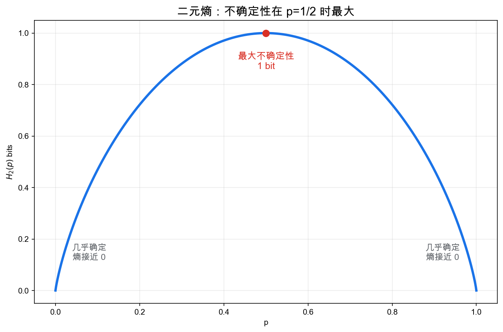
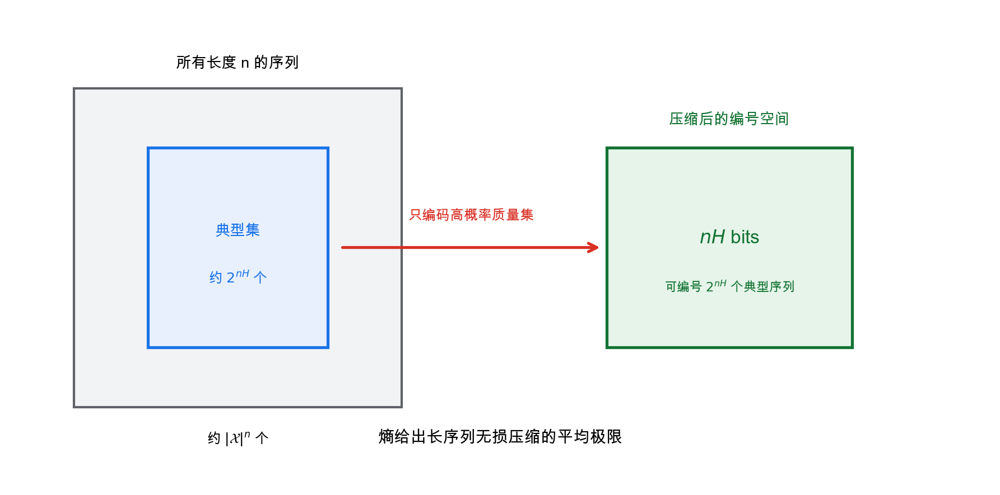
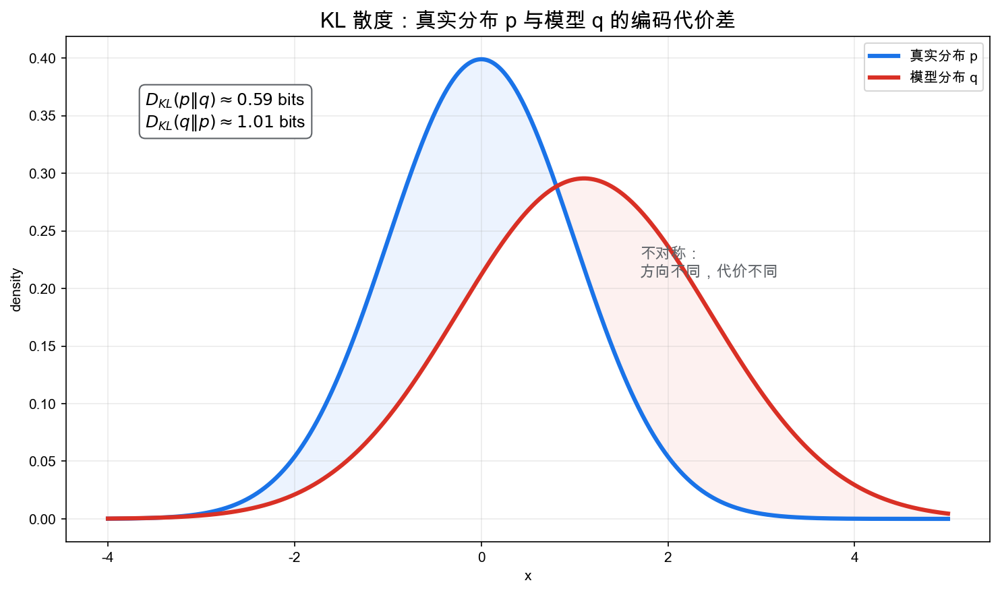
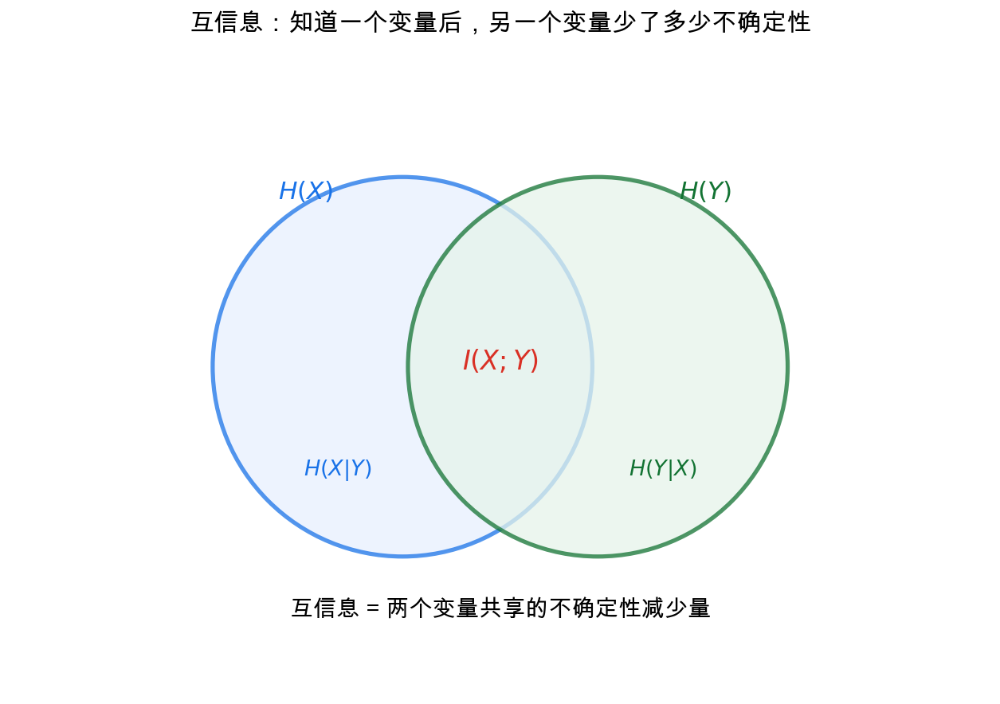
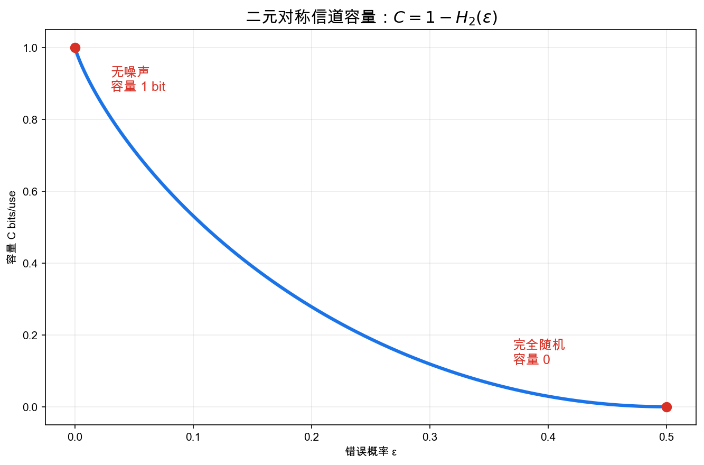

# 重学数学之十: 信息论——不确定性、压缩与通信的数学

## 一、信息到底是什么？

我们每天都在说"信息"：一条消息有信息量，一个数据集包含信息，一个模型学到了信息。

但如果要把"信息"变成数学对象，第一步就会遇到问题：

> **信息不是消息本身，而是消息排除了多少不确定性。**

如果我告诉你"太阳明天会升起"，这句话几乎没有信息量，因为你本来就几乎确定它会发生。

如果我告诉你"明天下午 3 点会突然停电"，信息量就大得多，因为它排除了很多原本可能的情况。

所以信息论的起点不是文字、声音或比特，而是不确定性。

Claude Shannon 在 1948 年提出信息论时，关心的是一个非常工程的问题：

> **如何在有噪声的信道中尽可能可靠、高效地传输消息？**

但他给出的数学语言远远超出了通信工程，后来进入统计、机器学习、物理、密码学、神经科学和优化。

## 二、熵：不确定性的自然量化

### 2.1 一条消息的信息量

如果一个事件发生概率是 $p$，它发生时带来的信息量应该满足几个直觉：

1. 越罕见，信息量越大。
2. 必然事件信息量为 0。
3. 两个独立事件同时发生，信息量应该相加。

满足这些条件的形式基本只能是：

$$
I(x)=-\log p(x)
$$

如果用 $\log_2$，单位就是 bit。

为什么会是对数？关键在第三条：两个独立事件同时发生时，概率相乘，但信息量应该相加。如果 $P(A,B)=P(A)P(B)$，我们希望

$$
I(A,B)=I(A)+I(B)
$$

能把乘法变成加法的自然函数就是对数。前面的负号只是为了让小概率事件得到正的信息量。

例如概率为 $1/2$ 的事件发生，信息量是：

$$
-\log_2(1/2)=1
$$

也就是 1 bit。概率为 $1/1024$ 的事件发生，信息量是 10 bits。

### 2.2 分布的平均信息量

一个随机变量 $X$ 有分布 $p(x)$。它的平均信息量就是：

$$
H(X)=\mathbb{E}[-\log p(X)]
=-\sum_x p(x)\log p(x)
$$

这就是**熵**。

熵不是"混乱程度"的模糊比喻，而是：

> **从这个分布中抽样一次，平均会产生多少信息。**

如果 $X$ 几乎确定，熵接近 0；如果 $X$ 在很多可能值之间均匀分布，熵大。

注意这里说的是“平均”。单个罕见事件可以带来很大的信息量，但如果它几乎不会发生，对平均熵的贡献仍然有限。熵关心的是长期反复抽样时，每次平均要准备多少编码长度，而不是某一次消息有多意外。

### 2.3 为什么均匀分布熵最大

在有 $n$ 个可能结果的离散分布中，熵最大的是均匀分布：

$$
p_i=\frac{1}{n}
$$

此时：

$$
H(X)=\log n
$$

这和直觉一致：如果所有结果同样可能，你最不确定。

二元随机变量的熵：

$$
H(p)=-p\log_2 p-(1-p)\log_2(1-p)
$$

在 $p=1/2$ 处达到最大值 1 bit，在 $p=0$ 或 $p=1$ 处为 0。

## 三、编码：熵为什么是压缩极限

信息论最早的工程问题是压缩。

如果一个符号很常见，就应该用短码；如果很罕见，可以用长码。摩尔斯电码就是这个思想：常见字母用短码，不常见字母用长码。

Shannon 源编码定理说：

> **无损压缩的平均码长不可能低于熵；但可以任意接近熵。**

更准确地说，对独立同分布的信息源，长序列的最优平均编码长度趋近于：

$$
H(X)
$$

这解释了熵的操作意义：

> **熵是平均每个符号所需的最少 bit 数。**

### 3.1 典型集

为什么能压缩到熵？

长序列并不是均匀散布在所有可能字符串中，而是高度集中在一个**典型集**里。典型序列的概率大约是：

$$
2^{-nH(X)}
$$

典型集大小大约是：

$$
2^{nH(X)}
$$

因此只需要：

$$
nH(X)
$$

个 bit 来编号典型序列。

这和概率论中的大数定律、统计物理中的相空间集中、机器学习中的数据流形都有同一种味道：高维空间很大，但概率质量集中在一个结构化区域里。

一个简单例子是抛一枚偏硬币，正面概率 $0.9$。长度为 $1000$ 的所有 0-1 串共有 $2^{1000}$ 个，但真正常见的不是“所有串”，而是那些大约有 $900$ 个正面的串。压缩不需要认真照顾每一个极端罕见的串，只要给概率质量集中的那一批设计短码。

## 四、相对熵：用错模型的代价

假设真实分布是 $p(x)$，但你用另一个分布 $q(x)$ 来编码。

如果用真实分布 $p$，平均码长是：

$$
H(p)=-\sum_x p(x)\log p(x)
$$

如果错用 $q$，平均码长变成：

$$
H(p,q)=-\sum_x p(x)\log q(x)
$$

多出来的代价是：

$$
D_{\mathrm{KL}}(p\|q)
=\sum_x p(x)\log\frac{p(x)}{q(x)}
$$

这叫 KL 散度或相对熵。

它的意义非常具体：

> **如果真实世界按 $p$ 产生数据，而你用 $q$ 来编码，平均每个样本多花多少 bit。**

KL 散度满足：

$$
D_{\mathrm{KL}}(p\|q)\ge0
$$

且等号当且仅当 $p=q$。

但它不是距离，因为通常：

$$
D_{\mathrm{KL}}(p\|q)\ne D_{\mathrm{KL}}(q\|p)
$$

这很重要。用简单模型近似复杂真实分布，和用复杂模型近似简单真实分布，代价并不对称。

### 4.1 机器学习里的 KL

最大似然估计是在最小化经验分布和模型分布之间的 KL 散度。

这句话可以拆开看。数据集给了一个经验分布 $\hat p$：出现过的样本频率高，没出现的样本频率低。模型给出一个分布 $q_\theta$。最大似然就是让模型给真实出现的数据尽量高的概率：

$$
\max_\theta \sum_i \log q_\theta(x_i)
$$

除以样本数以后，它等价于最小化

$$
D_{\mathrm{KL}}(\hat p\|q_\theta)
$$

所以交叉熵损失并不是凭空来的，它就是“用模型分布编码训练数据”时的平均代价。

交叉熵损失：

$$
H(p,q)=-\sum_x p(x)\log q(x)
$$

等于：

$$
H(p)+D_{\mathrm{KL}}(p\|q)
$$

当 $p$ 固定时，最小化交叉熵就是最小化 KL 散度。

## 五、互信息：知道一个变量后，另一个变量少了多少不确定性

两个随机变量 $X,Y$ 之间的互信息定义为：

$$
I(X;Y)=H(X)-H(X\mid Y)
$$

它表示：

> **知道 $Y$ 后，$X$ 的不确定性平均减少了多少。**

这里的 $H(X\mid Y)$ 叫条件熵。它不是固定某一个 $Y=y$ 后的熵，而是先看每个 $y$ 下 $X$ 还剩多少不确定性，再按照 $Y$ 出现的概率做平均：

$$
H(X\mid Y)=\sum_y p(y)H(X\mid Y=y)
$$

所以互信息问的是：在平均意义下，观察 $Y$ 到底帮我们排除了多少关于 $X$ 的可能性。

等价地：

$$
I(X;Y)=H(Y)-H(Y\mid X)
$$

也等价于联合分布和独立乘积分布之间的 KL 散度：

$$
I(X;Y)=D_{\mathrm{KL}}(p(x,y)\|p(x)p(y))
$$

这个公式很有力量。它说：

> **互信息测量的是 $X$ 和 $Y$ 偏离独立性的程度。**

如果两个变量真的独立，联合分布 $p(x,y)$ 就完全等于两个边缘分布的乘积 $p(x)p(y)$。互信息把“真实联合分布”和“假装独立时的联合分布”拿来比较。偏离越大，说明一个变量越能告诉你另一个变量的事情。

如果 $X,Y$ 独立，那么：

$$
p(x,y)=p(x)p(y)
$$

所以：

$$
I(X;Y)=0
$$

如果 $Y$ 完全决定 $X$，那么 $H(X\mid Y)=0$，互信息就是 $H(X)$。

### 5.1 数据处理不等式

如果信息经过一个处理链：

$$
X\to Y\to Z
$$

那么：

$$
I(X;Z)\le I(X;Y)
$$

这叫**数据处理不等式**。

直觉非常朴素：

> **处理数据不能凭空增加关于原始变量的信息。**

这在机器学习、统计推断和神经网络表示学习中都很重要。一个表示如果丢掉了关于标签的信息，后续算法无法凭空找回来。

## 六、信道容量：有噪声也能可靠通信

通信问题可以抽象为一个信道：

$$
p(y\mid x)
$$

输入 $X$ 经过信道后得到输出 $Y$。噪声意味着 $Y$ 不一定等于 $X$。

Shannon 最惊人的结果是：

> **在足够长的码块下，只要传输速率低于信道容量，就可以把错误概率任意压低；高于容量则不可能可靠通信。**

信道容量定义为：

$$
C=\max_{p(x)} I(X;Y)
$$

也就是选择最优输入分布，使输入和输出之间的互信息最大。

这里最大化的是 $p(x)$，不是信道本身。信道 $p(y\mid x)$ 已经固定，像一条已经铺好的线路；你能选择的是怎么使用它。某些输入符号可能更容易被噪声混淆，某些符号更稳。容量就是在所有输入使用策略中，找出每次传输最多能留下多少可恢复信息。

对于二元对称信道，错误概率为 $\epsilon$，容量是：

$$
C=1-H_2(\epsilon)
$$

当 $\epsilon=0$，信道无噪声，容量是 1 bit。  
当 $\epsilon=1/2$，输出完全随机，容量是 0。

这说明通信的本质不是消除噪声，而是在噪声下设计编码，让接收端仍能恢复消息。

## 七、最大熵原理：在约束下最少假设

如果你只知道一个随机变量的均值，应该选什么分布？

最大熵原理说：

> **在满足已知约束的所有分布中，选择熵最大的那个。**

因为熵最大意味着你没有额外引入不必要的信息。

例子：

- 只知道取值范围有限，没有其他信息 → 均匀分布。
- 只知道实数变量的均值和方差 → 高斯分布。
- 只知道非负变量的均值 → 指数分布。

最大熵不是说真实世界一定最随机，而是说：

> **在信息不足时，不要假装知道更多。**

从优化角度看，最大熵问题通常是凸优化问题。熵是凹函数，在线性约束下最大化凹函数有良好的全局结构。这里第九章的凸分析直接接上了。

这句话背后的结构是：可行分布集合通常是凸的，熵函数是凹的。最大化凹函数等价于最小化凸函数 $-H$，所以局部最优不会和全局最优打架。最大熵原理因此既是统计建模原则，也是一类可以稳定求解的优化问题。

### 7.1 典型集：压缩为什么真的可行

熵给出平均不确定性，但压缩理论真正的直觉来自典型集。

对独立同分布序列 $X_1,\dots,X_n$，虽然所有长度为 $n$ 的序列数量巨大，但绝大多数概率质量会集中在大约：

$$
2^{nH(X)}
$$

个典型序列上。

每个典型序列的概率大约是：

$$
2^{-nH(X)}
$$

这解释了为什么熵是无损压缩极限。我们不是要给所有可能序列同样长的编码，而是要给真正会出现的典型序列编码。

这也把大数定律带进了信息论：单个样本很随机，长序列却有稳定结构。压缩利用的正是这种稳定性。

## 八、应用场景

信息论最初来自通信，但现在已经成为许多领域的共同语言。

| 领域 | 信息论扮演的角色 |
|------|----------------|
| 数据压缩 | 熵给出无损压缩极限，典型集解释为什么长序列可压缩 |
| 通信系统 | 信道容量给出可靠通信的理论上限 |
| 机器学习 | 交叉熵、KL 散度、互信息、信息瓶颈用于训练和表示学习 |
| 统计推断 | 最大似然、贝叶斯推断、变分推断都和 KL/熵相关 |
| 物理 | 热力学熵、自由能、最大熵原理连接统计物理 |
| 神经科学 | 神经编码可用互信息衡量刺激和响应之间的信息传递 |
| 密码学 | 完美保密、随机性提取和熵估计依赖信息论 |

这些应用共同说明：信息论不是只研究通信线路，而是在研究不确定性如何被表示、压缩、传输和更新。

## 九、与前几章的连接

信息论和前面几章有多条连接：

1. **概率论与随机分析**：熵和互信息都定义在概率分布上；随机过程的信息率是信息论的重要主题。
2. **凸分析**：KL 散度、log-sum-exp、最大熵、变分推断都依赖凸性。
3. **泛函分析**：熵可以看作函数空间上的泛函；最大熵是泛函优化问题。
4. **傅里叶分析**：熵功率不等式、信号频谱和通信带宽把信息论与调和分析连接起来。
5. **范畴论**：Markov kernel、信息流和概率映射可以组成范畴化的信息处理图景。

特别是 KL 散度和凸优化的关系：

$$
D_{\mathrm{KL}}(p\|q)
$$

既是编码代价，也是优化目标，也是概率分布空间上的一种非对称几何。它把统计、学习和信息压缩放在同一张图上。

## 十、前沿展望

### 10.1 信息瓶颈理论与深度学习

Tishby、Pereira 与 Bialek（1999）提出**信息瓶颈**（Information Bottleneck，IB）框架：在保留关于标签 $Y$ 的信息的前提下，对输入 $X$ 的表示 $T$ 进行最大程度的压缩：

$$
\min_{p(t|x)} \; I(X;T) - \beta I(T;Y)
$$

其中 $\beta$ 控制压缩与保真的权衡。最优解满足自洽方程，诱导 $T$ 的分布是一个指数族，逆温度 $\beta$ 驱动相变。

Tishby 与 Schwartz-Ziv（2017）主张深度网络的隐层在训练过程中经历**拟合–压缩**两阶段，对应 IB 曲线上的移动。这一解释存在争议（Saxe 等 2019 认为压缩现象依赖激活函数选择），但 IB 框架本身作为表示学习的理论工具已深刻影响了 $\beta$-VAE（Higgins 等 2017）和解耦表示学习研究。

### 10.2 最优传输与信息几何

Wasserstein 距离（最优传输代价）与 KL 散度都度量概率分布之间的"距离"，但几何含义不同：KL 散度是统计流形（Fisher 度量）上的无穷小平方距离，Wasserstein-2 距离是在分布空间上用地面度量定义的测地线距离。

**最优传输信息不等式**（Marton 1986，Talagrand 1996）：若分布 $\mu$ 满足 $W_2(\nu,\mu)^2 \le 2\,D_{\mathrm{KL}}(\nu\|\mu)$（Talagrand 不等式），则 $\mu$ 满足次高斯浓度——这把输运代价与信息量直接绑在一起。

**Sinkhorn 算法**（Cuturi 2013）通过加入熵正则化 $D_{\mathrm{KL}}$ 将最优传输问题变为凸规划，复杂度从 $O(n^3 \log n)$ 降为 $O(n^2/\varepsilon^2)$，使其在深度学习（点云配准、GAN 训练、神经网络层激活匹配）中实用化。

### 10.3 量子信息论

量子系统的状态是密度矩阵 $\rho$（半正定、迹为 1 的 Hermitian 矩阵）。量子对应的熵是 **von Neumann 熵**：

$$
S(\rho) = -\mathrm{tr}(\rho \log \rho)
$$

量子相对熵 $D(\rho\|\sigma) = \mathrm{tr}[\rho(\log\rho - \log\sigma)]$ 满足量子数据处理不等式，是量子信道容量理论（Holevo 1973，Schumacher-Westmoreland 1997）的核心对象。

**纠缠熵**（entanglement entropy）是多体量子系统中的核心概念：对纯态 $|\psi\rangle_{AB}$，子系统 $A$ 的约化密度矩阵 $\rho_A = \mathrm{tr}_B(|\psi\rangle\langle\psi|)$ 的 von Neumann 熵衡量纠缠量。面积定律（Hastings 2007）：局部哈密顿量的基态纠缠熵通常只与边界大小成比例，而非体积——这正是张量网络（第三十二章）高效表示量子态的根本原因。

### 10.4 神经压缩与速率-失真学习

Ballé 等（2016，2018）将速率-失真理论与变分自编码器结合，构造**超先验模型**（hyperprior）：用一个带学习先验的分层隐变量模型同时优化压缩率和重建质量。这类端到端神经压缩方法（如 VQ-VAE、CodecGAN）在图像压缩上超越了 HEVC，在音频压缩（EnCodec）上显著优于 MP3。

Shannon 速率-失真函数 $R(D) = \min_{p(\hat x|x):\mathbb{E}[d(x,\hat x)]\le D} I(X;\hat X)$ 给出最优编码器的理论下界，而神经网络提供了接近该下界的实用编码器。

## 十一、总结

信息论的核心结构可以这样串起来：

1. **自信息**：事件越罕见，发生时信息量越大。
2. **熵**：随机变量的平均信息量，也是不确定性和压缩极限。
3. **典型集**：高维序列的概率质量集中在约 $2^{nH}$ 个典型序列中。
4. **KL 散度**：用错分布编码时的额外代价，不是对称距离。
5. **互信息**：知道一个变量后，另一个变量不确定性减少多少。
6. **信道容量**：噪声信道中可靠通信的最高速率。
7. **最大熵原理**：在约束下选择最少额外假设的分布。

> **信息论把不确定性变成可计算、可压缩、可传输、可优化的量。**

它的力量在于把编码和通信这些工程问题转化成概率分布上的数学结构。熵、KL、互信息这些东西一旦出现，就会自然地把概率、统计、优化、物理和机器学习连在一起。

---

*下一章进入统计学习理论。信息论量化了不确定性，而学习理论要回答的问题是：你从有限样本里学到的模型，凭什么能在没见过的新数据上也表现好？VC 维、Rademacher 复杂度、偏差-方差分解，这些工具会给出上界和保证。*
