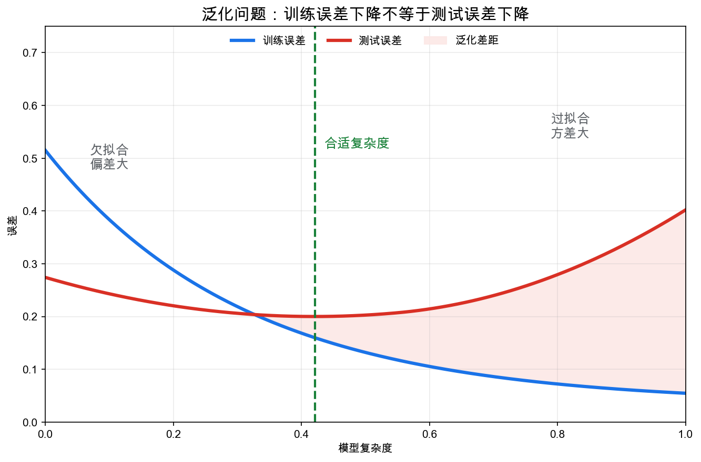
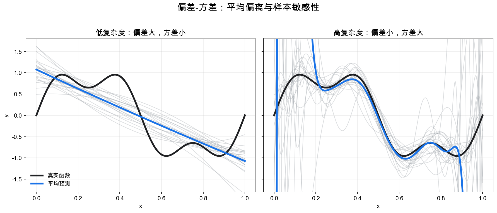
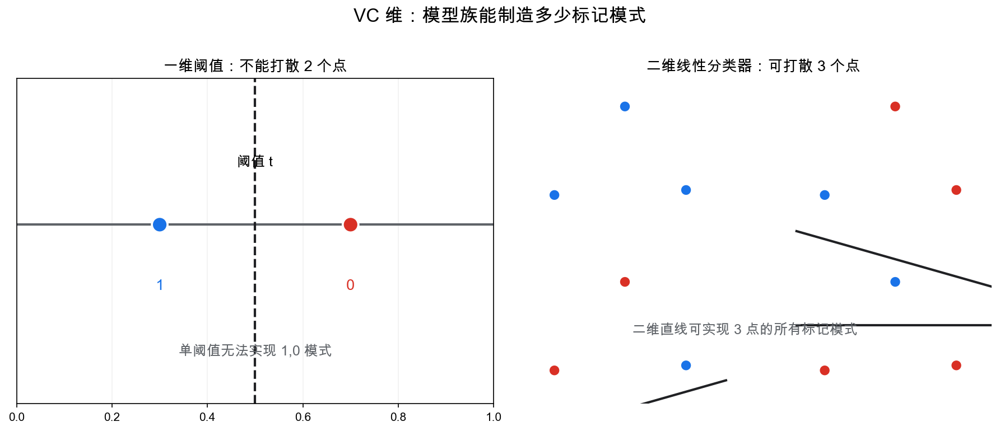
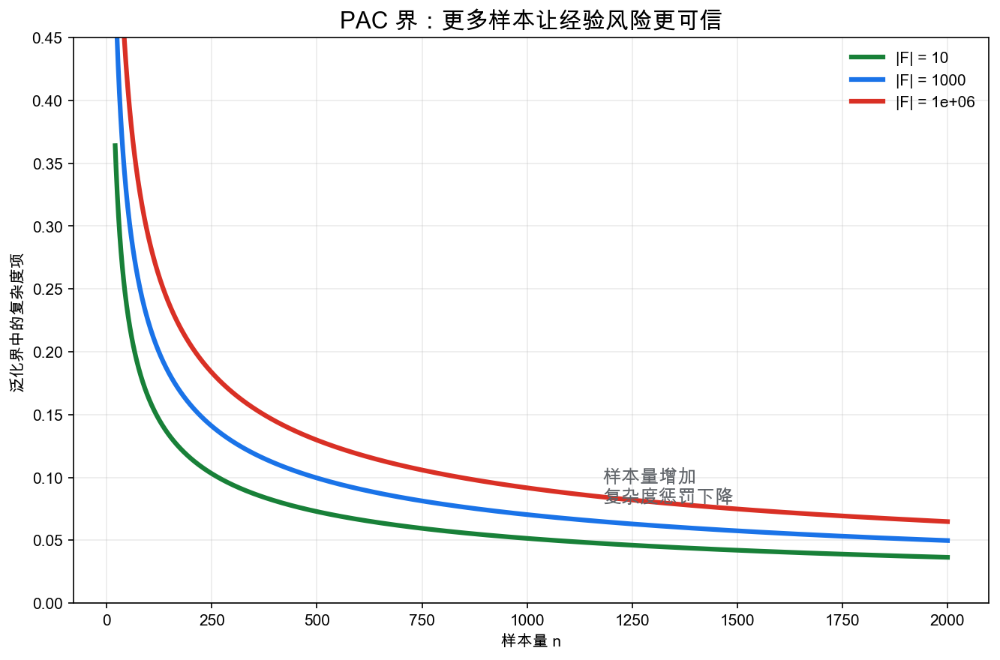
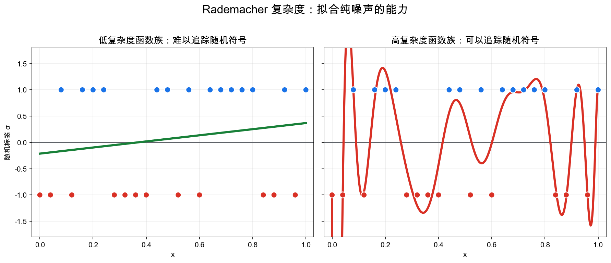

# 重学数学之十一: 统计学习理论——模型为什么能在没见过的数据上工作

## 一、真正的问题不是拟合，而是泛化

机器学习表面上是在做一件很熟悉的事：

> **从数据中找一个函数，让它在样本上犯错尽量少。**

写成公式，就是经验风险最小化：

$$
\hat f=\arg\min_{f\in\mathcal F}\frac{1}{n}\sum_{i=1}^n \ell(f(x_i),y_i)
$$

这里 $\mathcal F$ 是候选模型族，$\ell$ 是损失函数，$(x_i,y_i)$ 是训练样本。

但这句话隐藏了一个关键断裂：我们真正关心的不是训练样本，而是未来还没见过的数据。

训练误差是：

$$
\hat R(f)=\frac{1}{n}\sum_{i=1}^n \ell(f(x_i),y_i)
$$

真实风险是：

$$
R(f)=\mathbb E_{(X,Y)\sim P}\ell(f(X),Y)
$$

这里的 $P$ 是背后的数据生成分布。训练集只是从 $P$ 里抽出来的一小把样本，而真实风险要看所有未来可能出现的数据。麻烦就在这里：$P$ 通常看不见，我们只能用训练集这个有限影子去推断它。

统计学习理论的核心问题就是：

> **为什么 $\hat R(f)$ 小，能够说明 $R(f)$ 也小？**

如果模型族太小，它连训练数据都拟合不好；如果模型族太大，它可以把训练数据背下来，但对新数据没有保证。

所以学习理论不是在问"怎样把训练误差降到 0"，而是在问：

> **在有限样本下，经验世界和真实世界之间的差距如何被控制？**

这正是泛化误差：

$$
R(f)-\hat R(f)
$$

它是机器学习中最根本的未知量。

## 二、从大数定律到一致收敛

如果只固定一个模型 $f$，那么 $\hat R(f)$ 是 $R(f)$ 的样本平均估计。由大数定律：

$$
\hat R(f)\to R(f)
$$

这没什么神秘。问题出在我们不是先固定 $f$，再估计它的风险；而是用同一批数据从 $\mathcal F$ 里挑选了一个最合适的 $\hat f$。

这会引入选择偏差。

一个模型族越大，你越容易在其中找到一个模型，它刚好在训练集上表现很好。即使这个好表现只是偶然的。

这就像同时买很多张彩票，总会有一张看起来“很接近中奖”。如果只看那一张，你会高估自己的运气。模型选择也是这样：训练过程在大量候选函数里挑了一个最讨训练集喜欢的，训练误差天然带有乐观偏差。

因此学习理论需要控制的是：

$$
\sup_{f\in\mathcal F}|R(f)-\hat R(f)|
$$

这叫**一致收敛**。

它说的不是某一个模型的训练误差接近真实误差，而是：

> **整个模型族里，所有模型的经验风险都同时接近真实风险。**

一旦有了一致收敛，经验风险最小化就有泛化保证。因为如果每个模型的训练风险都没有严重欺骗你，那么训练集上最好的那个模型，在真实分布上也不会太差。

口述版推理是：

1. $\hat f$ 在训练集上不比最优模型 $f^\star$ 差。
2. 训练风险和真实风险在整个 $\mathcal F$ 上都接近。
3. 所以 $\hat f$ 的真实风险接近 $f^\star$ 的真实风险。

这就是经验风险最小化的理论基础。

如果只记一个判断标准，可以记这个：学习理论想要的不是“某个模型碰巧估得准”，而是“整个候选集合都没有太多作弊空间”。一致收敛正是在控制这种作弊空间。

## 三、偏差-方差：错误来自两种方向

在回归问题里，我们可以用偏差-方差分解看清另一种泛化结构。

假设真实关系是：

$$
Y=f^\star(X)+\varepsilon
$$

学习算法在不同训练集上会产生不同模型 $\hat f_D$。对某个输入 $x$，预测误差可以分解为：

$$
\mathbb E_D[(\hat f_D(x)-f^\star(x))^2]
=
\big(\mathbb E_D\hat f_D(x)-f^\star(x)\big)^2
+\mathbb E_D\big(\hat f_D(x)-\mathbb E_D\hat f_D(x)\big)^2
$$

第一项是**偏差**：平均模型离真实函数有多远。

第二项是**方差**：换一批训练数据，模型输出会抖动多大。

如果我们分解的是对 $Y$ 的预测误差，还会多出一项噪声方差 $\mathbb E[\varepsilon^2]$。那部分来自数据本身的随机性，任何模型都无法消除。上面的公式只写了模型函数 $\hat f_D(x)$ 相对真实函数 $f^\star(x)$ 的误差，所以没有把不可约噪声写进去。

低复杂度模型通常偏差大、方差小。它不太会跟着样本噪声乱跑，但可能捕捉不到真实结构。

高复杂度模型通常偏差小、方差大。它足够灵活，但也容易把噪声当成规律。

这解释了为什么"更复杂"不自动等于"更好"：

> **模型能力必须足以表达结构，但不能自由到把随机噪声也解释掉。**

在现代深度学习里，简单的 U 形偏差-方差图并不能解释所有现象，例如双降现象会让曲线更复杂。但这个分解仍然提供了一个重要视角：泛化失败通常不是因为训练不够努力，而是因为模型、数据量、噪声和归纳偏置之间的平衡错了。

## 四、VC 维：模型族到底能表达多少模式

### 4.1 打散一个点集

为了刻画模型族复杂度，Vapnik 和 Chervonenkis 提出了一个非常几何的想法。

给定一个分类模型族 $\mathcal F$，如果对某个点集中的任意 0/1 标记方式，$\mathcal F$ 都能找到一个分类器完全实现它，我们就说 $\mathcal F$ **打散**了这个点集。

“任意标记方式”是这一定义里最重的地方。它不是说模型能把某一组标签分对，而是说无论你怎样给这些点贴 0/1 标签，模型族都能照着实现。能做到这一点，说明模型族在这组点上几乎没有限制。

VC 维就是：

> **模型族能够打散的最大点数。**

例如一维阈值分类器：

$$
f_t(x)=\mathbf 1\lbrace x\ge t\rbrace
$$

它能打散 1 个点，但不能打散 2 个点。因为两个点 $x_1<x_2$ 如果标成 $1,0$，单个阈值无法实现。

所以一维阈值的 VC 维是 1。

二维平面上的线性分类器可以打散任意 3 个一般位置的点，但不能打散任意 4 个点。因此它的 VC 维是 3。

为什么 4 个点不行？把四个点摆成凸四边形，给对角线上的两个点标成 1，另外两个标成 0，就得到一个 XOR 式标记。任何一条直线都会把平面切成两个半平面，没法把交错的两个顶点单独分到同一边。这说明线性分类器的表达力有几何边界。

### 4.2 VC 维为什么控制泛化

有限 VC 维意味着模型族虽然可能无限大，但它在有限样本上的有效标记模式数受控。

这正是关键想法：

> **泛化能力不取决于参数空间是不是无限，而取决于模型族在样本上能制造多少不同模式。**

典型的 VC 泛化界形如：

$$
R(f)\le \hat R(f)
+O\left(\sqrt{\frac{d\log(n/d)+\log(1/\delta)}{n}}\right)
$$

这里 $d$ 是 VC 维，$n$ 是样本量，$\delta$ 是失败概率。

这条式子不该被当成实际调参公式，而应该被理解为一个结构性结论：

1. 样本越多，经验风险越可信。
2. 模型族越复杂，需要越多样本来约束它。
3. 泛化保证是概率性的，不是绝对确定的。

这里的 $\delta$ 经常让人困惑。它不是模型犯错的概率，而是这条上界失效的概率。换句话说，我们希望“以至少 $1-\delta$ 的概率，所有模型的真实风险都不超过右边这个界”。

## 五、PAC 学习：把"能学"说清楚

PAC 是 Probably Approximately Correct 的缩写。

它想形式化这样一句话：

> **在足够多样本下，算法以高概率学到一个近似正确的模型。**

这里有两个关键词。

**Approximately Correct**：模型真实误差不超过某个容忍水平 $\varepsilon$。

**Probably**：这个结论至少以 $1-\delta$ 的概率成立。

对有限假设类 $|\mathcal F|<\infty$，一个典型界是：

$$
R(f)\le \hat R(f)
+\sqrt{\frac{\log|\mathcal F|+\log(1/\delta)}{2n}}
$$

这条式子的思想很清楚：如果候选模型只有有限多个，我们可以对每个模型用集中不等式，再用 union bound 同时控制所有模型。

union bound 的意思很朴素：如果每个候选模型单独“骗过我们”的概率都很小，那么有限多个模型里至少有一个骗过我们的概率，最多是这些小概率加起来。模型越多，要同时防住它们，就要付出 $\log|\mathcal F|$ 这样的复杂度代价。

这也揭示了学习理论中一个反复出现的结构：

> **先控制单个对象的偏差，再为整个模型族付出复杂度代价。**

PAC 学习的贡献不是告诉我们某个具体神经网络一定怎么表现，而是把"可学习"从直觉变成了可量化命题：

$$
n \gtrsim \frac{\text{complexity}+\log(1/\delta)}{\varepsilon^2}
$$

样本复杂度、模型复杂度、误差容忍和置信度就这样被放在同一个公式里。

## 六、Rademacher 复杂度：模型能多容易拟合噪声

VC 维是最坏情况复杂度。它问的是：存在某个点集能不能被完全打散。

但很多时候我们更关心当前数据分布上的复杂度。这就引出 Rademacher 复杂度。

给定样本 $S=\lbrace x_1,\dots,x_n\rbrace$，随机给每个样本一个独立符号：

$$
\sigma_i\in\lbrace -1,+1\rbrace
$$

经验 Rademacher 复杂度定义为：

$$
\hat{\mathfrak R}_S(\mathcal F)
=
\mathbb E_\sigma
\left[
\sup_{f\in\mathcal F}
\frac{1}{n}\sum_{i=1}^n \sigma_i f(x_i)
\right]
$$

这看起来抽象，但含义很直接：

> **如果标签是纯随机噪声，这个模型族还能拟合到什么程度？**

这里的随机符号 $\sigma_i$ 可以理解成临时乱贴的标签。它们和样本没有任何真实关系。如果一个模型族连这种乱标签都能对上很多，说明它的自由度很大；如果它对乱标签无能为力，说明它只能表达比较稳定的结构。

如果模型族很弱，它无法预测随机符号，复杂度低。

如果模型族很强，它可以追着随机符号起伏，复杂度高。

Rademacher 复杂度的泛化界大致是：

$$
R(f)\le \hat R(f)+2\mathfrak R_n(\mathcal F)+O\left(\sqrt{\frac{\log(1/\delta)}{n}}\right)
$$

它比 VC 维更贴近数据和函数值大小，因此在现代学习理论中非常重要。

VC 维只问能不能打散，答案偏离散；Rademacher 复杂度还看函数值幅度、样本位置和当前数据集。两个模型族可能 VC 维一样，但在某个具体数据分布上，一个很容易追噪声，另一个很难追噪声。Rademacher 复杂度能区分这种差别。

这里的 aha moment 是：

> **泛化差距可以通过模型拟合随机噪声的能力来衡量。**

这和信息论也有联系：模型如果能编码太多随机标记，就说明它对训练集携带了过多偶然信息。泛化需要的是提取稳定结构，而不是记住样本编号。

## 七、正则化：主动限制自由度

正则化的实际作用不是让公式更漂亮，而是给模型加上归纳偏置。

经验风险最小化加正则项：

$$
\hat f=
\arg\min_{f\in\mathcal F}
\hat R(f)+\lambda\Omega(f)
$$

这里 $\Omega(f)$ 衡量模型复杂度。

典型例子：

| 正则项 | 约束的东西 | 常见效果 |
|--------|------------|----------|
| $\|w\|_2^2$ | 参数能量 | 权重分散、解更稳定 |
| $\|w\|_1$ | 参数稀疏性 | 自动变量选择 |
| 核范数 | 矩阵秩 | 低秩结构 |
| 总变差 | 函数震荡 | 保边去噪、分段平滑 |
| margin 约束 | 分类边界距离 | 提升分类鲁棒性 |

从第九章凸优化的角度看，正则化通常让问题更稳定、更容易分析。

从学习理论的角度看，正则化是在说：

> **在所有能解释数据的模型中，优先选择更简单、更稳定、更符合先验结构的那个。**

这和最大熵原理有一种对偶味道：信息不足时不要假装知道更多；样本有限时不要允许模型使用太多自由度。

## 八、稳定性：算法本身也影响泛化

前面我们主要讨论模型族 $\mathcal F$ 的复杂度。但学习结果不仅由模型族决定，也由算法决定。

一个算法如果对单个样本非常敏感，那么它容易过拟合。反过来，如果移除或替换一个训练样本，输出模型几乎不变，那么它通常有更好的泛化。

这正是**算法稳定性**。

一种常见表述是：如果训练集 $S$ 和 $S^{(i)}$ 只差一个样本，算法输出分别为 $A(S)$ 和 $A(S^{(i)})$，并且对所有测试点 $z$：

$$
|\ell(A(S),z)-\ell(A(S^{(i)}),z)|\le \beta
$$

那么算法具有稳定性 $\beta$。

直觉是：

> **一个模型如果真的学到了总体规律，就不应该因为某一个样本的替换而剧烈改变。**

稳定性把泛化问题从“模型族有多大”换成了“训练过程有多敏感”。这很贴近实践：同样的模型结构，用不同优化算法、不同学习率、是否早停，最后的泛化可能完全不同。学习理论因此不能只看函数集合，还要看算法怎样在集合里选点。

这解释了很多训练技术的泛化作用：正则化、早停、数据增强、随机梯度噪声、权重衰减，都可以从某种角度看作提高稳定性或降低有效复杂度。

## 九、双降与现代深度学习的挑战

经典统计学习理论常给出一个 U 形图景：模型复杂度增加时，训练误差下降，测试误差先下降后上升。

但现代深度学习经常发生另一件事：模型参数远多于样本，训练误差接近 0，却仍然能泛化。

这产生了**双降现象**：

1. 在低复杂度区域，测试误差呈经典 U 形。
2. 接近插值阈值时，测试误差可能变差。
3. 继续增大模型后，测试误差又下降。

插值阈值指的是模型刚好强到可以把训练集误差压到 0 的位置。这个位置最危险：模型有能力记住训练数据，但还没有足够多的冗余自由度去选择一个“简单”的插值解。继续增大模型以后，优化算法往往会偏向某些低范数、大 margin 或更平滑的解，测试误差反而可能下降。

这说明传统复杂度指标不够完整。参数数量本身不是泛化的全部答案。

现代观点更强调：

- 优化算法偏好什么解。
- 参数范数、margin、谱复杂度等有效复杂度。
- 数据分布是否有低维结构。
- 模型结构是否匹配任务对称性。
- 训练过程是否带来隐式正则化。

这并不是说经典学习理论错了，而是说它给出的框架需要更精细的复杂度概念。

### 9.1 分布偏移：泛化不是只看同分布测试集

经典泛化通常默认训练集和测试集来自同一个分布。

现实里，这个假设经常松动。医学模型换医院，推荐系统换用户群，自动驾驶模型换城市，训练分布和部署分布都可能不同。

这时经验风险最小化回答的只是：

$$
\text{在训练分布上表现如何？}
$$

真正要问的是：

$$
\text{当 }P_{\text{train}}\ne P_{\text{test}}\text{ 时，哪些规律还能保留？}
$$

这把统计学习理论推向鲁棒学习、领域泛化和因果学习。只靠相关性学到的模式，换环境后容易碎；更稳定的结构往往来自机制、对称性、因果关系或物理约束。

所以现代泛化问题不只是“样本够不够”，还包括“环境变了以后，模型学到的东西还算不算数”。

## 十、应用场景

统计学习理论是机器学习背后的元理论。它不直接替你训练模型，但它告诉你什么时候训练结果值得相信。

| 领域 | 学习理论扮演的角色 |
|------|------------------|
| 监督学习 | 分析分类、回归、经验风险最小化和泛化误差 |
| 模型选择 | 理解复杂度、正则化、交叉验证和过拟合 |
| 深度学习 | 研究过参数化、隐式正则化、margin 和双降 |
| 强化学习 | 样本复杂度、探索误差和策略泛化依赖学习理论 |
| 统计推断 | 连接估计一致性、集中不等式和风险界 |
| 公平与鲁棒性 | 分析分布偏移、对抗扰动和不同群体上的泛化 |
| 自动化机器学习 | 指导模型容量、搜索空间和验证集设计 |

它的实际价值不在于给出一个神奇公式，而在于提供判断框架：当模型表现好时，哪些原因是可靠的，哪些可能只是训练集偶然性。

## 十一、与前几章的连接

统计学习理论把前面很多章节汇聚到了一起：

1. **概率论与随机分析**：泛化界依赖样本平均、集中不等式、鞅和随机过程。
2. **凸优化**：经验风险最小化、正则化、稳定性分析都和优化结构有关。
3. **信息论**：互信息、压缩、最小描述长度和信息瓶颈提供另一套泛化语言。
4. **泛函分析**：模型族可以看作函数空间中的子集；范数、紧性和对偶性控制复杂度。
5. **拓扑与几何**：数据流形、决策边界、margin 和低维结构影响可学习性。
6. **范畴论**：训练、验证、泛化可以被看成从经验分布到假设空间再到预测分布的结构保持映射。

最值得抓住的是这一点：

> **学习理论是在研究有限样本如何约束无限可能。**

这和前面许多理论的精神一致。泛函分析用范数和紧性控制无限维空间；信息论用熵控制不确定性；凸分析用几何结构控制优化；学习理论则用复杂度控制经验数据到真实世界的跃迁。

## 十二、前沿展望

### 12.1 神经切线核：无穷宽网络的精确分析

Jacot、Gabriel 与 Hongler（2018）发现：无穷宽神经网络在梯度流训练下，其输出函数的演化等价于一个**核方法**——核函数为**神经切线核**（NTK）：

$$
\Theta(x,x') = \nabla_\theta f_\theta(x)^\top \nabla_\theta f_\theta(x')
$$

在无穷宽极限下，NTK 在训练过程中保持不变（收敛于初始化时的极限核），训练损失以指数速率收敛到全局极小。这给出了深度网络过参数化下"无坏局部极小"现象的第一个严格理论解释。

NTK 分析的局限：NTK 刻画的是"懒训练"极限（参数几乎不移动），无法解释特征学习、迁移学习和 grokking 等现象。这催生了**平均场（MFT）极限**（Yang & Hu 2021，$\mu$P 参数化）等更精细的无穷宽理论，使特征学习在极限下得以保留。

### 12.2 良性过拟合与双降现象

Belkin 等（2019）和 Bartlett 等（2020）在具体的线性回归、核回归随机模型和高维极限下证明：插值（训练误差为零）的最小范数解仍可能泛化；这依赖特征协方差、信号强度、噪声和有效维度等条件，并不是对所有插值模型的无条件结论。

这揭示了经典 U 形偏差-方差图的局限：在过参数化阶段，**第二下降段**出现——继续增加参数（特征），泛化误差可以再次改善。双降现象不限于神经网络，在线性模型中已有严格证明，并通过随机矩阵理论精确刻画（Hastie 等 2022）。

### 12.3 PAC-Bayes 界：先验如何影响泛化

McAllester（1998，1999）和 Langford-Shawe-Taylor（2002）将贝叶斯先验引入泛化界：设 $P$ 为训练前的先验，$Q$ 为训练后的后验（依赖数据），则

$$
R(Q) \le \hat R(Q) + \sqrt{\frac{D_{\mathrm{KL}}(Q\|P) + \log(1/\delta)}{2n}}
$$

以概率 $1-\delta$ 成立，且 $\hat R(Q)$ 是随机分类器在训练集上的期望误差。

PAC-Bayes 界的关键特点：它对**所有分布 $Q$** 同时成立（不需要 union bound over all 模型），且 KL 散度项提供了比 VC 维更紧的复杂度指标。近年 Dziugaite & Roy（2017）通过最优化 PAC-Bayes 界本身，为深度神经网络得到了第一个非平凡的数值泛化证书（在 MNIST 上约 16% 上界，接近实测泛化误差）。

### 12.4 算法稳定性与均匀稳定性

Bousquet & Elisseeff（2002）严格证明：若算法具有均匀稳定性（替换任意一个训练样本，模型损失变化 $\le\beta$），则其泛化误差以 $O(\beta + \sqrt{\log(1/\delta)/n})$ 为界。随机梯度下降的均匀稳定性与训练步数、步长和训练集大小的关系（Hardt 等 2016）解释了为什么早停能改善泛化——训练过长会降低稳定性。

**数据增强**的理论效果：Rajput 等（2019）证明随机化标签（randomized label）数据增强在 PAC-Bayes 框架下等价于先验正则化，严格改善泛化界。这为深度学习实践中的 Mixup、CutMix 提供了部分理论基础。

## 十三、总结

统计学习理论的核心结构可以这样串起来：

1. **经验风险与真实风险**：训练集上的好表现不自动等于真实世界中的好表现。
2. **一致收敛**：如果整个模型族的经验风险都接近真实风险，经验风险最小化就可靠。
3. **偏差-方差**：错误来自表达能力不足和对样本噪声过敏两种方向。
4. **VC 维**：模型族能打散多少点，刻画其最坏情况表达能力。
5. **PAC 学习**：用样本复杂度、误差和置信度定义什么叫"可学习"。
6. **Rademacher 复杂度**：模型拟合随机噪声的能力越强，泛化风险越高。
7. **正则化与稳定性**：通过限制自由度或降低样本敏感性来改善泛化。
8. **现代挑战**：过参数化和双降说明复杂度必须按有效自由度和算法偏置来理解。

> **统计学习理论把"从样本中学到规律"这件事，变成了关于风险、复杂度和样本量的数学问题。**

它提醒我们：模型真正学到的不是训练集本身，而是训练集背后稳定、可重复、能迁移到未来数据的结构。

---

*学完学习理论，我们知道了模型为什么能泛化。接下来进入贝叶斯统计与概率图模型——它们会把不确定性更新变成一套可计算的推理语言。*
