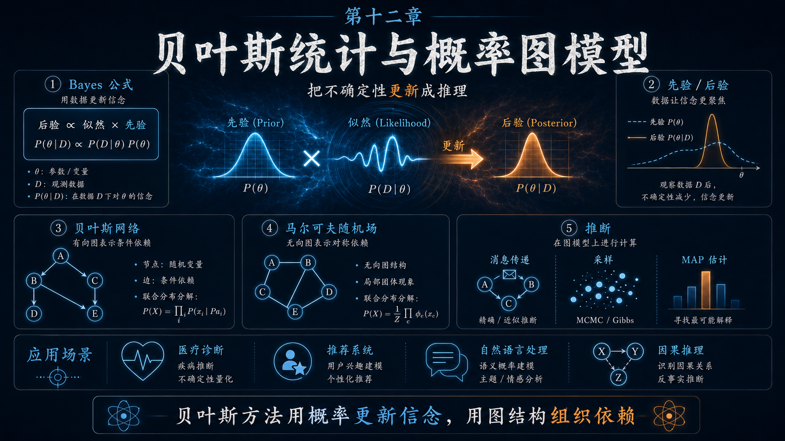
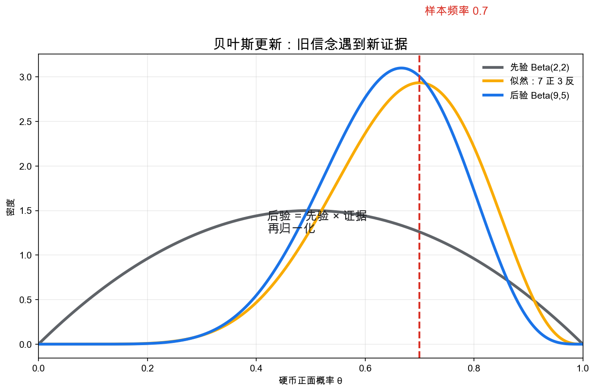
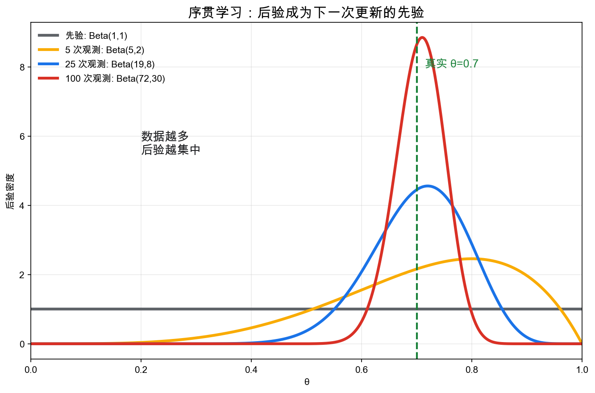
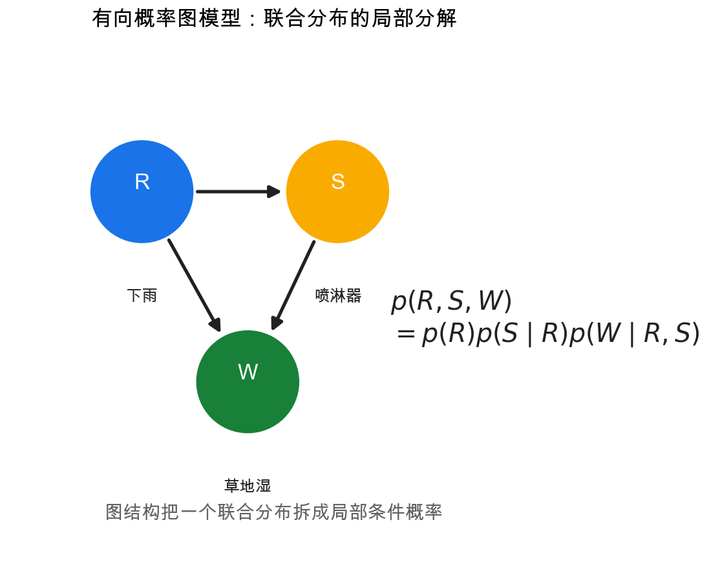
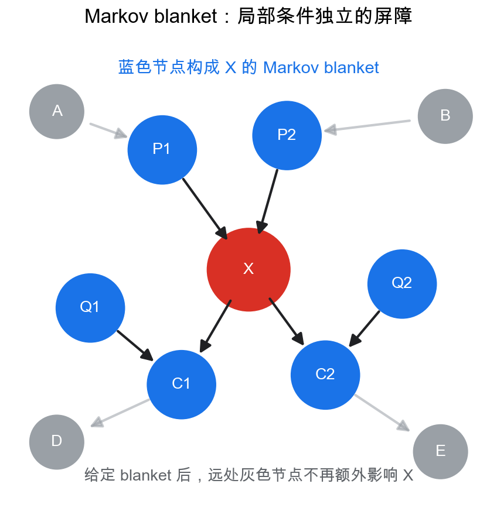
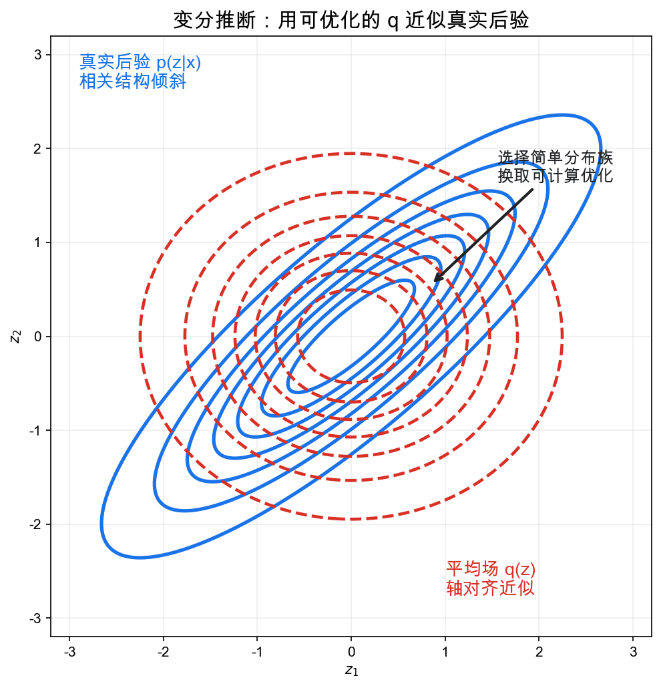

# 重学数学之十二: 贝叶斯统计与概率图模型——把不确定性更新成推理

## 一、为什么需要贝叶斯视角？

统计学习理论问的是：

> **模型为什么能在没见过的数据上泛化？**

贝叶斯统计问的是另一个更直接的问题：

> **看到新证据后，我应该怎样更新自己的不确定性？**

假设我们抛一枚硬币，想知道它正面朝上的概率 $\theta$。

如果抛了 10 次，出现 7 次正面，频率派会自然估计：

$$
\hat\theta=\frac{7}{10}
$$

这当然合理。但如果只抛了 2 次，正面出现 2 次，我们真的应该相信 $\theta=1$ 吗？

这里问题不在于最大似然错了，而在于它没有表达"我对这个估计有多不确定"。

贝叶斯方法的第一步是承认：

> **未知参数本身也可以用概率分布描述。**

不是说参数在物理上随机跳动，而是说在证据不足时，我们对它的知识状态是不确定的。

贝叶斯公式把这种知识更新写成：

$$
p(\theta\mid D)
=
\frac{p(D\mid\theta)p(\theta)}{p(D)}
$$

其中：

- $p(\theta)$ 是**先验**：看到数据前的信念。
- $p(D\mid\theta)$ 是**似然**：如果参数是 $\theta$，观察到数据 $D$ 的可能性。
- $p(\theta\mid D)$ 是**后验**：看到数据后的信念。
- $p(D)$ 是**证据**或归一化常数。

$p(D)$ 容易被忽略，但它并不是装饰项。它把所有可能参数下的数据概率加权平均：

$$
p(D)=\int p(D\mid\theta)p(\theta)\,d\theta
$$

它保证后验积分为 1。换句话说，似然乘先验先给出一个“未归一化的可信度”，证据项负责把这些可信度重新缩放成真正的概率分布。在模型比较里，$p(D)$ 还会变成边际似然，用来衡量一个模型整体上多能解释数据。

真正的核心不是公式本身，而是这句话：

> **后验 $\propto$ 似然 $\times$ 先验。**

这正是贝叶斯统计的基本动作：旧信念遇到新证据，变成新信念。

## 二、先验不是主观任性，而是信息的容器

很多人第一次听到"先验"会警惕：这是不是把主观偏见塞进统计里？

确实，先验可能被滥用。但它的正确理解是：

> **先验是数据之外的信息，必须被显式写出来。**

如果你分析的是一枚普通硬币，先验应该集中在 $\theta=0.5$ 附近。  
如果你分析的是某个制造过程中的缺陷率，先验应该集中在很小的概率附近。  
如果你真的什么都不知道，可以用更平坦的先验。

贝叶斯方法的诚实之处在于：它不假装先验不存在，而是把它放到台面上。

在硬币问题中，一个常用先验是 Beta 分布：

$$
\theta\sim \mathrm{Beta}(\alpha,\beta)
$$

Beta 分布适合硬币概率，是因为它定义在 $[0,1]$ 上，而且形状很灵活。$\alpha$ 大、$\beta$ 小时，它偏向正面概率高；$\alpha$ 小、$\beta$ 大时，它偏向正面概率低；$\alpha=\beta=1$ 时就是均匀分布。

它的密度为：

$$
p(\theta)
\propto
\theta^{\alpha-1}(1-\theta)^{\beta-1}
$$

如果观察到 $h$ 次正面、$t$ 次反面，似然是：

$$
p(D\mid\theta)
\propto
\theta^h(1-\theta)^t
$$

二者相乘：

$$
p(\theta\mid D)
\propto
\theta^{\alpha+h-1}(1-\theta)^{\beta+t-1}
$$

所以后验仍然是 Beta 分布：

$$
\theta\mid D\sim \mathrm{Beta}(\alpha+h,\beta+t)
$$

这叫**共轭先验**。

共轭的本质不是技巧，而是：

> **更新前后留在同一个分布族里。**

这让贝叶斯更新像加法一样简单：观察到一次正面，$\alpha$ 加 1；观察到一次反面，$\beta$ 加 1。

也因此，$\alpha$ 和 $\beta$ 常被理解成“伪计数”。它们不是伪造数据，而是在同一个计数语言里表达先验强度。$\mathrm{Beta}(1,1)$ 很弱，几次观测就能推动后验；$\mathrm{Beta}(100,100)$ 很强，需要很多数据才会明显移动。

## 三、贝叶斯学习是逐步收缩的不确定性

继续硬币例子。假设真实偏置是 $\theta=0.7$，我们一开始用均匀先验：

$$
\theta\sim\mathrm{Beta}(1,1)
$$

随着数据增加，后验分布会逐渐向真实值附近集中。

这张图比一个点估计更有信息量。它告诉我们：

1. 数据很少时，后验很宽，表示我们还不确定。
2. 数据变多时，后验变窄，表示证据越来越强。
3. 后验中心逐渐靠近真实参数。

贝叶斯估计不是只输出一个答案，而是输出一个完整的不确定性分布。

如果需要点估计，可以取后验均值：

$$
\mathbb E[\theta\mid D]
=
\frac{\alpha+h}{\alpha+\beta+h+t}
$$

也可以取最大后验估计：

$$
\theta_{\mathrm{MAP}}
=
\arg\max_\theta p(\theta\mid D)
$$

MAP 和最大似然很像，但多了先验项：

$$
\theta_{\mathrm{MAP}}
=
\arg\max_\theta
\big[
\log p(D\mid\theta)+\log p(\theta)
\big]
$$

这和第九章的正则化直接连上了。负对数先验就是正则项：

$$
-\log p(\theta)
$$

所以很多正则化方法都有贝叶斯解释：

- $L_2$ 正则对应高斯先验。
- $L_1$ 正则对应 Laplace 先验。
- 稀疏模型对应把概率质量放在低维结构附近的先验。

优化语言说"惩罚复杂解"，贝叶斯语言说"复杂解先验概率低"。

## 四、预测分布：不要只预测参数

贝叶斯统计真正关心的常常不是参数 $\theta$，而是未来观测 $\tilde y$。

预测分布是：

$$
p(\tilde y\mid D)
=
\int p(\tilde y\mid\theta)p(\theta\mid D)\,d\theta
$$

这条公式很重要，因为它没有先把 $\theta$ 固定成一个点估计，而是把参数不确定性积分掉。

直觉是：

> **未来预测应该同时考虑每个可能参数，以及这个参数在后验中有多可信。**

这在小样本、高风险决策和科学建模里尤其关键。

例如医学诊断中，样本不多时只给一个点预测很危险。贝叶斯预测分布可以告诉你：结果最可能是什么，以及不确定性有多大。

这也是贝叶斯方法和信息论的连接：后验分布保留了关于未知量的剩余不确定性，预测就是把这种不确定性传递到未来观测上。

## 五、层级模型：让先验也从数据中学习

如果我们有多个相关群体，简单地分别估计会浪费信息，完全合并又会抹掉差异。

例如估计多个城市的疾病发生率。每个城市样本量不同，小城市的数据很少，大城市的数据多。

一个层级模型可以写成：

$$
y_j\mid \theta_j \sim \mathrm{Binomial}(n_j,\theta_j)
$$

$$
\theta_j\mid \alpha,\beta \sim \mathrm{Beta}(\alpha,\beta)
$$

$$
\alpha,\beta \sim p(\alpha,\beta)
$$

这里每个城市有自己的 $\theta_j$，但这些 $\theta_j$ 又共享上层分布。

它实现了一种很有用的折中：

> **每个群体保留自己的差异，同时向总体规律收缩。**

这叫 partial pooling。

样本少的城市会更多地向总体均值收缩；样本多的城市则更多由自己的数据决定。

这不是拍脑袋修正，而是贝叶斯后验自然给出的结果。

这类收缩很适合小样本场景。假设一个小城市只记录到 1 个病例、样本总数也很小，单独估计会非常不稳定；但把它完全并入全国平均，又会抹掉地方差异。层级模型允许它“借用”其他城市的信息，同时保留自己的观测证据。

## 六、概率图模型：把联合分布拆成局部关系

贝叶斯统计给了我们更新信念的原则。但现实问题中变量很多，直接写联合分布通常不可行。

如果有 $n$ 个变量：

$$
p(x_1,\dots,x_n)
$$

完整联合分布会非常大。概率图模型的想法是：

> **用图结构表达变量之间的条件依赖，把一个大联合分布拆成局部因子。**

以一个简单的有向图为例：

$$
R \to S,\quad R\to W,\quad S\to W
$$

可以理解为：

- $R$：是否下雨。
- $S$：喷淋器是否打开。
- $W$：草地是否湿。

这些箭头先不要急着读成因果。它们在这一章里主要表示概率分解方式：$R$ 会帮助预测 $S$ 和 $W$，而 $W$ 的概率需要同时看 $R$ 和 $S$。到下一章因果推断时，我们会再区分“概率依赖的箭头”和“干预意义上的因果箭头”。

联合分布分解为：

$$
p(R,S,W)
=
p(R)p(S\mid R)p(W\mid R,S)
$$

这张图的价值不是画了几个箭头，而是把概率模型的结构暴露出来：

> **每个节点只需要关心自己的父节点。**

对于一般有向无环图，联合分布分解为：

$$
p(x_1,\dots,x_n)
=
\prod_i p(x_i\mid \mathrm{pa}(x_i))
$$

这里 $\mathrm{pa}(x_i)$ 是 $x_i$ 的父节点。

概率图模型的核心是：

> **图结构是联合分布的压缩格式。**

它把一个指数级的大表，压缩成一组局部条件概率。

## 七、条件独立：图真正表达的东西

概率图模型不只是为了画图好看。它真正表达的是条件独立。

如果：

$$
X\perp Y\mid Z
$$

意思是：一旦知道 $Z$，$X$ 和 $Y$ 就不再提供关于彼此的额外信息。

比如“下雨”和“喷淋器开启”都能解释“草地湿”。如果我们不知道草地是否湿，二者可能看起来相关；但在某些模型里，一旦把共同原因或共同结果条件化，相关结构会改变。条件独立不是说变量永远没关系，而是说在给定某些信息以后，额外知道另一个变量不会再改变判断。

在图模型中，条件独立让推理变得局部。

一个重要概念是**Markov blanket**。对某个节点 $X$，它的 Markov blanket 包括：

1. $X$ 的父节点。
2. $X$ 的子节点。
3. $X$ 子节点的其他父节点。

给定 Markov blanket 后，$X$ 与图中其他所有节点条件独立。

直觉是：

> **如果你已经知道一个节点周围的直接概率环境，远处变量不会再额外影响它。**

为什么还要包括“子节点的其他父节点”？因为子节点会把多个父节点的信息混在一起。只知道 $X$ 的子节点还不够，你还要知道这些子节点同时受哪些变量影响，才能判断子节点上的证据到底该归因给谁。这些“共同解释者”有时也叫 spouses。

这就是图模型能做大规模推理的原因。它不是把所有变量混在一起，而是利用条件独立把问题拆开。

范畴论视角下，图模型可以看成把复杂联合分布分解为一组局部构件，再用乘积和边缘化把它们组合起来。图上的箭头不是因果本身，而是一种组织概率依赖的语法。

## 八、推理：从已知证据推出未知变量

有了概率模型后，核心任务是推理：

> **给定一部分观测变量，求另一部分变量的后验分布。**

形式上：

$$
p(z\mid x)
=
\frac{p(x,z)}{\int p(x,z)\,dz}
$$

这看起来和贝叶斯公式一样，但困难在分母：

$$
p(x)=\int p(x,z)\,dz
$$

高维积分或高维求和通常非常难。

在链式结构、树结构或低树宽图中，可以用**消息传递**精确推理。典型方法包括：

- Hidden Markov Model 中的 forward-backward 算法。
- 树图上的 belief propagation。
- Kalman filter 中的递推更新。

消息传递的直觉是：每个局部因子先把自己知道的东西压缩成一条“消息”，沿边传给邻居；邻居把收到的消息和自己的局部概率合并，再继续传。树结构里没有环，消息不会绕回来重复计算，所以可以精确得到边缘分布。

如果图里有环，或者变量很多，精确推理通常不可行，就需要近似方法。

## 九、MCMC：用采样表示后验

一种近似思路是：既然后验分布难以写出完整形式，那就从中采样。

MCMC 的目标是构造一个 Markov 链：

$$
\theta^{(1)},\theta^{(2)},\dots
$$

使它的平稳分布正好是目标后验：

$$
p(\theta\mid D)
$$

“平稳分布”指的是：链走得足够久以后，它落在各个区域的长期比例就是目标后验概率。我们不需要直接算出后验的归一化常数，只要设计一条会在后验高的地方多停留、后验低的地方少停留的随机游走。

这样，后验期望可以用样本平均近似：

$$
\mathbb E[g(\theta)\mid D]
\approx
\frac{1}{M}\sum_{m=1}^M g(\theta^{(m)})
$$

Metropolis-Hastings、Gibbs sampling、Hamiltonian Monte Carlo 都是这个思想的不同实现。

MCMC 的优点是表达能力强，能处理复杂后验。

缺点也很现实：

- 采样可能混合很慢。
- 高维后验可能有复杂几何。
- 样本之间相关，不能简单当作独立样本。
- 诊断收敛很困难。

所以 MCMC 更像显微镜：看得细，但成本高。

实际使用时还要区分“能采样”和“采得好”。如果链长时间困在一个后验峰附近，没有充分探索其他峰，样本平均会很自信地给出错误答案。这就是混合慢和收敛诊断难的真正麻烦。

## 十、变分推断：把推理变成优化

另一种近似思路是变分推断。

我们选一个容易处理的分布族：

$$
q(z)\in\mathcal Q
$$

然后找一个 $q$，让它尽量接近真实后验：

$$
p(z\mid x)
$$

常见目标是最小化 KL 散度：

$$
\mathrm{KL}(q(z)\|p(z\mid x))
$$

但真实后验含有难算的归一化常数 $p(x)$。于是转而最大化 ELBO：

$$
\mathcal L(q)
=
\mathbb E_q[\log p(x,z)]
-\mathbb E_q[\log q(z)]
$$

它满足：

$$
\log p(x)
=
\mathcal L(q)
+
\mathrm{KL}(q(z)\|p(z\mid x))
$$

这条恒等式说明了 ELBO 的角色：$\log p(x)$ 是固定的证据，KL 项是近似误差，$\mathcal L(q)$ 是我们能直接优化的下界。把 $\mathcal L(q)$ 推高，就等于把 $q$ 往真实后验推近。

因为 KL 非负，所以：

$$
\mathcal L(q)\le \log p(x)
$$

ELBO 就是证据下界。

从第九章凸优化和第十章信息论看，变分推断非常自然：

- 它把积分问题变成优化问题。
- KL 散度衡量近似分布和真实后验之间的信息损失。
- 熵项鼓励 $q$ 不要过度集中。
- 选择 $\mathcal Q$ 是计算可行性和表达能力之间的权衡。

MCMC 和变分推断的区别可以粗略理解为：

> **MCMC 用更多计算换取更忠实的后验表示；变分推断用更强近似换取更快推理。**

### 10.1 共轭先验：什么时候贝叶斯更新能手算

前面已经在硬币例子里见过 Beta-Bernoulli 共轭。这里再把它单独拎出来，是因为共轭先验代表了一类更普遍的现象：贝叶斯推断最麻烦的是后验常常算不出来，但有些模型特别友好，先验和似然结合后，后验仍在同一个分布族里。

这叫共轭先验。

例如 Bernoulli 成功率 $\theta$ 的先验取 Beta 分布：

$$
\theta\sim \mathrm{Beta}(\alpha,\beta)
$$

观察到 $s$ 次成功、$f$ 次失败后，后验是：

$$
\theta\mid x\sim \mathrm{Beta}(\alpha+s,\beta+f)
$$

这几乎就是“伪计数”的数学化。$\alpha,\beta$ 像是先验里已经看过的成功和失败次数。

共轭先验不只是计算技巧。它让我们看见贝叶斯更新的骨架：先验信息和数据信息在同一套充分统计量上累加。

## 十一、应用场景

贝叶斯统计与概率图模型的应用非常广，因为它们解决的是"不确定性如何组合与传播"的问题。

| 领域 | 贝叶斯与图模型扮演的角色 |
|------|--------------------------|
| 医学诊断 | 结合先验患病率、检查结果和症状推断疾病概率 |
| 机器人 | Bayes filter、Kalman filter、粒子滤波用于定位与状态估计 |
| 自然语言处理 | 主题模型、隐变量模型、序列标注和生成模型 |
| 计算机视觉 | 图模型用于分割、姿态估计、三维重建和场景理解 |
| 科学建模 | 用层级模型融合实验数据、测量误差和物理先验 |
| A/B 测试 | 后验分布直接比较方案优劣和决策风险 |
| 推荐系统 | 用隐变量解释用户偏好与物品特征 |
| 因果推断 | 图结构帮助表达干预、混杂和条件独立假设 |

在这些应用里，贝叶斯方法的价值不是"更玄学"，而是它能把不确定性保留下来，并在模型结构中传播。

## 十二、与前几章的连接

这一章和前面几章联系很密：

1. **概率论与随机分析**：后验、预测分布、MCMC 都建立在条件概率和随机过程上。
2. **信息论**：KL 散度、熵、ELBO 和证据都是信息量的不同面孔。
3. **凸优化**：MAP、变分推断和很多正则化问题都可写成优化。
4. **统计学习理论**：贝叶斯预测分布提供另一种泛化与不确定性表达方式。
5. **范畴论**：概率图模型可看成局部概率核的组合；边缘化像把不关心的变量投影掉。
6. **泛函分析**：后验分布、变分分布和期望算子都发生在函数空间与测度空间中。

特别贝叶斯公式和学习理论的关系：

$$
p(\theta\mid D)\propto p(D\mid\theta)p(\theta)
$$

它不仅是参数估计公式，也是一种结构原则：

> **数据给出证据，先验给出归纳偏置，后验给出更新后的不确定性。**

这正是学习理论中"有限样本必须依赖归纳偏置"的概率版本。

## 十三、前沿展望

### 13.1 变分自编码器：把推理变成生成模型

Kingma & Welling（2013）提出**变分自编码器**（VAE）：用神经网络参数化推断网络 $q_\phi(z|x)$（编码器）和生成网络 $p_\theta(x|z)$（解码器），联合优化 ELBO：

$$
\mathcal{L}(\theta,\phi) = \mathbb{E}_{q_\phi(z|x)}[\log p_\theta(x|z)] - D_{\mathrm{KL}}(q_\phi(z|x)\|p(z))
$$

这将变分推断与深度生成模型统一：编码器做摊销推断（amortized inference），用同一组参数为所有数据点近似后验，大幅提升推断效率。$\beta$-VAE（Higgins 等 2017）通过增大 KL 权重 $\beta>1$ 鼓励解耦表示，与信息瓶颈框架直接相连。

### 13.2 归一化流：精确可逆的生成模型

**归一化流**（Normalizing Flows，Rezende & Mohamed 2015，Papamakarios 等 2021）通过一系列可逆变换 $f = f_K \circ \cdots \circ f_1$ 把简单先验（如高斯）映射到复杂目标分布，利用变量替换公式精确计算对数似然：

$$
\log p(x) = \log p_0(f^{-1}(x)) + \sum_k \log\left|\det \frac{\partial f_k^{-1}}{\partial x}\right|
$$

关键挑战是设计 Jacobian 行列式高效可计算的可逆层。代表性架构：RealNVP（仿射耦合层）、Glow（1×1 可逆卷积）、Neural Spline Flows、连续归一化流（CNF，通过瞬时流密度公式计算行列式）。归一化流在密度估计、生成建模和变分推断的后验表达（后验更灵活）中有广泛应用。

### 13.3 因果贝叶斯网络与干预

Pearl（2000，*Causality*）区分**相关推断**（在给定证据下更新后验）和**因果推断**（在干预下预测系统行为）：前者用贝叶斯公式，后者用 do-calculus：$p(Y|do(X=x))$ 表示强制设定 $X=x$（截断 $X$ 的父节点入边）后的结果分布。

结构因果模型（SCM）= 有向无环图（DAG）+ 函数方程 $X_i = f_i(\mathrm{pa}(X_i), U_i)$，其中 $U_i$ 是外生噪声变量。它不仅描述观测分布，还编码了所有可能干预和反事实的预测，是 Pearl 因果推断层级的完整表示。

Schölkopf 等（2021）提出**因果表示学习**（CRL）框架，将学习因果生成过程与不变性条件（跨域迁移、分布外泛化）联系起来。这与贝叶斯图模型的非参数化推广（Gaussian Processes、深度贝叶斯非参数模型）一起，构成了当前因果 AI 的核心。

### 13.4 Hamiltonian Monte Carlo 与 No-U-Turn Sampler

Duane 等（1987）和 Neal（2011）提出 **Hamiltonian Monte Carlo（HMC）**：把目标分布 $p(\theta) \propto e^{-U(\theta)}$ 嵌入哈密顿动力学系统 $H(\theta,p)=U(\theta)+K(p)$，沿哈密顿流（时间可逆、保 Lebesgue 体积）演化提议步，配合 Metropolis 校正保证精确性。

Metropolis-Hastings 的随机游走在高维空间（混合很慢），HMC 利用梯度信息大幅降低样本相关性，在高维后验上效率远超 Gibbs 采样。Hoffman & Gelman（2011）提出 **No-U-Turn Sampler（NUTS）**，自动调节积分步数，避免手动调参，使 HMC 变成实用工具——Stan、PyMC、NumPyro 的默认采样器均为 NUTS。

## 十四、总结

贝叶斯统计与概率图模型的核心结构可以这样串起来：

1. **贝叶斯公式**：后验正比于似然乘先验。
2. **先验**：数据之外的信息被显式编码为概率分布。
3. **共轭更新**：某些模型中后验与先验同族，使更新变成参数加法。
4. **预测分布**：预测未来时积分掉参数不确定性，而不是只使用点估计。
5. **层级模型**：多个相关群体共享上层结构，实现 partial pooling。
6. **概率图模型**：用图结构把联合分布分解成局部因子。
7. **条件独立**：图模型的真正力量来自局部依赖与 Markov blanket。
8. **推理算法**：精确推理依赖图结构；复杂模型需要 MCMC 或变分推断。
9. **变分推断**：把后验近似转化为 KL 与 ELBO 的优化问题。

> **贝叶斯统计把学习看成信念更新，概率图模型把复杂信念拆成可组合的局部结构。**

在不确定的世界里，它们把证据、结构和计算放进了同一个数学框架。

---

*贝叶斯图模型让我们学会了用概率结构表达依赖关系。接下来看因果推断——它会用一个更尖锐的问题挑战我们：相关性背后，什么才是真正的因果作用？*
