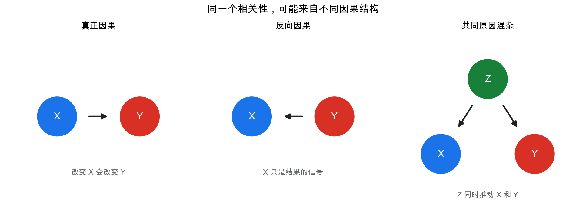
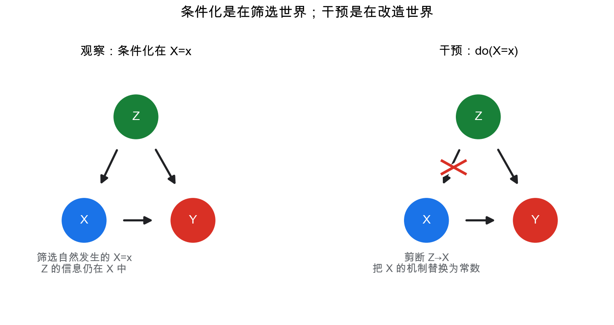
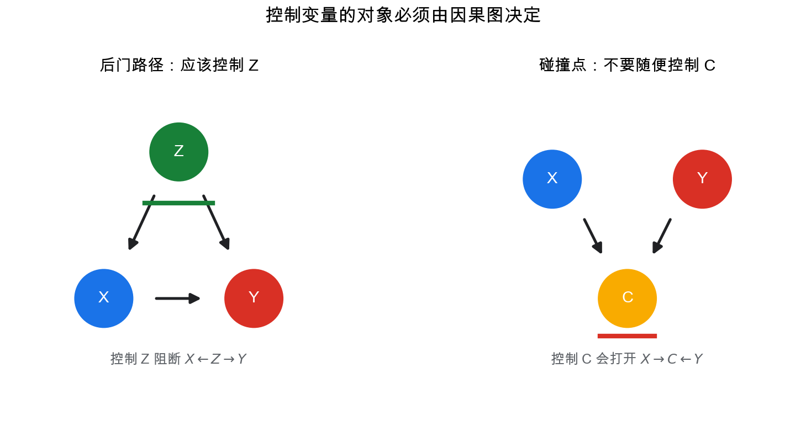
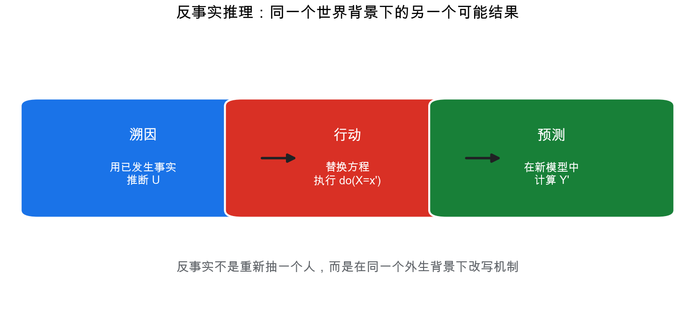
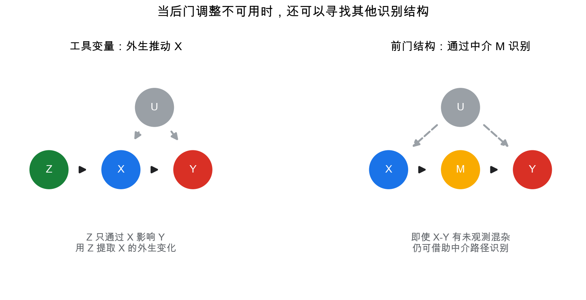

# 重学数学之十三: 因果推断——从相关性走向干预和反事实

## 一、相关性为什么不够？

统计、机器学习和贝叶斯图模型都很擅长描述一个问题：

> **变量之间怎样一起变化？**

但因果推断问的是更尖锐的问题：

> **如果我主动改变一个变量，另一个变量会怎样变化？**

这两个问题看起来相近，其实差别很大。

假设我们观察到：

$$
\Pr(Y=1\mid X=1)>\Pr(Y=1\mid X=0)
$$

这说明 $X$ 和 $Y$ 相关。但它不说明：

$$
X\to Y
$$

也许是 $X$ 导致了 $Y$；也许是 $Y$ 导致了 $X$；也许有第三个变量 $Z$ 同时影响二者。

最经典的例子是冰淇淋销量和溺水人数。二者正相关，但冰淇淋不会导致溺水。真正的共同原因是气温：天气热时，更多人买冰淇淋，也更多人去游泳。

所以因果推断的第一句核心话是：

> **观察分布 $p(y\mid x)$ 不等于干预分布 $p(y\mid \mathrm{do}(x))$。**

前者是在自然发生的样本里观察 $X=x$ 的人。  
后者是主动把 $X$ 设置为 $x$ 后，看 $Y$ 会发生什么。

这正是因果推断要补上的缺口：从“看见某件事发生”到“如果我让它发生”之间，还差一个数学结构。

一个实用判断是：如果改变 $X$ 的产生方式会改变问题答案，那它就是因果问题。预测一个人是否会买保险，可以只看相关性；评估“提高保费会不会让他退保”，就必须进入干预语言。

## 二、结构因果模型：给变量背后加上生成机制

概率图模型描述联合分布如何分解：

$$
p(x_1,\dots,x_n)=\prod_i p(x_i\mid \mathrm{pa}(x_i))
$$

但因果推断需要更强的东西：不仅要知道变量之间的概率关系，还要知道每个变量是怎样被它的原因生成的。

这正是**结构因果模型**，简称 SCM。

一个 SCM 包含三类对象：

1. 外生噪声变量 $U$。
2. 内生变量 $X_1,\dots,X_n$。
3. 结构方程：

$$
X_i=f_i(\mathrm{pa}(X_i),U_i)
$$

这里的 $f_i$ 不是普通回归函数，而是生成机制：

> **如果父变量和外生噪声这样取值，那么 $X_i$ 就由这个机制产生。**

普通回归关心的是“给定父变量时，怎样预测 $X_i$”。结构方程还多了一层意思：如果外部把某个父变量改掉，$X_i$ 会按照同一个机制重新生成。正因为有这层机制含义，我们才能讨论剪断箭头和替换方程。

例如：

$$
Z=f_Z(U_Z)
$$

$$
X=f_X(Z,U_X)
$$

$$
Y=f_Y(X,Z,U_Y)
$$

对应图结构：

$$
Z\to X,\quad Z\to Y,\quad X\to Y
$$

这里 $Z$ 是混杂变量。它同时影响处理 $X$ 和结果 $Y$。

SCM 的关键优点是：它允许我们谈论“修改机制”。

这正是普通联合分布做不到的事情。

## 三、干预：把一个机制剪断并替换

Pearl 的 do-算子写作：

$$
\mathrm{do}(X=x)
$$

它的意思不是观察到 $X=x$，而是主动把 $X$ 设为 $x$。

在结构因果模型里，干预的操作非常具体：

> **删除 $X$ 原来的结构方程，把它替换成常数 $X=x$。**

如果原来是：

$$
X=f_X(Z,U_X)
$$

干预后变成：

$$
X=x
$$

所有指向 $X$ 的因果箭头被剪断。

这就是为什么：

$$
p(Y\mid X=x)
\ne
p(Y\mid \mathrm{do}(X=x))
$$

在观察条件 $X=x$ 下，$X$ 仍然携带关于其原因 $Z$ 的信息。  
在干预条件 $\mathrm{do}(X=x)$ 下，$X$ 已经被外部设置，不再反映 $Z$ 的自然变化。

这就是二者最容易混淆的地方。观察到一个人接受治疗，往往还说明他可能更严重、更有钱、更愿意就医；强制随机给一个人治疗，则不会携带这些原本导致他“选择治疗”的信息。条件化保留了选择机制，干预删除了选择机制。

一句话：

> **条件化是在筛选世界；干预是在改造世界。**

这是因果推断和普通概率推断的分界线。

## 四、混杂：最常见的因果错觉

混杂出现于这样的结构：

$$
Z\to X,\quad Z\to Y
$$

如果我们想估计 $X$ 对 $Y$ 的因果效应，但 $Z$ 同时影响二者，那么观察到的 $X$ 和 $Y$ 关联会混入 $Z$ 的影响。

用公式说：

$$
p(Y\mid X=x)
$$

混合了两种东西：

1. $X$ 对 $Y$ 的因果作用。
2. $X$ 与 $Z$ 相关，而 $Z$ 又影响 $Y$ 带来的伪关联。

解决思路是控制混杂变量 $Z$。

如果 $Z$ 足以阻断所有从 $X$ 到 $Y$ 的非因果路径，那么有：

$$
p(Y\mid \mathrm{do}(X=x))
=
\sum_z p(Y\mid X=x,Z=z)p(Z=z)
$$

这叫**调整公式**。

它的直觉很清楚：

> **先在每个相同 $Z$ 的子群里比较 $X$ 的影响，再按总体中 $Z$ 的分布加权平均。**

注意最后加权用的是 $p(Z=z)$，不是 $p(Z=z\mid X=x)$。原因是干预以后，$X$ 不再由 $Z$ 自然生成；我们想比较的是“同一个总体”在被设为 $X=x$ 后的结果，而不是已经自然选择到 $X=x$ 的那群人。

这正是很多实验设计和观察性研究中的“控制变量”思想。

但因果图告诉我们一个更重要的事实：不是所有变量都该控制。控制错变量可能引入偏差。

## 五、后门准则：什么时候可以调整？

在因果图里，从 $X$ 到 $Y$ 的路径有两类。

第一类是因果路径，例如：

$$
X\to Y
$$

第二类是后门路径，也就是从箭头指向 $X$ 的边开始的路径，例如：

$$
X\leftarrow Z\to Y
$$

后门路径会制造混杂。

**后门准则**说：如果变量集合 $S$ 满足：

1. $S$ 不包含 $X$ 的后代。
2. $S$ 阻断所有从 $X$ 到 $Y$ 的后门路径。

那么可以用 $S$ 做调整：

$$
p(Y\mid \mathrm{do}(X=x))
=
\sum_s p(Y\mid X=x,S=s)p(S=s)
$$

第一条也很重要。$X$ 的后代可能已经包含了部分处理效果，控制它会把你想估计的因果作用截掉一块。比如研究教育 $X$ 对收入 $Y$ 的影响，如果控制了“毕业后的职业”这种中介变量，就不再是在估计教育的总效应，而是在估计绕过职业路径以外的剩余效应。

这里最容易犯的错误是控制碰撞点。

碰撞点结构是：

$$
X\to C\leftarrow Y
$$

在不控制 $C$ 时，$X$ 和 $Y$ 在这条路径上是独立的。  
但一旦条件化在 $C$ 上，路径反而被打开，产生虚假关联。

直觉例子：假设一个人能进入某个精英项目，可能因为学术强，也可能因为体育强。只看已经进入项目的人，学术能力和体育能力可能负相关：学术稍弱的人需要体育更强才能进来。这不是总体中的真实负相关，而是选择条件造成的碰撞点偏差。

因果推断的 aha moment 是：

> **控制变量不是越多越好，关键是控制对的变量。**

## 六、随机实验：最干净的因果识别

如果我们能随机分配处理 $X$，事情会简单很多。

随机化意味着：

$$
X\perp (Y(1),Y(0))
$$

处理组和对照组在期望上只差处理本身，不差潜在结果。

这条独立性是随机实验的核心。它说接受处理不是因为一个人本来更健康、更富有或更努力，而只是随机机制的结果。于是处理状态 $X$ 不再泄露潜在结果的信息，观察比较才可以解释为因果比较。

这时：

$$
\mathbb E[Y\mid X=1]-\mathbb E[Y\mid X=0]
$$

就是平均处理效应：

$$
\mathrm{ATE}
=
\mathbb E[Y(1)-Y(0)]
$$

这里 $Y(1)$ 表示如果接受处理时的结果，$Y(0)$ 表示如果不接受处理时的结果。

潜在结果语言和 do-算子语言在很多问题中是等价的：

$$
\mathbb E[Y(x)] = \mathbb E[Y\mid \mathrm{do}(X=x)]
$$

随机实验强大的原因是：它用设计切断了所有后门路径。处理不再由混杂变量决定，而是由随机机制决定。

但现实中随机实验常常有成本、伦理或可行性限制。不能随机让人吸烟，不能随机让城市发生灾害，也不能随意改变一个国家的制度。

所以观察性因果推断的核心任务就是：

> **在没有随机实验时，寻找足够可信的准实验结构或调整策略。**

## 七、反事实：另一个世界里的结果

因果推断最深的一层不是干预，而是反事实。

干预问：

> 如果我现在做 $X=x$，总体结果会怎样？

反事实问：

> 对这个已经发生了某种经历的个体，如果当时做了另一种选择，结果会怎样？

例如，一个病人服用了药并康复了。我们想问：

> 如果这个同一个病人没有服药，他还会康复吗？

这不是普通条件概率能回答的问题，因为我们永远只能观察到一个现实结果。

潜在结果框架把它写成：

$$
Y_i(1),\quad Y_i(0)
$$

但对同一个个体 $i$，我们最多只能观察其中一个。这叫**因果推断的根本问题**。

这也是为什么因果推断通常要依赖群体、模型或假设。我们不能同时看到同一个人的两个世界，只能用相似个体、随机分配、结构方程或历史证据去重建那个没发生的结果。

结构因果模型给反事实提供了三步计算：

1. **溯因**：用已观测事实推断外生噪声 $U$ 的后验。
2. **行动**：替换结构方程，执行干预。
3. **预测**：在修改后的模型里计算结果。

反事实之所以重要，是因为很多责任、解释和决策问题都不是总体平均问题，而是个体层面的“如果当时不同，会不会不同”。

## 八、do-calculus：什么时候能从观察数据识别干预效应

有些因果效应可以通过调整公式识别。  
有些不能通过简单调整识别，但仍然可以通过更复杂的图操作识别。  
有些则仅靠观察数据根本无法识别。

do-calculus 的作用是：

> **给出一套规则，把含 do 的表达式转化成只含观察分布的表达式，或者证明做不到。**

它有三条规则，细节比较技术。这里不展开形式证明，只抓核心意义：

1. 在某些图分离条件下，可以加入或删除观察条件。
2. 在某些图分离条件下，可以把干预换成观察。
3. 在某些图分离条件下，可以删除无关干预。

这些规则的本质是：在干预后的图里重新判断条件独立。

如果最后能把：

$$
p(Y\mid \mathrm{do}(X=x))
$$

化成只包含：

$$
p(\text{observed variables})
$$

的表达式，那么因果效应就是可识别的。

如果不能，说明仅凭当前观察数据和图结构不够，需要实验、额外假设或新变量。

所以 do-calculus 不是一个更花哨的代数游戏，而是一套“合法消去 do 符号”的审计规则。它关心的不是估计器方差多小，而是目标量在逻辑上能不能由观察分布推出。

这和第十二章概率图模型的关系非常直接：图模型提供条件独立语言；因果图模型则额外允许我们剪断箭头、替换机制，并在修改后的图上继续推理。

## 九、工具变量、前门准则与准实验

后门调整不是唯一识别方法。

有时混杂变量不可观测，但我们能找到一个工具变量 $Z$：

$$
Z\to X\to Y
$$

并且 $Z$ 只通过 $X$ 影响 $Y$，同时与未观测混杂独立。典型例子包括政策变化、距离、随机分配资格等。

工具变量的直觉是：

> **找一个外生推动 $X$ 变化的来源，用它隔离出 $X$ 的因果部分。**

一个合格工具变量通常要过三道关：

1. **相关性**：$Z$ 必须真的影响 $X$。
2. **排除限制**：$Z$ 不能绕过 $X$ 直接影响 $Y$。
3. **独立性**：$Z$ 不能和影响 $Y$ 的未观测因素纠缠在一起。

第一条可以从数据里检查一些证据，后两条更多依赖设计和领域知识。这也是工具变量强大但危险的原因：一旦排除限制不可信，估计出来的“因果效应”会很漂亮地错掉。

还有前门准则。它适用于 $X$ 对 $Y$ 的作用通过中介 $M$ 传递，虽然 $X$ 和 $Y$ 有未观测混杂，但 $X\to M$ 和 $M\to Y$ 的路径可以被识别。

前门的直觉是：直接看 $X$ 到 $Y$ 会被未观测混杂污染，那就改为追踪中介链条。先估计 $X$ 如何改变 $M$，再估计 $M$ 如何改变 $Y$，最后把两段拼起来。它要求中介路径足够完整，而且中介到结果的那段也能被适当调整。

现实研究中还常见很多准实验设计：

- 双重差分：比较政策前后、处理组和对照组的变化差异。
- 断点回归：利用阈值附近个体近似随机分配。
- 匹配：寻找协变量相近但处理不同的样本。
- 合成控制：用多个未处理单位构造反事实对照。

这些方法看似各不相同，本质都在做同一件事：

> **寻找一种可信机制，让处理变化中有一部分像随机实验。**

## 十、因果发现：能不能从数据中学出因果图？

如果因果图已知，推断已经很难。更难的问题是：因果图本身能否从数据中学习？

一般来说，仅靠观察数据不能唯一确定因果方向。

例如：

$$
X\to Y
$$

和：

$$
Y\to X
$$

在很多情况下可以产生同样的联合分布。

因此因果发现必须依赖额外假设，例如：

- 没有隐藏混杂。
- 因果 Markov 条件。
- faithfulness 假设。
- 非高斯噪声。
- 函数形式限制。
- 时间顺序。

因果 Markov 条件大致说：每个变量在给定其直接原因后，与非后代变量独立。faithfulness 假设则反过来要求：图中没有被结构暗示的独立性，不应该靠参数巧合刚好抵消出来。没有这些假设，很多不同因果图会对应同一个观察分布。

约束型方法利用条件独立测试，典型如 PC 算法。  
评分型方法搜索图结构，选择拟合好且复杂度低的图。  
函数型方法利用非线性、非高斯或噪声独立性来辨别方向。

因果发现的正确态度是谨慎的：

> **数据可以提供因果结构的线索，但很少能独自承担全部因果结论。**

领域知识、实验设计、机制理解和统计证据必须一起工作。

### 10.1 可识别性：先问能不能算，再问怎么算

因果推断里有一个容易被低估的步骤：可识别性。

我们想要的是：

$$
P(Y\mid do(X=x))
$$

但手里通常只有观察分布：

$$
P(X,Y,Z,\dots)
$$

可识别性问的是：干预分布能否仅由观察分布和因果图唯一推出？

如果不能识别，样本再多、模型再复杂，也只是更精确地估计了错误目标。这个判断先于估计方法。

后门、前门、工具变量、do-calculus，都是在回答同一个问题：哪些因果量能从现有数据和假设中被推出？这让因果推断比普通预测多了一层逻辑审计。

## 十一、应用场景

因果推断的应用都围绕一个核心：我们不只是想预测世界，而是想改变世界。

| 领域 | 因果推断扮演的角色 |
|------|------------------|
| 医学 | 估计治疗效果、药物安全性、个体化治疗和伦理上无法随机化的问题 |
| 公共政策 | 评估教育、税收、就业、福利和城市治理政策的实际作用 |
| 互联网实验 | A/B 测试、推荐系统干预、广告增量效果和长期用户行为 |
| 经济学 | 工具变量、双重差分、断点回归用于识别制度和政策影响 |
| 机器学习 | 因果表示学习、分布外泛化、反事实解释和鲁棒决策 |
| 科学发现 | 从观测和实验中推断机制，而不仅是拟合相关模式 |
| 法律与责任 | 判断某个行为是否造成损害，反事实推理是责任判断的核心 |

预测模型可以告诉你谁更可能生病；因果模型要回答的是：给谁治疗会真正改变结果。

这个差别决定了因果推断在决策问题中的位置。

## 十二、与前几章的连接

因果推断不是独立漂浮的理论，它连接了前面很多结构：

1. **概率论**：因果效应最终仍然以分布、期望和条件概率表达。
2. **贝叶斯图模型**：因果图继承图模型的条件独立语言，但增加干预和机制替换。
3. **统计学习理论**：观察性估计要面对泛化、偏差、方差和样本复杂度。
4. **信息论**：因果方向和机制独立性可以用信息流、压缩和不变性来理解。
5. **优化与凸分析**：匹配、加权、估计方程和因果表示学习常转化为优化问题。
6. **范畴论**：干预可以看成对系统结构的局部重写；概率核的组合描述机制如何连接。

最关键的连接是和第十二章的区别：

> **概率图模型描述世界如何联合分布；因果图模型描述世界如何在干预下改变。**

这解释了为什么因果推断必须在概率之外再加入机制语言。

## 十三、前沿展望

### 13.1 双重机器学习

Chernozhukov 等（2018）解决了"用高维 ML 估计低维因果参数"时的正则化偏差问题：将目标参数（如平均处理效应 ATE）的估计写成 Neyman 正交化矩方程，先用任意 ML 方法拟合干扰函数（倾向得分、条件均值），再用正交残差消除 ML 误差的一阶影响，得到 $\sqrt{n}$-一致的因果估计量。这使得高维协变量、非线性效应和随机对照设计可以统一处理，并与稳健估计（doubly robust）框架完全兼容。

### 13.2 因果表示学习

Schölkopf 等（2021）系统化了**独立因果机制原则**（ICM）：真实生成过程由模块化独立机制组成，分布偏移只改变少数机制（稀疏机制改变假设）。核心应用：

- **非线性 ICA 与辅助变量**（Hyvärinen 等 2016；Khemakhem 等 2020）：用时间/域标签打破不可识别性，还原潜在因果变量。
- **不变风险最小化**（IRM，Arjovsky 等 2019）：跨多个环境寻找预测不变特征，对应因果父节点。
- **因果生成建模**：在条件扩散模型中实现 do-calculus，生成反事实图像（"如果干预了某个变量，观测会如何变化"）。

### 13.3 时序因果发现与大语言模型

Granger 因果性、PCMCI（Runge 等 2019）和 DYNOTEARS 专为时间序列因果发现设计，处理自回归效应和非平稳性。大语言模型在因果推理任务中能陈述 do-calculus 步骤，但在存在混杂偏差的定量场景中仍有系统性错误（Zevcevic 等 2023）——将 SCM 与 LLM 结合（causally-aware reasoning）是当前热点。

### 13.4 自适应实验与政策学习

**多臂老虎机**结合因果推断（Thompson sampling、最优自适应分配，Hadad 等 2021）在实验进行中动态调整处理分配，同时控制 I 类错误。个体处理效应（ITE）估计与离线策略评估（Offline Policy Evaluation，OPE）将因果推断与强化学习打通，是工业界 A/B 测试升级的核心方向。

## 十四、总结

因果推断的核心结构可以这样串起来：

1. **相关不等于因果**：观察到 $X$ 和 $Y$ 共同变化，不说明改变 $X$ 会改变 $Y$。
2. **结构因果模型**：用结构方程描述变量背后的生成机制。
3. **干预**：$\mathrm{do}(X=x)$ 不是条件化，而是替换 $X$ 的生成机制。
4. **混杂**：共同原因会让观察关联偏离因果效应。
5. **后门准则**：控制足以阻断后门路径的变量集合，才能用观察数据识别干预效应。
6. **碰撞点偏差**：控制错误变量会打开本来关闭的路径。
7. **随机实验**：通过设计切断混杂，是识别因果效应的黄金标准。
8. **反事实**：询问同一个单位在另一个可能世界中的结果。
9. **do-calculus**：用图结构判断因果效应是否能由观察分布表达。
10. **准实验与工具变量**：在不能随机实验时寻找近似外生变化。

> **因果推断把“世界怎样被观察”提升为“世界怎样被改变”。**

它的力量不是比统计更神秘，而是清楚地区分了观察、干预和反事实这三层问题。只有做出这个区分，我们才能从预测走向决策。

---

*因果推断之后，我们进入动力系统与混沌——当规则确定时，长期行为为什么仍然可能复杂到难以预测？固定点、分岔和 Lyapunov 指数会帮我们回答这个问题。*
