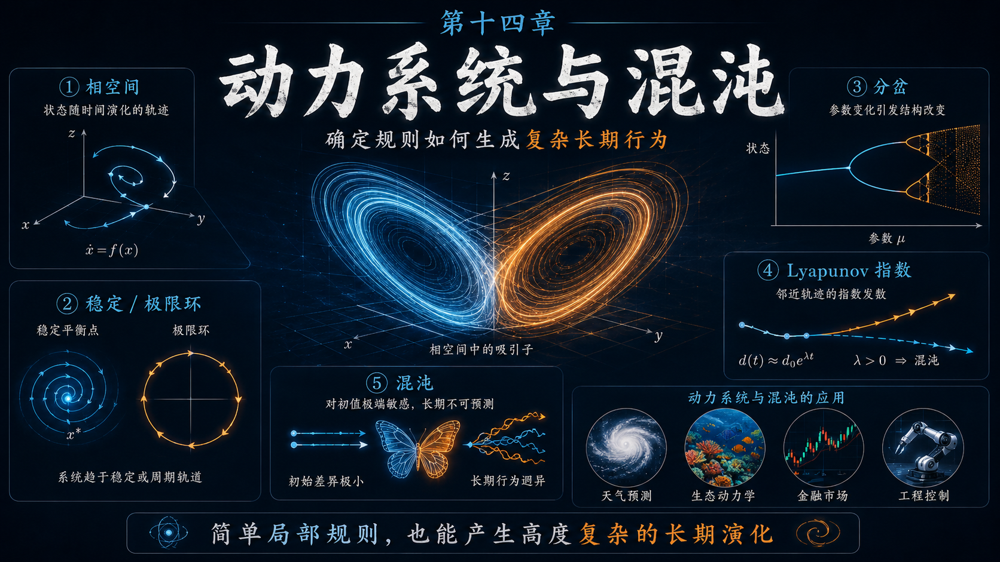
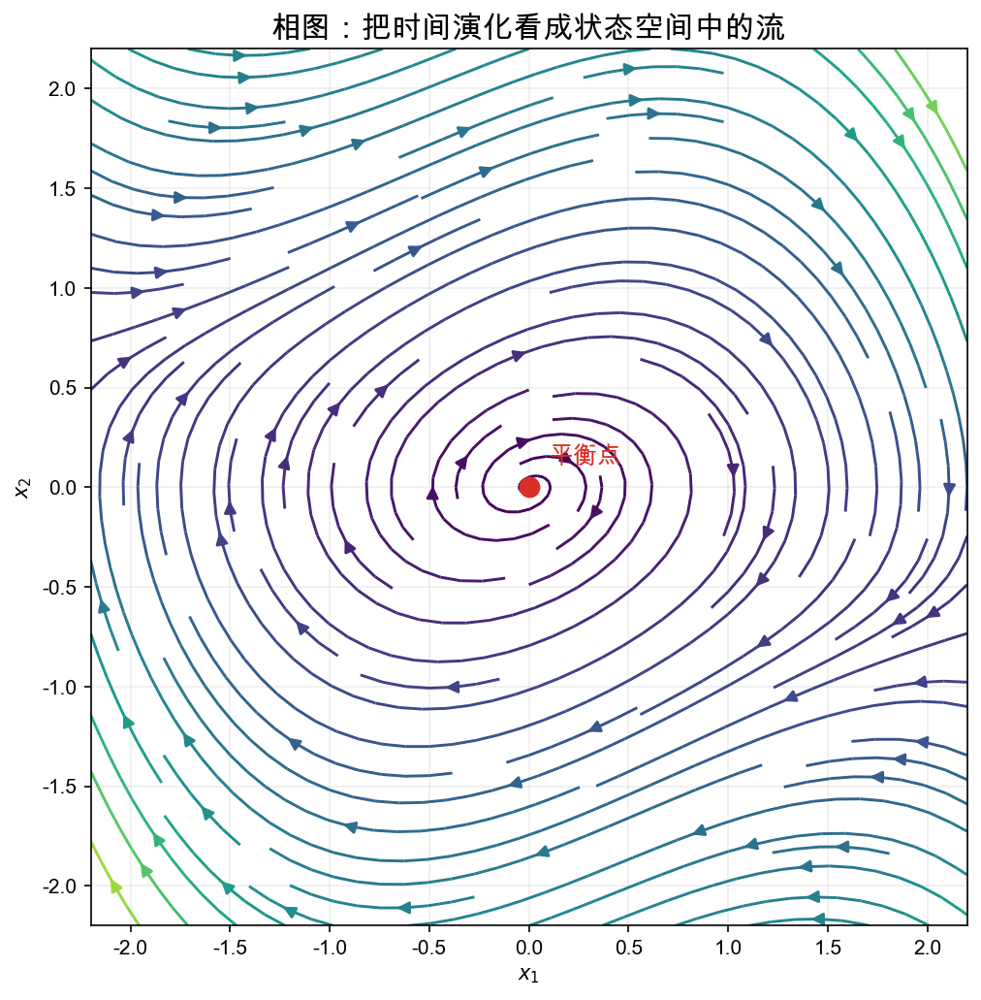
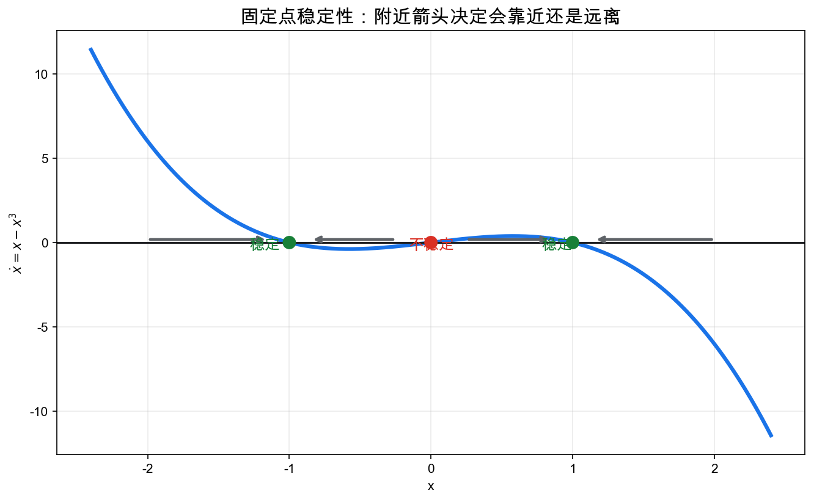
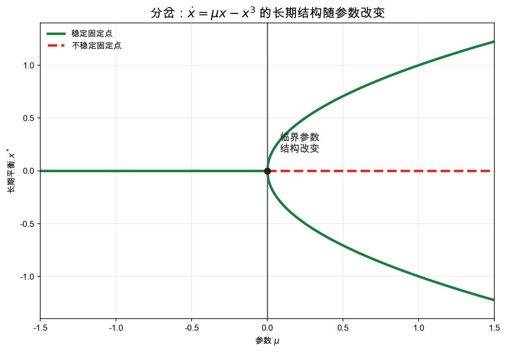
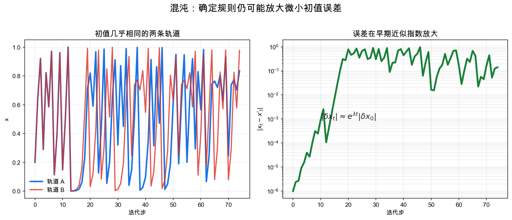
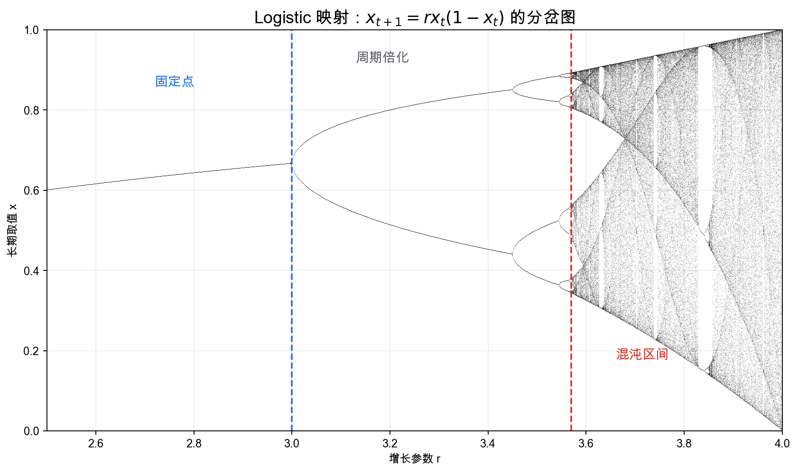
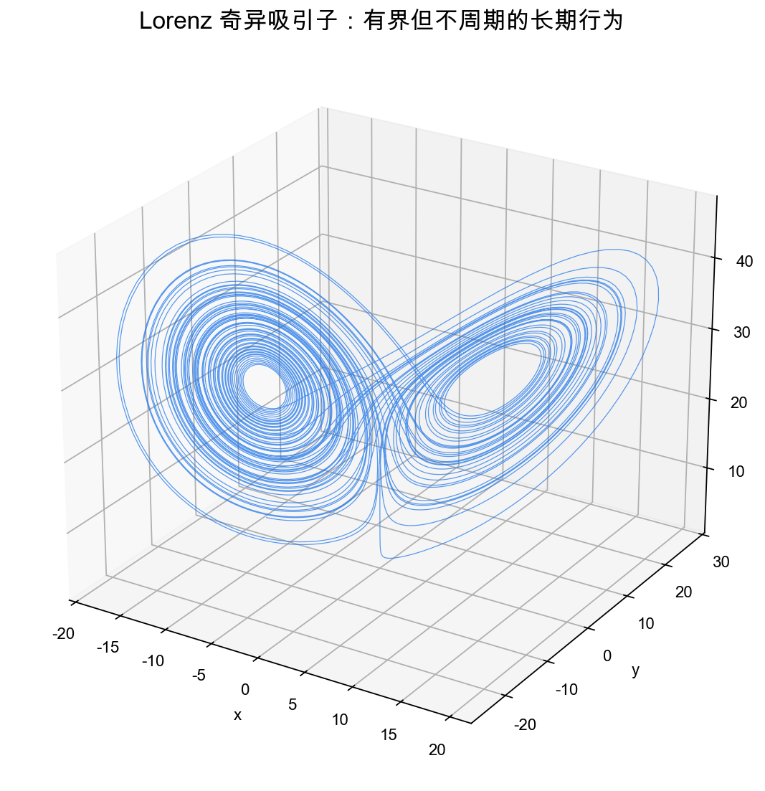

# 重学数学之十四: 动力系统与混沌——确定规则如何生成复杂长期行为

## 一、确定性不等于可预测

前面几章里，我们一直在处理不确定性。随机过程里有噪声，统计学习里有样本误差，贝叶斯方法里有先验和后验，因果推断里有观察不到的反事实。

现在故意把这些东西都拿掉。

假设规则完全确定，没有随机项，没有隐藏骰子。只要给定今天的状态，明天的状态就由一个公式唯一决定。听起来，预测应该很容易。

但动力系统最先打破的，正是这个直觉。

一个离散时间系统写成：

$$
x_{t+1}=F(x_t)
$$

一个连续时间系统写成：

$$
\frac{dx}{dt}=f(x)
$$

这里 $x$ 是系统状态。它可以是一维数，也可以是 $\mathbb R^n$ 中的向量；更一般地，它可以落在一个流形、一个概率单纯形、一个函数空间，甚至一个图上的状态空间里。

动力系统真正关心的不是下一步怎么算。下一步通常很容易，直接代公式就行。

真正难的是这个问题：

> **同一个规则反复作用很多次以后，所有可能的轨道会被组织成什么长期结构？**

会停下来吗？会振荡吗？会突然切换模式吗？会进入看似随机的混沌吗？

这张相图传达了动力系统的基本姿态：不要只盯着时间序列上的一个点，而要把所有可能状态放到状态空间里，看轨道怎样流动、缠绕、靠近、远离。

也就是说，动力系统把“时间中的问题”变成了“空间中的几何问题”。

## 二、状态空间：先把系统放在哪里说清楚

讨论动力系统，第一件事不是写方程，而是问：

> **状态到底是什么？**

一个摆，如果只记录角度 $\theta$，你不知道它下一刻往哪边走。还必须记录角速度 $\dot\theta$。所以摆的状态至少是：

$$
(\theta,\dot\theta)
$$

一个种群模型，状态可能是不同物种的数量：

$$
(x_{\text{prey}},x_{\text{predator}})
$$

一个机器学习优化过程，状态可能是全部参数：

$$
\theta\in\mathbb R^p
$$

状态空间选错了，后面的分析都会别扭。很多看起来“有记忆”的系统，只要把状态扩充，就可以重新变成 Markov 式的无记忆演化。

这里的“无记忆”不是说系统忘掉过去，而是说过去已经被压进当前状态里了。只记录摆的位置时，未来还依赖它刚才怎么动；把速度也放进状态后，当前的 $(\theta,\dot\theta)$ 就足够决定下一瞬间。选状态空间，本质上是在决定“什么信息才算当前”。

例如二阶方程：

$$
\ddot q = F(q,\dot q)
$$

可以改写为一阶系统：

$$
\dot q = v,\quad \dot v=F(q,v)
$$

所以动力系统里常说“状态包含预测未来所需的全部信息”。这句话很朴素，但很关键。

状态空间一旦确定，轨道就是状态随时间走出的路径：

$$
x(t)\in M
$$

或离散情形：

$$
x_0,x_1,x_2,\dots
$$

但我们不只看一条轨道。我们要看许多初始点一起怎样运动。固定点、周期轨道、稳定流形、吸引子和分岔，都是这种全局视角下长出来的对象。

## 三、固定点：系统不再变化的状态

最先要找的是固定点。

离散系统中，固定点满足：

$$
x^\star=F(x^\star)
$$

连续系统中，平衡点满足：

$$
f(x^\star)=0
$$

它们都是“如果系统到了这里，就不会再动”的状态。

例如一维连续系统：

$$
\dot x=f(x)
$$

如果 $f(x)>0$，状态向右走；如果 $f(x)<0$，状态向左走。固定点就是速度为零的位置。

但固定点本身还不够。一个球停在碗底和停在山顶，都是“速度为零”。差别在于，稍微推一下以后会怎样。

所以我们立刻要问：

> **附近的状态会靠近这个点，还是远离它？**

这就是稳定性。

稳定固定点像盆地底部，附近轨道会被拉回来。不稳定固定点像山顶，理论上能停住，但现实中任何微小扰动都会把它推走。还有一种鞍点，一些方向吸引，一些方向排斥，长期结构往往围绕它展开。

## 四、线性化：非线性系统的第一把手术刀

假设连续系统：

$$
\dot x=f(x)
$$

在固定点 $x^\star$ 附近做 Taylor 展开：

$$
f(x)\approx Df(x^\star)(x-x^\star)
$$

令：

$$
u=x-x^\star
$$

得到线性近似：

$$
\dot u=A u,\quad A=Df(x^\star)
$$

于是固定点附近的行为由矩阵 $A$ 的特征值控制。

如果所有特征值实部都小于 0，扰动会衰减，固定点稳定。  
如果存在特征值实部大于 0，扰动会增长，固定点不稳定。  
如果有正有负，通常得到鞍点。

复特征值也不神秘。虚部对应旋转，实部对应半径变大或变小。实部为负，就是一边旋转一边向固定点收进去；实部为正，就是一边旋转一边逃出去。所以稳定性看实部，而不是只看特征值是不是实数。

这一步很像第四章微分几何里的切空间思想。非线性系统整体可能很复杂，但在一个点附近，我们先贴一个线性系统上去。

当然，线性化不是万能的。如果特征值实部刚好等于 0，线性项无法决定稳定性，就要看更高阶项。很多分岔正是发生在这种“线性化失效”的临界位置。

这点值得记住。

> **线性化告诉我们大多数点附近发生什么；分岔告诉我们线性化刚刚失效时会发生什么。**

## 五、流、映射与 Poincare 截面

连续系统：

$$
\dot x=f(x)
$$

会生成一个流：

$$
\varphi_t(x_0)
$$

意思是从初始点 $x_0$ 出发，经过时间 $t$ 后到达哪里。

流有一个很自然的半群结构：

$$
\varphi_{t+s}=\varphi_t\circ\varphi_s
$$

先走 $s$，再走 $t$，等于一次走 $t+s$。

离散系统则直接是映射迭代：

$$
x_n=F^n(x_0)
$$

这两种看似不同，其实经常可以互相转化。一个连续系统如果有周期运动，我们可以取一个横截面，每次轨道穿过这个截面时记录一次位置。这样连续流就变成了离散映射，这叫 Poincare 映射。

这个技巧很有用，因为它把高维连续动力学降维成离散迭代。研究周期轨道是否稳定时，Poincare 映射常常比原微分方程更直接。

直觉上，这像是在河流中固定一块截面，不再盯着水流每时每刻的位置，而只记录它每次穿过截面时留下的痕迹。

当然，这个截面不能随便取。它要横切轨道，而不是贴着轨道走；否则你记录不到稳定的穿越点。Poincare 映射牺牲了连续时间里的细节，换来一个更容易分析的“每圈一次”的离散系统。

## 六、极限环：稳定的周期运动

不是所有系统都会趋向固定点。有些系统会进入稳定振荡。

心跳、神经元放电、化学振荡、捕食者和猎物数量波动，都不是“静止”才叫稳定。恰恰相反，它们的稳定性表现为一种可重复的节律。

连续系统中的孤立周期轨道叫极限环。

> **极限环是吸引附近轨道的闭合曲线。**

“孤立”两个字很重要。如果平面上有一整族闭合轨道，每条轨道附近都是另一条闭合轨道，那通常不是极限环。极限环强调的是一个特殊的周期轨道，附近轨道会向它靠拢或远离它，所以它能承担稳定节律的角色。

如果初始状态稍微偏离，系统不会远走，也不会停在某个点，而是逐渐回到同一个周期循环。

极限环比固定点更适合描述生命系统和工程振荡器。一个健康心脏不是停在平衡点上，而是在一个稳定节律附近反复运动。稳定不是“不动”，而是“偏离后能回到节律”。

典型例子是 Van der Pol 振子：

$$
\ddot x-\mu(1-x^2)\dot x+x=0
$$

写成一阶系统后，它在相平面里会产生一个稳定极限环。小振幅时系统补充能量，大振幅时系统耗散能量，最后被推到一个合适的周期轨道上。

这类模型解释了很多自激振荡现象：电子振荡器、神经放电、心脏节律，都有类似结构。

## 七、分岔：参数变化如何改变长期结构

动力系统通常依赖参数：

$$
\dot x=f(x;\mu)
$$

当参数 $\mu$ 平滑变化时，系统行为有时也平滑变化。但在某些临界值处，长期结构会突然改变：

- 固定点出现或消失。
- 稳定性翻转。
- 周期轨道产生。
- 系统从稳定进入混沌。

这叫分岔。

最简单的例子是：

$$
\dot x=\mu x-x^3
$$

固定点满足：

$$
x(\mu-x^2)=0
$$

所以：

$$
x=0,\quad x=\pm\sqrt{\mu}\quad(\mu>0)
$$

当 $\mu<0$ 时，只有一个稳定固定点 $x=0$。  
当 $\mu>0$ 时，$x=0$ 变成不稳定，而出现两个稳定固定点。

这类图的横轴是参数，纵轴是长期状态。看起来只是一张曲线图，其实它在告诉你系统的长期结构怎样随参数重组。

分岔的意义不只是数学分类。它解释了现实中的临界点：

- 生态系统从稳定湖泊突然变成藻类爆发。
- 神经系统从静息态进入癫痫样放电。
- 气候系统跨过冰盖或洋流临界点。
- 市场从正常波动切换到危机传播。

这些现象共同说明一件事：参数变化可以很慢，但系统响应可以很突然。

分岔点之所以危险，是因为原来的稳定性正在消失。远离临界值时，小扰动很快被拉回；接近临界值时，恢复力变弱，系统开始变得迟钝、摇晃、对噪声敏感。等越过临界点，原来的长期状态可能已经不存在。

## 八、几种典型分岔：不要只记名字，要看机制

分岔类型很多，先抓住几种最常见的。

**鞍结分岔**中，一个稳定固定点和一个不稳定固定点相遇后一起消失。它常对应“临界阈值”：还没到阈值时系统能维持原状态，一旦越过阈值，原状态直接没了。

**叉形分岔**中，一个对称状态失稳，分裂出两个新的稳定状态。上一节的：

$$
\dot x=\mu x-x^3
$$

就是超临界叉形分岔的标准模型。

**Hopf 分岔**中，固定点失稳后产生周期轨道。这是从静止到振荡的典型机制，在神经科学、流体、化学反应中非常常见。

**倍周期分岔**中，一个周期轨道变成周期 2，再变成周期 4、8、16，最后可能进入混沌。Logistic 映射就是最经典的例子。

我不建议一开始就背分岔分类表。更好的方式是问：

> **原来的长期对象还在吗？稳定性怎么变？新的长期对象从哪里冒出来？**

这三个问题比名字更重要。

## 九、混沌：对初值极端敏感的确定系统

混沌最容易被误解成随机。

但混沌系统可以完全确定，没有任何随机项。它的关键特征是：

> **初值相差极小的两条轨道，会随时间指数级分离。**

也就是说：

$$
|\delta x(t)|\approx |\delta x(0)|e^{\lambda t}
$$

如果 $\lambda>0$，误差会指数增长。这个 $\lambda$ 就是 Lyapunov 指数。

更准确地说，Lyapunov 指数衡量的是长期平均的误差增长率。实际轨道上，误差不一定每一刻都增长；它可能有时收缩、有时拉伸。只要长期平均为正，有限精度的初值误差就会被系统持续放大。

这解释了为什么天气预报有天然时限。大气方程可以是确定的，但初始状态永远测不准。只要系统有正 Lyapunov 指数，微小测量误差迟早会被放大到宏观尺度。

一句话：

> **混沌不是没有规律，而是规律会放大你不知道的那一点。**

这里有一个容易忽略的细节。混沌不是说什么都不能预测。短期轨道可以预测，长期统计规律也可能稳定。真正坏掉的是长期逐点预测。

这和概率论很像，又不完全一样。概率论承认随机性；混沌说，哪怕没有随机性，只要你无法给出无限精度的初值，长期轨道也会失去可预测性。

## 十、Logistic 映射：一维规则里的混沌

一个著名离散系统是 Logistic 映射：

$$
x_{t+1}=r x_t(1-x_t),\quad x_t\in[0,1]
$$

它最初来自种群增长模型：

- $r$ 控制增长率。
- $x_t$ 是归一化种群规模。
- $1-x_t$ 表示资源限制。

这个公式看起来简单到几乎无害。但随着 $r$ 增大，长期行为会发生一系列变化：

1. 收敛到一个固定点。
2. 进入周期 2 振荡。
3. 周期不断倍化，4、8、16。
4. 最后进入混沌区间。

这张图是动力系统最重要的图像之一。它告诉我们：

> **复杂性不一定来自复杂规则，简单非线性迭代就足够产生复杂长期行为。**

Logistic 映射还揭示了一个更奇妙的事实：倍周期分岔之间的参数间距按固定比例收缩，这个比例趋向 Feigenbaum 常数：

$$
\delta\approx 4.669
$$

这个常数不只出现在 Logistic 映射里。很多具有类似“折叠”结构的一维映射都会出现同样的比例。

这叫普适性。

它说明混沌不是一堆杂乱例子，而是有自己的结构。

## 十一、吸引子：长期行为的几何形状

当系统长期演化后，轨道可能不填满整个状态空间，而是集中到某个集合上。

这个集合叫吸引子。

吸引子可以是：

- 一个稳定固定点。
- 一个稳定周期轨道。
- 一个环面上的准周期运动。
- 一个奇异吸引子。

Lorenz 系统是最著名的混沌例子之一：

$$
\dot x=\sigma(y-x)
$$

$$
\dot y=x(\rho-z)-y
$$

$$
\dot z=xy-\beta z
$$

它来自简化的大气对流模型。某些参数下，轨道既不收敛到固定点，也不闭合成周期轨道，而是在一个蝴蝶形区域中永远绕来绕去。

奇异吸引子很特别：

> **轨道被限制在有结构的集合上，但在这个集合内部又表现出混沌。**

它既有秩序，也有不可预测性。

这也是动力系统最迷人的地方。长期行为不是简单落在一个数上，而是落在一个几何集合上。这个集合可能有分形结构，有稳定方向和不稳定方向，有局部拉伸和全局折叠。

## 十二、稳定流形、不稳定流形与盆地

吸引子不是孤立工作的。它周围还有几何结构。

给定一个吸引子 $A$，所有最终会趋向它的初始点组成吸引盆：

$$
B(A)=\{x:\operatorname{dist}(\varphi_t(x),A)\to0\}
$$

吸引盆告诉我们：从哪里出发会落到哪个长期状态。

如果系统有多个吸引子，吸引盆之间的边界就很重要。边界附近的微小扰动可能把轨道送到完全不同的长期命运。

这就是为什么只知道“有哪些吸引子”还不够。工程上常常更关心吸引盆有多大、边界有多复杂。一个吸引子本身很稳定，但吸引盆很窄，系统稍微被推远一点就掉进另一个盆地，这样的稳定性在实际中并不可靠。

鞍点附近还有稳定流形和不稳定流形：

- 稳定流形由最终趋向鞍点的方向组成。
- 不稳定流形由从鞍点被推出去的方向组成。

它们像状态空间里的道路和分水岭。很多复杂动力学正是由这些流形相交、缠绕、折叠产生的。

这也解释了为什么拓扑会进入动力系统。我们关心的不只是某条轨道，而是整片状态空间怎样被吸引盆和流形切分。

## 十三、守恒、耗散与可逆性

动力系统还可以按能量或体积行为分类。

**守恒系统**中，某些量保持不变。例如理想摆、行星运动、Hamilton 系统。相空间体积通常被保持，轨道不会简单收缩到吸引子上。

**耗散系统**中，能量或相空间体积会被压缩。例如带摩擦的摆、实际流体、许多生态和神经系统。吸引子常出现在耗散系统里，因为轨道被压到低维长期结构上。

这个区别会影响我们期待看到什么。守恒系统更像永远在能量面上滑行，长期行为可能是周期、准周期或复杂遍历；耗散系统则像不断丢掉自由度，很多初始状态最后被挤到同一个低维集合上。

一个简单对照：

| 类型 | 典型方程 | 长期行为 |
|------|----------|----------|
| 守恒系统 | Hamilton 方程 | 在能量面上运动，体积保持 |
| 梯度系统 | $\dot x=-\nabla V(x)$ | 沿势能下降，趋向临界点 |
| 耗散系统 | 带阻尼振子、Navier-Stokes | 体积压缩，可能出现吸引子 |
| 随机动力系统 | SDE | 轨道受噪声扰动，研究分布演化 |

在机器学习中，也能看到类似结构。梯度下降是耗散动力系统，轨道会流向损失函数的低谷；Hamiltonian Monte Carlo 则利用近似守恒动力学在概率空间中高效探索；扩散模型则把随机动力系统和概率流结合起来。

所以动力系统不是物理课里的一个分支，而是一种通用语言。

## 十四、离散、连续、随机、无限维

到这里，我们已经看到几类系统：

1. 离散时间映射：

$$
x_{t+1}=F(x_t)
$$

2. 连续时间微分方程：

$$
\dot x=f(x)
$$

3. 随机动力系统：

$$
dX_t=b(X_t)dt+\sigma(X_t)dW_t
$$

4. 无限维动力系统：

$$
\partial_t u=\mathcal F(u)
$$

最后一类来自 PDE。热方程、波方程、Navier-Stokes 方程、反应扩散方程，都可以看成函数空间中的动力系统。

例如热方程：

$$
\partial_t u=\Delta u
$$

状态不是有限维向量，而是一整个函数 $u(x,t)$。时间推进时，这个函数在函数空间里移动。

这就是泛函分析为什么会进入动力系统。有限维里，轨道是一条曲线；无限维里，轨道仍然是一条曲线，只不过它生活在函数空间中。

这个观点在第十六章 PDE 和第十七章数值分析里会继续出现。

### 14.1 Lyapunov 函数：不解方程也能判断稳定

很多非线性系统根本解不出显式轨道。稳定性分析不能只靠求解。

Lyapunov 函数提供了另一条路。找一个类似能量的函数 $V(x)$，满足：

$$
V(x)\ge0,
$$

并且沿系统轨道下降：

$$
\frac{d}{dt}V(x(t))\le0
$$

那么系统就不会往能量更高的区域跑。如果下降严格，还能推出渐近稳定。

这和优化里的下降函数很像。我们不必知道每一步轨道精确在哪里，只要知道某个全局量持续下降，就能控制长期行为。

难点在于，Lyapunov 函数通常不是自动送上门的。找到合适的 $V$ 本身就是建模和数学技巧。物理系统里它可能来自能量；控制系统里它可能要专门设计；神经网络或非线性系统里，寻找 Lyapunov 函数甚至可以变成一个优化问题。

在控制理论、机械系统、神经网络稳定性分析里，Lyapunov 方法都是核心工具。

## 十五、应用场景

动力系统的应用非常广，因为“状态随时间演化”几乎无处不在。

| 领域 | 动力系统扮演的角色 |
|------|------------------|
| 物理 | 经典力学、天体运动、流体、等离子体和非线性波 |
| 生物 | 心跳节律、神经放电、基因调控网络、生态系统稳定性 |
| 工程控制 | 稳定性分析、反馈控制、机器人运动、飞行器姿态 |
| 气候与天气 | 大气动力学、混沌、临界跃迁和可预测性边界 |
| 经济金融 | 市场周期、非线性反馈、危机传播和多均衡状态 |
| 机器学习 | 梯度流、神经 ODE、扩散模型、训练动力学和优化轨迹 |
| 社会系统 | 舆论演化、传播模型、网络动力学和群体行为 |

它的实际价值不只是预测未来。

更实际的问题常常是这些：

- 哪些状态稳定？
- 哪些参数危险？
- 哪些扰动会被放大？
- 哪些反馈能改变长期行为？
- 哪些系统有临界跃迁的早期信号？

动力系统给我们一种比“预测一个数字”更稳的目标：理解长期结构。

## 十六、与前几章的连接

动力系统把前面很多数学线索收束到一起：

1. **微积分与线性代数**：微分方程、Jacobian、特征值控制局部行为。
2. **泛函分析**：无限维动力系统描述 PDE、流体和演化方程。
3. **微分几何**：状态空间可以是流形；向量场定义流，流沿着流形移动。
4. **拓扑**：吸引子、周期轨道、稳定流形和分岔都带有拓扑结构。
5. **随机分析**：加入噪声后得到随机动力系统和随机微分方程。
6. **优化**：梯度下降、自然梯度和连续时间梯度流都是动力系统。
7. **信息论**：Lyapunov 指数和熵刻画系统生成新可见信息的速度。
8. **因果推断**：动力系统给出机制随时间传播的结构，干预可以看成修改演化方程。

特别值得抓住的是：

> **动力系统把“规则”与“长期结构”分开。**

规则可能很简单，但长期结构可以非常复杂。数学的任务是找到连接二者的桥梁。

## 十七、前沿展望

### 17.1 Koopman 算子理论与数据驱动动力系统

Koopman（1931）引入的算子视角在近年重获关注。非线性动力系统可以被提升为无穷维线性系统，Koopman 算子 $\mathcal K$ 作用在可观测函数上：

$$
(\mathcal K g)(x)=g(F(x))
$$

核心优势是：即使 $F$ 非线性，$\mathcal K$ 仍然是线性算子，可以用谱方法分析。

DMD 和 EDMD 从数据直接估计 Koopman 算子的有限维近似，已用于流体力学、神经科学、金融市场和工业过程的数据驱动预测与控制。

这条路线很像第三章泛函分析的回声：把非线性状态演化搬到函数空间里，用线性算子的谱看它。

### 17.2 神经 ODE 与物理信息网络

神经 ODE 将残差网络连续化，把深度网络看成时间连续的动力系统：

$$
\dot h(t)=f_\theta(h(t),t)
$$

这让“层数”变成“时间”，也让训练过程和微分方程求解器连在一起。

Universal Differential Equations 则把已知物理方程和神经网络结合起来。已知的部分用方程写，未知的机制用网络补。这比纯黑箱模型更像科学建模，也更适合数据不多但物理结构明确的问题。

PINNs 把 ODE/PDE 残差写进损失函数，在无需传统网格的情况下求解连续动力系统。它们还不总是比数值方法更稳，但已经给科学计算提供了一条新路线。

### 17.3 混沌、可预测性与气候科学

Lorenz 在 1963 年发现大气对流的混沌吸引子后，天气预报的可预测性时限就成了核心问题。

现代集合预报用许多初始扰动同时演化，观察它们怎样分散，从而给出概率预测。Lyapunov 指数和奇异向量则帮助我们识别误差增长最快的方向。

深度学习天气预报模型，如 GraphCast、Pangu-Weather 和 FourCastNet，在中期天气预报上已经表现很强。但它们也带来新问题：模型是否真正学到了动力机制？极端事件外推是否可靠？长期气候统计是否保持物理一致？

这不是简单的“神经网络替代物理模型”。更准确地说，是数据驱动模型和非线性动力系统之间的一场磨合。

### 17.4 同步与涌现

Kuramoto 模型是研究大规模耦合振子同步的标准系统：

$$
\dot\theta_i=\omega_i+\frac K N\sum_j\sin(\theta_j-\theta_i)
$$

当耦合强度 $K$ 足够大，原本频率不同的振子会自发同步。

这个模型很简单，却抓住了很多现象的共同骨架：萤火虫同步闪烁、电网频率同步、神经振荡、群体节律。

Ott 和 Antonsen 发现，在某些频率分布下，大规模 Kuramoto 系统可以精确降到低维宏观方程。这件事很漂亮，因为它说明“涌现”不一定只能靠仿真观察，有时可以被严格约化和计算。

### 17.5 临界跃迁与早期预警

很多系统在崩溃前并不会线性地变坏，而是先在一个稳定态附近晃动，接着突然跳到另一个状态。

这叫临界跃迁。

在生态、气候、金融、脑科学中，人们都在寻找早期预警信号。常见指标包括：

- 恢复速度变慢。
- 方差增大。
- 自相关增强。
- 小扰动后的回归时间变长。

这些信号背后的动力学机制叫临界减速。系统接近分岔点时，稳定性变弱，扰动不容易被拉回去。

这让动力系统有了很现实的一面：它不只是解释已经发生的崩溃，还试图在崩溃前发现系统正在接近危险边界。

## 十八、总结

动力系统的核心结构可以这样串起来：

1. **状态空间**：系统所有可能状态组成的空间。
2. **演化规则**：离散迭代 $x_{t+1}=F(x_t)$ 或连续方程 $\dot x=f(x)$。
3. **轨道**：状态随时间在相空间中走出的路径。
4. **固定点与稳定性**：长期静止状态及其对扰动的反应。
5. **线性化**：用 Jacobian 和特征值分析非线性系统的局部行为。
6. **极限环**：稳定的周期行为。
7. **分岔**：参数变化导致长期结构突然改变。
8. **混沌**：确定系统对初值极端敏感，长期逐点预测受限。
9. **Lyapunov 指数**：初始误差指数放大的速率。
10. **吸引子与吸引盆**：系统长期行为集中的几何结构。
11. **守恒与耗散**：决定轨道是否保持体积，还是收缩到低维集合。
12. **无限维动力系统**：PDE 可看成函数空间中的演化。

> **动力系统研究的是规则如何组织时间。**

理解一个系统，不只是知道下一步怎样算，而是要知道所有可能轨道在长期如何被固定点、周期轨道、吸引子、流形和分岔结构组织起来。

---

*从动力系统到测度论是很自然的一步——一旦开始关心长期平均和概率分布，就绕不开一个问题：集合的大小到底怎么算、对函数求平均到底是什么意思。下一章就把这两个基础问题彻底说清楚。*
