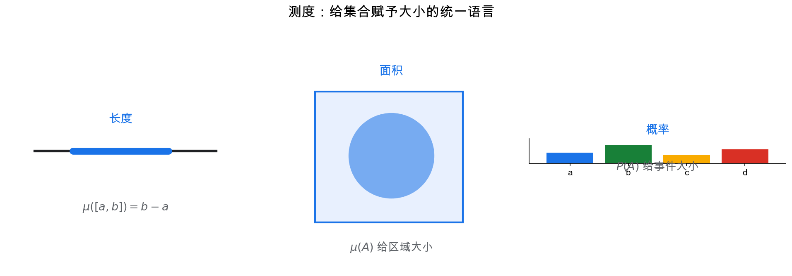
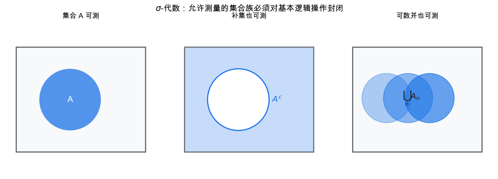
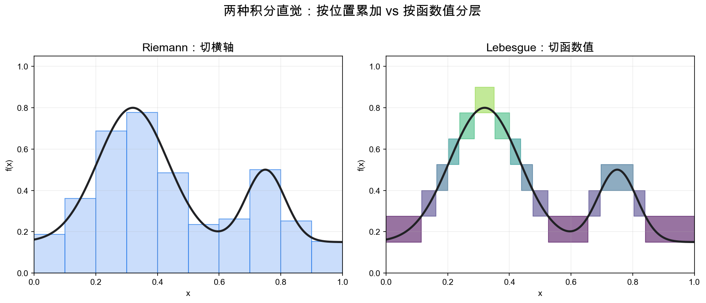
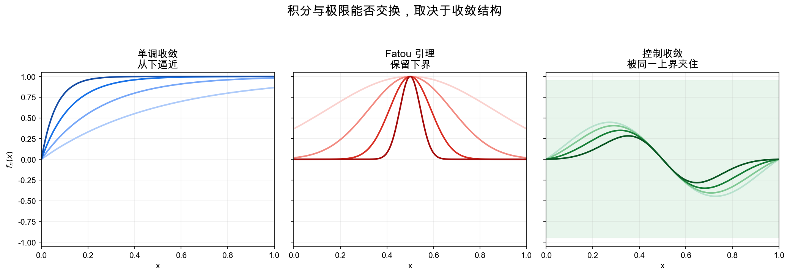
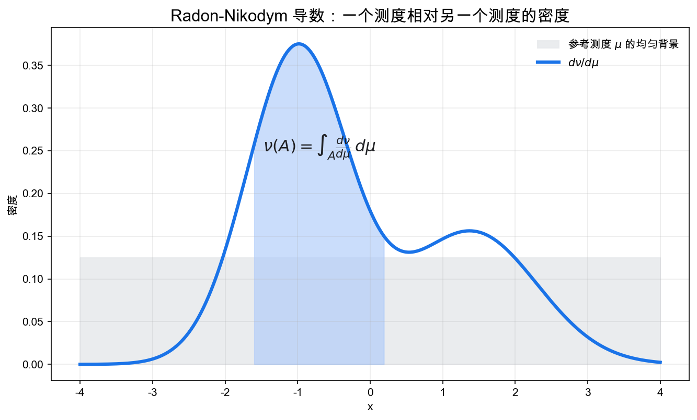

# 重学数学之十五: 测度论与积分——把长度、面积和概率放进同一个语言
![[Pasted image 20260628225246.png]]
## 一、为什么还要重新发明积分？

你已经学过 Riemann 积分。对连续函数来说，它非常自然：

$$
\int_a^b f(x)\,dx
$$

就是把区间切成很多小段，用矩形面积近似曲线下方面积。

但现代数学很快会遇到 Riemann 积分的边界：

- 概率论里，我们要对随机变量取期望。
- 泛函分析里，我们要研究 $L^p$ 空间。
- 随机过程里，路径可能极其不规则。
- PDE 里，解可能不是传统可导函数。
- 统计学习里，风险是对未知分布的积分。

这些问题里，真正重要的不是“把横轴切成小段”，而是：

> **我们能否给集合赋予大小，并对函数按这种大小做加权平均？**

长度、面积、体积、概率，表面上是不同概念，但它们都有同一个结构：

$$
\mu(A)
$$

给每个合适的集合 $A$ 一个非负大小。

测度论的关键想法是：

> **积分不是先从函数开始，而是先从集合的大小开始。**

如果 $\mu$ 是长度测度，积分就是普通面积。  
如果 $\mu$ 是概率测度，积分就是期望：

$$
\mathbb E[X]=\int X\,d\mathbb P
$$

如果 $\mu$ 是计数测度，积分就是求和：

$$
\int f\,d\mu=\sum_x f(x)
$$

所以测度论不是为了抽象而抽象，而是在回答：

> **如何用同一种语言处理连续、离散、概率和极限？**

## 二、可测集合：不是所有集合都值得测量

如果要给集合赋大小，最自然的想法是：所有集合都给一个大小。

但这会出问题。实数轴上存在非常病态的集合，无法在保持平移不变性和可数可加性的同时给出合理长度。

所以测度论做了一个看似保守、实则必要的选择：

> **不要求所有集合都可测，只要求一个足够好的集合族可测。**

这个集合族叫 $\sigma$-代数，记作 $\mathcal F$。

它满足：

1. 全空间 $\Omega\in\mathcal F$。
2. 如果 $A\in\mathcal F$，那么补集 $A^c\in\mathcal F$。
3. 如果 $A_1,A_2,\dots\in\mathcal F$，那么可数并 $\bigcup_n A_n\in\mathcal F$。

由这些条件也能推出可数交封闭。

这些要求不是形式主义。它们对应我们对“事件”或“可测集合”的基本操作：

- 已知一个事件，就应该能谈它不发生。
- 已知一列事件，就应该能谈至少一个发生。
- 已知一列条件，就应该能谈它们同时成立。

概率论中，$\mathcal F$ 就是事件空间。  
测度论中，$\mathcal F$ 就是允许测量大小的集合族。

所以一个测度空间是三元组：

$$
(\Omega,\mathcal F,\mu)
$$

这里：

- $\Omega$ 是底层空间。
- $\mathcal F$ 是可测集合族。
- $\mu$ 是给可测集合赋大小的函数。

## 三、测度：大小必须可数可加

测度是函数：

$$
\mu:\mathcal F\to[0,\infty]
$$

它满足：

1. $\mu(\emptyset)=0$。
2. 如果 $A_1,A_2,\dots$ 两两不交，那么：

$$
\mu\left(\bigcup_{n=1}^\infty A_n\right)
=
\sum_{n=1}^\infty \mu(A_n)
$$

这叫**可数可加性**。

为什么不是只要求有限可加？

因为现代分析和概率都离不开极限。你经常要把一个集合看成越来越多小集合的并，或者让事件序列趋向某个极限事件。

可数可加性保证：

> **测度能和极限操作稳定配合。**

例如，如果：

$$
A_1\subset A_2\subset \cdots
$$

那么：

$$
\mu\left(\bigcup_n A_n\right)=\lim_{n\to\infty}\mu(A_n)
$$

这叫从下连续性。

测度论的很多力量都来自这种对极限友好的设计。

## 四、可测函数：能被事件观察到的函数

有了可测集合，就可以定义可测函数。

函数：

$$
f:\Omega\to\mathbb R
$$

是可测的，如果对任意阈值 $a$：

$$
\{\omega:f(\omega)>a\}\in\mathcal F
$$

这句话的概率解释非常清楚：

> **如果 $f$ 是随机变量，那么“$f$ 大于 $a$”必须是一个事件。**

可测函数不是任意函数，而是能被当前信息结构 $\mathcal F$ 分辨的函数。

这和概率论里的随机变量完全一致：

$$
X:(\Omega,\mathcal F)\to(\mathbb R,\mathcal B(\mathbb R))
$$

随机变量不是“随机的变量”，而是从样本空间到实数的可测映射。

这个定义让概率分布变成推前测度：

$$
\mathbb P_X(B)=\mathbb P(X^{-1}(B))
$$

随机变量把原始概率空间上的测度推到实数轴上，形成我们熟悉的分布。

## 五、Lebesgue 积分：按函数值分层，而不是按横轴切片

Riemann 积分的图像是把横轴切成小区间。

Lebesgue 积分的图像更像是把函数值切成层：

> **先看函数在哪些地方取某个范围的值，再用这些集合的测度加权。**

对简单函数：

$$
s=\sum_{i=1}^n a_i\mathbf 1_{A_i}
$$

定义积分：

$$
\int s\,d\mu=\sum_{i=1}^n a_i\mu(A_i)
$$

一般非负可测函数 $f$ 的积分定义为：

$$
\int f\,d\mu
=
\sup\left\{\int s\,d\mu:0\le s\le f,\ s\text{ 是简单函数}\right\}
$$

这个定义看似抽象，但它非常自然：

1. 先会积分最简单的阶梯函数。
2. 用越来越精细的简单函数从下逼近复杂函数。
3. 用上确界定义最终积分。

这样做的好处是：Lebesgue 积分对极限非常友好。

这正是现代概率和分析需要的性质。

## 六、三个收敛定理：积分为什么能穿过极限

测度论真正强大的地方，不是它能积分更多怪函数，而是它告诉我们什么时候可以交换极限和积分：

$$
\lim_{n\to\infty}\int f_n\,d\mu
=
\int \lim_{n\to\infty} f_n\,d\mu
$$

这件事在 Riemann 积分里很麻烦，在 Lebesgue 理论中有清晰定理。

### 6.1 单调收敛定理

如果：

$$
0\le f_1\le f_2\le\cdots
$$

且 $f_n\to f$，那么：

$$
\int f_n\,d\mu\to \int f\,d\mu
$$

直觉是：如果函数从下往上稳定逼近，面积也从下往上逼近。

### 6.2 Fatou 引理

对非负函数列：

$$
\int \liminf f_n\,d\mu
\le
\liminf \int f_n\,d\mu
$$

它是一个保险丝：即使没有良好收敛，积分的下极限仍然有基本控制。

### 6.3 控制收敛定理

如果 $f_n\to f$，且存在可积函数 $g$ 使：

$$
|f_n|\le g
$$

那么：

$$
\int f_n\,d\mu\to\int f\,d\mu
$$

控制收敛定理在概率论中几乎无处不在。它告诉我们：如果随机变量逐点收敛，并且被一个可积上界控制，那么期望也收敛。

这就是测度论支撑现代概率极限定理的原因。

## 七、$L^p$ 空间：函数按积分范数组成空间

有了积分，就可以定义函数的大小：

$$
\|f\|_p=\left(\int |f|^p\,d\mu\right)^{1/p}
$$

满足 $\|f\|_p<\infty$ 的函数组成 $L^p$ 空间。

但要注意：$L^p$ 空间里的元素不是单个函数，而是“几乎处处相等”的函数等价类。

如果两个函数只在测度为零的集合上不同，积分看不见它们的区别。于是我们把它们视为同一个元素。

这和概率论很自然：随机变量如果只在概率为 0 的事件上不同，那么它们在期望、方差和几乎所有概率计算中没有区别。

最重要的特例是 $L^2$：

$$
\langle f,g\rangle=\int f g\,d\mu
$$

它是 Hilbert 空间。

这把第三章泛函分析和本章接起来：

> **测度论给函数空间提供积分，积分给函数空间提供范数和内积。**

## 八、乘积测度与 Fubini：多重积分为什么可以换顺序

如果有两个测度空间：

$$
(X,\mathcal A,\mu),\quad (Y,\mathcal B,\nu)
$$

我们希望在乘积空间 $X\times Y$ 上定义测度：

$$
\mu\times\nu
$$

使得矩形集合满足：

$$
(\mu\times\nu)(A\times B)=\mu(A)\nu(B)
$$

这就是乘积测度。

有了它，才能严肃地谈多重积分：

$$
\int_{X\times Y} f(x,y)\,d(\mu\times\nu)
$$

Fubini 定理说，在合适可积条件下：

$$
\int_{X\times Y} f(x,y)\,d(\mu\times\nu)
=
\int_X\left(\int_Y f(x,y)\,d\nu(y)\right)d\mu(x)
$$

也可以反过来先对 $x$ 积分。

这支撑了概率论里的联合分布、边缘分布、条件分布，也支撑了统计学习里的经验风险和总体风险。

## 九、Radon-Nikodym 定理：密度到底是什么

我们常说概率密度：

$$
p(x)
$$

并写：

$$
\mathbb P(A)=\int_A p(x)\,dx
$$

但“密度”到底是什么？

Radon-Nikodym 定理给出答案。

如果测度 $\nu$ 相对于测度 $\mu$ 绝对连续，记作：

$$
\nu\ll\mu
$$

意思是：

$$
\mu(A)=0\Rightarrow \nu(A)=0
$$

那么存在一个可测函数 $f$，使得：

$$
\nu(A)=\int_A f\,d\mu
$$

这个 $f$ 记作：

$$
\frac{d\nu}{d\mu}
$$

叫 Radon-Nikodym 导数。

所以密度不是一个凭空出现的函数，而是：

> **一个测度相对于另一个测度的导数。**

概率密度是概率测度相对于 Lebesgue 测度的导数。  
离散概率质量函数是概率测度相对于计数测度的导数。

这让连续分布、离散分布和混合分布都进入同一个框架。

## 十、条件期望：给定信息后的最佳可测近似

条件期望是概率论中最容易被低估的概念。

我们常写：

$$
\mathbb E[X\mid Y]
$$

好像只是“知道 $Y$ 后对 $X$ 的平均”。但测度论给出更本质的定义。

给定子 $\sigma$-代数 $\mathcal G\subset \mathcal F$，条件期望：

$$
\mathbb E[X\mid\mathcal G]
$$

是一个 $\mathcal G$-可测随机变量，满足对所有 $A\in\mathcal G$：

$$
\int_A \mathbb E[X\mid\mathcal G]\,d\mathbb P
=
\int_A X\,d\mathbb P
$$

这句话的意思是：

> **在只能使用信息 $\mathcal G$ 的情况下，用一个 $\mathcal G$-可测函数尽量代表 $X$，并保持所有可观察事件上的平均值一致。**

在 $L^2$ 中，条件期望就是正交投影：

$$
\mathbb E[X\mid\mathcal G]
=
\text{Proj}_{L^2(\mathcal G)}X
$$

这又接回泛函分析：条件期望不是概率论里的孤立技巧，而是 Hilbert 空间投影。

它在鞅、随机过程、贝叶斯更新、统计学习、因果推断里都会反复出现。

### 10.1 完备化与“几乎处处”：忽略零测集不是偷懒

测度论里经常说“几乎处处成立”。这不是含糊其辞，而是因为零测集在积分和概率问题中确实不可见。

如果两个函数只在零测集上不同：

$$
f=g\quad \text{a.e.}
$$

那么它们的 Lebesgue 积分相同，在 $L^p$ 空间里也被视为同一个元素。

这一步很关键。$L^p$ 空间里的“点”不是单个函数，而是函数的等价类。这样处理后，空间才有好的完备性，极限才不会跑出空间。

概率论里也一样。随机变量通常只在几乎处处意义下定义；条件期望也是在几乎处处意义下唯一。测度论让这种“忽略概率为零的异常”变成严谨语言。

## 十一、应用场景

测度论是很多现代数学的底层语言。

| 领域 | 测度论扮演的角色 |
|------|----------------|
| 概率论 | 概率空间、随机变量、期望、条件期望和分布都依赖测度 |
| 随机过程 | 路径空间、鞅、停时、随机积分需要可测性和收敛定理 |
| 泛函分析 | $L^p$ 空间、弱收敛、对偶性和算子理论建立在积分上 |
| PDE | 弱解、Sobolev 空间、能量估计需要 Lebesgue 积分 |
| 统计学习 | 风险、泛化误差、经验分布和总体分布都是测度语言 |
| 信息论 | 熵、KL 散度、Radon-Nikodym 导数和相对连续性密切相关 |
| 贝叶斯统计 | 先验、后验、似然和证据都是测度变换与积分 |
| 几何分析 | 流形上的体积测度、Hausdorff 测度、最优传输都离不开测度 |

如果说微积分是“连续变化的语言”，那么测度论就是：

> **在极限、概率和不规则对象面前仍然稳定工作的微积分语言。**

## 十二、与前几章的连接

测度论把前面很多章节的底层结构补齐：

1. **傅里叶与泛函分析**：$L^2$ 空间、正交展开和 Plancherel 定理都依赖 Lebesgue 积分。
2. **随机分析**：概率空间、条件期望、鞅和 Itô 积分都需要测度论。
3. **信息论**：KL 散度可以写成 Radon-Nikodym 导数的积分。
4. **统计学习理论**：真实风险是对数据分布的积分，经验风险是对经验测度的积分。
5. **贝叶斯统计**：后验归一化、边缘似然和预测分布都是测度上的积分。
6. **因果推断**：干预分布和观察分布的区别，是不同测度之间的关系。
7. **动力系统**：不变测度和遍历理论研究长期轨道如何分布在状态空间中。

特别值得抓住的是：

> **测度论让“大小”和“平均”脱离欧氏几何，进入任意可测空间。**

这正是它能同时支撑概率、分析、几何和学习的原因。

## 十三、前沿展望

### 13.1 最优传输与测度推动

测度论为最优传输（第十八章）提供了最自然的语言：Kantorovich 问题在概率测度空间 $\mathcal{P}(\mathcal{X})$ 上寻找最优耦合测度 $\pi \in \mathcal{P}(\mathcal{X}\times\mathcal{X})$。Brenier 定理（1991）给出了绝对连续测度间 $W_2$ 最优映射存在且唯一的充要条件，其证明依赖 Radon-Nikodym 定理和凸函数的 Legendre 变换。Wasserstein 梯度流（Jordan-Kinderlehrer-Otto 1998）把 Fokker-Planck 方程理解为在 $(\mathcal{P}_2,W_2)$ 度量空间上的梯度流，是连接概率测度与 PDE 的核心桥梁。

### 13.2 量子测度与非交换积分

经典测度论在量子力学中被**量子概率**（von Neumann 代数上的迹态）推广：状态 $\phi: \mathcal{A}\to\mathbb{C}$ 是正规化正线性泛函，积分变为迹 $\tau(A) = \operatorname{tr}(\rho A)$。Lp 空间推广为非交换 $L^p(\mathcal{A},\tau)$ 空间（Segal 1953），保留了 Hölder 不等式和 Riesz-Thorin 插值定理。这是算子代数（第二十九章）与量子信息（第二十二章）的共同基础。

### 13.3 概率编程与测度语义

Church、Stan、PyMC 等概率编程语言将贝叶斯推断写成程序，其语义由**准 Borel 空间**或**可测空间范畴**上的测度变换函子精确描述（Staton 等 2016；Ścibior 等 2017）。对高阶概率程序，需要 Quasi-Borel Spaces 等更精细的范畴框架，使得测度推入（pushforward）在函数组合下保持良好行为。这是测度论、范畴论与程序设计语言理论的交汇点。

### 13.4 遍历理论与机器学习

遍历定理（Birkhoff 1931）保证：对遍历测度保持变换，时间平均收敛至空间平均。**训练数据的遍历性**是时间序列机器学习的隐含假设：随机梯度下降用小批量估计整体梯度，依赖遍历性保证估计的一致性。近年研究（Ma 等 2018；Raginsky 等 2017）将 Langevin 动力学的收敛分析与遍历理论结合，给出 SGLD（Stochastic Gradient Langevin Dynamics）的非渐近采样误差界。

## 十四、总结

测度论与积分的核心结构可以这样串起来：

1. **$\sigma$-代数**：允许测量的集合族，对补集和可数并封闭。
2. **测度**：给可测集合赋大小，并满足可数可加性。
3. **可测函数**：阈值事件可测的函数，也就是概率论中的随机变量。
4. **Lebesgue 积分**：先定义简单函数积分，再用简单函数逼近一般函数。
5. **收敛定理**：单调收敛、Fatou、控制收敛保证积分与极限稳定互动。
6. **$L^p$ 空间**：用积分定义函数范数，把函数组成 Banach/Hilbert 空间。
7. **乘积测度与 Fubini**：严格支撑多重积分和联合分布。
8. **Radon-Nikodym 导数**：把密度理解为测度之间的导数。
9. **条件期望**：给定信息下的最佳可测近似，也是 $L^2$ 投影。

> **测度论把”多大”和”平均多少”变成可以穿越极限的结构。**

它是现代概率、分析、统计和几何共同的底层语法。很多后续理论看似高深，其实都在反复使用本章的三个动作：定义可测对象、对它积分、让积分和极限交换。

---

*测度论把积分和概率的底层搭稳了。接下来该看连续模型本身——偏微分方程会把微积分、物理和泛函分析真正汇合到一起。*
