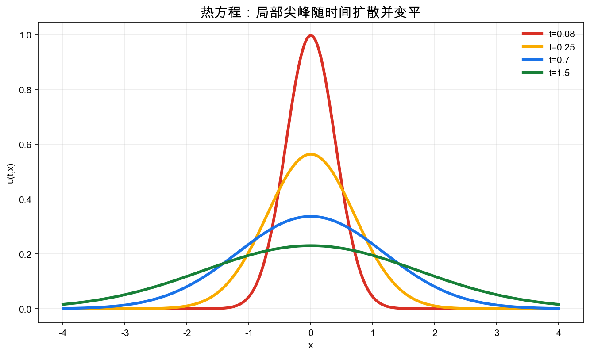
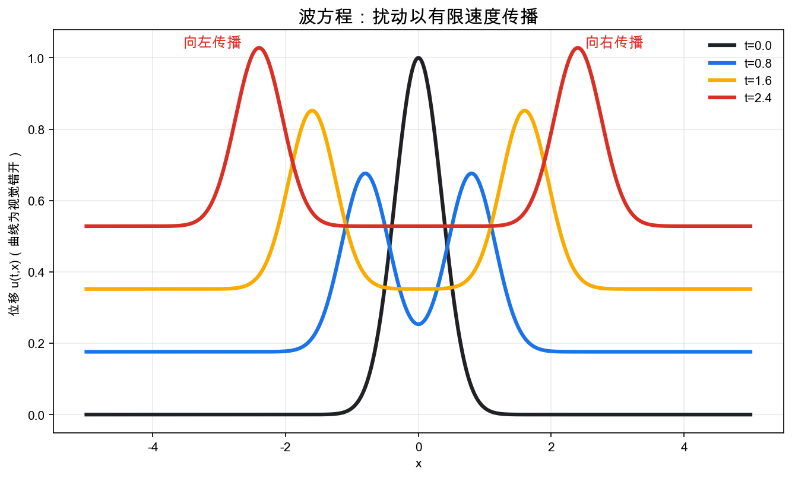
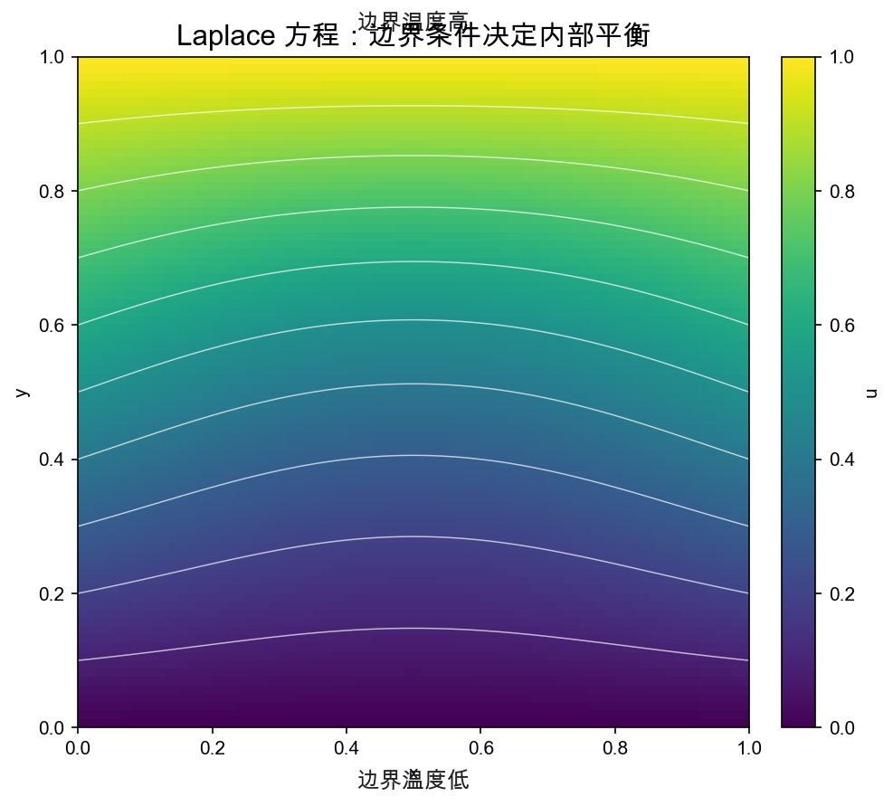
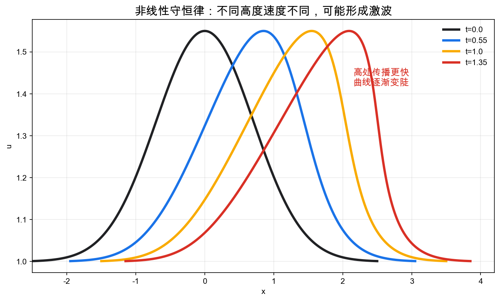
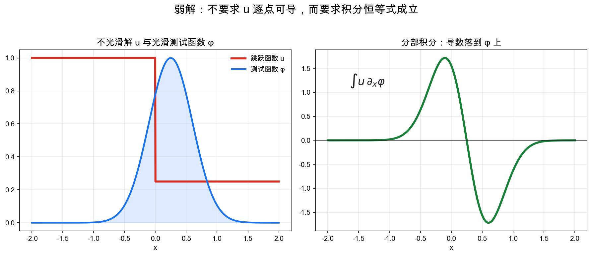

# 重学数学之十六: 偏微分方程——局部规律如何生成空间中的整体演化

## 一、为什么常微分方程不够？

动力系统里，一个状态 $x(t)$ 随时间变化：

$$
\frac{dx}{dt}=f(x)
$$

但很多真实系统的状态不是一个有限维向量，而是一个空间中的场：

- 温度场 $u(t,x)$。
- 波的位移 $u(t,x)$。
- 流体速度 $v(t,x)$。
- 电磁场 $E(t,x),B(t,x)$。
- 概率密度 $\rho(t,x)$。

这时未知量同时依赖时间和空间：

$$
u=u(t,x)
$$

它的变化不仅有时间导数：

$$
\partial_t u
$$

也有空间导数：

$$
\nabla u,\quad \Delta u,\quad \nabla\cdot F(u)
$$

这就是偏微分方程，PDE。

PDE 的核心问题是：

> **局部的微分关系，如何决定整个空间中的全局形状和长期演化？**

如果 ODE 是点在状态空间中走轨道，那么 PDE 是一个函数在函数空间中演化。状态不再是几个数，而是一整张曲线、一片温度场或一个概率分布。

这也是 PDE 比 ODE 难很多的原因。一个 ODE 的初值通常是有限个数；一个 PDE 的初值是一整个函数，边界也是一整个函数。我们不只是在追踪一个点，而是在追踪无限多个空间位置之间如何互相影响。

## 二、三类基本方程：扩散、波动、平衡

PDE 不是一个单一理论，而是一族语言。最重要的三种原型是：

这三类原型也常被粗略称为抛物型、双曲型和椭圆型。名字不重要，重要的是它们对应三种完全不同的行为：扩散会平滑，波动会传播，平衡会由边界约束内部。

### 2.1 热方程：扩散会抹平差异

$$
\partial_t u=\kappa \Delta u
$$

这里 $u(t,x)$ 是温度，$\kappa>0$ 是扩散系数。

热方程说：

> **一个点的温度变化由附近温度的平均弯曲程度决定。**

如果某点比周围高，$\Delta u<0$，温度下降。  
如果某点比周围低，$\Delta u>0$，温度上升。

热方程的本质是平滑。它会把尖峰摊开，把局部差异扩散到周围。

这和概率论中的布朗运动、随机分析中的扩散过程直接相连。热核就是 Brownian motion 的转移密度。

### 2.2 波方程：扰动以有限速度传播

$$
\partial_{tt}u=c^2\Delta u
$$

波方程描述振动、声音、电磁波和弹性介质。

它和热方程很不同：

- 热方程会平滑。
- 波方程会传播。
- 热方程有耗散。
- 理想波方程保持能量。

这说明同样是 PDE，时间行为可以完全不同。方程中的导数结构决定了信息如何移动。

### 2.3 Laplace 方程：没有源时的平衡

$$
\Delta u=0
$$

满足这个方程的函数叫调和函数。

它描述稳态温度、静电势、不可压无旋流等平衡状态。

Laplace 方程的核心性质是平均值原理：

> **调和函数在一点的值等于周围小球边界上的平均值。**

这意味着内部没有孤立峰值或谷值。边界条件决定内部形状。

这就是边值问题的典型图像：方程在内部成立，边界给出约束，解是二者共同决定的对象。

## 三、边界条件和初值条件：方程本身还不够

一个 PDE 只给局部规律。要得到唯一解，通常还需要：

1. 初值条件。
2. 边界条件。

热方程需要初始温度：

$$
u(0,x)=u_0(x)
$$

如果空间区域有边界，还要规定边界如何行为。

常见边界条件有三类。

**Dirichlet 条件**：

$$
u|_{\partial\Omega}=g
$$

直接规定边界值，例如边界温度被固定。

**Neumann 条件**：

$$
\frac{\partial u}{\partial n}\bigg|_{\partial\Omega}=h
$$

规定法向通量，例如绝热边界意味着热流为零。

**Robin 条件**：

$$
a u+b\frac{\partial u}{\partial n}=g
$$

描述边界值和通量的混合关系。

边界条件不是技术附属品，而是模型的一部分。相同 PDE 配不同边界条件，可以代表完全不同的物理系统。

同一个热方程，如果边界温度固定，就是和外界热库接触；如果法向通量为零，就是绝热容器；如果边界和外界按温差交换热量，就是 Robin 条件。方程描述内部规律，边界条件描述系统怎样和外部世界接触。

## 四、守恒律：局部守恒如何变成方程

很多 PDE 来自守恒。

假设 $u(t,x)$ 是某种密度，$F(u)$ 是通量。守恒律写成：

$$
\partial_t u+\nabla\cdot F(u)=0
$$

意思是：

> **一个区域内总量的变化，只能来自边界上的流入流出。**

一维情形：

$$
\partial_t u+\partial_x f(u)=0
$$

最简单的线性输运方程是：

$$
\partial_t u+c\partial_x u=0
$$

它的解只是沿速度 $c$ 平移：

$$
u(t,x)=u_0(x-ct)
$$

但非线性守恒律会产生激波。

例如 Burgers 方程：

$$
\partial_t u+\partial_x\left(\frac{u^2}{2}\right)=0
$$

不同高度处传播速度不同，曲线会变陡，最后形成间断。

这说明 PDE 的解不一定保持光滑。即使初始条件很光滑，有限时间后也可能出现间断。

这正是弱解出现的动机。

## 五、弱解：当导数不存在时，方程仍然有意义

经典解要求函数足够光滑，可以逐点计算导数。

但很多重要 PDE 的自然解并不光滑：

- 守恒律会形成激波。
- 流体方程可能产生复杂涡结构。
- 椭圆方程的边界可能不光滑。
- 变分问题的极小值可能只有弱导数。

弱解的思想是：

> **不再要求方程逐点成立，而是要求它在所有测试函数下积分成立。**

以一维守恒律为例：

$$
\partial_t u+\partial_x f(u)=0
$$

乘上光滑紧支撑测试函数 $\varphi$，积分并分部积分，可以把导数从 $u$ 转移到 $\varphi$：

$$
\int\int \left(u\partial_t\varphi+f(u)\partial_x\varphi\right)\,dxdt=0
$$

这样即使 $u$ 有跳跃，公式仍然有意义。

这一步非常深刻：

> **弱解不是降低要求，而是换一种更稳定的方程表达方式。**

它把 PDE 和第十五章测度论、第三章泛函分析接起来。函数不再需要处处可导，只要在积分意义下有足够结构。

不过弱解也带来一个新问题：解可能不唯一。守恒律里，同一个初值可能有多个弱解，只有满足额外熵条件的那个才符合物理。也就是说，弱形式让方程在不光滑处继续有意义，但有时还要再加入“哪一个弱解是正确的”这层选择原则。

## 六、Sobolev 空间：导数也可以是弱的

弱解需要一个合适的函数空间。

这就是 Sobolev 空间：

$$
W^{k,p}(\Omega)
$$

它由满足如下条件的函数组成：

- 函数本身在 $L^p$ 中。
- 它的弱导数直到 $k$ 阶也在 $L^p$ 中。

最常见的是：

$$
H^1(\Omega)=W^{1,2}(\Omega)
$$

它是 Hilbert 空间，范数为：

$$
\|u\|_{H^1}^2
=
\int_\Omega |u|^2\,dx
+
\int_\Omega |\nabla u|^2\,dx
$$

Sobolev 空间的本质是：

> **用积分意义控制函数和导数，而不是要求点态光滑。**

这非常适合物理。能量有限的场未必处处光滑，但仍然是合理状态。

还有一个常被忽略的点：Sobolev 空间能把“边界值”也说清楚。很多弱函数不能逐点取值，但在合适条件下仍有 trace，可以在边界上定义意义良好的限制。这正是弱解还能处理边界条件的原因。

## 七、变分法：PDE 也可以来自能量最小化

很多 PDE 可以看成能量泛函的 Euler-Lagrange 方程。

例如 Dirichlet 能量：

$$
E(u)=\frac12\int_\Omega |\nabla u|^2\,dx
$$

在固定边界值下使 $E(u)$ 最小的函数满足：

$$
\Delta u=0
$$

Laplace 方程的解是最平滑、最少弯曲的函数。

这让 PDE 和优化直接相连：

> **解方程 = 找能量极值。**

在更复杂的物理中，作用量原理、弹性能量、流体能量、电磁场能量都会导出 PDE。

这也解释了为什么泛函分析在 PDE 中不可避免：未知量是函数，优化对象是函数空间上的泛函。

## 八、适定性：一个方程什么时候是好问题？

Hadamard 提出，一个数学物理问题应该满足：

1. 解存在。
2. 解唯一。
3. 解连续依赖数据。

这叫适定性。

第三条尤其重要。如果初始数据有一点误差，解却发生巨大变化，那么问题虽然形式上有解，但不适合预测。

这和动力系统中的 Lyapunov 稳定性、统计学习中的泛化稳定性是同一种精神：

> **一个理论对象不仅要存在，还要对扰动有可控反应。**

很多 PDE 研究都围绕适定性展开。不同函数空间中，适定性可能完全不同。

这就是为什么 PDE 里总要指定“在哪个空间里求解”。同一个方程，在光滑函数空间里可能没有解，在弱函数空间里有解；在某个低正则空间里可能不唯一，在更强空间里又能恢复唯一性。函数空间不是包装，而是问题本身的一部分。

## 九、数值离散：把连续方程变成可计算对象

现实中大多数 PDE 无法解析求解，只能数值计算。

基本思路是把连续空间和时间离散化。

例如热方程：

$$
\partial_t u=\kappa \partial_{xx}u
$$

可以近似为：

$$
\frac{u_i^{n+1}-u_i^n}{\Delta t}
=
\kappa\frac{u_{i+1}^n-2u_i^n+u_{i-1}^n}{\Delta x^2}
$$

这里导数被差分替代。

但数值方法不是简单把导数换成差分。还要考虑：

- 一致性：离散方程是否近似原方程。
- 稳定性：误差是否被放大。
- 收敛性：网格变细时是否趋向真解。
- 守恒性：离散格式是否保留物理守恒律。

数值 PDE 是分析、线性代数、优化和计算机科学的交汇点。

### 9.1 有限元方法：弱形式怎样变成算法

有限差分直接离散导数，适合规则网格。复杂几何上，更常用有限元方法。

核心步骤是先把 PDE 写成弱形式。以 Poisson 方程为例：

$$
-\Delta u=f
$$

乘上测试函数 $v$ 并积分分部，得到：

$$
\int_\Omega \nabla u\cdot\nabla v\,dx=\int_\Omega fv\,dx
$$

然后选取有限维函数空间，用基函数展开 $u$，PDE 就变成线性方程组。

这条路线非常自然：弱解给了理论合法性，Sobolev 空间给了函数框架，线性代数给了计算实现。有限元方法就是 PDE、泛函分析和数值分析的交汇点。

有限元的另一个好处是几何适应性。复杂区域可以被剖分成三角形或四面体，每个小单元上用简单多项式近似，整体再拼成全局函数。这比规则网格上的差分法更适合真实工程形状。

## 十、应用场景

PDE 是数学进入物理世界的主要接口。

| 领域 | PDE 扮演的角色 |
|------|---------------|
| 热传导 | 热方程描述温度扩散 |
| 声学与光学 | 波方程、Helmholtz 方程描述波传播 |
| 流体力学 | Euler/Navier-Stokes 方程描述速度场和压力场 |
| 电磁学 | Maxwell 方程是电磁场的 PDE 系统 |
| 量子力学 | Schrödinger 方程描述波函数演化 |
| 金融数学 | Black-Scholes 方程是期权定价 PDE |
| 图像处理 | 扩散方程、总变差流用于去噪、分割和修复 |
| 机器学习 | 神经 ODE、扩散模型、连续归一化流都借用 PDE/动力系统语言 |

如果说动力系统研究有限维状态如何演化，那么 PDE 研究的是无限维状态如何演化。

## 十一、与前几章的连接

偏微分方程是前面许多理论的交汇点：

1. **傅里叶分析**：常系数线性 PDE 可以通过傅里叶变换对角化。
2. **泛函分析**：弱解、算子半群、谱理论和 Sobolev 空间是 PDE 的基础。
3. **测度论**：Lebesgue 积分和 $L^p$ 空间让弱解有意义。
4. **微分几何**：流形上的 Laplace-Beltrami 算子、曲率流和几何 PDE。
5. **随机分析**：热方程与 Brownian motion，Fokker-Planck 方程与随机微分方程。
6. **优化**：变分法把 PDE 解解释为能量极值。
7. **动力系统**：PDE 可以看成无限维动力系统。

特别热方程：

$$
\partial_t u=\Delta u
$$

它同时是扩散过程的密度演化、梯度流、平滑算子、Fourier 模式衰减，也是半群理论的基本例子。

一个方程把分析、概率、几何和动力系统接在了一起。

## 十二、前沿展望

### 12.1 物理信息神经网络（PINNs）与神经算子

Raissi、Perdikaris 与 Karniadakis（2019）提出 PINNs：将 PDE 残差直接写入神经网络损失函数，用自动微分计算偏导数，在无需网格的情况下求解正问题和逆问题。其优势是对不规则域和高维问题天然适用，代价是训练困难（刚性方程收敛慢）以及边界条件强制执行的技术挑战。

**神经算子**（Neural Operator，Li 等 2021）学习算子 $\mathcal{G}: \mathcal{A}\to\mathcal{U}$（从输入函数到解函数的映射），而非单一方程的解。傅里叶神经算子（FNO）在频率域做全局卷积，实现了对流、NS 方程等问题的快速近似求解，推理速度比传统数值方法快三个量级。DeepONet（Lu 等 2021）用"主干-支干"架构普遍逼近非线性算子。

### 12.2 平均场博弈理论

Lasry 与 Lions（2007）和 Huang、Malhamé、Caines（2006）独立提出**平均场博弈**（MFG）：$N$-玩家博弈在 $N\to\infty$ 时的极限，用一对耦合 PDE 描述均衡——前向 Fokker-Planck 方程描述玩家分布演化，后向 HJB 方程描述最优策略。

MFG 提供了大规模多智能体系统（交通流、金融市场、无人机集群、流行病控制）的可解析框架，并与强化学习（第三十章）的多智能体情形直接相连。Cardaliaguet 等（2019）将 MFG 分析系统化；深度学习方法（APAC-Net 等）扩展其计算可行性。

### 12.3 几何 PDE 与 Ricci 流

Hamilton（1982）引入 Ricci 流 $\partial_t g_{ij} = -2R_{ij}$，Perelman（2002-2003）用它证明了 Thurston 几何化猜想，并由此证明 Poincaré 猜想（百年数学难题之一）。技术工具包括：熵泛函的单调性（Perelman 的 W-entropy）、奇点消解手术、以及随机几何与 Ricci 流的连接（Brownian motion on evolving manifolds）。

Ricci 流现在被用于计算机图形学（曲面参数化、球面映射）和数据分析（图的几何正则化）中。

### 12.4 数据驱动的方程发现

Brunton、Proctor 与 Kutz（2016）提出 **SINDy**（Sparse Identification of Nonlinear Dynamics）：把 ODE/PDE 的右端项写成候选函数库的稀疏线性组合，用 LASSO 从轨迹数据中恢复方程结构。这将稀疏优化（第九章）与动力系统识别结合，已用于流体湍流、化学反应动力学和神经网络激活函数的自动发现。

## 十三、总结

偏微分方程的核心结构可以这样串起来：

1. **未知量是场**：$u(t,x)$ 同时依赖时间和空间。
2. **局部微分规律**：PDE 用时间导数和空间导数表达局部变化。
3. **扩散方程**：热方程抹平差异，体现耗散和平滑。
4. **波方程**：扰动以有限速度传播，体现能量守恒。
5. **Laplace 方程**：边界决定内部平衡，体现平均值原理。
6. **守恒律**：局部守恒导致通量散度形式，并可能产生激波。
7. **弱解**：通过测试函数和分部积分，让不光滑解仍满足方程。
8. **Sobolev 空间**：用积分意义控制弱导数。
9. **变分法**：许多 PDE 是能量泛函的最优性条件。
10. **适定性与数值**：好方程需要存在、唯一、稳定，并能被可靠计算。

> **PDE 把局部微分规律变成空间中的整体形状和时间演化。**

它是现代应用数学的主干之一。只要系统有空间分布、有局部相互作用、有守恒或扩散，PDE 就会自然出现。

---

*连续模型有了，但真要用还得靠计算。下一章进数值分析，看连续数学怎样在有限精度的机器上变成可靠的结果。*
