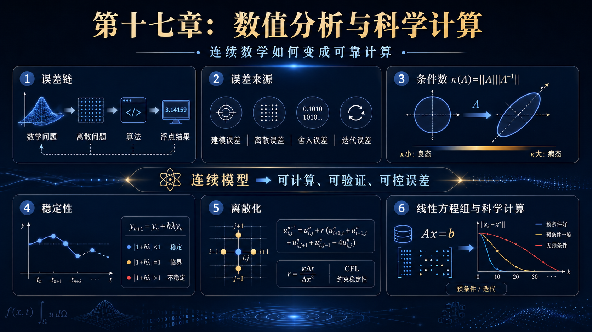
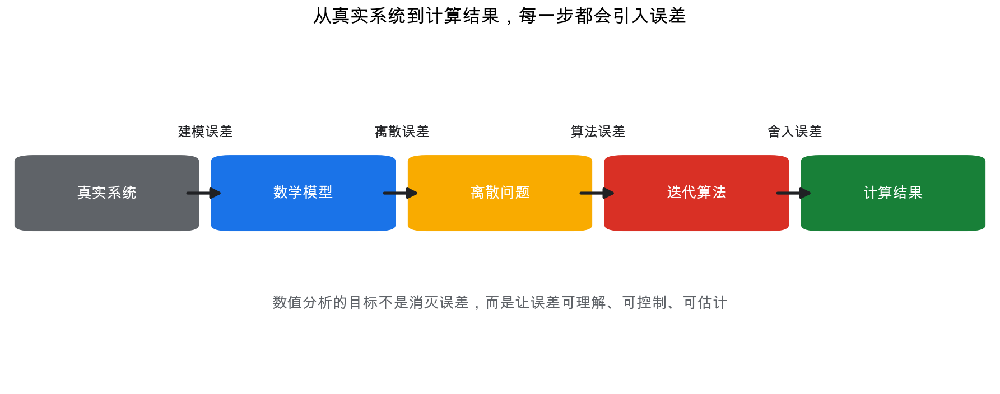
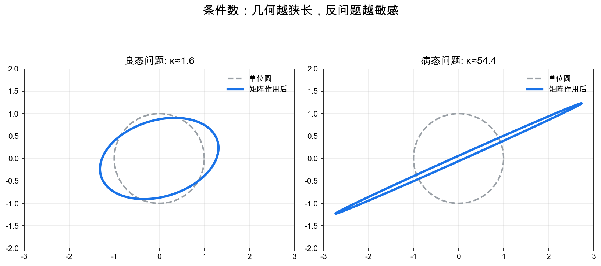
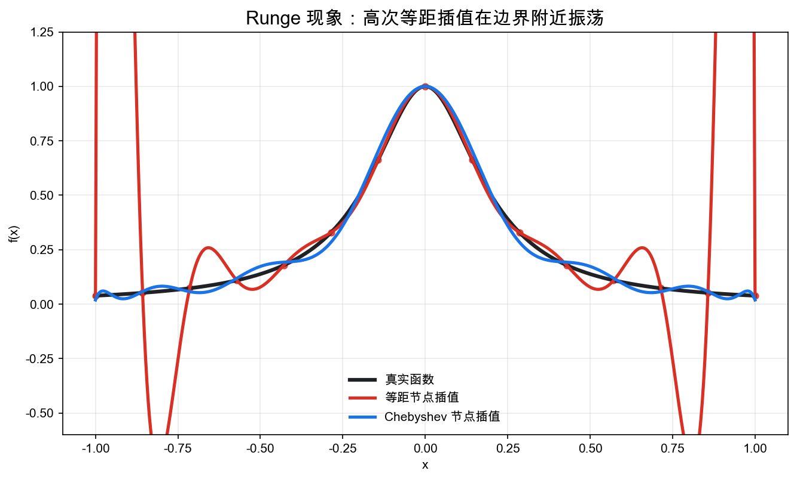
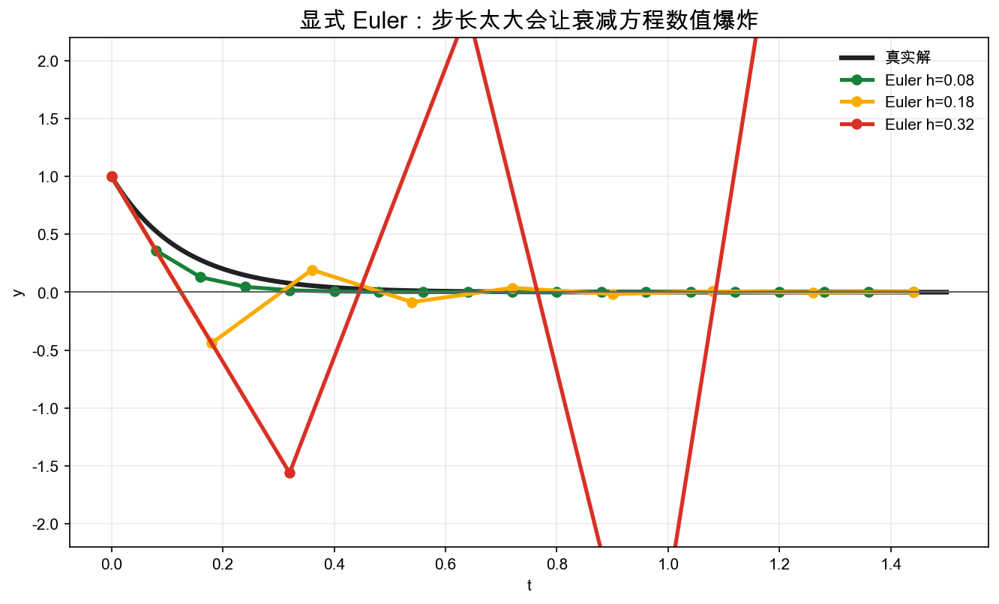
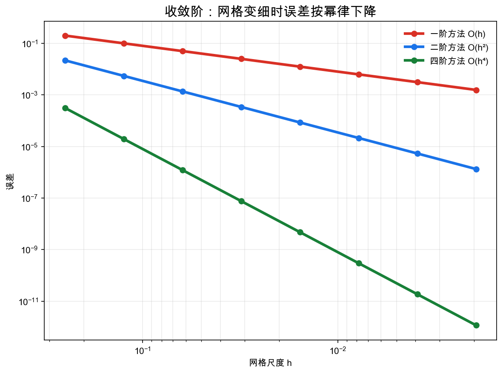

# 重学数学之十七: 数值分析与科学计算——连续数学如何变成可靠计算

## 一、为什么“有公式”还不够？

前面几章一直在建立数学结构：积分、PDE、动力系统、优化、概率、因果。

但现实中还有一个很直接的问题：

> **数学对象通常是连续的，而计算机只能处理有限的数字。**

微分方程的解可能是一个函数。  
积分可能是无穷小区间的极限。  
线性系统可能有百万维。  
概率分布可能没有解析表达式。  
PDE 的状态可能是整个空间中的场。

所以科学计算的核心问题不是“怎么算出一个数字”这么简单，而是：

> **离散计算结果在多大程度上代表原来的连续数学问题？**

数值分析研究的就是这条链：

$$
\text{数学问题}
\to
\text{离散问题}
\to
\text{算法}
\to
\text{浮点计算结果}
$$

每一步都会引入误差。

数值分析的目标不是消灭误差，而是让误差可理解、可控制、可估计。

这也是科学计算和普通编程最大的区别。程序跑出一个数不难，难的是知道这个数为什么可信、误差主要来自哪里、继续加算力能不能真的改善结果。

## 二、误差：先承认计算不是精确数学

一个数值结果和真实值之间的差可以分成几类。

误差还常分为绝对误差和相对误差。绝对误差看差了多少：

$$
|\hat x-x|
$$

相对误差看相对于目标大小差了多少：

$$
\frac{|\hat x-x|}{|x|}
$$

当量纲或数量级很重要时，相对误差通常更有意义；当真实值接近 0 时，相对误差又可能变得不稳定。

### 2.1 建模误差

真实世界先被简化成数学模型。比如用热方程描述热传导时，我们可能忽略了材料非均匀性、边界辐射和相变。

这一步产生建模误差。

### 2.2 离散误差

连续方程要变成有限维问题。

例如导数：

$$
u'(x)
$$

被差分近似为：

$$
\frac{u(x+h)-u(x)}{h}
$$

这会产生截断误差。

### 2.3 舍入误差

计算机用有限位浮点数表示实数。很多十进制数无法被精确表示，连续运算也会被舍入。

单个舍入误差很小，但在不稳定算法中可能被放大。

### 2.4 迭代误差

很多算法不是一步到位，而是逐步逼近。比如共轭梯度、牛顿法、固定点迭代、时间步进。提前停止会留下迭代误差。

所以一个数值答案背后至少有四层问题：

> **模型对不对？离散够不够细？算法稳不稳？浮点误差有没有被放大？**

## 三、条件数：问题本身会不会放大误差

有些问题天然敏感。输入稍微变一点，输出就剧烈变化。

这种敏感性由**条件数**衡量。

对线性系统：

$$
Ax=b
$$

如果 $A$ 可逆，解是：

$$
x=A^{-1}b
$$

矩阵条件数定义为：

$$
\kappa(A)=\|A\|\|A^{-1}\|
$$

它衡量 $b$ 中的相对误差可能被放大多少：

$$
\frac{\|\delta x\|}{\|x\|}
\lesssim
\kappa(A)
\frac{\|\delta b\|}{\|b\|}
$$

几何上，矩阵把单位球变成椭球。椭球越狭长，条件数越大。此时某些方向上的信息被压得很扁，反求时会被猛烈放大。

这里要区分两个概念：

- **问题病态**：问题本身对输入敏感。
- **算法不稳定**：算法额外放大了误差。

好的算法不能让病态问题变成良态，但可以避免引入额外不稳定。

这一区分非常实用。条件数高，是“题目本身难”；稳定性差，是“解题方法又添了麻烦”。一个病态问题即使用最好的算法也需要谨慎解释结果；一个良态问题如果用不稳定算法，也可能算出荒唐答案。

## 四、稳定性：算法是否放大误差

一个算法可以看成从输入到输出的映射：

$$
\hat y=\mathcal A(\hat x)
$$

如果输入和每一步运算都有小误差，一个稳定算法应该让最终误差保持可控。

数值分析中有一个重要观点：

> **稳定算法算出的结果，应该等价于对一个稍微扰动的问题给出了精确解。**

这叫后向稳定性。

例如求解线性系统时，后向稳定算法得到的 $\hat x$ 满足：

$$
(A+\delta A)\hat x=b+\delta b
$$

其中 $\delta A,\delta b$ 很小。

这非常务实：我们不要求算法在浮点世界里魔法般精确，只要求它没有把问题变得更糟。

后向稳定性的好处是它把算法误差重新翻译成数据误差。科学数据本来就有测量误差，如果算法结果等价于对一个极小扰动后的问题求精确解，我们就能把数值误差放进同一套误差预算里讨论。

## 五、插值：穿过所有点不等于理解函数

给定数据点：

$$
(x_i,y_i)
$$

最直接的问题是：找一个函数穿过这些点。

多项式插值告诉我们：如果有 $n+1$ 个不同节点，就存在唯一一个次数不超过 $n$ 的多项式 $p_n(x)$，使：

$$
p_n(x_i)=y_i
$$

但高次多项式插值可能很危险。Runge 现象说明，在等距节点上插值光滑函数，边界附近可能出现剧烈振荡。

这给出一个重要教训：

> **精确通过样本点，不代表在点与点之间表现好。**

这和统计学习理论中的过拟合非常相似。插值误差不仅取决于函数光滑性，也取决于节点分布和基函数选择。

实际计算中更常用样条、Chebyshev 节点、局部插值或正则化方法。

Chebyshev 节点的作用是把节点更多放在区间两端，减轻边界振荡。样条的思路则相反：不用一个高次多项式统治整个区间，而是用许多低次多项式分段拼接。两者都在避免“全局高自由度”带来的不稳定。

## 六、数值积分：用有限采样近似整体累积

积分：

$$
I=\int_a^b f(x)\,dx
$$

通常无法解析求出。数值积分用有限个函数值近似它。

最简单的是梯形公式：

$$
\int_a^b f(x)\,dx
\approx
\frac{h}{2}
\left[
f(x_0)+2\sum_{i=1}^{n-1}f(x_i)+f(x_n)
\right]
$$

Simpson 公式、Gauss 求积、自适应积分会更高效。

数值积分的核心问题是：

> **函数的整体面积，能否由有限采样点可靠代表？**

如果函数平滑，少量点就可能很好。  
如果函数有尖峰、震荡或奇异性，就需要更多结构信息。

这和测度论形成对照：测度论关心积分的定义和极限交换；数值分析关心积分如何被有限计算近似。

## 七、线性系统：科学计算的核心工作量

大量科学计算最终会变成线性系统：

$$
Ax=b
$$

PDE 离散、最小二乘、优化、图算法、有限元方法、机器学习训练中的局部二次近似，都会产生线性系统。

常见方法分两类。

**直接法**：例如 Gaussian elimination、LU 分解、Cholesky 分解。  
它们通常可靠，但大规模问题成本高。

**迭代法**：例如 Jacobi、Gauss-Seidel、共轭梯度、GMRES。  
它们利用稀疏性和结构，适合大规模问题。

真正的工程关键往往是预条件：

$$
M^{-1}Ax=M^{-1}b
$$

预条件器 $M$ 的目标是让问题条件数变小、迭代更快收敛。

这和第九章优化中的条件数完全相通：狭长的几何会让算法慢，而预条件是在改变坐标，让几何更圆。

迭代法里还要区分残差和误差。残差是 $r=b-A\hat x$，可以直接算；误差是 $\hat x-x$，通常不知道。条件数把二者联系起来：小残差不一定代表小误差，尤其当 $A$ 病态时更要小心。

## 八、时间步进：ODE 离散里的稳定性

考虑最简单的线性 ODE：

$$
y'=\lambda y
$$

真实解是：

$$
y(t)=e^{\lambda t}y(0)
$$

如果 $\lambda<0$，真实解会衰减。

显式 Euler 方法写成：

$$
y_{n+1}=y_n+h\lambda y_n=(1+h\lambda)y_n
$$

它稳定的条件是：

$$
|1+h\lambda|<1
$$

如果步长 $h$ 太大，即使真实解衰减，数值解也可能爆炸。

这说明：

> **离散模型可能有原连续模型没有的假动力学。**

数值方法不只是近似公式，还会引入自己的稳定性结构。

这也是隐式方法会出现的原因。显式方法每一步便宜，但稳定步长可能很小；隐式方法每一步要解方程，成本更高，却常能用更大的步长处理刚性问题。数值方法的选择，本质上是在单步成本和稳定区域之间做权衡。

## 九、PDE 离散：网格、格式与 CFL 条件

PDE 数值计算通常需要同时离散时间和空间。

例如热方程：

$$
\partial_t u=\kappa\partial_{xx}u
$$

显式差分格式为：

$$
u_i^{n+1}
=
u_i^n
+
r(u_{i+1}^n-2u_i^n+u_{i-1}^n)
$$

其中：

$$
r=\frac{\kappa\Delta t}{\Delta x^2}
$$

这个格式稳定需要：

$$
r\le \frac12
$$

这类限制叫 CFL 条件。它表达的是：

> **数值信息传播速度必须和方程本身的信息传播结构相匹配。**

如果时间步太大，网格还没来得及传递信息，算法就跨太远，误差会被放大。

一个好的离散格式需要同时满足：

1. 一致性：离散方程近似连续方程。
2. 稳定性：误差不被无限放大。
3. 收敛性：网格加密时数值解趋向真解。

经典 Lax 等价定理说，对适定线性问题：

> **一致性 + 稳定性 = 收敛性。**

这句话是数值 PDE 的核心原则之一。

## 十、浮点数：实数在机器中的影子

数学中的实数有无限精度。计算机中的浮点数没有。

浮点数大致表示为：

$$
\pm m\times 2^e
$$

其中尾数 $m$ 和指数 $e$ 都只有有限位。

这会导致几个现象：

- 不是所有实数都能精确表示。
- 很小的数加到很大的数上可能消失。
- 两个接近的数相减会损失有效位数。
- 运算顺序会影响结果。

例如：

$$
(a+b)+c
$$

和：

$$
a+(b+c)
$$

在实数中相等，在浮点数中可能不完全相等。

所以科学计算要尊重浮点世界的规则。稳定算法、缩放、正交化、避免灾难性消去，都不是代码细节，而是数学正确性的一部分。

灾难性消去最典型的场景是两个很接近的数相减。前面许多有效数字互相抵消，剩下的结果主要由舍入误差决定。很多数值公式看起来代数等价，但在浮点数里稳定性完全不同，实际实现时常要改写公式。

### 10.1 自适应计算：误差估计决定算力花在哪里

真实科学计算很少把网格均匀细化到底。那样太贵，也常常没必要。

更好的做法是自适应：先粗算，再估计误差，把算力集中到误差大的区域。

例如 PDE 里，边界层、激波、奇点附近需要细网格；平滑区域可以用粗网格。优化里，曲率大的方向需要更谨慎的步长；条件好的子问题可以快速推进。

这体现了数值分析的一条工程原则：不要平均分配计算资源，要让误差估计来指挥资源分配。

所以数值方法不是把连续公式机械离散化。它还要不断回答一个实践问题：当前近似哪里不可信，下一份算力该花在哪里？

## 十一、应用场景

数值分析是把数学模型变成工程结果的桥。

| 领域 | 数值分析扮演的角色 |
|------|------------------|
| 工程仿真 | 有限元、有限体积、有限差分用于结构、热、流体和电磁计算 |
| 物理模拟 | 天体运动、量子系统、等离子体、材料模拟依赖数值方法 |
| 机器学习 | 优化、自动微分、矩阵分解和大规模线性代数是训练基础 |
| 数据科学 | 最小二乘、特征值、SVD、稀疏求解支撑统计计算 |
| 金融 | PDE、Monte Carlo、随机过程数值求解用于定价和风险 |
| 图形学 | 流体、布料、弹性体、光照和几何处理都需要稳定离散 |
| 气候与天气 | 大规模 PDE 离散、同化和并行计算决定预测能力 |

任何把连续模型用于现实决策的地方，都需要数值分析。

## 十二、与前几章的连接

数值分析把整套数学拉回计算现实：

1. **线性代数**：矩阵分解、条件数、特征值是科学计算的核心。
2. **泛函分析**：连续问题和离散子空间之间的投影、逼近和收敛。
3. **测度论与积分**：数值积分和 Monte Carlo 是积分的有限采样版本。
4. **PDE**：有限差分、有限元、有限体积把无限维问题离散成有限维问题。
5. **优化**：迭代算法、梯度法、牛顿法都需要稳定数值实现。
6. **动力系统**：时间步进算法本身也是离散动力系统。
7. **统计学习**：泛化误差之外，还要考虑优化误差和数值误差。

一个现代计算结果通常同时包含三种误差：

$$
\text{总误差}
=
\text{建模误差}
+
\text{离散误差}
+
\text{计算误差}
$$

理解这三者的边界，是科学计算可信度的基础。

## 十三、前沿展望

### 13.1 随机数值线性代数

Halko、Martinsson 与 Tropp（2011）将随机化引入数值线性代数：用随机投影将大矩阵压缩至低维子空间，再做精确 SVD，得到近似最优的低秩分解。算法复杂度从 $O(mn^2)$ 降至 $O(mn\log k)$（$k$ 为目标秩），并可流式处理不放入内存的矩阵。这一思路（随机化 SVD、Randomized LU、Sketching）已被 JAX、PyTorch 集成，成为大规模机器学习训练的基础工具。

### 13.2 自动微分与可微编程

自动微分（AD）将计算图中每个基本操作的导数组合成任意复合函数的精确梯度，分为**前向模式**（高效计算 Jacobian-向量积）和**反向模式**（高效计算梯度，即反向传播）。JAX（Google 2018）将 AD 与函数式变换（`jit`、`vmap`、`grad`）结合，支持高阶导数、任意函数上的 vmap 向量化，以及 XLA 编译器优化。

**可微编程**是更广的范式：物理模拟器、渲染器、PDE 求解器都可以变成可微组件，嵌入神经网络并端到端训练，用于优化设计参数、逆问题求解和科学发现。

### 13.3 概率数值方法

Hennig、Osborne 与 Girolami（2015）提出**概率数值方法**（Probabilistic Numerics）：把数值计算本身视为统计推断问题——ODE 求解器、积分方法、线性方程求解器都可以输出概率分布（后验），量化因数值离散化引入的不确定性。这为科学计算结果的不确定性传播提供了原则性框架，与贝叶斯推断（第十二章）天然融合。

### 13.4 神经网络加速科学计算

AlphaFold2（Jumper 等 2021）用神经网络将蛋白质序列直接映射到三维结构，取代了昂贵的分子动力学模拟。类似范式正在出现于：
- **分子动力学势函数学习**（DeePMD、NequIP）：等变神经网络拟合原子间势能面，实现接近 DFT 精度的快速 MD 模拟。
- **气候模型参数化**（Rasp 等 2018）：用神经网络取代 GCM 中计算昂贵的云微物理参数化方案。
- **晶格规范场论**（Boyda 等 2021）：归一化流加速 QCD 晶格模拟中的 Markov Chain 采样。

## 十四、总结

数值分析与科学计算的核心结构可以这样串起来：

1. **误差分解**：建模、离散、舍入、迭代都会产生误差。
2. **条件数**：问题本身可能放大输入扰动。
3. **稳定性**：算法不应额外放大误差。
4. **插值与逼近**：通过有限自由度表示函数，但要避免振荡和过拟合。
5. **数值积分**：用有限采样近似整体累积。
6. **线性系统**：大多数科学计算的核心工作量。
7. **时间步进**：离散 ODE/PDE 时必须尊重稳定区域。
8. **CFL 条件**：数值传播结构要匹配方程传播结构。
9. **浮点计算**：机器数不是实数，算法必须适应有限精度。

> **数值分析研究的是数学真理如何在有限计算中保持可信。**

它不是数学之后的实现细节，而是连接理论与现实的最后一层结构。

## 十五、第二阶段收束：从基础结构到可计算世界

第 15 到第 17 章补上了第一阶段之后最重要的一条底层线：

- 测度论让积分、概率和极限稳定。
- PDE 让局部微分规律进入空间中的连续模型。
- 数值分析让这些连续模型变成可验证、可运行、可误差控制的计算过程。

如果说前 14 章形成了“结构、信息、变化”的数学地图，那么这三章补上的是：

> **现代数学如何落地到严肃计算。**

到这里，第二阶段可以收束，但路线还可以继续向外展开。

前 17 章已经形成一条完整主线：从信号与函数，到空间与结构，到随机与学习，到因果与动力，再到底层积分、连续模型和科学计算。

下一阶段会进入更专门也更现代的交汇区：最优传输、Lie 群、表示论、代数几何、量子信息、复杂系统与深度学习理论。这些主题不再只是补基础，而是在展示同一批数学语言怎样进入当代研究和工程系统。

---

*从连续计算再往前一步，就是概率分布之间的几何。下一章进入最优传输——把概率分布看成可以搬运的质量，看看 Wasserstein 距离给概率空间带来了怎样的结构。*
