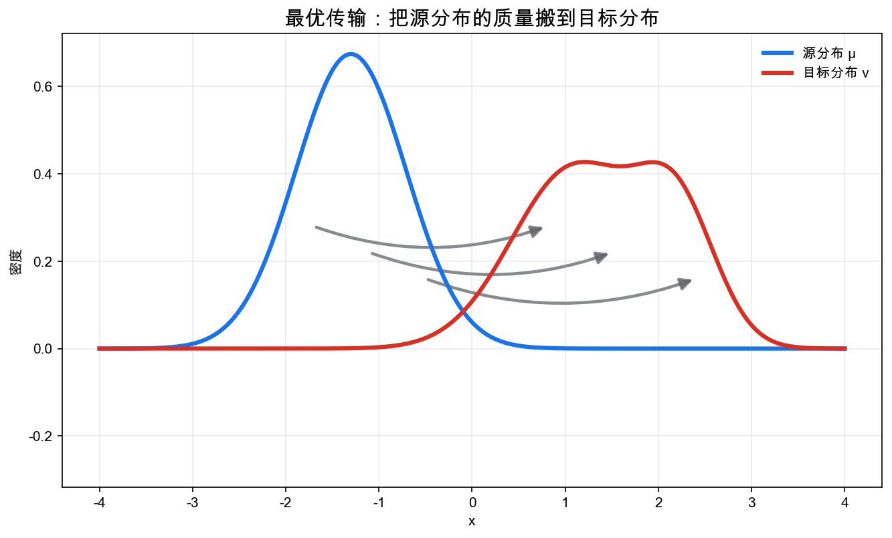
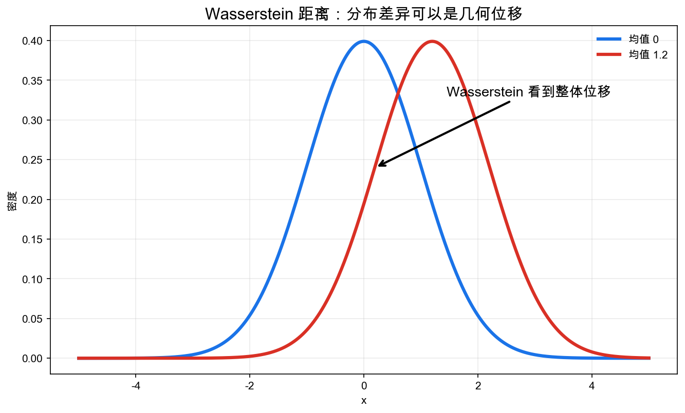
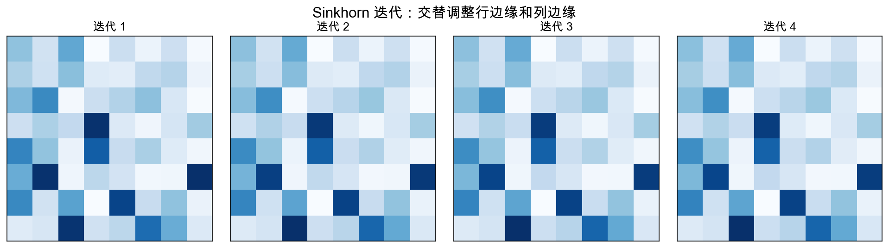

# 重学数学之十八: 最优传输——在概率分布之间搬运质量的几何

## 一、从“比较两个分布”开始

概率论和统计学习里，我们经常要比较两个分布。

一个分布可能代表真实数据，另一个代表模型生成的数据；一个代表今天的用户，另一个代表明天的用户；一个代表初始密度，另一个代表演化后的密度。

KL 散度能比较分布：

$$
D_{\mathrm{KL}}(p\|q)
$$

但它有一个明显特点：它比较的是同一点上的密度比例。如果两个分布支撑集几乎不重叠，KL 可能变得很大甚至无穷。

最优传输换了一个问题：

> **如果把一个分布看成一堆质量，搬成另一个分布，最小搬运成本是多少？**

这就是 Wasserstein 距离的直觉。它不只是问“密度值差多少”，而是问“质量要移动多远”。

## 二、Monge 问题：给每个点指定去向

Monge 的原始问题很直接。

给两个测度 $\mu,\nu$，找一个映射：

$$
T:X\to Y
$$

把 $\mu$ 推到 $\nu$：

$$
T_\#\mu=\nu
$$

这里的 $T_\#\mu$ 叫推前测度。意思是：先从 $\mu$ 中抽一个点 $x$，再把它送到 $T(x)$，得到的新分布就是 $\nu$。用集合写，就是

$$
(T_\#\mu)(B)=\mu(T^{-1}(B))
$$

所以 Monge 问题不是只找一个函数，而是找一个能把源分布整体变成目标分布的函数。

并最小化搬运成本：

$$
\inf_T \int c(x,T(x))\,d\mu(x)
$$

这里 $c(x,y)$ 是把质量从 $x$ 搬到 $y$ 的成本。

问题是，Monge 映射太刚性。一个点的质量只能整体搬到一个地方，不能拆分。

## 三、Kantorovich 松弛：允许质量拆分

Kantorovich 的关键放松是：不直接找映射 $T$，而是找联合分布 $\pi(x,y)$。

它表示：

> **从 $x$ 搬多少质量到 $y$。**

要求 $\pi$ 的两个边缘分别是 $\mu$ 和 $\nu$：

$$
\pi_X=\mu,\quad \pi_Y=\nu
$$

这样的 $\pi$ 也叫耦合。它把“源点在哪里”和“目标点在哪里”放进同一个联合分布里。边缘条件保证从源端看，发出的总质量正好是 $\mu$；从目标端看，收到的总质量正好是 $\nu$。

然后最小化：

$$
\inf_{\pi\in\Pi(\mu,\nu)}
\int c(x,y)\,d\pi(x,y)
$$

这正是 Kantorovich 最优传输。

它的好处是变成了凸优化问题。可行集是所有耦合，目标函数是线性的。

这个松弛也解决了“一个点不能拆分”的麻烦。比如源分布在一个点有一大块质量，目标分布却分散在多个点上，Monge 映射无法把同一点的质量拆开，Kantorovich 耦合可以自然地把它分给多个目的地。

## 四、Wasserstein 距离：概率空间上的几何

如果成本取：

$$
c(x,y)=d(x,y)^p
$$

定义：

$$
W_p(\mu,\nu)
=
\left(
\inf_{\pi\in\Pi(\mu,\nu)}
\int d(x,y)^p\,d\pi(x,y)
\right)^{1/p}
$$

这就是 Wasserstein 距离。

它把概率分布空间变成一个几何空间。

如果一个高斯分布平移一点，KL 和 Wasserstein 都能感知；但 Wasserstein 的解释更几何：质量整体移动了一段距离。

这正是最优传输在生成模型和分布对齐中有用的原因。

不过 Wasserstein 距离依赖底层空间的距离 $d(x,y)$。同样两组概率权重，如果底层几何不同，搬运成本也不同。这是它和 KL 这类纯密度比较最大的区别：Wasserstein 看见“点与点之间有多远”。

## 五、对偶性：运输问题也有势函数

Kantorovich 对偶说，原始运输问题可以写成势函数优化。

在成本 $c(x,y)$ 下：

$$
\inf_{\pi\in\Pi(\mu,\nu)}\int c\,d\pi
=
\sup_{\varphi,\psi}
\left[
\int \varphi\,d\mu+\int \psi\,d\nu
\right]
$$

约束是：

$$
\varphi(x)+\psi(y)\le c(x,y)
$$

这和凸优化中的对偶非常相似：原问题是搬运计划，对偶问题是给源点和目标点赋势能，势能不能超过搬运成本。

可以把 $\varphi,\psi$ 想成一组价格系统。约束 $\varphi(x)+\psi(y)\le c(x,y)$ 保证价格不会超过实际运输成本；最大化势能总收益，就是在所有合法价格系统中找到最紧的下界。强对偶说，这个最佳下界正好等于最小运输成本。

对偶势函数在理论和算法中都很重要。WGAN 中的 critic 就可以看成 Wasserstein-1 对偶势函数的近似。

## 六、熵正则化与 Sinkhorn 算法

直接求最优传输可能很贵。常用方法是加入熵正则项：

$$
\min_{\pi\in\Pi(\mu,\nu)}
\langle C,\pi\rangle
+
\varepsilon\sum_{ij}\pi_{ij}\log\pi_{ij}
$$

熵项让问题更光滑，也带来高效的 Sinkhorn 迭代。

直觉上，熵正则化不喜欢过于尖锐的运输计划。原始 OT 可能把质量集中到很少几条路径上；加入熵后，运输计划会更分散、更平滑，算法也更容易收敛。代价是它解的不再是原问题，而是一个被平滑过的问题。

它的直觉很简单：先把矩阵行和调成 $\mu$，再把列和调成 $\nu$，反复交替直到两个边缘都对。

这把最优传输变成了可大规模计算的工具。

## 七、梯度流：PDE 也可以是概率空间上的最速下降

最优传输最深的连接之一是 Wasserstein 梯度流。

热方程：

$$
\partial_t\rho=\Delta\rho
$$

可以看成熵泛函：

$$
\mathcal H(\rho)=\int \rho\log\rho\,dx
$$

在 Wasserstein 空间中的梯度流。

扩散不是随便摊开，而是在概率分布空间中沿着熵下降方向运动。

这把第十六章 PDE、第十五章测度论和第九章优化接在了一起。

这句话一开始可能反直觉：熵在普通欧氏空间里不是位置函数，概率分布也不是普通点。但 Wasserstein 几何给了分布空间“方向”和“距离”，于是我们可以问一个分布怎样沿着某个泛函最快下降。PDE 就变成了分布空间里的运动方程。

## 八、一维情形：最容易看见的最优传输

如果先不碰高维，只看实线上两个分布，最优传输有一个漂亮到有点过分的答案。

设 $F_\mu,F_\nu$ 是两个分布函数，$F_\mu^{-1},F_\nu^{-1}$ 是分位数函数。那么：

$$
W_p^p(\mu,\nu)=\int_0^1 |F_\mu^{-1}(t)-F_\nu^{-1}(t)|^p\,dt
$$

这句话的意思很朴素：把两堆质量都按从左到右排好，最低的 $1\%$ 对最低的 $1\%$，中位数对中位数，最高的 $1\%$ 对最高的 $1\%$。

为什么这样最优？因为在一维里，交叉搬运一定浪费。如果 $x_1<x_2$ 却把 $x_1$ 搬到更右边、$x_2$ 搬到更左边，两条运输路径发生交叉。交换目的地之后，总成本不会变大。反复消掉交叉，就得到单调搬运。

这个例子很重要。它提醒我们，最优传输不是神秘的“分布距离”，它首先是排序、配对、移动。

## 九、动态观点：质量真的在流动

Wasserstein-2 距离还有一个动态表达，叫 Benamou-Brenier 公式：

$$
W_2^2(\mu_0,\mu_1)
=
\inf_{\rho_t,v_t}
\int_0^1\int \rho_t(x)\|v_t(x)\|^2\,dx\,dt
$$

约束是连续性方程：

$$
\partial_t\rho_t+\nabla\cdot(\rho_t v_t)=0
$$

这比静态耦合更像物理：密度 $\rho_t$ 随时间移动，速度场 $v_t$ 推着它走，总动能最小。

静态版本问“从哪里搬到哪里”。动态版本问“中间怎么走”。

这也是为什么最优传输会自然出现在流体力学、扩散方程和生成模型里。扩散模型里从噪声走向数据，流匹配里学习速度场，本质上都在问一个类似问题：怎样把一个分布沿着一条可计算的路径推到另一个分布。

## 十、计算时容易踩的坑

最优传输理论很干净，计算时却有几件事必须记住。

第一，维数一高，经验分布的 Wasserstein 距离收敛很慢。两个样本集看起来很接近，$W_p$ 估计值也可能因为样本不足而很抖。这就是维数灾难。

第二，熵正则化让 Sinkhorn 算法变快，但也改变了问题。$\varepsilon$ 太大，运输计划会被抹得太平；$\varepsilon$ 太小，数值迭代又容易不稳定。实际使用时常常要做 log-domain Sinkhorn，避免指数项下溢。

第三，Wasserstein 距离能看见几何位移，但不一定适合所有统计比较。若任务关心尾部概率、罕见事件或似然拟合，KL、$\chi^2$ 散度、MMD 可能更直接。

所以最优传输不是替代所有分布距离的万能工具。它擅长的是“质量沿着底层几何移动”的问题。

## 十一、应用场景

| 领域 | 最优传输扮演的角色 |
|------|------------------|
| 机器学习 | 生成模型、分布对齐、domain adaptation、WGAN |
| 图像处理 | 颜色迁移、形状匹配、纹理混合 |
| 统计 | 两样本检验、分布鲁棒优化、经验测度收敛 |
| PDE | Wasserstein 梯度流、扩散方程、Fokker-Planck 方程 |
| 经济学 | 匹配市场、资源分配、均衡运输 |
| 几何 | 度量测度空间、Ricci 曲率的弱化定义 |

最优传输把“分布差异”变成了“几何搬运”。

## 十二、与前几章的连接

1. **测度论**：对象是概率测度，耦合是乘积空间上的测度。
2. **优化**：Kantorovich 问题是线性规划，熵正则化是凸优化。
3. **PDE**：Wasserstein 梯度流连接扩散方程。
4. **信息论**：熵正则化、KL、Wasserstein 提供不同分布几何。
5. **机器学习**：分布对齐和生成模型需要比较数据分布。

## 十三、前沿展望

### 13.1 Schrödinger 桥与随机最优传输

经典最优传输寻找两个分布之间的确定性最优映射。**Schrödinger 桥**问题（Schrödinger 1931；Léonard 2013）引入熵正则化：在连接 $\mu_0$ 与 $\mu_1$ 的所有随机过程中，寻找 KL 散度最小者（最接近参考布朗运动）。极限 $\varepsilon\to 0$ 时回退到标准 OT；有限 $\varepsilon$ 时得到一对耦合扩散过程，其漂移项满足 Sinkhorn-like 迭代（IPFP 算法）。

De Bortoli 等（2021）将 Schrödinger 桥与扩散生成模型结合：把数据分布和噪声分布之间的 Schrödinger 桥转化为一对配对 SDE，并可用迭代比例拟合和得分估计等方法近似采样。它在特定数据规模和实验设置下有优势，但不能概括为普遍优于标准 DDPM。

### 13.2 非平衡最优传输与部分传输

标准 OT 要求两个边缘分布总质量相等。**非平衡最优传输**（Unbalanced OT，Chizat 等 2018）允许质量生成和消灭，用 KL 惩罚取代严格边缘约束，适用于质量不守恒的场景（细胞谱系追踪、肿瘤演化分析）。

**Gromov-Wasserstein 距离**（Mémoli 2011）把 OT 推广到没有公共度量空间的异质对象间：优化映射使得内部距离矩阵尽可能保持一致，可用于无公共坐标的图/网络对齐（神经科学脑区对应、跨物种基因组比较、异质知识图谱融合）。

### 13.3 最优传输在生成模型中的角色

Wasserstein GAN（WGAN，Arjovsky 等 2017）用 $W_1$ 距离替换 GAN 的 JS 散度训练目标，克服了 JS 散度在支撑不重叠时梯度消失的问题，带来更稳定的训练。WGAN-GP 引入梯度惩罚强制 Lipschitz 约束，成为 GAN 训练的标准技术。

最优传输在流匹配（Flow Matching，Lipman 等 2022）中扮演核心角色：通过插值 $x_t = (1-t)x_0 + tx_1$（OT 路径）定义条件向量场，训练比 DDPM 更简单高效，成为扩散模型的主要竞争者。

## 十四、总结

最优传输的核心结构：

1. **质量搬运**：把一个测度搬成另一个测度。
2. **Monge 映射**：每个点指定去向，但太刚性。
3. **Kantorovich 耦合**：允许质量拆分，形成凸问题。
4. **Wasserstein 距离**：用最小搬运成本刻画分布差异。
5. **对偶势函数**：运输问题也有对偶几何。
6. **Sinkhorn 算法**：熵正则化让最优传输可计算。
7. **梯度流**：PDE 可以看成概率空间上的最速下降。
8. **动态运输**：连续性方程把分布距离变成最小动能问题。

> **最优传输把概率分布变成可以移动、比较和优化的几何对象。**

---

*最优传输让我们看到了概率空间中的几何搬运。下一章进入 Lie 群与 Lie 代数，看看连续对称性本身为什么也能被微分和线性化。*
