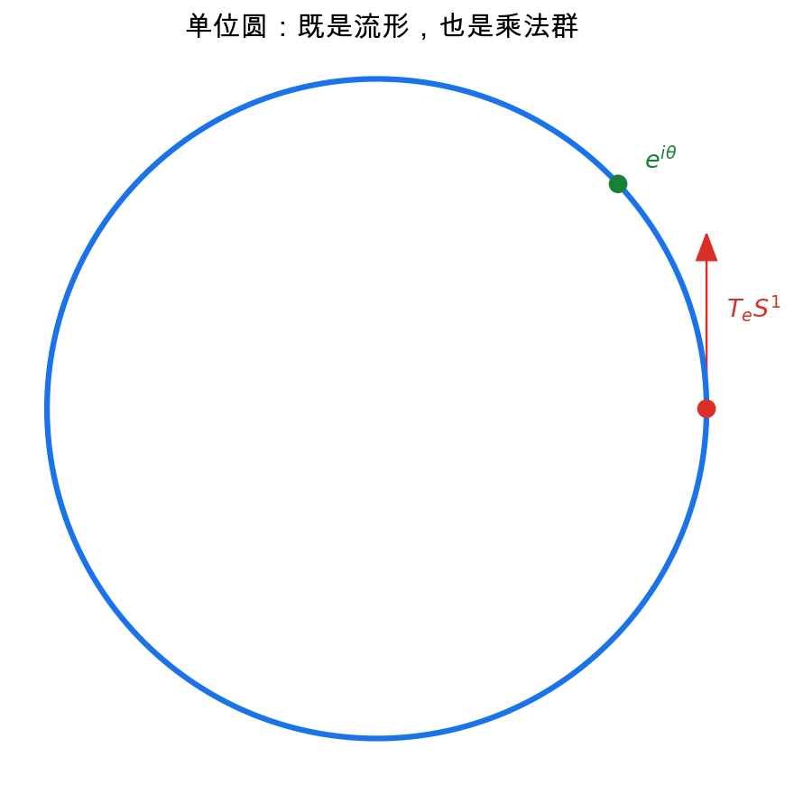
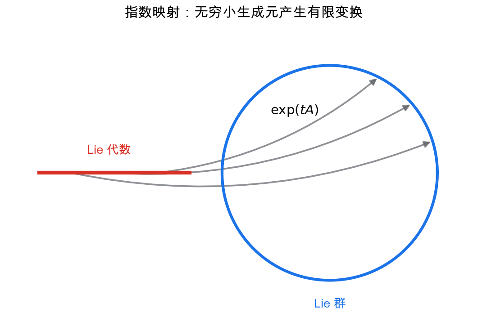
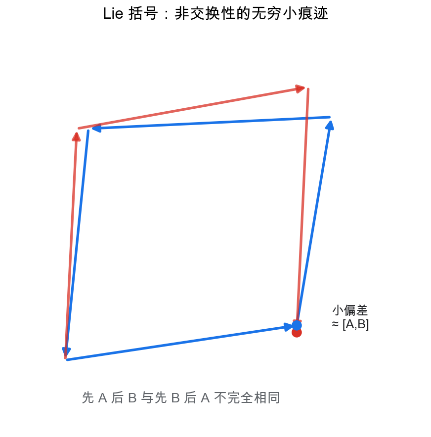

# 重学数学之十九: Lie 群与 Lie 代数——连续对称性如何被线性化

## 一、对称性不是只有离散翻转

前面我们见过很多“结构保持”的思想：线性变换保持线性结构，连续映射保持拓扑结构，光滑映射保持微分结构。

现在看另一类结构：**对称性**。

一个正方形有旋转 90 度的对称性，这是离散的。圆的旋转对称性则是连续的：你可以旋转任意角度。

连续对称性自然形成 Lie 群。

> **Lie 群 = 同时是群、又是光滑流形的对象，并且乘法和取逆都是光滑映射。**

最简单的例子是单位圆：

$$
S^1=\left\{e^{i\theta}\mid \theta\in\mathbb R\right\}
$$

它既是圆形流形，又是复数乘法下的群。

Lie 群的关键是：群运算描述对称性的组合，流形结构允许我们对对称性做微积分。

## 二、为什么需要 Lie 代数？

Lie 群可能是弯曲的。比如 $SO(3)$ 是三维旋转群，它不是普通向量空间。

但在恒等元附近，Lie 群可以被切空间近似。

这个切空间叫 Lie 代数：

$$
\mathfrak g=T_eG
$$

它是线性的，因此可以用线性代数处理。

核心想法就是：

> **Lie 代数是 Lie 群在恒等元处的无穷小版本。**

如果 Lie 群描述有限对称变换，Lie 代数描述无穷小生成元。

为什么只看恒等元就够？因为群里任意一点都可以通过左乘或右乘搬回恒等元附近。也就是说，整个群的局部结构可以从恒等元处的切空间复制出去。恒等元是“什么都不做”的变换，从这里出发看无穷小变化，最自然也最干净。

## 三、指数映射：从无穷小走到有限变换

Lie 代数中的元素可以通过指数映射回到 Lie 群：

$$
\exp:\mathfrak g\to G
$$

对矩阵 Lie 群，这就是矩阵指数：

$$
\exp(A)=I+A+\frac{A^2}{2!}+\frac{A^3}{3!}+\cdots
$$

在 $SO(2)$ 中，Lie 代数元素是：

$$
A=
\begin{pmatrix}
0&-\omega\\
\omega&0
\end{pmatrix}
$$

指数映射给出旋转矩阵：

$$
\exp(A t)=
\begin{pmatrix}
\cos \omega t&-\sin \omega t\\
\sin \omega t&\cos \omega t
\end{pmatrix}
$$

所以连续旋转可以理解为无穷小旋转不断流动的结果。

指数映射不是说每个群元素都一定能被唯一写成 $\exp X$。在恒等元附近通常可以这样理解，但全局上可能有多值、覆盖或到不了的问题。它最可靠的用途，是把“小扰动”从线性空间带回弯曲的群上。

## 四、Lie 括号：非交换性的无穷小痕迹

如果 Lie 群是交换的，事情很简单。但许多重要群不交换：

$$
AB\ne BA
$$

三维旋转就是典型例子：先绕 $x$ 轴转，再绕 $y$ 轴转，通常不等于反过来。

Lie 代数用 Lie 括号记录这种非交换性。

对矩阵 Lie 代数：

$$
[A,B]=AB-BA
$$

它衡量两个无穷小变换交换失败的程度。

括号不是随便定义出来的。若先沿 $A$ 走一小步，再沿 $B$ 走一小步，然后反向走回去，最后通常不会完全回到原点；留下的二阶偏差正由 $[A,B]$ 控制。它记录的是“先后顺序”在无穷小层面的痕迹。

这和微分几何里的曲率有相似味道：你沿不同方向做小移动，回来后可能出现二阶偏差。Lie 括号就是对称性非交换性的局部版本。

## 五、典型例子

| Lie 群 | Lie 代数 | 含义 |
|--------|----------|------|
| $S^1$ | $\mathbb R$ | 平面旋转角 |
| $SO(2)$ | 反对称 $2\times2$ 矩阵 | 二维旋转 |
| $SO(3)$ | 反对称 $3\times3$ 矩阵 | 三维旋转 |
| $SE(3)$ | 角速度 + 线速度 | 刚体运动 |
| $GL(n)$ | 所有 $n\times n$ 矩阵 | 可逆线性变换 |
| $U(n)$ | 反 Hermitian 矩阵 | 量子态的酉变换 |

这些例子说明 Lie 群不是抽象玩具。它们就是旋转、刚体运动、坐标变换和量子演化的语言。

## 六、群作用：对称性必须作用在某个东西上

只说 Lie 群还不够。对称性总要作用在某个空间上。

一个群作用是映射：

$$
G\times M\to M,\quad (g,x)\mapsto g\cdot x
$$

满足：

$$
e\cdot x=x,\quad (g_1g_2)\cdot x=g_1\cdot(g_2\cdot x)
$$

这两个条件保证“作用”真的尊重群结构。恒等元作用后什么都不变；先做 $g_2$ 再做 $g_1$，等于做组合 $g_1g_2$。没有这两个条件，群元素只是一些随便的变换，不能称为同一个对称系统。

例如 $SO(3)$ 作用在球面 $S^2$ 上，$SE(3)$ 作用在三维空间里的刚体位姿上，酉群 $U(n)$ 作用在量子态空间上。

一旦有了群作用，就能问两个重要问题。

第一个问题是轨道：

$$
G\cdot x=\left\{g\cdot x\mid g\in G\right\}
$$

它表示从 $x$ 出发，通过对称变换能到达哪里。

第二个问题是稳定子：

$$
G_x=\left\{g\in G\mid g\cdot x=x\right\}
$$

它表示哪些对称变换看起来没有改变 $x$。

很多几何分类问题其实就是在研究轨道和稳定子。比如球面上任意两个点都能被旋转互相送到，所以 $S^2$ 可以看成：

$$
S^2\simeq SO(3)/SO(2)
$$

这句公式很有味道：球面不是孤立出现的，它是旋转群除掉“绕固定点旋转”的剩余自由度。

这里的商 $SO(3)/SO(2)$ 可以这样读：要指定球面上一点，可以从北极出发做一个三维旋转；但所有绕北极方向的旋转都不会改变这个点，所以要把这些“看不见的自由度”除掉。

## 七、伴随表示：群怎样作用在自己的无穷小上

Lie 群可以作用在别的空间上，也可以作用在自己的 Lie 代数上。

给定 $g\in G$，共轭变换：

$$
h\mapsto ghg^{-1}
$$

在恒等元处微分，得到伴随表示：

$$
\mathrm{Ad}_g:\mathfrak g\to\mathfrak g
$$

它描述的是：换一个群元素当参考系后，无穷小生成元怎样改变。

再对 $\mathrm{Ad}$ 在恒等元处微分，得到：

$$
\mathrm{ad}_X(Y)=[X,Y]
$$

也就是说，Lie 括号就是伴随作用的无穷小版本。

这个观点能把很多东西串起来。刚体运动里，速度在不同坐标系下会变；规范场论里，联络在规范变换下会变；机器人位姿优化里，误差到底写在左边还是右边，也和伴随表示有关。

伴随表示的实际意义是“换坐标系”。同一个无穷小运动，用车体坐标系看和用世界坐标系看，坐标会不同；$\mathrm{Ad}$ 就是在群语言里记录这种转换。

## 八、BCH 公式：两个小变换合成后还是小变换吗？

如果群是交换的，那么：

$$
\exp(X)\exp(Y)=\exp(X+Y)
$$

但非交换 Lie 群里，这不对。正确公式的开头是 Baker-Campbell-Hausdorff 公式：

$$
\log(\exp X\exp Y)
=
X+Y+\frac12[X,Y]+\cdots
$$

多出来的第一项正是 Lie 括号。

这就是 Lie 括号的另一个解释：两个无穷小运动合成时，非交换性从二阶项开始冒出来。

在工程里，这个公式并不只是理论。做 $SO(3)$ 或 $SE(3)$ 优化时，我们常常把当前位姿 $G$ 更新为：

$$
G_{\text{new}}=\exp(\delta)G
$$

这里 $\delta$ 在 Lie 代数里，是一个小扰动。这样更新的好处是，数值迭代永远留在群上。旋转矩阵不会因为普通加法更新而慢慢失去正交性。

## 九、应用场景

Lie 群与 Lie 代数在所有涉及连续对称性的地方出现。

| 领域 | 作用 |
|------|------|
| 机器人 | $SE(3)$ 描述位姿，Lie 代数描述速度和扰动 |
| 计算机视觉 | 相机姿态、SLAM、三维重建依赖 $SO(3),SE(3)$ 优化 |
| 物理 | Noether 定理把连续对称性和守恒律联系起来 |
| 量子力学 | 酉群描述量子演化，Lie 代数描述 Hamiltonian |
| 控制理论 | Lie 括号判断非完整系统的可达性 |
| 深度学习 | 等变网络利用群作用保持对称性 |

## 十、与前几章的连接

1. **微分几何**：Lie 群是带群结构的流形。
2. **线性代数**：Lie 代数把局部对称性线性化。
3. **动力系统**：Lie 代数元素生成群上的流。
4. **优化**：流形优化常在 Lie 代数中做局部更新。
5. **物理**：对称性、守恒律、场论都依赖 Lie 群。

## 十一、前沿展望

### 11.1 等变神经网络

等变神经网络将 Lie 群的表示论直接嵌入深度学习架构。**SE(3)/E(3) 等变网络**（如 E(n)-GNN、NequIP、Equiformer）对三维空间中的旋转和平移保持等变性，用于：
- 分子属性预测：原子坐标旋转后，预测的能量/力不变（等变），提升样本效率。
- 蛋白质结构预测：AlphaFold2 的等变注意力层处理残基间的三维几何关系。
- 机器人感知：点云处理中对刚体变换保持等变，提升泛化性。

Steerable CNNs（Cohen 等 2016）在连续旋转群 $SO(2)/SO(3)$ 下构造等变卷积，理论基础是群表示的约化分解（Schur 引理）。

### 11.2 Lie 群上的数值积分与几何力学

经典 Runge-Kutta 方法不能保证轨迹始终留在 Lie 群流形上（如旋转矩阵可能失去正交性）。**Lie 群积分器**（Munthe-Kaas 1998；Celledoni & Iserles 2001）在 Lie 代数中做更新，再用指数映射搬回群上，同时保持结构守恒（正交性、单位行列式）。应用于刚体动力学仿真、量子力学算符演化和控制系统设计。

### 11.3 量子群与量子对称性

Jimbo（1985）和 Drinfel'd（1986）将经典 Lie 代数的 Hopf 代数结构变形为**量子群** $U_q(\mathfrak{g})$（参数 $q$ 取复数），在 $q=1$ 时退化为经典 Lie 代数包络代数。量子群出现在：
- 量子可积系统（Yang-Baxter 方程的系统解）。
- 拓扑量子场论（Jones 多项式和 Kauffman 括号的代数根源）。
- 量子信息：量子对称性保护的错误类型（量子纠错码的对称子结构）。

## 十二、总结

Lie 理论的核心结构：

1. **Lie 群**：连续对称性的空间。
2. **Lie 代数**：恒等元处的切空间，描述无穷小变换。
3. **指数映射**：把无穷小生成元积分成有限群元素。
4. **Lie 括号**：记录无穷小变换的非交换性。
5. **群作用**：对称性如何作用在空间或对象上。
6. **伴随表示**：群作用在自己的无穷小结构上。

> **Lie 群把连续对称性几何化，Lie 代数把它线性化。**

---

*Lie 群让我们看到对称性本身可以被微分。下一章进入表示论，看看抽象群如何变成实实在在的线性变换，让对称性真正作用在向量空间、函数空间和物理状态上。*
