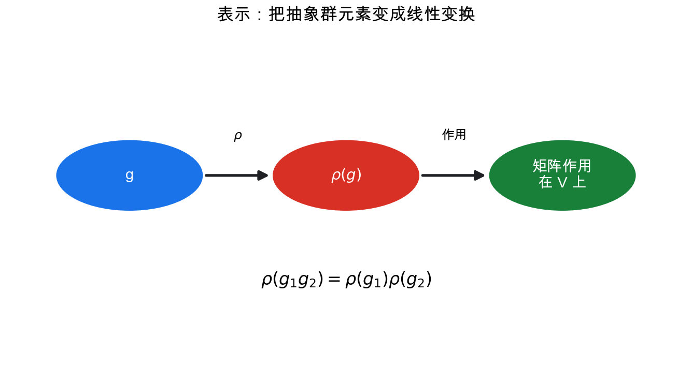
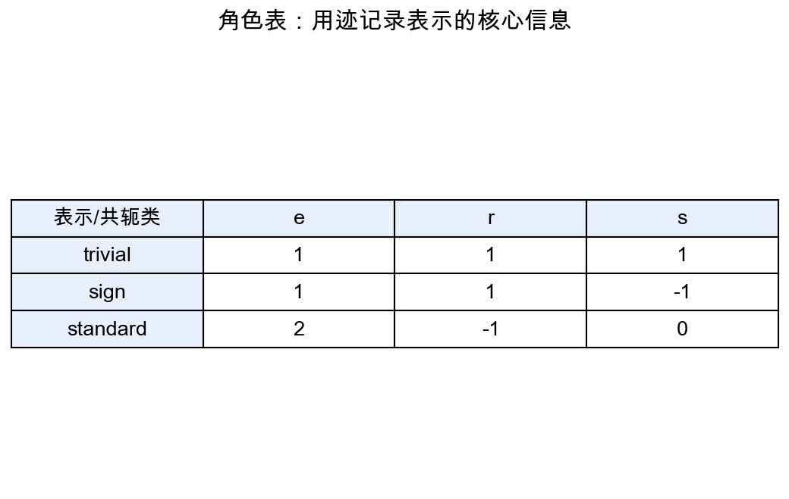
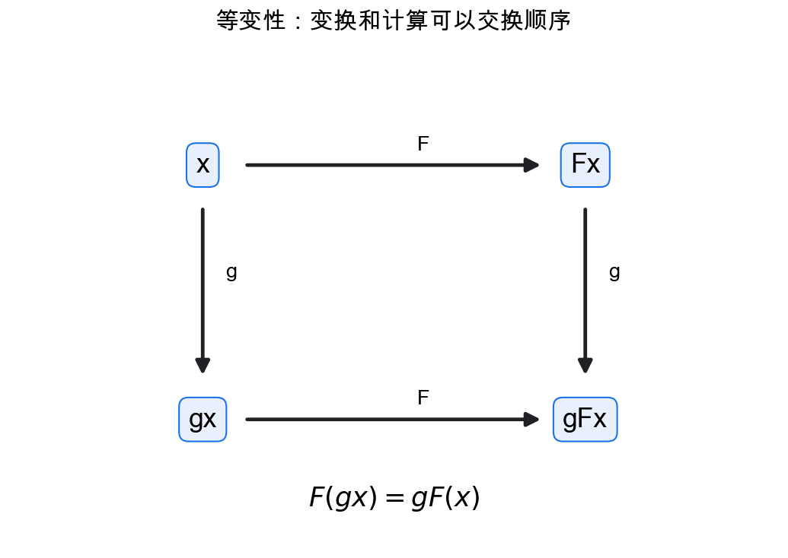

# 重学数学之二十: 表示论与对称性——把抽象群变成线性变换

## 一、为什么有了群还不够？

Lie 群告诉我们连续对称性本身可以被微分。但如果只知道一个群 $G$，我们还没有说明它怎样作用在具体对象上。

表示论的出发点是：

> **把抽象对称性变成向量空间上的线性变换。**

一个群表示是同态：

$$
\rho:G\to GL(V)
$$

它把每个群元素 $g$ 变成一个可逆线性变换 $\rho(g)$，并满足：

$$
\rho(g_1g_2)=\rho(g_1)\rho(g_2)
$$

群的组合关系在矩阵乘法中被保留下来。

这一步非常关键。抽象的旋转、翻转、置换，一旦变成矩阵，就可以用线性代数研究。

同态条件是表示论的核心。如果只给每个群元素随便配一个矩阵，那只是贴标签；要求 $\rho(g_1g_2)=\rho(g_1)\rho(g_2)$，才保证群里的关系在向量空间里被忠实地执行。表示论研究的不是“矩阵集合”，而是“对称性的线性实现”。

## 二、不可约表示：对称性的基本音符

如果表示空间 $V$ 有一个非平凡子空间 $W$，并且对所有 $g\in G$：

$$
\rho(g)W\subset W
$$

那么 $W$ 是不变子空间。

如果一个表示没有非平凡不变子空间，就叫不可约表示。

直觉上：

> **不可约表示是不能再分解的对称性基本模块。**

这类似线性代数中把矩阵对角化，或者傅里叶分析中把函数分解成频率。表示论把复杂对称性分解成不可约成分。

不变子空间的意思是：对称性作用不会把你带出这个子空间。若存在这样的子空间，整个表示就可以分块研究；若不存在，说明这个表示在对称性作用下已经“搅在一起”，不能再拆成更小的独立部分。

## 三、角色：用迹压缩表示信息

一个表示可能由很多矩阵组成。角色把每个矩阵压缩成迹：

$$
\chi_\rho(g)=\mathrm{tr}(\rho(g))
$$

迹在相似变换下不变，所以角色只依赖共轭类。

共轭可以理解成同一个对称操作在不同坐标系下的写法。矩阵可能变了，但迹不变。因此角色忽略了坐标选择，保留了表示中真正由对称性决定的信息。

有限群表示论中，角色表非常强大。不可约角色彼此正交，复杂表示可以通过角色分解。

角色的哲学是：

> **不必记住每个矩阵的全部细节，迹已经保留了分解表示所需的核心信息。**

## 四、Fourier 分析也是表示论

圆群 $S^1$ 的不可约复表示是：

$$
\rho_n(e^{i\theta})=e^{in\theta},\quad n\in\mathbb Z
$$

这正是傅里叶基：

$$
e^{inx}
$$

所以傅里叶分析可以理解为：

> **把函数按圆群的不可约表示分解。**

更一般地，在非交换群上也可以做 Fourier 分析，只是频率不再是整数，而是不可约表示。

这把第一章傅里叶变换和本章直接接起来。

## 五、对称性与物理

量子力学中，状态空间是 Hilbert 空间。物理对称性必须作用为酉算子：

$$
U(g):\mathcal H\to\mathcal H
$$

粒子自旋、角动量、能级简并，都由旋转群和 Lorentz 群的表示控制。

Noether 定理说连续对称性对应守恒量；表示论进一步告诉我们守恒量如何组织状态空间。

## 六、等变性：现代机器学习中的表示论

如果输入空间有群作用，输出空间也有群作用，映射 $F$ 满足：

$$
F(gx)=gF(x)
$$

就叫等变。

卷积神经网络的平移等变性就是最熟悉的例子。图神经网络利用置换等变性；几何深度学习研究旋转、平移、规范变换下的等变结构。

等变和不变要分开。不变是 $F(gx)=F(x)$，变换输入后输出完全不变；等变是输出也按同样规则变换。分类任务常要不变，分割、姿态估计、向量场预测常要等变，因为输出本身带有方向或位置结构。

这说明表示论不是只属于纯数学，它正在成为理解神经网络结构设计的语言。

## 七、Schur 引理：不可约性为什么这么有力

表示论里最常用的一把小刀是 Schur 引理。

设 $V,W$ 是两个不可约表示。如果一个线性映射 $T:V\to W$ 与群作用可交换：

$$
T\rho_V(g)=\rho_W(g)T,\quad \forall g\in G
$$

那么只有两种情况：要么 $T=0$，要么 $T$ 是同构。特别地，当 $V=W$ 且底域是复数时，$T$ 只能是标量倍恒等映射。

这听起来很小，却解释了很多现象。

在量子力学里，若 Hamiltonian 和某个对称群可交换，状态空间会按不可约表示分块；在同一个不可约块里，对称性强到让很多算符只能像标量一样作用。这就是能级简并、选择定则和守恒量背后的线性代数。

在等变神经网络里，Schur 引理告诉我们：一个线性层如果要保持群等变，它在不可约表示分解后的矩阵形状会被严格限制。架构不是拍脑袋设计出来的，自由参数的位置由表示论决定。

## 八、正则表示：群把自己也表示出来

有限群 $G$ 有一个非常自然的表示，叫正则表示。

取向量空间：

$$
\mathbb C[G]=\left\{\sum_{g\in G}a_g e_g\right\}
$$

群元素 $h$ 通过左乘作用：

$$
h\cdot e_g=e_{hg}
$$

这个表示很大，维数等于 $|G|$。但它包含了群的全部不可约表示。事实上：

$$
\mathbb C[G]\cong \bigoplus_{\lambda} d_\lambda V_\lambda
$$

其中 $V_\lambda$ 遍历所有不可约表示，$d_\lambda=\dim V_\lambda$。

这就是有限群版的 Fourier 分析：函数空间 $\mathbb C[G]$ 可以按不可约表示分解。对交换群，每个不可约表示都是一维字符，于是回到熟悉的离散 Fourier 变换；对非交换群，频率变成矩阵块。

这里的 $\mathbb C[G]$ 可以看成群上的所有复值函数。正则表示让群通过平移作用在这些函数上。于是“分析群上的函数”变成“分解这个表示”，这就是 Fourier 分析在表示论里的自然形态。

## 九、从紧群到 Peter-Weyl：连续版 Fourier 展开

对紧 Lie 群，类似结论由 Peter-Weyl 定理给出。

粗略地说，紧群 $G$ 上的平方可积函数可以由不可约酉表示的矩阵元张成：

$$
L^2(G)\cong \widehat{\bigoplus}_{\lambda} V_\lambda\otimes V_\lambda^\ast
$$

这就是在圆群 $S^1$ 上 Fourier 级数的巨大推广。

所以“频率”并不一定是一个整数。它可以是 $SO(3)$ 的角动量表示，可以是紧群的不可约表示，也可以是空间群里的能带标签。

这也是表示论最值得记住的一句话：只要一个问题里有对称性，函数空间往往就能按对称性分解。

紧性在这里很关键。它保证表示有足够好的酉化和分解性质，类似有限群中可以对群元素做平均。非紧群的表示论要复杂得多，很多分解会涉及连续谱。

## 十、限制与诱导：对称性改变时，表示怎样跟着变

很多实际问题不是固定一个群不动，而是在大对称性和小对称性之间切换。

如果 $H\subset G$，一个 $G$ 的表示可以限制到 $H$：

$$
\mathrm{Res}^G_H V
$$

这表示只看小群 $H$ 的作用。物理里，系统从高对称相进入低对称相时，原来的不可约表示往往会在子群下分裂成几个表示。这就是对称性破缺的代数影子。

反过来，从 $H$ 的表示也可以诱导出 $G$ 的表示：

$$
\mathrm{Ind}_H^G W
$$

直觉是：先知道稳定子或局部对称性怎样作用，再把它沿整个群的轨道铺开。

这在很多地方出现。晶体空间群的表示可以从小群表示诱导出来；粒子物理里，小群分类决定粒子态；几何深度学习里，局部纤维的表示会被推广成整个空间上的等变场。

所以表示论不只是“把群变成矩阵”。它还研究对称性放大、缩小、破缺和迁移时，线性结构如何随之改变。

## 十一、应用场景

| 领域 | 表示论扮演的角色 |
|------|----------------|
| 傅里叶分析 | 频率是圆群/平移群的不可约表示 |
| 量子力学 | 粒子状态、角动量、自旋由群表示分类 |
| 晶体学 | 空间群表示解释晶体对称性和能带 |
| 化学 | 分子振动模式按对称群表示分解 |
| 图像与几何学习 | 等变网络利用群表示保持结构 |
| 数论 | automorphic forms 和 Galois 表示连接深层结构 |

## 十二、与前几章的连接

1. **傅里叶变换**：本质是交换群上的表示分解。
2. **线性代数**：表示把群元素变成矩阵。
3. **范畴论**：表示是从群到向量空间自同构范畴的函子。
4. **Lie 群**：连续群的表示由 Lie 代数表示控制。
5. **机器学习**：等变模型把先验对称性写进架构。

## 十三、前沿展望

### 13.1 几何表示论与 Kazhdan-Lusztig 猜想

Beilinson-Bernstein（1981）和 Brylinski-Kashiwara（1981）用 D-模（代数微分方程的层）证明了 Kazhdan-Lusztig 猜想：Verma 模的合成因子的重数由 Kazhdan-Lusztig 多项式（定义在 Weyl 群上的组合不变量）决定。这把群表示理论、代数几何（旗流形上的相交上同调）和组合数学联系在一起，是 20 世纪后半叶最重要的数学结果之一。

### 13.2 Langlands 纲领的几何化

Langlands 纲领（1967）是连接数论、表示论和代数几何的宏大统一框架，预言数域上自守表示与 Galois 表示之间存在深刻对应。**几何 Langlands 纲领**（Frenkel、Ben-Zvi、Nadler 等）将其翻译为：复曲线上的代数 D-模与主 G-丛的局部系之间的对应。Kapustin-Witten（2007）将几何 Langlands 解释为拓扑扭曲的 $\mathcal{N}=4$ 超对称 Yang-Mills 理论的电磁对偶，把物理学工具引入纯数学。

### 13.3 表示论与深度学习的交汇

Cohen 等（2016，2019）将群等变性的表示论刻画用于设计等变卷积层：任何 G-等变线性映射由 Schur 引理决定了其自由度（对不可约表示的分解），从而将"设计等变网络"化归为"分解目标群表示"。这为不同对称群（SO(2)、SO(3)、$E(3)$、置换群、二面体群）的网络架构提供了系统化构造方法。

Zaheer 等（2017）的 Deep Sets 用这一框架证明：作用在点集上置换等变/不变函数的完全刻画，推导了 PointNet（Qi 等 2017）的理论最优性。

## 十四、总结

表示论的核心结构：

1. **表示**：群到线性变换群的同态。
2. **不变子空间**：对称作用不会带出的子空间。
3. **不可约表示**：对称性的基本模块。
4. **角色**：用迹压缩表示并支持分解。
5. **Fourier 分解**：表示论在交换群上的特例。
6. **等变映射**：尊重群作用的结构保持映射。
7. **Schur 引理**：不可约表示之间的等变映射几乎没有自由度。

> **表示论把对称性翻译成线性代数，并把复杂对象按对称性分解。**

---

*表示论把对称性翻译成了线性代数语言。下一章进入代数几何，看看多项式方程怎样定义出几何空间，把代数运算和几何形状放在同一张图里。*
