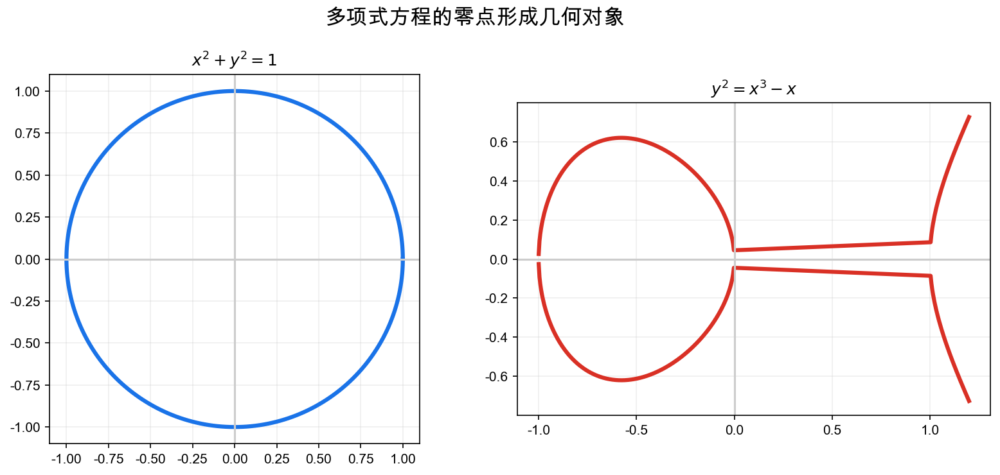
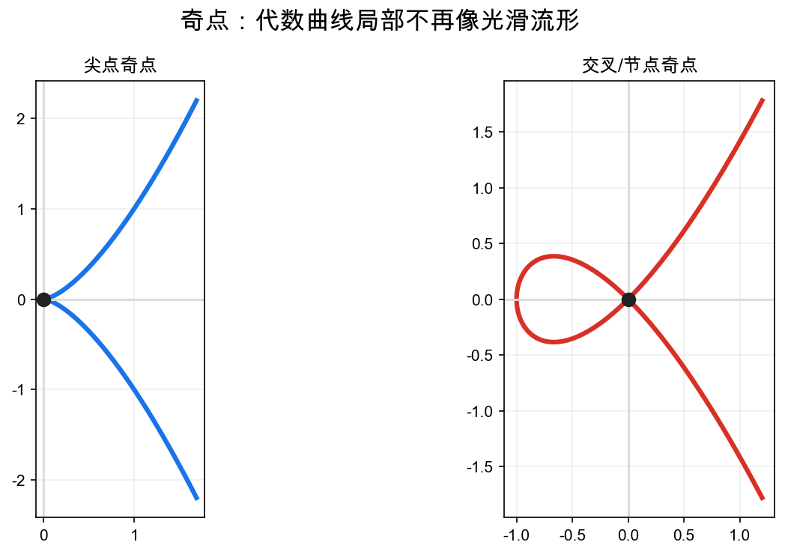
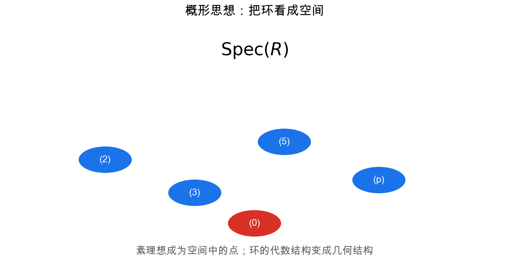

# 重学数学之二十一: 代数几何——方程组如何长成空间

## 一、从一个方程的形状开始

代数几何的起点很朴素：

> **多项式方程的解集是什么形状？**

例如：

$$
x^2+y^2=1
$$

是一条圆；而：

$$
y^2=x^3-x
$$

是一条椭圆曲线。

代数几何研究的是由多项式方程定义的空间：

$$
V(I)=\left\{x\mid f(x)=0,\ \forall f\in I\right\}
$$

这里 $I$ 是一个多项式理想。

核心想法是：

> **代数关系定义几何对象，几何对象反过来反映代数结构。**

这里的 $I$ 不一定只有一个方程。它可以是一整套方程以及这些方程的所有代数组合。用理想而不是单个多项式，是因为几何对象通常由“所有会在它上面消失的方程”共同决定。

## 二、理想：同时记录一族方程

如果只看一个方程，结构太弱。实际问题常常是一组方程：

$$
f_1=0,\dots,f_k=0
$$

所有由这些方程组合出来的多项式也应该被视为同一约束系统的一部分。

这就是理想：

$$
I=(f_1,\dots,f_k)
$$

它满足：如果 $f\in I$，任意多项式 $h$ 乘上去仍在 $I$：

$$
hf\in I
$$

理想不是技术细节，而是在代数层面记录“这些方程共同强迫了什么”。

比如如果 $x=0$ 和 $y=0$ 都成立，那么 $x+y=0$、$x^2+xy=0$ 也必然成立。理想把这些逻辑后果一次性收进来，避免我们只盯着某一组生成元，而忘了它们生成的整个约束系统。

## 三、坐标环：用函数认识空间

给定代数集合 $V$，我们可以看在 $V$ 上的多项式函数。

如果两个多项式在 $V$ 上取值完全相同，就应该视为同一个函数。

于是得到坐标环：

$$
k[V]=k[x_1,\dots,x_n]/I(V)
$$

这是一个非常深的转向：

> **研究空间，也可以研究空间上的函数环。**

这和微分几何中“用光滑函数认识流形”、泛函分析中“用函数空间认识对象”是同一精神。

商掉 $I(V)$ 的意思是：凡是在 $V$ 上恒为零的多项式，都不应该被看成不同函数。坐标环不是原来环境空间的函数环，而是“只在这个几何对象上还能被区分的函数”。

## 四、Hilbert 零点定理：代数和几何的桥

在代数闭域上，Hilbert 零点定理给出理想和几何解集之间的对应：

$$
I(V(I))=\sqrt I
$$

其中 $\sqrt I$ 是根理想。

它说明：

> **多项式方程的几何零点，决定了理想的根结构。**

这正是代数几何的基本桥梁：理想对应方程，方程对应几何，几何又反过来恢复代数信息。

这里出现根理想，是因为几何零点看不见幂零信息。方程 $x=0$ 和 $x^2=0$ 在普通点集上有同一个零点集合，但代数上后者带有“重根”信息。经典零点定理会把这种幂的信息压成根理想；现代概形则会重新把这些厚度信息纳入空间。

## 五、奇点：方程形状坏掉的地方

不是所有代数曲线都光滑。

例如：

$$
y^2=x^3
$$

在原点有尖点；而：

$$
y^2=x^2(x+1)
$$

在原点有交叉。

奇点很重要，因为它们是几何结构发生退化的地方。解析奇点，就是理解方程组何时不能像流形那样局部展开。

## 六、射影空间：把无穷远点加回来

欧氏平面里，两条平行线不相交。但射影几何说：它们在无穷远处相交。

射影空间把比例相同的向量视为同一点：

$$
[x_0:x_1:\dots:x_n]
$$

其中：

$$
[\lambda x_0:\lambda x_1:\dots:\lambda x_n]=[x_0:x_1:\dots:x_n]
$$

射影化的好处是让许多定理更干净。例如两条射影平面曲线的交点数可以稳定计算。

直观上，射影空间记录的是“方向”而不是“向量长度”。点 $[x_0:\cdots:x_n]$ 是一条过原点的直线。无穷远点不是额外补丁，而是那些在仿射坐标里看不到的方向。

## 七、概形：为什么还要更抽象？

经典代数几何主要研究域上的零点。但现代代数几何希望同时处理：

- 多重根。
- 整数上的方程。
- 有限域上的解。
- 局部环和粘合。
- 算术与几何的统一。

概形的想法是：把环本身看成空间。

对一个交换环 $R$，定义：

$$
\mathrm{Spec}(R)
$$

为它的素理想集合，并带上结构层。

这听起来抽象，但哲学清楚：

> **如果坐标环能决定空间，那么任意环也应该能被看成某种空间。**

为什么点是素理想？在经典情形里，一个点 $a$ 对应所有在 $a$ 处取值为 0 的多项式，这些多项式组成一个极大理想。概形把“点”的概念放宽到素理想，是为了同时记录普通点、不可约子空间的泛点，以及整数环里素数这样的算术点。

概形让数论问题变成几何问题。整数环 $\mathbb Z$ 也有一个“空间”，素数就是其中的点。

## 八、Groebner 基：代数几何怎样真的算起来

如果给你一个理想：

$$
I=(f_1,\dots,f_k)\subset k[x_1,\dots,x_n]
$$

你很快会遇到计算问题。

一个多项式 $g$ 是否属于 $I$？两个理想是否定义同一个解集？怎样消去变量？怎样把方程组化成更容易求解的形式？

Groebner 基就是为这些问题准备的。

它先给单项式排一个顺序，然后把多项式除法推广到多变量情形。若一组生成元 $G=\{g_1,\dots,g_m\}$ 的首项理想足够好，那么任意多项式对 $G$ 做除法，余数就成为标准形。

直觉上，Groebner 基是多项式方程组的“行阶梯形”。线性方程组用高斯消元，多项式方程组用 Buchberger 算法。

例如消元顺序可以把几何投影转化为代数计算。想从方程组里消去 $y,z$，得到只关于 $x$ 的约束，就可以选择合适的单项式顺序，让 Groebner 基自动把这些信息暴露出来。

这就是代数几何进入机器人运动学、计算机视觉和符号计算的入口：抽象的理想真的能算。

## 九、维数：一个代数空间到底有多少自由度

代数簇的维数不是看它嵌在几维空间里，而是看它自身有多少自由参数。

一条平面曲线嵌在 $\mathbb A^2$，但维数是 1；一个曲面嵌在 $\mathbb A^3$，维数是 2。

代数上，维数可以通过坐标环的 Krull 维数表达：

$$
\dim V=\dim k[V]
$$

也就是素理想链的最大长度。

这个定义一开始很冷，但它有一个清楚的动机：在概形里，我们不总能靠眼睛看几何形状，只能从环里读出自由度。

素理想链可以理解成一层层不可约子空间的包含关系。点包含在曲线里，曲线包含在曲面里，链越长，说明空间里可嵌套的几何层次越多，也就是自由度越高。

在应用里，维数也很实际。统计模型的参数空间如果映射到分布空间后维数下降，就说明有些参数不可识别；张量分解的割线簇维数如果不够，就说明低秩张量不能覆盖你想要的模型族。

## 十、层与局部化：空间不是只靠点拼出来的

概形真正比经典代数簇多出来的东西，是结构层。

只知道点集不够。我们还要知道每个开集上有哪些函数，并且这些函数怎样在重叠区域一致。

局部化是关键操作。给定环 $R$ 和一个素理想 $\mathfrak p$，局部环：

$$
R_{\mathfrak p}
$$

只关注 $\mathfrak p$ 附近的行为。那些不落在 $\mathfrak p$ 里的元素都被允许取倒数，因为它们在这个点附近“不为零”。

这和微分几何里的局部坐标图很像。只不过微分几何用开集和光滑函数，代数几何用素理想和局部环。

层语言的作用，是把“局部能做什么”和“能不能全局粘起来”分开。很多深刻问题都卡在这里：局部看都没问题，放到全局就有扭曲、障碍和上同调。

## 十一、应用场景

| 领域 | 代数几何扮演的角色 |
|------|------------------|
| 数论 | 椭圆曲线、模形式、算术几何 |
| 密码学 | 椭圆曲线密码、有限域曲线 |
| 机器人 | 多项式约束、运动学方程 |
| 计算机视觉 | 多视几何、本质矩阵、重建约束 |
| 优化 | 半代数集合、sum-of-squares 松弛 |
| 物理 | 弦论、规范理论、镜像对称 |
| 机器学习 | 代数统计、张量分解、模型可识别性 |

## 十二、与前几章的连接

1. **线性代数**：仿射空间、射影空间和矩阵秩条件。
2. **拓扑**：Zariski 拓扑把代数闭集作为基本闭集。
3. **范畴论**：概形语言高度依赖函子和粘合。
4. **表示论**：代数群和表示空间是代数几何对象。
5. **优化**：多项式约束优化与半代数几何相关。

## 十三、前沿展望

### 13.1 导出代数几何与∞-范畴化

Grothendieck 的经典代数几何建立在 Abelian 范畴和同调代数上。Lurie（2004，*Derived Algebraic Geometry*）和 Toën-Vezzosi 将概形推广到**导出概形**（derived scheme）：用简单化交换环（simplicial commutative ring）替换普通交换环，使截断上同调的高阶信息成为空间本身的一部分，优雅处理交叉乘积中的过渡情形（non-transverse intersections）。这是∞-范畴（第七章）进入代数几何的核心例证。

### 13.2 镜像对称与弦论

Candelas 等（1991）发现，某些 Calabi-Yau 3-流形（弦论的紧化空间）成对出现，其上的 A 模型（辛几何，量子上同调）和 B 模型（复几何，Hodge 理论）彼此交换——这就是**镜像对称**。它预言了复杂的枚举几何结论（如有理曲线计数公式），被严格证明后（Givental 1996；Lian-Liu-Yau 1997）成为现代数学的主要驱动力之一。

同调镜像对称（Kontsevich 1994）将其提升为 A∞-范畴（Fukaya 范畴）与导出相干层范畴之间的等价，是当前最活跃的纯数学领域之一。

### 13.3 热带几何与可组合代数几何

**热带几何**（Mikhalkin、Itenberg-Mikhalkin-Shustin 等 2000 年代）将代数曲线/曲面的复数结构"对数极限"到分段线性对象（热带曲线/曲面），可以用组合方法回答经典代数几何问题（Hurwitz 数、相交数、有理曲线计数）。它为复杂代数几何计算提供了组合化的快速算法，并与最优传输和多项式优化（多面体几何）有直接联系。

### 13.4 代数几何在机器学习中的应用

- **张量分解的可识别性**：多线性代数（Chiantini 等）从代数几何角度研究何时张量分解唯一，直接影响隐变量模型（混合高斯、LDA）的参数可识别性。
- **代数统计**（Drton、Sturmfels、Sullivant）：统计模型作为代数簇，参数估计对应射影代数几何操作。
- **神经网络表达能力**：深度网络定义的函数族与代数簇的维数和奇点结构相关（Montufar 等 2014）。

## 十四、总结

代数几何的核心结构：

1. **代数簇**：多项式方程的解集。
2. **理想**：记录方程生成的代数约束。
3. **坐标环**：用空间上的函数环认识空间。
4. **零点定理**：理想和几何零点之间的桥。
5. **奇点**：局部光滑结构失效的位置。
6. **射影空间**：加入无穷远点，让交点理论更稳定。
7. **概形**：把任意交换环看成几何空间。
8. **Groebner 基**：让多项式方程组可以消元和计算。
9. **层与局部化**：把局部函数和全局粘合纳入空间本身。

> **代数几何把方程组变成空间，再用空间理解方程。**

---

*代数几何展示了代数和空间如何统一。下一章进入量子信息，看看 Hilbert 空间、张量积、测量和纠缠怎样把线性代数、概率和信息论一起推向量子世界。*
