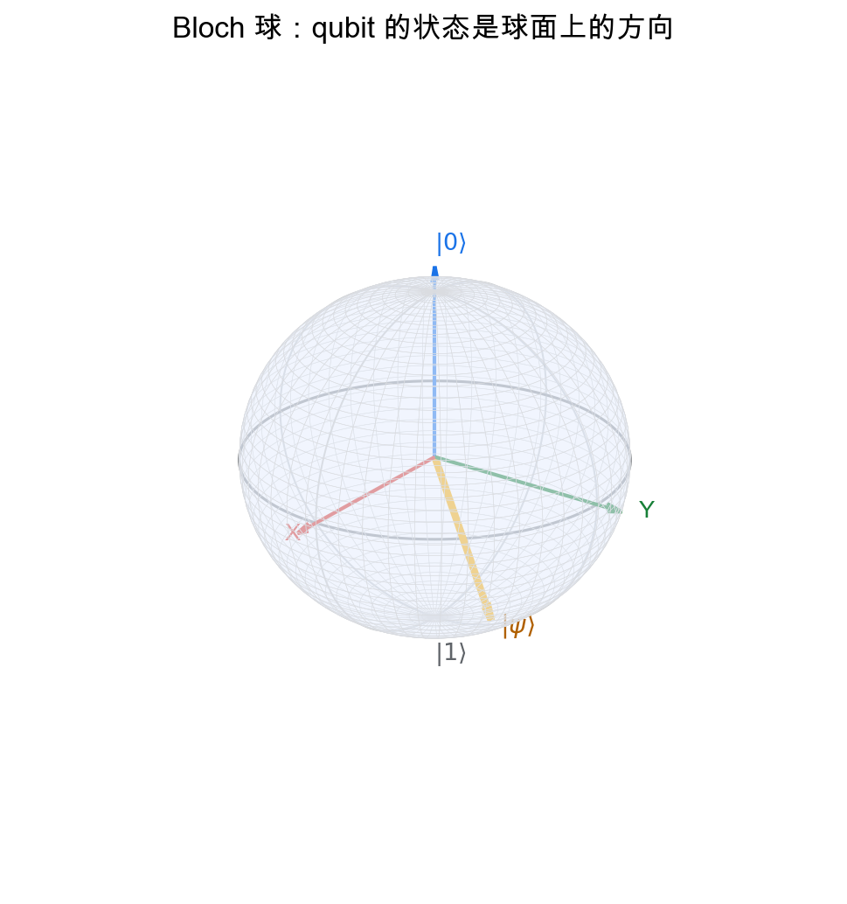
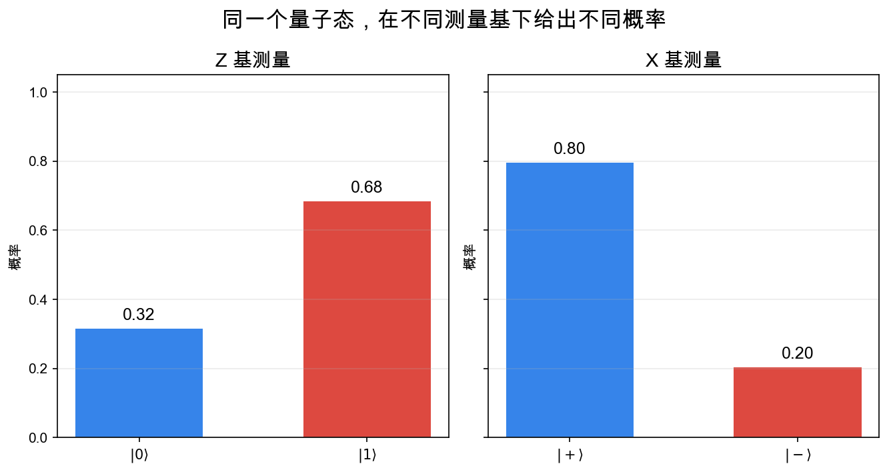
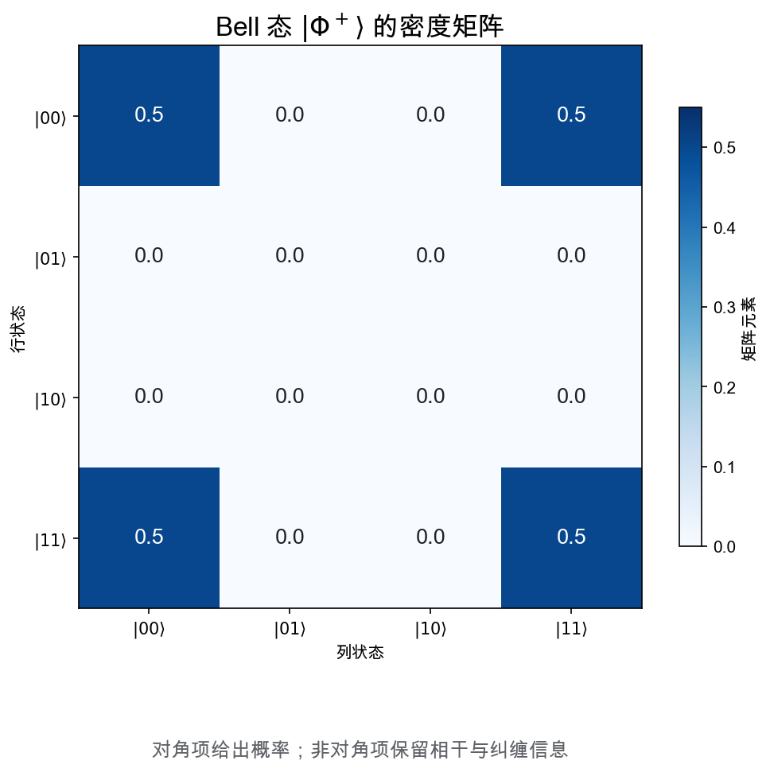

# 重学数学之二十二: 量子信息——当信息住进 Hilbert 空间
![[Pasted image 20260628173725.png]]
## 一、从一个比特不够用开始

经典信息的基本单位是 bit。它只有两个状态：

$$
0,\quad 1
$$

量子信息的基本单位是 qubit。它不是“既是 0 又是 1”的神秘说法，而是一个二维复 Hilbert 空间中的单位向量：

$$
|\psi\rangle=\alpha|0\rangle+\beta|1\rangle
$$

其中：

$$
|\alpha|^2+|\beta|^2=1
$$

真正新的地方是：状态本身是向量，测量结果才是概率。

Bloch 球把一个 qubit 画成三维球面上的点。北极是 $|0\rangle$，南极是 $|1\rangle$，赤道上的点是不同相位的叠加态。

这张图很重要，因为它说明 qubit 的状态空间不是一条线段。经典概率只能在 $0$ 和 $1$ 之间混合；量子态还多了相位，而相位会在干涉中显现。

## 二、测量：从向量到概率

给定状态：

$$
|\psi\rangle=\alpha|0\rangle+\beta|1\rangle
$$

在计算基 $\{|0\rangle,|1\rangle\}$ 下测量，得到：

$$
P(0)=|\alpha|^2,\quad P(1)=|\beta|^2
$$

测量不是单纯“读出隐藏值”。它会把状态投影到测量基中的某个方向。

如果换一个测量基，同一个状态会给出不同概率分布。这里的关键不是概率本身，而是概率依赖于我们如何提问。

这和经典统计很不一样。经典随机变量有一个样本空间；量子系统则把“可观察量”也放进结构里。

## 三、张量积：多个系统不是简单拼接

两个 qubit 的联合空间不是直和，而是张量积：

$$
\mathcal H_{AB}=\mathcal H_A\otimes\mathcal H_B
$$

如果每个 qubit 是二维，两个 qubit 的空间就是四维：

$$
|00\rangle,\ |01\rangle,\ |10\rangle,\ |11\rangle
$$

张量积带来一个根本现象：联合态不一定能拆成两个局部态。

例如 Bell 态：

$$
|\Phi^+\rangle=\frac{|00\rangle+|11\rangle}{\sqrt2}
$$

它不能写成：

$$
|\psi_A\rangle\otimes|\psi_B\rangle
$$

这就是纠缠。

## 四、纠缠：整体比部分多出来的结构

Bell 态里，每个单独 qubit 看起来都是随机的；但两个 qubit 放在一起，却有强相关。

如果测量第一个 qubit 得到 $0$，第二个也会得到 $0$；如果第一个得到 $1$，第二个也会得到 $1$。

纠缠最容易被误解成“远距离传信”。它不是。纠缠给出的是非经典相关性，不能单独用来超光速传递信息。

它真正改变的是资源观：

> **量子信息里，纠缠本身就是一种资源。**

量子隐形传态、量子密钥分发、量子纠错、量子计算的加速，都离不开纠缠。

## 五、密度矩阵：把不确定性也写进线性代数

纯态可以写成向量 $|\psi\rangle$。但如果我们只知道系统以概率 $p_i$ 处于不同纯态，就需要密度矩阵：

$$
\rho=\sum_i p_i|\psi_i\rangle\langle\psi_i|
$$

密度矩阵满足：

$$
\rho\succeq0,\quad \mathrm{tr}(\rho)=1
$$

它同时记录两种不确定性：

1. 量子叠加带来的相干性。
2. 我们对制备过程不了解带来的经典混合。

纯态满足：

$$
\rho^2=\rho
$$

混合态一般不满足。

## 六、熵：信息论进入量子世界

经典信息论中，熵是：

$$
H(p)=-\sum_i p_i\log p_i
$$

量子信息中，对应的是 von Neumann 熵：

$$
S(\rho)=-\mathrm{tr}(\rho\log\rho)
$$

如果把 $\rho$ 对角化，它就是特征值分布的 Shannon 熵。

这个定义看似只是把概率换成矩阵，但含义很深：量子系统的信息量由密度矩阵的谱决定。

纠缠熵就是把联合纯态的一部分取偏迹后，看子系统密度矩阵的 von Neumann 熵。整体是纯的，局部却像混合的，这正是纠缠的典型信号。

## 七、量子信道：允许的演化是什么？

封闭量子系统按酉变换演化：

$$
\rho\mapsto U\rho U^\dagger
$$

但真实系统会和环境耦合。更一般的量子信道是完全正、保迹映射：

$$
\mathcal E(\rho)=\sum_k E_k\rho E_k^\dagger,\quad
\sum_k E_k^\dagger E_k=I
$$

这叫 Kraus 表示。

它把噪声、退相干、测量、丢失粒子等过程统一到一个框架里。量子纠错的核心，就是设计编码，让关键信息在这些信道下仍能恢复。

## 八、不可克隆：量子信息不能随便复制

经典 bit 可以复制。看到一个 0，就再写一个 0；看到一个 1，就再写一个 1。

量子态不行。不存在一个统一的酉变换 $U$，能对任意未知态做到：

$$
U|\psi\rangle|0\rangle=|\psi\rangle|\psi\rangle
$$

这就是不可克隆定理。

证明的核心非常短。假设能复制两个态 $|\psi\rangle,|\phi\rangle$：

$$
U|\psi\rangle|0\rangle=|\psi\rangle|\psi\rangle,\quad
U|\phi\rangle|0\rangle=|\phi\rangle|\phi\rangle
$$

酉变换保持内积，所以左边内积是 $\langle\psi|\phi\rangle$，右边内积却是：

$$
\langle\psi|\phi\rangle^2
$$

除非两个态完全相同或正交，否则矛盾。

这不是一个小限制，而是量子信息的基本边界。量子密钥分发能发现窃听，正是因为窃听者不能无损复制未知量子态再慢慢测。

## 九、量子门与线路：把酉变换拆成可执行步骤

量子计算不是一次性施加一个巨大酉矩阵。实际做法是把它拆成局部门：

$$
U\approx U_m\cdots U_2U_1
$$

常见单 qubit 门包括 Pauli 门、Hadamard 门和相位门。双 qubit 门里，CNOT 最典型：

$$
|a,b\rangle\mapsto |a,a\oplus b\rangle
$$

Hadamard 负责制造叠加，CNOT 负责制造纠缠。只靠单 qubit 门永远不能产生纠缠；只有加入 entangling gate，量子线路才真正离开经典可分状态的世界。

从数学上看，量子线路是在 $U(2^n)$ 这个巨大酉群中，用少量局部生成元逼近目标变换。这里直接连到 Lie 群、表示论和数值优化：量子算法设计就是在高维酉空间里找一条可实现的路径。

## 十、Schmidt 分解：纠缠的最干净坐标系

任意双体纯态 $|\psi\rangle\in\mathcal H_A\otimes\mathcal H_B$ 都可以写成：

$$
|\psi\rangle=\sum_i \lambda_i |u_i\rangle\otimes |v_i\rangle
$$

其中 $\lambda_i\ge0$，$\{|u_i\rangle\},\{|v_i\rangle\}$ 是两边的正交基。这叫 Schmidt 分解。

它就像对一个矩阵做奇异值分解。Schmidt 系数 $\lambda_i$ 直接告诉我们纠缠有多少。

如果只有一个非零系数，态可分；如果有多个非零系数，态纠缠。子系统的密度矩阵特征值正是 $\lambda_i^2$，所以纠缠熵为：

$$
S_A=-\sum_i \lambda_i^2\log \lambda_i^2
$$

这也是张量网络能工作的原因之一。很多物理态的 Schmidt 谱衰减很快，意味着虽然 Hilbert 空间巨大，但有效纠缠结构可以被低秩近似抓住。

## 十一、量子纠错：不能复制，仍然可以保护

量子信息不能复制，但可以编码。

量子纠错的想法是把一个逻辑 qubit 嵌入多个物理 qubit 的子空间：

$$
|\psi\rangle\mapsto |\psi_L\rangle
$$

错误不是直接被“备份”抵消，而是通过 syndrome measurement 被诊断。测量 syndrome 时，我们只提取错误类型，不测出逻辑态本身。

Knill-Laflamme 条件给出一个清楚判据。若错误集合为 $\{E_a\}$，编码子空间投影为 $P$，可纠错当且仅当：

$$
P E_a^\dagger E_b P=c_{ab}P
$$

直觉是：错误可以在编码空间外留下可识别痕迹，但不能泄露逻辑态内部的信息。

这句话把量子纠错的难点说透了。我们要知道“出了什么错”，又不能知道“被保护的信息是什么”。

## 十二、应用场景

| 领域 | 量子信息扮演的角色 |
|------|------------------|
| 量子计算 | 用酉门、测量和纠缠构造算法 |
| 密码学 | 量子密钥分发利用测量扰动发现窃听 |
| 通信 | 量子信道容量描述可传输信息上限 |
| 物理 | 纠缠熵刻画多体系统和相变 |
| 纠错 | 通过编码抵抗退相干和噪声 |
| 机器学习 | 量子核、量子线路、张量网络模型 |

量子信息最有价值的地方，是它把物理问题变成信息问题，也把信息问题变成线性代数和算子代数问题。

## 十三、与前几章的连接

1. **线性代数**：量子态是 Hilbert 空间向量，观测量是算子。
2. **概率论**：测量结果是概率，但概率来自投影。
3. **信息论**：von Neumann 熵推广 Shannon 熵。
4. **泛函分析**：无限维量子系统需要算子理论。
5. **表示论**：物理对称性通过酉表示作用在状态空间上。
6. **优化**：量子态判别、纠错和变分量子算法都依赖凸优化。

## 十四、前沿展望

### 14.1 容错量子计算与表面码

Kitaev（2003）提出**拓扑量子码**（toric code）：把逻辑量子比特编码在二维晶格上的多体纠错码中，错误纠正对应拓扑的局部算符，不受局部噪声影响。**表面码**（Fowler 等 2012）是目前最成熟的容错量子计算方案：阈值错误率约 1%，物理量子比特开销约数百至数千倍。Google（2023）的 Sycamore 处理器已在表面码上演示了低于阈值的实验错误率，进入了容错量子计算的"低于阈值"时代。

GKP 码（Gottesman-Kitaev-Preskill 2001）将量子信息编码在谐振子的位置/动量上，用连续变量系统实现离散纠错，适用于光子量子计算。

### 14.2 量子机器学习与量子优势

**变分量子本征求解器**（VQE，Peruzzo 等 2014）和**量子近似优化算法**（QAOA，Farhi 等 2014）是近期噪声量子设备（NISQ 设备）上最有前途的算法：用参数化量子电路做功能逼近，通过经典优化器调整参数。理论上界：VQE 在化学问题中有量子优势（指数加速），但 NISQ 设备的噪声限制实际深度。

量子机器学习的核心理论问题（Biamonte 等 2017；Cerezo 等 2022）：量子 kernel 方法、barren plateau（梯度指数消失）和量子神经网络的可训练性，近年负面结果（大多数情况下无量子优势）推动了选择性量子优势的精确刻画。

### 14.3 量子纠错的代数结构

稳定子码（Calderbank-Shor-Steane 1996）由 Pauli 群的对易子群（稳定子群）$\mathcal{S}$ 生成，逻辑空间是 $\mathcal{S}$ 的 $+1$ 本征空间。Knill-Laflamme 条件给出了量子纠错码精确纠正错误集 $\mathcal{E}$ 的充要条件，是算子代数与量子信息的直接桥梁。非 Abelian 任意子（如 Fibonacci 任意子）支持本质容错的拓扑量子门，是拓扑量子计算的硬件基础，目前由 Microsoft Station Q 等机构积极研究。

## 十五、总结

量子信息的核心结构：

1. **qubit**：二维复 Hilbert 空间中的单位向量。
2. **测量**：把向量投影成概率结果。
3. **张量积**：联合系统的状态空间。
4. **纠缠**：不能分解为局部态的整体结构。
5. **密度矩阵**：统一纯态、混合态和不完全知识。
6. **von Neumann 熵**：矩阵谱上的信息量。
7. **量子信道**：开放系统中允许的信息演化。
8. **不可克隆与纠错**：量子信息不能复制，但可以通过子空间编码保护。

> **量子信息把信息的载体从集合提升到 Hilbert 空间，于是概率、相位和纠缠成为同一种线性结构的不同侧面。**

---

*量子信息告诉我们，复杂整体不一定能拆成独立部分。下一章我们会看到，当大量局部单元通过连接和反馈相互作用时，整体会生长出怎样的新行为。*
