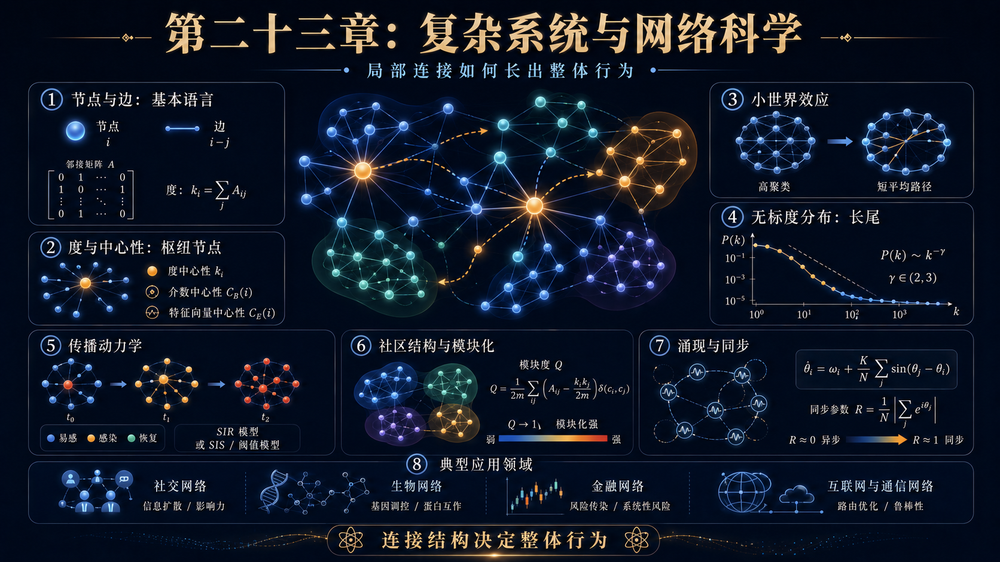
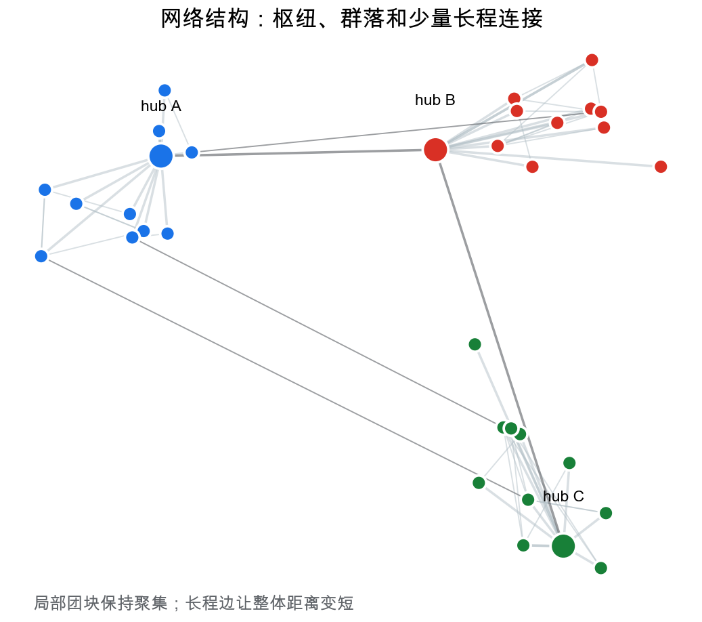
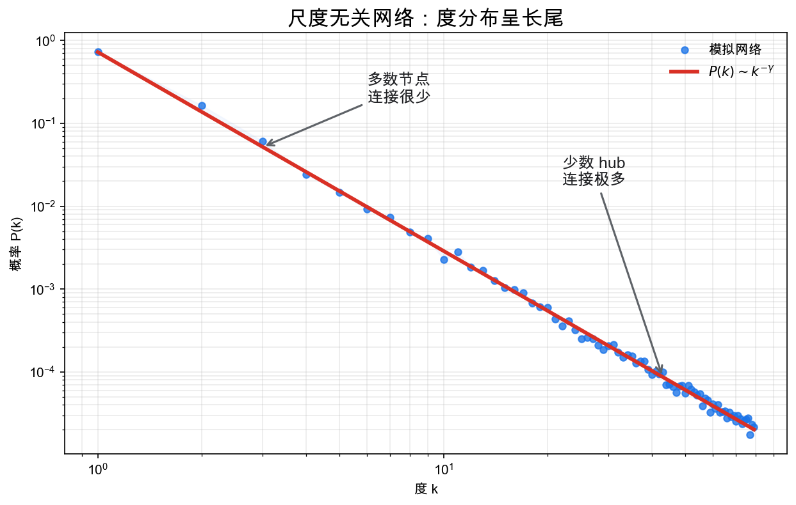
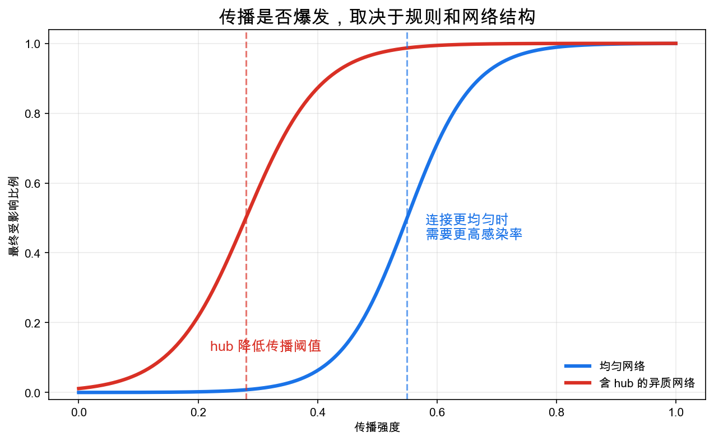

# 重学数学之二十三: 复杂系统与网络科学——局部连接如何长出整体行为

## 一、为什么不能只研究单个部件？

很多系统的难点不在部件本身，而在部件之间的连接。

一个神经元不等于大脑，一个用户不等于社交网络，一个蛋白质不等于细胞，一个城市路口不等于交通系统。

复杂系统的基本问题是：

> **当大量局部单元通过连接、反馈和传播相互作用时，整体会出现什么新行为？**

网络科学先把问题降到最朴素的形式：节点和边。

节点可以是人、网页、基因、城市、论文、服务器。边可以是朋友关系、超链接、调控关系、航班、引用、通信链路。

一旦有了网络，结构本身就成为研究对象。

## 二、度：一个节点连接了多少世界

最简单的指标是度：

$$
k_i=\sum_j A_{ij}
$$

其中 $A$ 是邻接矩阵。

度高的节点常被称为 hub。它们可能是机场网络中的枢纽城市，也可能是社交网络中的高影响力用户。

但“度高”不总是“重要”。有些节点度不高，却位于两个社群之间，承担桥梁作用。这引出介数中心性、特征向量中心性、PageRank 等指标。

网络科学的第一条经验是：

> **重要性不是节点自身的属性，而是节点在连接结构中的位置。**

这些中心性回答的问题不同。度中心性问“你直接连着多少人”；介数中心性问“多少最短路径要经过你”；特征向量中心性问“你连接的人本身重不重要”。所以一个机场、论文、用户或蛋白质是否关键，要先看我们关心的是流量、桥接，还是影响力放大。

## 三、小世界：远处其实很近

很多真实网络同时具有两个特点：

1. 局部聚集强：朋友的朋友常常也是朋友。
2. 平均路径短：任意两点之间隔得不远。

这正是小世界现象。

Watts-Strogatz 模型展示了一个关键机制：只要在规则格子中加入少量长程边，平均路径长度就会快速下降，而局部聚集仍然保留。

这解释了为什么信息、谣言、疾病、创新都能在大系统中迅速传播。

小世界的关键不是“每个人朋友很多”，而是少量跨社区边把原本很远的局部团块接了起来。局部结构负责聚集，长程边负责捷径。很多真实网络的效率正来自这两种结构同时存在。

## 四、尺度无关：少数 hub 改变系统命运

许多网络的度分布不是接近正态，而是长尾：

$$
P(k)\sim k^{-\gamma}
$$

也就是说，大多数节点连接很少，少数节点连接极多。

Barabasi-Albert 模型用两个机制解释这种结构：

1. 网络不断增长。
2. 新节点更倾向连接已有高连接节点。

这叫偏好连接，也常被概括为“富者愈富”。

偏好连接的意思是，新节点不是均匀随机选择连接对象，而是更容易连接已经很热门的节点。早期优势会被不断放大，于是网络自然长出少数 hub。这也解释了为什么平台、论文引用和网页链接里常见赢家通吃式结构。

尺度无关网络对随机故障通常比较稳健，因为随机删掉的多半是低度节点；但它们对定向攻击很脆弱，因为移除少数 hub 就可能破坏整体连通性。

## 五、传播：结构决定动力学

同样的传播规则，放在不同网络上会产生完全不同的结果。

疾病传播、信息扩散、金融风险传染、软件漏洞扩散，都可以粗略写成：

$$
\text{状态变化} = \text{本地规则} + \text{邻居影响}
$$

在经典 SIR 模型中，节点分为易感、感染、恢复三类。传播是否爆发，不只取决于感染率，也取决于网络结构。

在高度异质的网络里，hub 会显著降低传播阈值。少数节点就可能把局部事件放大成全局事件。

## 六、群落：网络有自己的模块化

真实网络往往不是均匀混在一起，而是由群落组成。群落内部连接密集，群落之间连接稀疏。

这在社交关系、学科合作、蛋白质相互作用、城市功能区中都很常见。

群落结构说明系统有多层组织：

1. 节点层：单个元素。
2. 群落层：局部模块。
3. 全局层：模块之间的连接图。

这和代数拓扑、范畴论里的分层思想有相通之处：复杂对象往往不能只从一个尺度理解。

## 七、涌现：宏观规律不是微观规则的简单相加

复杂系统里最有意思的词是“涌现”。

它不是说宏观行为违反微观规则，而是说：

> **宏观模式需要通过大量相互作用才显现出来。**

同步就是一个例子。许多振子各自有频率，如果耦合足够强，它们会自发锁相。

Kuramoto 模型写成：

$$
\dot\theta_i=\omega_i+\frac K N\sum_j\sin(\theta_j-\theta_i)
$$

当 $K$ 超过临界值，系统从杂乱相位进入同步状态。

这类相变式行为让复杂系统和统计物理、动力系统紧密连接。

## 八、网络拉普拉斯：连接结构的谱

邻接矩阵 $A$ 记录谁和谁相连。网络拉普拉斯矩阵更进一步：

$$
L=D-A
$$

其中 $D$ 是度矩阵。

这个矩阵的味道和连续空间里的 Laplace 算子很像。它衡量一个节点的值和邻居平均值之间的差异：

$$
(Lf)_i=\sum_j A_{ij}(f_i-f_j)
$$

所以网络上的扩散、同步、平滑、谱聚类，都会自然碰到 $L$。

第二小特征值 $\lambda_2$ 叫代数连通度。它越大，网络越难被切开；它越接近 0，说明网络里有弱连接的瓶颈。谱聚类正是利用这些低频特征向量，把网络切成内部连接密、外部连接稀的模块。

这和第十六章 PDE 的直觉接上了：图是离散空间，网络拉普拉斯就是这个离散空间上的扩散算子。

为什么看第二小特征值？因为常数函数对应特征值 0，它只说明整个网络作为一个整体不产生差异。第二个低频模式才开始显示最容易被切开的方向。谱聚类就是读出这个“最慢扩散方向”，把网络分成彼此交流较弱的部分。

## 九、鲁棒性与级联：局部失败怎样变成系统事故

复杂系统最麻烦的地方，是局部故障不一定停在局部。

电网里一条线路过载，负荷会转移到别的线路；金融网络里一家机构违约，资产负债关系会把压力传给其他机构；供应链里一个关键节点停摆，上游和下游都会受影响。

这类问题可以粗略写成：

$$
\text{节点状态}_{t+1}=F(\text{自身容量},\text{邻居压力},\text{网络重分配})
$$

网络结构决定故障传播路径，容量分布决定系统能吸收多少冲击，反馈规则决定局部扰动会衰减还是放大。

一个常见误区是只看平均鲁棒性。很多网络对随机故障很稳，却对定向攻击极脆弱。互联网、航空网络、金融网络都可能有这种结构：大多数节点无关紧要，少数枢纽一旦出事，系统会突然变得支离破碎。

## 十、Agent-based 模型：从局部规则长出宏观现象

有些复杂系统很难直接写出封闭方程。个体有异质性、有限理性、局部信息，还会根据邻居行为调整自己。

这时可以用 agent-based model。每个 agent 有自己的状态和规则，系统通过模拟它们的相互作用来观察宏观结果。

例如 Schelling 隔离模型里，每个人只要求“邻居里有一部分和我相似”。这个局部偏好并不极端，却可能在整体上形成明显空间隔离。

这类模型的价值不是给出精确预测，而是帮我们检查机制：某种宏观模式是否可能由一组简单局部规则产生？如果可能，哪些参数会触发相变？哪些干预能打断反馈？

它让复杂系统研究保持一种谦逊：我们不急着把宏观现象归因给单个变量，而是先问局部互动能否自己长出这个模式。

## 十一、多层网络：同一批节点不止一种关系

真实系统很少只有一种边。

城市之间可以有航班、铁路、物流和通信；人和人之间可以有亲属、同事、关注和交易；细胞里基因调控、蛋白互作、代谢通路也不是同一类连接。

这就需要多层网络。每一层是一种关系，层与层之间还可能耦合。

如果只把所有边压成一张图，信息会丢失。一个节点在社交层是 hub，在物流层可能不是；某条边在通信层很弱，在资金层却非常关键。

多层网络让我们问更细的问题：风险是否会跨层传播？一个层的群落结构是否会约束另一层？如果切断某类边，系统整体韧性会怎样改变？

这对金融系统、城市基础设施和生物网络尤其重要，因为真正的系统性风险往往不是单层网络内部爆发，而是在层与层之间传递。

## 十二、反馈控制：复杂系统不是只能观察

复杂系统研究不只是描述网络结构，还要问能不能干预。

干预可以是给某些节点接种疫苗，给电网增加冗余线路，调整交通信号，也可以是在社交平台上改变信息推荐机制。

困难在于反馈。你改变系统，系统里的个体也会反过来改变行为。一次干预可能短期有效，长期却诱发新的适应。

这让复杂系统和控制理论接起来：我们需要在网络动力学上设计输入，让系统避开级联崩溃、过度同步或错误传播。

这里没有万能控制器。好的干预通常是结构性的：找瓶颈、找反馈回路、找跨群落桥接边，再用尽量小的动作改变全局动力学。

## 十三、应用场景

| 领域 | 网络科学扮演的角色 |
|------|------------------|
| 社交网络 | 影响力传播、群落发现、推荐系统 |
| 生物系统 | 基因调控网络、蛋白质相互作用、代谢通路 |
| 流行病学 | 接触网络上的传播阈值和干预策略 |
| 金融 | 风险传染、机构关联、系统性风险 |
| 互联网 | 路由、鲁棒性、攻击防护 |
| 城市科学 | 交通流、空间网络、基础设施韧性 |

复杂系统的价值在于，它提醒我们：有些问题不能靠孤立变量解释，必须研究连接结构。

这也是复杂系统和传统还原论的差别。还原论问单个部件是什么，网络科学问部件之间怎样组织。很多系统故障、传播和涌现行为，不是因为某个节点本身特殊，而是因为连接结构给了它放大作用。

## 十四、与前几章的连接

1. **图论与线性代数**：邻接矩阵、拉普拉斯矩阵和谱聚类。
2. **概率论**：随机图、传播过程、马尔可夫链。
3. **动力系统**：网络上的耦合振子和同步。
4. **统计学习**：图神经网络、社区检测和表示学习。
5. **拓扑**：高阶网络和持续同调刻画多尺度结构。
6. **信息论**：网络传播、压缩和互信息揭示依赖关系。

## 十五、前沿展望

### 15.1 图神经网络的表达能力

Xu 等（2019）证明了 GNN 的表达能力上界由 Weisfeiler-Leman（WL）图同构测试决定：标准消息传递 GNN 不能区分 WL 测试无法区分的图。超越 WL 极限的方向包括：高阶 WL 测试（$k$-WL，对应 $k$-GNN）、随机特征（RWGNN）、端口编号（Port-Numbered GNN）以及将节点位置信息（SignNet、RWPE）注入 GNN。

**图变换器**（Graph Transformer，Kreuzer 等 2021；Rampasek 等 2022）在传统 GNN 基础上加入全局注意力，解决消息传递的长程依赖问题，在分子性质预测和 3D 蛋白质结构图上达到最优性能。

### 15.2 时序网络与因果传播

真实社会、生物和技术网络的拓扑随时间变化，时序网络（Temporal Networks，Holme & Saramäki 2012）将时间戳纳入网络分析。时间中心性（temporal centrality）、时序路径（temporal path）和信息传播时延（temporal spreading）是经典静态网络度量的时序推广，用于疫情模型（感染序列的重要性）和社会传播（meme 扩散机制研究）。

### 15.3 高阶网络与拓扑数据分析

超图（hypergraph）和单纯复形将成对相互作用推广到高阶相互作用（三人以上同时合作、群体效应）。Battiston 等（2021）系统综述高阶网络，揭示高阶相互作用如何导致经典图不能预测的新集体行为（多稳态、高阶同步）。持久同调（第六章）应用于时序点云和高阶网络，检测多尺度拓扑特征（环、空腔）及其演化。

### 15.4 基础模型与大规模图预训练

受 NLP Transformer 启发，**图基础模型**（Graph Foundation Model，Mao 等 2024）通过在数十亿节点的大规模图数据上预训练，实现跨图迁移和 zero-shot 推断。代表工作：OFA（One for All，Liu 等 2023）将节点/边特征统一为文本，GraphGPT 将语言模型与图结构结合。核心挑战是处理异质图的拓扑多样性和特征分布偏移。

## 十六、总结

复杂系统与网络科学的核心结构：

1. **节点与边**：把系统关系显式化。
2. **度与中心性**：衡量节点在结构中的位置。
3. **小世界**：局部聚集与全局短路径共存。
4. **尺度无关**：长尾度分布和 hub 主导结构。
5. **传播动力学**：连接结构改变扩散阈值。
6. **群落结构**：网络按模块组织。
7. **涌现行为**：宏观模式来自局部互动。
8. **网络拉普拉斯**：用谱刻画扩散、连通性和模块结构。
9. **级联与鲁棒性**：局部故障可能通过网络反馈变成系统性风险。

> **复杂系统研究的不是单个元素有多复杂，而是连接方式如何让整体获得新的行为。**

---

*复杂系统让我们看到整体行为怎样从连接中涌现。下一章进入深度学习理论——它是前面许多数学线索的现代交汇点。*
