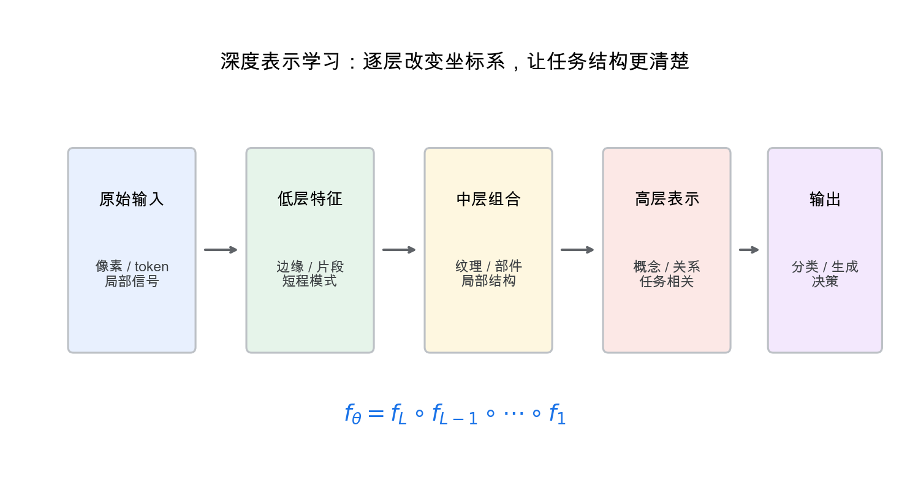
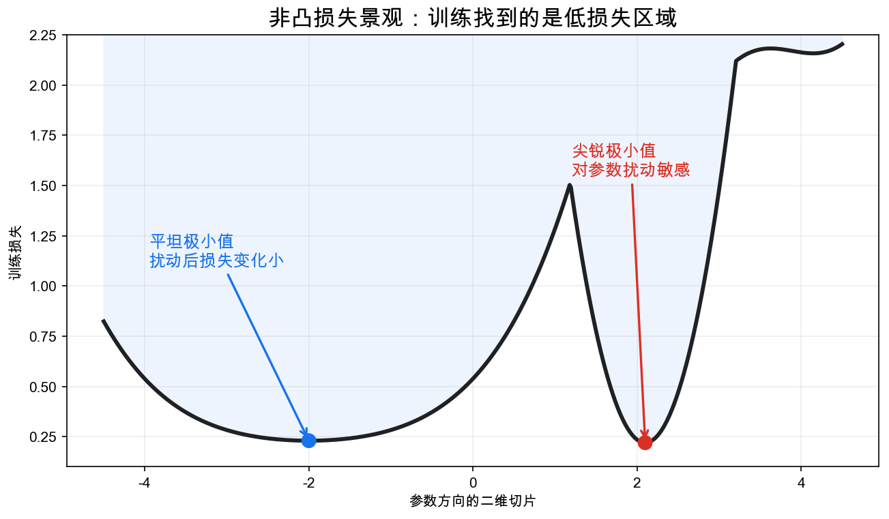
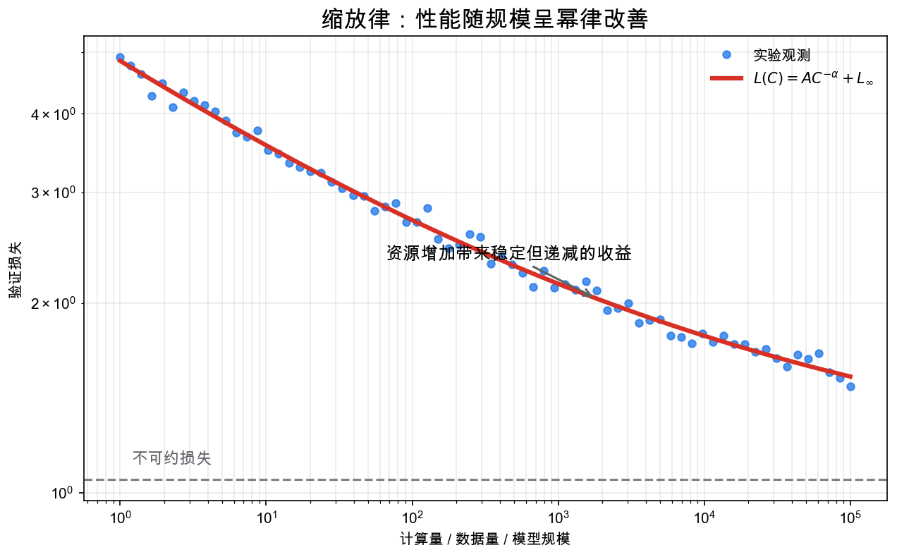

# 重学数学之二十四: 深度学习理论——表示、优化与泛化的现代交汇点
![[Pasted image 20260628173818.png]]
## 一、为什么最后来到深度学习？

前面二十多章看似分散：傅里叶、拓扑、优化、信息论、统计学习、测度、PDE、表示论、量子信息、复杂网络。

但现代深度学习恰好站在这些理论的交汇处。

一个神经网络可以被看成：

1. 一个函数空间中的参数化族。
2. 一个大规模非凸优化问题。
3. 一个从数据中学习表示的统计系统。
4. 一个带有对称性、结构和归纳偏置的计算图。

深度学习理论的问题不是“神经网络为什么能拟合数据”这么简单。拟合已经不难，真正的问题是：

> **为什么一个参数远多于样本的模型，经过简单的一阶优化后，竟然能学到对新数据有用的结构？**

## 二、表示学习：网络在学习坐标系

传统建模常常先人工设计特征，再训练一个相对简单的模型。

深度学习把这两件事合在一起：模型自己学习特征。

早期层可能提取局部边缘，中间层组合成纹理或部件，高层形成语义概念。这个描述来自视觉任务，但抽象结构更一般：

> **深度网络通过层层复合，把原始空间重新坐标化。**

数学上，一个深度网络是函数复合：

$$
f_\theta = f_L\circ f_{L-1}\circ\cdots\circ f_1
$$

每一层都在改变表示空间，让原本难以分离的数据逐渐变得更线性、更可压缩、更适合任务。

## 三、优化：非凸并不等于不可训练

神经网络训练通常是非凸优化：

$$
\min_\theta \frac1n\sum_{i=1}^n \ell(f_\theta(x_i),y_i)
$$

从经典优化角度看，这很危险。非凸问题可能有坏局部极小值、鞍点、平坦区域和病态曲率。

但深度网络通常是过参数化的。参数很多，通往低损失区域的路径也很多。

一个有用的直觉是：训练不是在一个狭窄山谷里寻找唯一最优点，而是在高维空间中找到一个足够好的低损失区域。

这也是为什么一阶方法如此重要。SGD 不只是优化器，它还通过噪声、批量选择、学习率等因素影响最终解的性质。

## 四、泛化：不只是参数数量的问题

经典统计学习理论常用模型复杂度解释泛化。如果模型太复杂，就容易过拟合。

深度学习挑战了这个朴素图像。许多网络参数量远超样本数，却仍能泛化。

所以我们要换一个问题：

> **在所有能拟合训练集的函数中，训练过程偏向了哪一种？**

这叫隐式正则化。

显式正则化包括权重衰减、dropout、数据增强、早停。隐式正则化则来自优化算法、初始化、网络结构和数据分布本身。

例如，线性模型中梯度下降可能偏向最小范数解；深度网络中，这种偏向更复杂，但思想类似：优化路径本身在选择函数。

## 五、神经切线核：把宽网络线性化

当网络足够宽时，训练动态可以在初始化附近近似线性化。

神经切线核写作：

$$
K_\theta(x,x')=
\left\langle
\nabla_\theta f_\theta(x),
\nabla_\theta f_\theta(x')
\right\rangle
$$

它衡量两个输入对参数扰动的响应有多相似。

在无限宽极限下，某些网络的训练可以近似为核回归。

这个理论很有启发性，因为它把深度学习和泛函分析、核方法、随机初始化联系起来。但它也有边界：真实网络并不总是只在初始化附近微调，很多能力来自特征学习，而不是固定核。

## 六、缩放律：能力随规模如何增长

大模型时代，一个经验事实变得非常突出：模型规模、数据规模、计算量和损失之间常呈幂律关系。

粗略写成：

$$
L(C)\approx A C^{-\alpha}+L_\infty
$$

这里 $C$ 可以代表计算量或有效训练资源。

缩放律的重要性不在于公式漂亮，而在于它改变了工程决策：如果知道性能如何随资源变化，就能估算该扩模型、加数据，还是改算法。

这让深度学习理论不再只是解释已有现象，也开始参与资源分配。

## 七、注意力：可学习的依赖结构

Transformer 的核心是注意力机制：

$$
\mathrm{Attention}(Q,K,V)
=
\mathrm{softmax}\left(\frac{QK^\top}{\sqrt d}\right)V
$$

它做了一件很直接的事：让每个位置根据相似度，从其他位置聚合信息。

从网络科学角度看，注意力是在输入样本内部动态构造一张加权图。从信息论角度看，它是在分配有限的上下文容量。从表示论角度看，注意力需要处理序列、位置和对称性。

正因如此，Transformer 能成为通用架构：它不是只写死一种局部连接，而是让连接结构随输入变化。

## 八、双降：过参数化以后，曲线又降下来了

经典统计图像里，模型复杂度增加，训练误差下降，测试误差先下降后上升。过拟合发生在复杂度太高的时候。

深度学习里常见另一种曲线：双降。

当模型刚好能插值训练数据时，测试误差可能达到峰值；继续增大模型，测试误差反而再次下降。

这迫使我们重新理解“复杂度”。参数量不是唯一尺度。优化算法偏向什么解、数据是否有低维结构、模型是否学到稳定表示，都在影响泛化。

双降不是说过拟合消失了。它说的是：插值本身不等于坏泛化。真正要问的是，模型在众多插值解里选中了哪一个。

## 九、Grokking：先记住，再突然理解？

有些小型算法任务里，网络会先把训练集记住，测试集表现长期很差；训练很久以后，测试性能突然上升。这种现象常被称为 grokking。

它像是把“记忆”和“规则学习”分开摆在了台面上。

一种解释是，早期优化先找到容易降低训练损失的记忆解；权重衰减、噪声或继续训练逐渐偏向更简单、更结构化的算法解。等算法解超过记忆解，泛化突然出现。

这个现象不该被神秘化。它提醒我们，训练时间本身也是一种正则化轴。模型不是只在“最终参数量”上复杂，训练轨迹也会改变它最终表达的函数。

## 十、Transformer 与上下文学习：参数不动，任务在变

In-context learning 的奇怪之处在于：模型参数没有更新，却能根据上下文里的示例临时适配任务。

从函数角度看，Transformer 学到的不是单个映射：

$$
x\mapsto y
$$

而是一个依赖上下文的映射：

$$
(\text{examples},x)\mapsto y
$$

上下文变了，模型执行的“临时算法”也变了。

理论上有几种解释路线：一种把注意力看成检索和核回归；一种把 Transformer 看成在前向传播里模拟梯度下降；还有一种从程序合成角度看，把上下文当作任务说明。

这些解释还没有完全统一，但共同指向一件事：现代模型不只是存储知识，它也在学一种从上下文中构造计算过程的能力。

## 十一、机制可解释性：模型内部到底有没有可读结构

深度网络不是黑箱和白箱二选一。很多时候，它像一台复杂仪器：直接看参数没什么用，但可以找中间变量、通路和功能模块。

机制可解释性关心的问题是：模型内部是否有可定位的特征、回路和算法？

比如在语言模型里，某些注意力头可能执行复制、括号匹配、间接宾语识别等相对明确的功能。稀疏自编码器则试图把混在同一神经元里的多个特征拆成更单一的方向。

这里的数学味道很浓：我们又回到了表示问题。只不过这次不是人为指定 Fourier 基或小波基，而是在高维激活空间里寻找一组更可解释、更稀疏的坐标。

## 十二、神经算子：学习函数到函数的映射

普通神经网络多半学习：

$$
x\mapsto y
$$

神经算子想学的是函数到函数的映射：

$$
\mathcal G:a(x)\mapsto u(x)
$$

这在 PDE 里很自然。系数场、初值或边界条件变了，解函数也跟着变。传统数值方法每换一次输入就要重新求解；神经算子试图直接学习解算子。

Fourier Neural Operator 的想法尤其贴近本系列开头：在频域里处理全局相互作用，再回到物理空间。它不是简单替代有限元，而是在大量相似 PDE 实例上学习一个可迁移的近似求解器。

这把深度学习从“拟合数据点”推向“学习数学算子”。泛函分析、傅里叶、小波、PDE 和数值计算在这里重新汇合。

## 十三、扩散模型：生成也可以看成反向动力学

生成模型的目标是从简单噪声生成复杂数据。

扩散模型先把数据逐步加噪，得到接近高斯的分布；训练时学习反向去噪方向。连续时间写法里，关键对象是得分函数：

$$
\nabla_x\log p_t(x)
$$

模型学会它以后，就能沿反向 SDE 或概率流 ODE 从噪声走回数据。

这件事把很多章节接在一起：随机分析给出 SDE，信息几何解释得分，最优传输和 Schrödinger 桥解释分布路径，数值分析关心采样器稳定性。

所以扩散模型不只是一个工程技巧。它是现代深度学习里少数能把概率、动力系统、PDE 和几何同时拉进来的范例。

## 十四、应用场景

| 领域 | 深度学习理论关注的问题 |
|------|----------------------|
| 计算机视觉 | 表示层次、等变性、数据增强 |
| 自然语言处理 | 注意力、上下文建模、缩放律 |
| 科学计算 | 神经算子、PDE surrogate、物理约束学习 |
| 生物信息 | 蛋白质结构、序列表示、图模型 |
| 控制与机器人 | 表示学习、强化学习、世界模型 |
| 生成模型 | 分布学习、最优传输、扩散模型、score matching |

深度学习不是替代数学，而是把许多数学结构压进一个可训练系统里。

## 十五、与前面章节的总连接

1. **傅里叶与小波**：卷积、频谱偏置、多尺度表示。
2. **泛函分析**：神经网络是函数空间中的可训练子族。
3. **微分几何与拓扑**：数据流形、表示空间、拓扑特征。
4. **优化**：SGD、非凸几何、隐式正则化。
5. **信息论**：压缩、互信息、泛化和表示瓶颈。
6. **统计学习理论**：泛化误差、复杂度、PAC 与现代修正。
7. **贝叶斯与因果**：不确定性、干预、分布外泛化。
8. **动力系统与 PDE**：残差网络、连续深度模型、扩散生成模型。
9. **最优传输**：分布距离、生成模型、domain adaptation。
10. **Lie 群与表示论**：等变网络和对称性归纳偏置。
11. **复杂网络**：GNN、注意力图和大规模系统行为。

这张地图说明，深度学习理论不是一门孤立学科。它更像一个交汇点，把“函数”“概率”“结构”“优化”“信息”重新编织在一起。

## 十六、前沿展望

### 16.1 大语言模型的涌现能力与规模定律

Kaplan 等（2020）发现语言模型的损失遵循关于参数量 $N$、数据量 $D$、计算量 $C$ 的幂律规模定律（Scaling Laws），为模型设计提供了预测性框架。Chinchilla（Hoffmann 等 2022）重新推导了计算最优的 $N$-$D$ 权衡比例（$D \approx 20N$）。

**涌现能力**（Wei 等 2022）：某些能力（算术推理、多步推断、In-Context Learning）在模型规模超过临界阈值时突然出现，对此有两种解释：真正的相变（类比统计物理中的相变），或者是评估指标非线性造成的测量假象（Schaeffer 等 2023）。

### 16.2 推理与链式思维

Transformer 的 In-Context Learning 能力（Brown 等 2020）允许模型从少量示例直接推断任务而无需参数更新，其理论机制被解释为梯度下降在前向传播中的隐式实现（von Oswald 等 2023；Akyürek 等 2022）。

**链式思维推理**（Chain-of-Thought，Wei 等 2022）通过提示模型生成中间推理步骤，大幅提升复杂推理任务准确率。从计算复杂度视角：CoT 将时间复杂度从常数级（单步输出）提升至多项式级（每个 token 都是计算步骤），将 Transformer 从 $TC^0$ 电路类提升至更强的计算能力（Merrill & Sabharwal 2023）。

### 16.3 对齐与人类反馈强化学习（RLHF）

Christiano 等（2017）和 Stiennon 等（2020）提出 RLHF：先训练奖励模型（RM）拟合人类偏好标注，再用 PPO 从 RM 信号微调语言模型。InstructGPT（Ouyang 等 2022）将 RLHF 系统化，成为 ChatGPT/Claude 等对话模型的训练范式。

数学分析：RLHF 等价于在 KL 散度约束下最大化期望奖励，最优解是 Bradley-Terry 偏好模型的闭合形式（Ziegler 等 2019）。**直接偏好优化**（DPO，Rafailov 等 2023）绕过显式 RM，将偏好对比优化写成监督学习目标，计算更高效。

### 16.4 可解释性：机制性可解释性

Elhage 等（2021，Anthropic）提出**叠加假说**：神经元通过相互接近正交的方向压缩表示超线性数量的特征（多义性）。**稀疏自编码器**（Cunningham 等 2023；Bricken 等 2023）通过在激活上拟合超完备字典，将多义神经元分解为人类可解读的单义特征，成为目前最成熟的机制可解释性工具，已在 Gemma、GPT-4 系列上规模化应用。

## 十七、小结：一张足够宽的第一版地图

如果把这二十四章压缩成一条线索，它大概是这样：

1. **分析**告诉我们怎样分解函数、研究极限和连续变化。
2. **几何与拓扑**告诉我们怎样理解空间、形状和不变量。
3. **代数与范畴**告诉我们怎样保留结构、比较结构、迁移结构。
4. **概率、信息与统计**告诉我们怎样在不确定性下学习和决策。
5. **优化、动力系统与数值计算**告诉我们怎样让理论变成可执行过程。
6. **对称性、量子信息与复杂系统**告诉我们整体结构如何约束局部行为。
7. **深度学习**把这些线索集中到一个现代问题上：如何从数据中学习可泛化的表示。

本系列从傅里叶变换开始，不是偶然。傅里叶分析的核心是“换一个基，问题就变简单”。一路走到深度学习，这个主题并没有消失，只是变得更广：

> **好的数学理论，往往是在寻找一种更合适的表示；好的学习系统，也是在寻找一种让世界变得可计算的表示。**

到这里，前二十四章形成了一张够宽的第一版地图。它不意味着数学学习结束，而是意味着我们已经有了一套可继续扩展的坐标系：以后无论进入微分拓扑、代数数论、随机控制、量子场论，还是更具体的机器学习理论，都能知道这些新对象大概会落在地图的什么位置。

---

*深度学习理论把许多数学线索汇到了现代机器学习。下一章进入微分拓扑——我们不再量长度和曲率，而是看光滑映射和临界点怎样决定流形的整体形状。*
