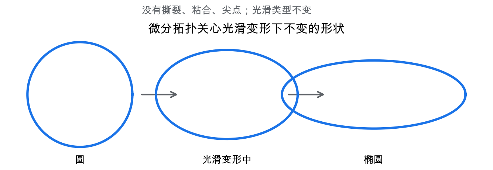
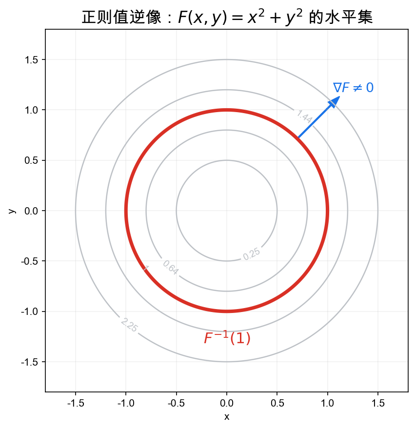
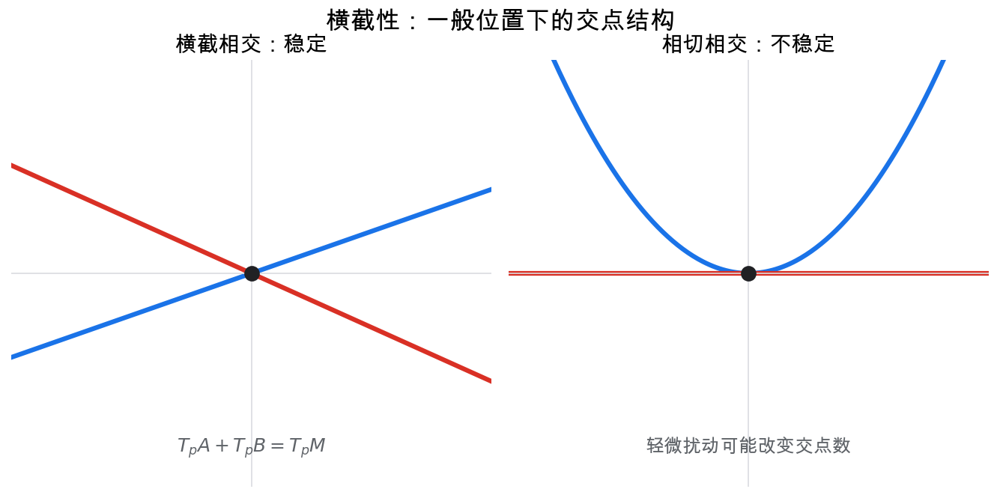

# 重学数学之二十五: 微分拓扑——不量长度，只看光滑形状怎样变

## 一、从微分几何中拿掉度量

微分几何问很多带有测量意味的问题：曲率是多少？测地线怎么走？面积如何变化？

微分拓扑换一个角度：

> **如果只保留“光滑结构”，不关心长度、角度和曲率，还能看见什么不变量？**

一个圆和一个椭圆在微分拓扑里没有本质区别。它们都是一维紧无边光滑流形。你可以把圆光滑变形成椭圆，过程没有撕裂、粘合或产生尖点。

这和第五章拓扑很接近，但多了一个限制：变形必须光滑。光滑结构让我们可以谈切空间、微分、临界点和向量场，却不必引入度量。

## 二、光滑映射：流形之间的结构保持

微分拓扑的主角不是单个流形，而是流形之间的光滑映射：

$$
f:M\to N
$$

在每一点 $p\in M$，它诱导切空间之间的线性映射：

$$
df_p:T_pM\to T_{f(p)}N
$$

如果 $df_p$ 满秩，局部图像就比较规整；如果秩下降，就出现临界点。

这里的满秩可以理解成：映射在这一点附近没有突然丢掉方向。若 $df_p$ 的秩下降，某些方向被压扁，局部形状就可能折叠、相切或出现尖点。微分拓扑关心的很多整体信息，正是从这些“方向丢失”的地方冒出来的。

最简单的例子是：

$$
f(x)=x^2
$$

在 $x=0$ 处导数为零，这个点是临界点。临界点不是坏事，它们往往携带整体拓扑信息。

## 三、正则值：用逆像切出子流形

如果 $y\in N$ 满足：对所有 $p\in f^{-1}(y)$，微分 $df_p$ 都满秩，那么 $y$ 是正则值。

正则值定理说：

> **正则值的逆像是一个光滑子流形。**

例如：

$$
F(x,y,z)=x^2+y^2+z^2
$$

$1$ 是正则值，于是：

$$
F^{-1}(1)=S^2
$$

是 $\mathbb R^3$ 中的光滑曲面。

这条定理的哲学很清楚：方程组定义空间时，只要约束方向足够独立，解集就会是光滑流形。

“约束方向足够独立”就是满秩条件。比如在 $\mathbb R^3$ 中，一个方程通常切出曲面；两个独立方程通常切出曲线；如果方程的梯度在某点同时退化，解集就可能在那里失去流形结构。

## 四、横截性：一般位置的数学语言

几何里常说“两条曲线一般会横着相交”。如果相切，稍微扰动一下就会变成横截相交。

微分拓扑把这种“一般位置”写成横截性。

两个子流形 $A,B\subset M$ 横截，意思是在每个交点 $p$：

$$
T_pA+T_pB=T_pM
$$

横截性重要，是因为横截交集稳定。相切交点轻轻一动可能消失或裂成两个；横截交点则不会这么脆弱。

这也是很多现代几何理论的底层技术：先把对象扰动到一般位置，再数交点、定义不变量。

横截性把“不要刚好擦边而过”变成了可检验条件。它不只适用于两个子流形，也适用于映射与子流形的相交。很多计数型不变量都要先保证相交是横截的，否则交点数会因为退化相交而失去稳定意义。

## 五、Morse 理论：用函数读出流形形状

Morse 理论的想法很像爬山：

给流形 $M$ 上一个光滑函数：

$$
f:M\to\mathbb R
$$

观察子水平集：

$$
M_a=\lbrace p\in M\mid f(p)\le a\rbrace
$$

当 $a$ 从低到高变化，如果没有经过临界值，拓扑不变；一旦经过临界点，拓扑可能改变。

临界点的 Hessian 负特征值个数叫指标。指标告诉我们拓扑变化时附着了几维把手。

指标的直觉是“从这个临界点往下走有多少独立方向”。指标为 0 的临界点像新连通块的出生，指标为 1 常对应加一条通道，指标更高则对应更高维把手。Morse 理论把这种局部二次型信息翻译成全局拓扑变化。

这给出一种惊人的观点：

> **流形的整体形状，可以通过一个足够好的函数的临界点逐步重建。**

## 六、度：光滑映射怎样覆盖目标

对同维紧有向流形之间的光滑映射：

$$
f:M\to N
$$

映射度大致表示 $M$ 覆盖 $N$ 多少次，并带方向符号。

例如圆上的映射：

$$
f(e^{i\theta})=e^{ik\theta}
$$

度就是 $k$。

映射度是同伦不变量。只要连续变形不撕裂映射，度不会改变。

这把分析中的 Jacobian、拓扑中的同伦和代数中的整数不变量接到一起。

度也可以通过正则值来理解。取目标上的一个正则值，数它的逆像点，每个点按映射是否保持方向记 $+1$ 或 $-1$，加起来就是度。正因为这个数不依赖所选正则值，它才成为全局不变量。

## 七、Sard 定理：坏值其实很少

正则值定理告诉我们：如果 $y$ 是正则值，$f^{-1}(y)$ 就是好看的子流形。

那正则值多不多？

Sard 定理回答：临界值集合的测度为零。

也就是说，对大多数 $y\in N$，$y$ 都是正则值。

这条定理的价值不在于“测度为零”四个字本身，而在于它给了微分拓扑一个基本信念：坏情况存在，但一般位置下可以避开。

比如我们想研究两个子流形的交点，可以轻微扰动其中一个，让它们横截相交。Sard 定理和横截性定理背后支撑的，就是这种“稍微动一下就变好”的思想。

## 八、Whitney 嵌入：抽象流形可以放进欧氏空间

流形一开始可以抽象定义，不必先嵌在某个 $\mathbb R^n$ 里。

但 Whitney 嵌入定理说，每个 $m$ 维光滑流形都可以光滑嵌入某个足够高维的欧氏空间。一个经典版本是：

$$
M^m\hookrightarrow \mathbb R^{2m}
$$

这给了我们一个安心的背景：抽象流形不是完全脱离直觉的东西，它总能被放到欧氏空间里观察。

更重要的是，嵌入和浸入的差别揭示了微分拓扑的细节。浸入只要求微分单射，允许自交；嵌入还要求整体拓扑不被粘坏。

比如一条曲线在平面里可以浸入成“8”字形，局部看每一点都像一条光滑曲线，但整体有自交；嵌入则不允许这种自交把两个不同点粘到同一个位置。浸入是局部条件，嵌入还要求全局无歧义。

很多问题就是从这里冒出来的：一个流形最少需要多少维欧氏空间才能嵌进去？两个嵌入什么时候同痕？这些问题连接到示性类、配边和稳定同伦论。

## 九、配边：什么时候两个流形是同一个边界的两端

两个闭流形 $M,N$ 如果共同作为某个高一维紧流形 $W$ 的边界：

$$
\partial W=M\sqcup (-N)
$$

就说它们配边。

直觉上，$W$ 是从 $M$ 到 $N$ 的一段光滑“时空”。如果存在这样的 $W$，我们可以认为 $M$ 和 $N$ 在配边意义下等价。

配边理论把流形分类问题变成代数问题。所有配边类在不交并和笛卡尔积下形成环。Thom 的工作说明，配边环可以用同伦论计算。

这很典型：微分拓扑表面上研究光滑形状，深处却会把问题推到稳定同伦、谱和示性数那里。

## 十、应用场景

| 领域 | 微分拓扑扮演的角色 |
|------|------------------|
| 几何 | 流形分类、子流形、嵌入与浸入 |
| 动力系统 | 向量场零点、Poincare-Hopf 定理 |
| 物理 | 场构型空间、孤子、规范场拓扑 |
| 数据分析 | 流形学习、临界点、拓扑数据分析 |
| 机器人 | 构型空间、避障、可达性 |
| 优化 | 临界点结构、Morse 函数、鞍点分析 |

微分拓扑像是“无度量的微分几何”：它保留可微结构，但把注意力放在形状的不变量上。

## 十一、与前几章的连接

1. **微分几何**：共享流形、切空间、光滑映射，但弱化度量。
2. **拓扑**：关心同伦、不变量和整体形状。
3. **代数拓扑**：同调、上同调用于表达微分拓扑不变量。
4. **动力系统**：向量场零点和流的结构依赖微分拓扑。
5. **机器学习**：数据流形、损失景观临界点都需要类似语言。

## 十二、前沿展望

### 12.1 四维流形的奇异现象

微分拓扑在四维空间中存在独特的反直觉现象：$\mathbb{R}^4$ 上存在不可数无穷多个彼此不微分同胚的光滑结构（exotic $\mathbb{R}^4$），这在任何其他维度都不发生。Donaldson（1983）用 Yang-Mills 规范场论（四维空间中的瞬子方程）证明了某些拓扑 4-流形不能承认光滑结构，并给出光滑 4-流形的强制约束（Donaldson's diagonalizability theorem）。

Seiberg-Witten 不变量（1994）用超对称量子场论简化了 Donaldson 不变量的计算，统一了大量四维拓扑结果，成为现代低维拓扑的核心工具。这是数学物理与纯数学最深刻的交汇之一。

### 12.2 Morse 理论与 Floer 同调

经典 Morse 理论（Milnor 1963）通过光滑函数的临界点分析流形拓扑。Floer（1988）将 Morse 理论的思想推广到若干无穷维问题：例如用 Lagrangian 子流形交点生成辛 Floer 链复形，或用 3-流形上的平坦联络构造瞬子 Floer 理论；微分由相应方程的解模空间计数给出。定义过程中还要处理横截性、紧性和取向等技术问题。

Floer 同调是镜像对称（第二十一章）和三维流形手术分类的核心工具，并与纽结 Floer 同调（Ozsváth-Szabó 2004）联系，给出纽结的亏格、纤维性等经典不变量的有效计算。

### 12.3 微分拓扑与数据科学

Morse 理论在数据分析中的应用：**Mapper 算法**（Singh 等 2007）是对参数化 Morse 函数的 Reeb 图（折叠等高线集合）的离散化，提取高维数据的拓扑骨架。神经网络损失景观的临界点分析（Goodfellow 等 2015；Dauphin 等 2014）用 Morse 理论语言描述鞍点、极大值和极小值的分布，解释优化难度。

## 十三、总结

微分拓扑的核心结构：

1. **光滑流形**：局部像欧氏空间，并允许微分。
2. **光滑映射**：流形之间的结构保持变换。
3. **正则值**：逆像自然成为子流形。
4. **横截性**：一般位置和稳定交点的语言。
5. **Morse 理论**：用函数临界点重建流形拓扑。
6. **映射度**：记录有向覆盖次数的同伦不变量。
7. **Sard 定理**：说明临界值在一般位置下可以避开。
8. **嵌入与配边**：把抽象流形放入欧氏空间，并比较它们是否同属一个边界。

> **微分拓扑研究的是：在不测量长度的情况下，光滑结构还能保留多少整体形状信息。**

---

*微分拓扑保留了光滑结构，却不强调度量。下一章进入辛几何与 Hamilton 系统——我们会看到，真正被保留下来的不是距离，而是相空间里的面积、体积和守恒结构。*
