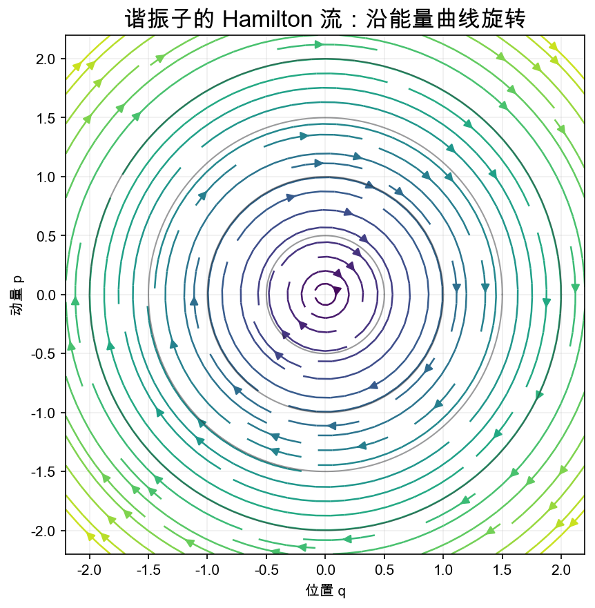
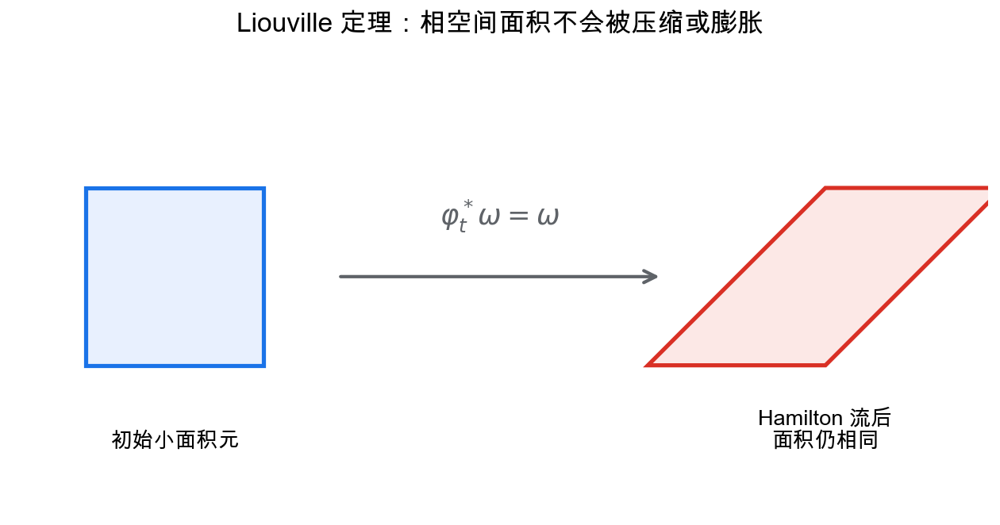
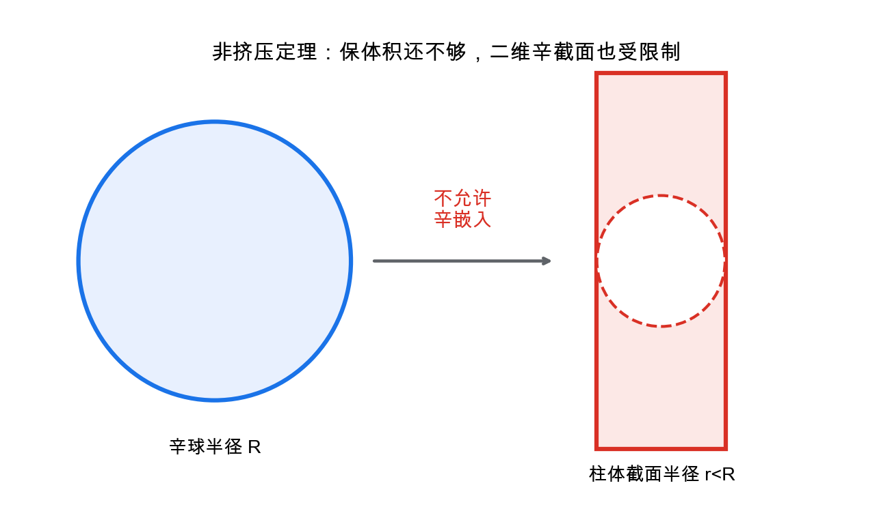

# 重学数学之二十六: 辛几何与 Hamilton 系统——相空间里真正守恒的是什么

> **先给读者一张地图。** 这一章只抓住一条主线：把状态写成“位置 $q$ + 动量 $p$”，用辛形式 $\omega$ 把能量函数 $H$ 变成运动方程，再看这种运动究竟保留了什么。读者只需熟悉多元微积分和一点微分形式；遇到 Lie 群、Floer 同调等词时，可以先把它们当作后续方向，不影响前面主线的理解。

## 一、从“位置 + 动量”开始

经典力学里，一个粒子的状态不只由位置 $q$ 决定，还要加上动量 $p$。

所以自然的空间不是配置空间，而是相空间：

$$
(q,p)
$$

如果配置空间是 $Q$，相空间通常是余切丛：

$$
T^*Q
$$

这里的 $T^*Q$ 可以先粗略理解成：对 $Q$ 的每个位置，都附上一个记录动量的线性空间。若 $Q=\mathbb R^n$，就可以直接用 $n$ 个位置坐标和 $n$ 个动量坐标表示状态：

$$
(q_1,\ldots,q_n,p_1,\ldots,p_n).
$$

辛几何研究相空间上的一种二形式（可以把它理解成“测量有向面积的规则”）：

$$
\omega
$$

在一个自由度、也就是二维 $(q,p)$ 平面中，标准形式是：

$$
\omega=dq\wedge dp
$$

这里的楔积 $dq\wedge dp$ 是反对称的面积元：交换两个方向会变号，两个方向相同时则为零。因此

$$
\omega(\partial_q,\partial_p)=1,\quad \omega(\partial_p,\partial_q)=-1.
$$

它不是度量。它不告诉你两点有多远，也不告诉你两个向量夹角多少。它告诉你相空间中的“有向面积”。

更具体地说，$\omega$ 会把两个切向量送到一个数，表示它们张成的有向面积。度量关心长度和角度，辛形式关心位置方向和动量方向如何配对。Hamilton 力学里真正稳定保留下来的，正是这种配对结构。

Hamilton 力学的核心不是能量曲线好看，而是运动的流会保留辛结构；能量守恒只是由此推出的另一个结果。

## 二、辛形式：非退化的二形式

一个辛流形是偶数维光滑流形 $M$，带一个闭的、非退化的二形式：

$$
(M,\omega)
$$

“闭”是微分形式的无旋条件：

$$
d\omega=0
$$

“非退化”表示：如果一个向量 $v$ 对所有 $w$ 都满足：

$$
\omega(v,w)=0
$$

那么 $v=0$。

因此，通过辛形式与一个向量配对，可以得到一个唯一的 1-形式；反过来也能由 1-形式找回唯一的向量。这正是“非退化”在计算上的含义。

非退化性让每个光滑函数都能生成一个唯一的向量场。

为什么非退化性有这个作用？因为它让“向量场 $X$”和“1-形式 $\iota_X\omega$”之间可以一一对应。给定 $dH$ 这个 1-形式，就能唯一反推出 $X_H$。如果 $\omega$ 退化，某些方向会被它看不见，Hamilton 向量场就可能不唯一或不存在。

## 三、Hamilton 向量场：函数生成运动

给一个 Hamilton 函数：

$$
H:M\to\mathbb R
$$

下面固定一个符号约定（不同教材可能整体差一个负号）：

$$
\iota_{X_H}\omega=dH
$$

其中 $\iota_{X_H}$ 表示“把向量场 $X_H$ 代入二形式的第一个槽”。

在标准坐标中，这就是 Hamilton 方程：

$$
\dot q=\frac{\partial H}{\partial p},\quad
\dot p=-\frac{\partial H}{\partial q}
$$

如果：

$$
H(q,p)=\frac{p^2}{2}+\frac{q^2}{2}
$$

就得到谐振子。轨道在相平面中沿能量椭圆旋转。

把方程写出来更直观：

$$
\dot q=p,\qquad \dot p=-q.
$$

初始点 $(q,p)=(1,0)$ 会沿单位圆运动；因为 $H=(q^2+p^2)/2$ 不变，轨道不能离开这条能量等值线。

注意这里不是沿着能量下降，而是沿着能量等值线运动。直接计算即可看到：

$$
\frac{dH}{dt}=dH(X_H)=\omega(X_H,X_H)=0.
$$

梯度系统会往低能量处流；Hamilton 系统则由辛形式把 $dH$ 转成等能量面的切向方向。这正是它和有摩擦的耗散系统的根本区别。

## 四、Liouville 定理：相空间体积守恒

如果 $\varphi_t$ 表示 $X_H$ 产生的流（在解存在的时间范围内），Hamilton 流有一个非常强的性质：它保留辛形式。

符号 $\varphi_t^*\omega$ 表示把运动后的点拉回原来的坐标来比较二形式；等式成立就是说，经过时间 $t$ 的演化前后，辛面积的测量规则完全相同。

$$
\varphi_t^*\omega=\omega
$$

因此也保留相空间体积（$2n$ 维时通常写成带归一化因子的 Liouville 体积）：

$$
\frac{\omega^n}{n!}
$$

这和耗散系统很不一样。摩擦会让轨道向吸引子收缩；Hamilton 系统不会把相空间体积压扁。

这就是为什么辛几何和统计力学、天体力学、分子动力学关系很深。

## 五、Poisson 括号：可观测量之间的代数

在 Hamilton 力学里，函数不只是函数。它们是可观测量，也能生成流。

两个函数 $F,G$ 的 Poisson 括号定义为：

$$
\lbrace F,G\rbrace
=
\sum_i
\left(
\frac{\partial F}{\partial q_i}\frac{\partial G}{\partial p_i}
-
\frac{\partial F}{\partial p_i}\frac{\partial G}{\partial q_i}
\right)
$$

按上面的符号约定，$\{F,G\}=dF(X_G)$，也就是 **$F$ 沿着 $G$ 生成的流的瞬时变化率**。等价地，$G$ 沿着 $F$ 的流变化率是 $\{G,F\}$。

最基本的检验是 $\{q,p\}=1$。对谐振子 $H=(p^2+q^2)/2$，有 $\{q,H\}=p$、$\{p,H\}=-q$，这正好重新得到上一节的两条运动方程。

时间演化可以写成：

$$
\frac{dF}{dt}=\lbrace F,H\rbrace
$$

这说明力学系统不仅有几何结构，还有代数结构。

如果 $\lbrace F,H\rbrace=0$，那么 $F$ 沿 Hamilton 流保持不变，也就是守恒量。Poisson 括号因此把“可观测量是否守恒”“两个运动是否交换”这些问题变成了代数计算。

## 六、辛不变量：不能随便挤压相空间

拓扑上，一个球可以连续变形成细长形状；即使要求体积保持，也可以把它变得很细很长。

但辛几何更刚性。Gromov 的非挤压定理说，辛球不能被辛嵌入到半径更小的柱体中。

这说明辛结构不只是体积。它还保留某些二维共轭平面上的“面积容量”；非挤压定理正是对这种容量的限制。

这也是辛几何迷人的地方：它介于拓扑的柔性和 Riemann 几何的刚性之间。

非挤压定理常被比喻成“辛骆驼过针眼”：即使总体积足够，半径较大的辛球仍不能嵌入半径更小的辛柱体。它说明 Hamilton 运动守住的不只是总体体积，还守住更细的二维尺度。

## 七、Darboux 定理：辛几何没有局部曲率

Riemann 几何里，度量的局部信息很丰富。曲率会告诉你空间局部怎样弯。

辛几何很不同。Darboux 定理说，每个辛流形在任意点附近，都能找到局部坐标，使辛形式写成标准形：

$$
\omega=\sum_i dq_i\wedge dp_i
$$

也就是说，单看 $\omega$，所有辛流形局部看起来都一样；这里的“没有局部曲率”是说没有类似 Riemann 曲率那样由辛形式本身产生的局部弯曲不变量，并不是说相关动力学或嵌入都没有局部信息。

所以辛几何的困难不在局部，而在全局。没有类似 Riemann 曲率那样的局部不变量；真正有内容的是整体嵌入、周期轨道、Lagrangian 子流形、Floer 同调这些全局问题。

这也解释了为什么辛几何既柔又硬。局部极其柔软，全局却有 Gromov 非挤压这样的刚性。

## 八、Lagrangian 子流形：相空间中的“半维世界”

在 $2n$ 维辛流形里，一个 $n$ 维子流形 $L$ 如果满足：

$$
\omega|_L=0
$$

就叫 Lagrangian 子流形。

它有点像相空间里的“可作为配置空间的半维对象”。在标准余切丛 $T^*Q$ 中，零截面 $Q$ 就是 Lagrangian；一个函数 $S(q)$ 的图像（把 $dS$ 看成动量协向量）：

$$
p=dS(q)
$$

也是 Lagrangian。

半维条件不是随便来的。若 $\omega|_L=0$，说明 $L$ 内部的所有切方向彼此没有辛面积；这样的子空间最大只能有一半维数。Lagrangian 子流形正是这种“最大无辛面积”的对象。

Hamilton-Jacobi 理论可以从这里理解：如果能找到合适的生成函数 $S$，动力学就被编码在一个 Lagrangian 子流形上。

在镜像对称里，Lagrangian 子流形更是 A 侧的基本对象。它们之间的交点生成 Floer 复形，交点数和伪全纯曲线共同定义深层不变量。

## 九、动量映射：对称性对应守恒量

如果 Lie 群 $G$ 作用在辛流形 $M$ 上，并保持辛形式，我们自然想问：这个连续对称性对应什么守恒量？

动量映射给出答案：

$$
\mu:M\to\mathfrak g^\ast
$$

对每个 Lie 代数元素 $\xi\in\mathfrak g$，函数：

$$
\mu^\xi(x)=\langle \mu(x),\xi\rangle
$$

生成对应的无穷小群作用。

这里仍采用 $\iota_{X_{\mu^\xi}}\omega=d\mu^\xi$ 的约定；不同教材可能整体差一个负号，守恒结论不受影响。

这正是 Noether 定理的辛几何版本。平移对称性对应动量守恒，旋转对称性对应角动量守恒。

动量映射还允许做辛约化：在正则情形下，先取水平集 $\mu^{-1}(c)$，再除掉保持 $c$ 不变的群作用，得到更低维的相空间。这是从大系统中消去冗余自由度的几何方法。

可以把辛约化理解成两步：先用守恒量选出你关心的能级或动量层，再把由对称性造成的重复描述除掉。这样得到的低维空间仍然带有辛结构，动力学也能在上面继续进行。

## 十、辛积分器：数值算法也要尊重几何

普通数值方法可能每一步误差都很小，但长时间模拟 Hamilton 系统时，结构会慢慢漂掉。

辛积分器的目标不是每一步都最精确，而是让离散时间映射保持辛结构。

最简单的 Störmer-Verlet 格式可以写成“半步动量、一步位置、半步动量”的交错更新。对可分 Hamilton 量 $H(q,p)=T(p)+V(q)$，一步更新是

$$
p_{k+1/2}=p_k-\frac{h}{2}\nabla V(q_k),\quad
q_{k+1}=q_k+h\nabla T(p_{k+1/2}),\quad
p_{k+1}=p_{k+1/2}-\frac{h}{2}\nabla V(q_{k+1}).
$$

它不保证每一步能量都精确相等，但能量误差通常在一个小范围内振荡，而不是单向累积。

这里的经验很值得记住：对结构守恒系统，算法应该保结构，而不只是追求局部截断误差小。第十七章数值分析里的稳定性，在辛几何里变成了几何稳定性。

## 十一、应用场景

| 领域 | 辛几何扮演的角色 |
|------|----------------|
| 经典力学 | Hamilton 系统、守恒律、相空间结构 |
| 天体力学 | 长时间稳定性、KAM 理论、轨道共振 |
| 量子力学 | 正则量子化、Poisson 括号到对易子 |
| 数值分析 | 辛积分器保留长期能量结构 |
| 控制理论 | 最优控制中的 Hamiltonian 和协态变量 |
| 镜像对称 | Lagrangian 子流形和 Fukaya 范畴 |

辛几何关心的不是“物体在哪里”，而是“状态如何在位置和动量之间保持结构地演化”。

## 十二、与前几章的连接

1. **微分拓扑**：辛流形首先是光滑流形。
2. **动力系统**：Hamilton 流是一类结构守恒动力系统。
3. **微分形式**：辛形式是闭的非退化二形式。
4. **量子力学**：Poisson 括号在量子化后对应对易子的经典极限。
5. **数值分析**：长期模拟 Hamilton 系统需要辛算法。

## 十三、前沿展望

这一节是路线图，不是前面定义的必要前提。若只想掌握基本思想，读到这里可以先停在上一节的总结；下列名词可在以后按兴趣回看。

### 13.1 Floer 同调与辛拓扑刚性

Arnold 猜想（1965）给出一个很有代表性的全局问题：在满足适当非退化和紧性条件时，紧辛流形 $M$ 上的 Hamiltonian 微分同胚至少有 $\sum_k \beta_k(M)$ 个不动点（$\beta_k$ 为 Betti 数）。Floer（1989）通过引入无穷维 Morse 理论（辛 Floer 同调）在一系列假设下证明了这一猜想。这里的重点不是记住精确假设，而是看到：局部标准形并不能阻止全局不动点数量受到拓扑约束。

辛刚性的另一个显著结果：Gromov（1985）的非压缩定理（nonsqueezing theorem）——$B^{2n}(r)$ 中的球不能辛嵌入 $B^2(R)\times\mathbb{R}^{2n-2}$ 中（若 $r>R$），即使体积允许。这给出了辛几何区别于黎曼几何的最干净例子，证明工具是**伪全纯曲线**（pseudo-holomorphic curves），现已成为辛拓扑的标准工具。

### 13.2 辛算法与长期数值积分

**辛积分器**（Symplectic integrators）是让离散时间映射保持辛结构的数值格式。对于 Hamiltonian 系统，辛积分器不保证能量逐步严格守恒，但在合适条件下会近似保留一个附近的**阴影哈密顿量**（shadow Hamiltonian），所以长期能量误差通常有界。Störmer-Verlet 算法（分子动力学中常用的 leapfrog）是最简单的辛积分器；GHMC 和辛 Runge-Kutta 是更高阶或更专门的版本。

在分子动力学模拟（如 AMBER、GROMACS）和 N 体天文模拟（如 REBOUND）中，辛积分器是常用选择，因为在适合的可分 Hamilton 系统和步长条件下，它们通常比非辛方法更好地控制长期能量漂移。

### 13.3 镜像对称的辛几何侧

同调镜像对称（Kontsevich 1994）预言：Calabi-Yau 流形 $X$ 的 **Fukaya $A_\infty$-范畴**（对象为 Lagrangian 子流形，态射由 Floer 复形给出）等价于其镜像流形 $X^\vee$ 上的**导出相干层范畴**（B 侧）。这把辛几何（A 侧）和复代数几何（B 侧）联系在一起；严格证明通常需要额外条件，不能把它理解成对所有 Calabi-Yau 的无条件定理。

## 十四、总结

辛几何的核心结构：

1. **相空间**：位置和动量共同描述状态。
2. **辛形式**：测量有向面积的闭、非退化二形式。
3. **Hamilton 向量场**：函数通过辛形式生成运动。
4. **Liouville 定理**：Hamilton 流保留相空间体积。
5. **Poisson 括号**：可观测量之间的动力学代数。
6. **非挤压定理**：辛结构比体积守恒更刚性。
7. **Darboux 定理**：局部辛结构总能化为标准形。
8. **Lagrangian 与动量映射**：半维几何对象和对称守恒量的语言。

> **辛几何研究的是相空间中被 Hamilton 运动严格保留下来的结构。**

---

*辛几何让我们看到，结构可以藏在二形式里。下一章进入纤维丛与示性类——把“每个点上附着一个空间”的思想系统化，来看全局扭曲怎么解释规范场、向量丛和拓扑不变量。*
