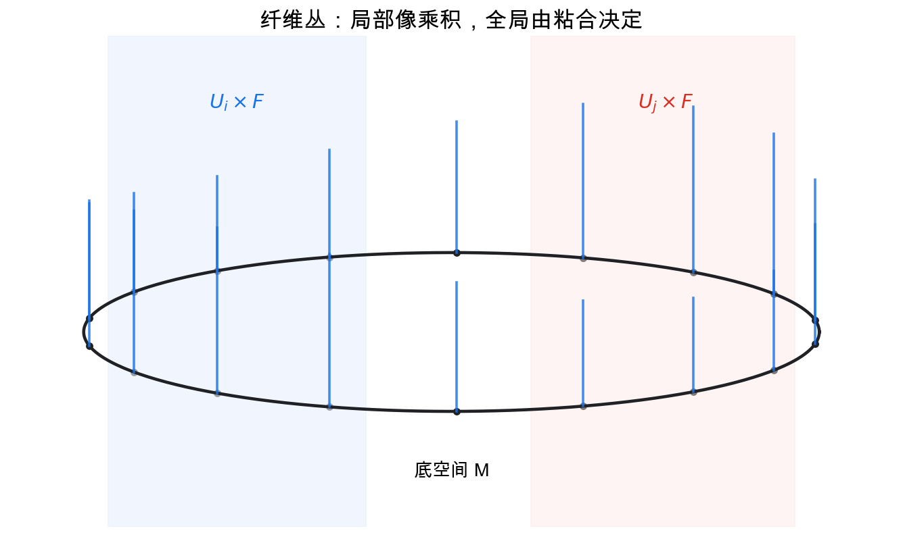
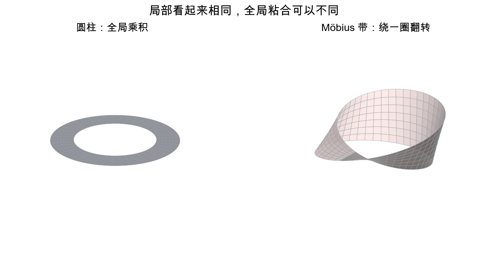
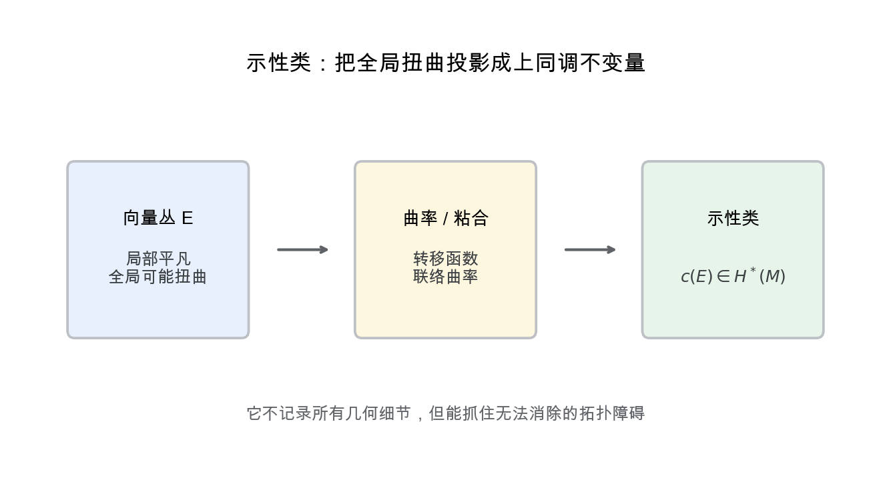

# 重学数学之二十七: 纤维丛与示性类——局部像乘积，全局却可能扭起来
![[Pasted image 20260628173927.png]]
## 一、从“每个点上附着一个空间”开始

很多几何对象不是单独一个空间，而是：

> **在底空间的每个点上，都附着另一个空间。**

流形每个点有切空间，于是所有切空间合在一起形成切丛：

$$
TM=\bigsqcup_{p\in M}T_pM
$$

如果每个点附着一个向量空间，就得到向量丛；如果每个点附着一个圆、一个群或一个更一般空间，就得到纤维丛。

局部看，纤维丛像乘积：

$$
\pi^{-1}(U)\cong U\times F
$$

但全局可能不是乘积。

纤维丛的核心在于：局部简单，全局可能扭曲。

## 二、Möbius 带：最小的扭曲例子

最直观的例子是 Möbius 带。

它的底空间是圆 $S^1$，每个点上附着一条线段。局部看，它和圆柱没有区别；但沿着圆走一圈，纤维翻转了。

这说明：

> **局部平凡不代表全局平凡。**

这种“绕一圈回来发生了变化”的现象，是纤维丛思想的入口。

## 三、转移函数：扭曲藏在哪里

为了描述纤维丛，我们用开覆盖 $\{U_i\}$。

在每个 $U_i$ 上，丛看起来像：

$$
U_i\times F
$$

但在重叠区域 $U_i\cap U_j$ 上，两种局部坐标要用转移函数粘起来：

$$
g_{ij}:U_i\cap U_j\to G
$$

这里 $G$ 是结构群。

转移函数必须满足 cocycle 条件：

$$
g_{ij}g_{jk}g_{ki}=e
$$

这和范畴论、上同调很接近：全局对象由局部对象加粘合数据构成。

## 四、联络：怎样比较不同点上的纤维

如果每个点上都有一个向量空间，那么不同点上的向量不能天然相减。它们属于不同纤维。

联络的作用是规定：

> **沿着底空间移动时，怎样把一个纤维中的向量平行搬运到另一个纤维。**

联络给出协变导数：

$$
\nabla_X s
$$

它衡量截面 $s$ 沿方向 $X$ 如何变化。

曲率则衡量平行移动绕小回路后是否回到原样：

$$
F_\nabla=\nabla^2
$$

这和第四章的平行移动、第十九章的 Lie 群、第二十六章的几何结构都接上了。

## 五、示性类：用上同调测量扭曲

示性类是纤维丛的拓扑不变量。它把一个向量丛映到基空间的上同调类：

$$
c(E)\in H^*(M)
$$

常见示性类包括：

- Stiefel-Whitney 类。
- Chern 类。
- Pontryagin 类。
- Euler 类。

它们回答的问题是：

> **这个丛到底扭得有多厉害？是否能找到全局非零截面？是否能拆成更简单的丛？**

例如球面 $S^2$ 的切丛不平凡。直观上，这就是“不能把球面上的毛梳平”的毛球定理。

## 六、主丛与规范场

物理中的规范理论自然使用主丛。

主丛的纤维是一个 Lie 群 $G$。规范场可以看成主丛上的联络；场强就是曲率。

电磁场对应 $U(1)$ 规范理论，Yang-Mills 理论对应非交换 Lie 群。

所以纤维丛不是抽象装饰。它是现代场论语言的骨架：

$$
\text{规范势} \leftrightarrow \text{联络},\quad
\text{场强} \leftrightarrow \text{曲率}
$$

## 七、关联丛：表示论怎样生成几何对象

主丛的纤维是群 $G$，但物理场和几何量常常取值在向量空间里。

如果有一个表示：

$$
\rho:G\to GL(V)
$$

就可以从主丛 $P$ 构造关联向量丛：

$$
P\times_\rho V
$$

意思是把 $P\times V$ 中满足群作用等价的点粘在一起。

这句话把第十九章和第二十章接进来了：结构群负责坐标变换，表示决定纤维里的对象怎样随坐标变换而变。

标量场、旋量场、规范场中的物质场，都可以这样理解。它们不是“定义在空间上的普通函数”，而是某个关联丛的截面。

## 八、和乐：绕一圈回来发生了什么

联络允许我们沿路径平行移动。若沿闭合回路走一圈，向量可能不会回到原方向。

这个变换叫和乐：

$$
\mathrm{Hol}_\gamma(\nabla)
$$

曲率可以看成无穷小回路的和乐；和乐则记录有限回路积累出的全局效应。

Berry 相位就是最典型例子。量子态的 Hamiltonian 缓慢绕参数空间一圈，系统回到同一个能级，但波函数获得一个额外相位。这个相位不是动力学时间积累出来的，而是参数空间中联络的和乐。

这再次提醒我们：局部看似可以选坐标消掉的东西，绕一圈后可能留下不可消除的痕迹。

## 九、Chern-Weil 理论：从曲率制造示性类

示性类不是凭空来的。Chern-Weil 理论告诉我们，可以从联络曲率中构造闭微分形式，它们代表上同调类。

例如 Chern 类可以由曲率矩阵 $F_\nabla$ 的不变量多项式得到：

$$
c(E)=\det\left(I+\frac{i}{2\pi}F_\nabla\right)
$$

换一个联络，具体微分形式会变，但上同调类不变。

这非常漂亮：局部几何量曲率，经过不变量多项式处理，变成全局拓扑不变量。

Atiyah-Singer 指标定理之所以能把分析、几何和拓扑放在同一个公式里，Chern-Weil 理论正是其中的基础语言之一。

## 十、规范变换：同一个物理场的不同描述

规范理论里，局部平凡化不是唯一的。换一套局部截面，就会改变联络形式的表达。

若规范变换为 $g$，联络形式大致按：

$$
A\mapsto g^{-1}Ag+g^{-1}dg
$$

曲率则按更简单的方式变换：

$$
F\mapsto g^{-1}Fg
$$

所以联络势 $A$ 依赖描述，曲率 $F$ 更接近可观测结构。

这也是学习纤维丛时容易卡住的地方：我们看到的局部公式常常带着坐标选择，但真正的对象是坐标变化下保持一致的整体结构。

## 十一、应用场景

| 领域 | 纤维丛扮演的角色 |
|------|----------------|
| 微分几何 | 切丛、余切丛、联络、曲率 |
| 拓扑 | 示性类、向量丛分类、K 理论 |
| 物理 | 规范场、Yang-Mills、纤维化、瞬子 |
| 机器人 | 姿态空间、配置空间、主丛约化 |
| 数据科学 | 流形上的局部坐标、切空间丛、规范等变网络 |
| 数值计算 | 有限元中的向量场、离散外微分 |

纤维丛真正厉害的地方是，它把“局部数据如何拼成全局对象”变成了可计算的结构。

## 十二、与前几章的连接

1. **微分拓扑**：纤维丛是光滑流形上的全局结构。
2. **同调与上同调**：示性类生活在上同调环中。
3. **Lie 群**：结构群控制纤维如何粘合。
4. **表示论**：关联丛通过群表示构造。
5. **物理与量子信息**：规范场、Berry 相位和拓扑相都依赖丛语言。

## 十三、前沿展望

### 13.1 规范场论与四维拓扑

Yang-Mills 规范场（1954）的数学实体就是主 $G$-丛上的联络，曲率形式对应物理场强。**瞬子**是四维 Riemannian 流形上 Yang-Mills 方程的自对偶解（$F = *F$），其模空间的拓扑被 Donaldson（1983）用来定义四维光滑流形的不变量。

Atiyah-Singer 指标定理将分析量（椭圆算子的指标）与拓扑量（示性类的积分）等同：

$$
\text{ind}(D) = \int_M \hat{A}(M) \wedge \text{ch}(E)
$$

这是 20 世纪数学最重要的结果之一，被应用于弦论中的反常消除（anomaly cancellation）和量子场论中的手性对称性破缺。

### 13.2 Berry 相位与拓扑绝缘体

Aharonov-Bohm 效应（1959）和 Berry 相位（1984）揭示：即使量子系统的 Hamiltonian 绝热演化回到初始值，波函数也会积累一个几何相位——这正是 $U(1)$ 主丛上联络的和乐（holonomy）。

Chern 数 $C_1 = \frac{1}{2\pi}\int_{BZ} F$（对布里渊区上 Berry 曲率积分）决定了二维系统的量子 Hall 电导（TKNN 公式，1982）。拓扑绝缘体的分类（Kitaev 2009；Ryu 等 2010）给出了不同对称性保护拓扑相的完整周期表，其中 Z 或 Z₂ 分类直接对应第 K 理论中向量丛的同伦分类。

### 13.3 示性类在机器学习中

等变网络的架构设计是选择主 $G$-丛的关联丛：给定群 $G$ 的表示 $\rho$，关联向量丛 $P \times_\rho V$ 承载了等变特征。Chern-Simons 项在某些 GNN 架构（分子模拟）中用于处理手性（chirality），Pontryagin 类在 SO(n) 等变网络的容量分析中出现。示性类 = 等变架构的"形状参数"。

## 十四、总结

纤维丛与示性类的核心结构：

1. **纤维丛**：每个底点附着一个纤维。
2. **局部平凡化**：局部像乘积空间。
3. **转移函数**：记录局部坐标如何粘合。
4. **联络**：定义不同纤维之间的平行比较。
5. **曲率**：平行移动绕回路失败的量。
6. **示性类**：把全局扭曲变成上同调不变量。
7. **主丛**：规范场论的几何语言。
8. **关联丛**：用群表示把主丛变成向量丛。
9. **Chern-Weil 理论**：从曲率形式构造拓扑不变量。

> **纤维丛研究的是局部看似平凡的对象，如何在全局拼接时产生不可消除的扭曲。**

---

*纤维丛展示了局部怎么粘成全局。接下来进入代数数论，把整数、素数和方程解放进更大的数域，用理想、分解和局部化重新理解算术。*
