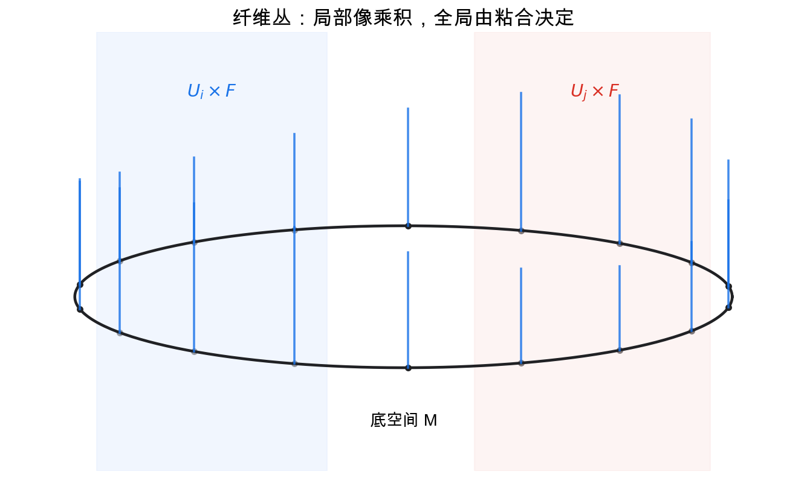
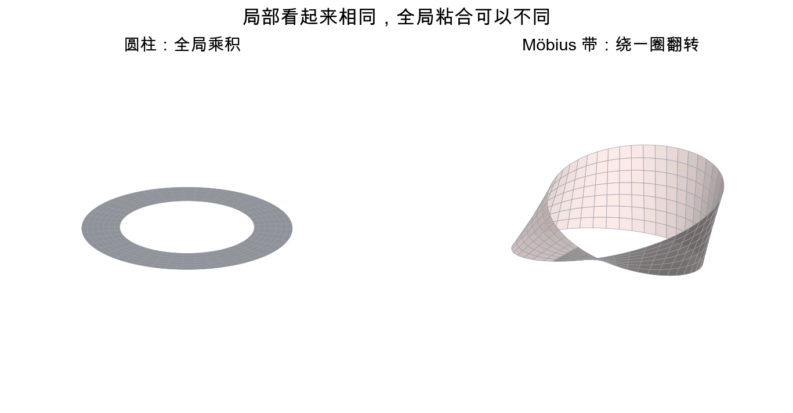
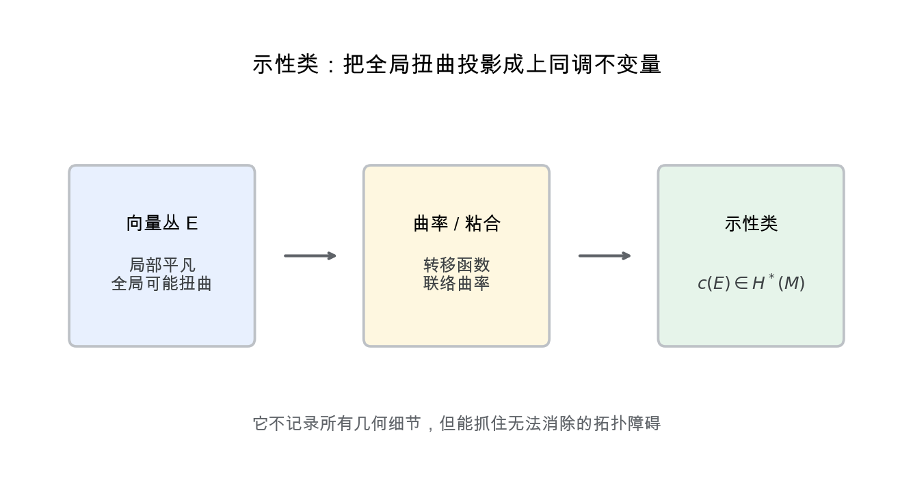

# 重学数学之二十七: 纤维丛与示性类——局部像乘积，全局却可能扭起来

> **先给读者一张地图。** 本章研究一类由许多空间拼成的几何对象。我们先弄清这些空间怎样逐点排列，再用 Möbius 带和 Hopf 丛观察它们怎样扭转。转移函数、联络和曲率描述扭转的方式，示性类则把扭转转成可计算的上同调类。

读者只需熟悉流形、微分形式和基本上同调。主丛、Chern-Weil 理论和 K 理论会给出一条通往现代几何与物理的路线，不要求一开始就掌握所有技术细节。

## 一、从“每个点上附着一个空间”开始

先从切丛说起。设 $M$ 是一个 $n$ 维流形。每个点 $p\in M$ 都有自己的切空间 $T_pM$。如果 $v$ 是 $p$ 点的切向量，我们写成

$$
(p,v),\qquad v\in T_pM.
$$

这里必须保留 $p$。只写 $v$，就不知道它属于哪个切空间。把所有这样的 $(p,v)$ 收集起来，得到切丛

$$
TM=\{(p,v)\mid p\in M,\ v\in T_pM\}.
$$

切丛有一个自然的映射

$$
\pi:TM\longrightarrow M,\qquad \pi(p,v)=p.
$$

这个映射把切向量送回它所在的点。纤维丛沿用了这组关系，只是附在每个点上的对象不一定是切空间，也可以是一条直线、一个圆或另一个空间。一般记号如下。

| 记号 | 名称 | 含义 |
| --- | --- | --- |
| $M$ | **底空间**（base space） | 纤维按哪些点排列。切丛的底空间就是流形 $M$。 |
| $E$ | **总空间**（total space） | 把各点上的纤维全部放在一起得到的空间。切丛中 $E=TM$。 |
| $\pi:E\to M$ | **投影**（projection） | 指出总空间中的元素属于哪个底点。 |
| $E_p=\pi^{-1}(p)$ | $p$ 上方的**纤维**（fiber） | 投影到 $p$ 的全部元素。切丛中 $E_p=T_pM$。 |

底空间可以看作纤维的索引空间。固定 $p$ 后，逆像

$$
\pi^{-1}(p)=\{e\in E\mid \pi(e)=p\}
$$

就是 $p$ 上方的纤维。纤维未必是一条线；名称虽然来自几何图像，它可以是任意给定类型的空间。

还剩下 **典型纤维** $F$。这里的“典型”不是概率统计里的典型样本，而是供各个纤维参照的标准模型。具体纤维 $E_p$ 和 $F$ 通常不是同一个集合，但它们具有相同的空间结构。对 $n$ 维流形的切丛，

$$
E=TM,\qquad E_p=T_pM,\qquad F=\mathbb R^n.
$$

每个 $T_pM$ 都是 $n$ 维向量空间。选定坐标图 $\varphi:U\to\mathbb R^n$ 后，微分

$$
d\varphi_p:T_pM\longrightarrow\mathbb R^n
$$

可以把 $U$ 中每个点的切向量写成 $n$ 个数。换到另一个坐标图，新的微分会改变这些数。局部坐标能够统一，全局坐标却可能对不上，纤维丛记录的就是不同局部表示之间的转换规则。

一个完全不扭的对照例子是平凡丛：

$$
E=M\times\mathbb R^r,\qquad \pi(p,v)=p.
$$

此时每根纤维 $E_p=\{p\}\times\mathbb R^r$ 都能用同一套方式标识为 $\mathbb R^r$，所以 $F=\mathbb R^r$。一般的纤维丛只要求这种标识在小区域里存在，整个 $M$ 上未必能共用一套标识。

形式上，一个以 $F$ 为典型纤维的纤维丛要求：对 $M$ 的每个点 $p$，存在一个小邻域 $U$ 和同胚（光滑范畴中取微分同胚）

$$
\Phi_U:\pi^{-1}(U)\xrightarrow{\ \cong\ }U\times F,
\qquad \operatorname{pr}_1\circ\Phi_U=\pi.
$$

等式 $\operatorname{pr}_1\circ\Phi_U=\pi$ 表明 $\Phi_U$ 保留底点。若 $e\in E$ 满足 $\pi(e)=p$，那么 $\Phi_U(e)$ 必须形如 $(p,f)$，其中 $f\in F$。

因此，纤维丛不是简单的笛卡尔积，而是“局部像 $U\times F$、全局由粘合决定”的空间。

最简单的丛是平凡丛 $M\times F\to M$。但局部平凡并不推出全局平凡，这正是本章的主题。

## 二、四个基本例子

### 2.1 Möbius 带：绕一圈翻转一次

把矩形 $[0,1]\times[-1,1]$ 的两条竖边按

$$
(0,t)\sim(1,-t)
$$

粘起来，得到 Möbius 带。把矩形中的 $x$ 坐标投到

$$
S^1=[0,1]/(0\sim1)
$$

上，就得到一个投影。固定圆上的一个点后，所有投影到该点的线段点组成一根纤维。每个小弧段上，Möbius 带都能写成 $U\times[-1,1]$；沿圆走一周，两个端点的识别把纤维坐标变成 $t\mapsto-t$。

若把每根线段延长为整条实线，就得到 Möbius 线丛。它没有处处非零的连续截面，也就是说，无法在圆上的每一点连续选出一根不为零的向量。稍后我们用第一 Stiefel-Whitney 类 $w_1$ 来记录这个障碍。

### 2.2 切丛：每个点附着一个切空间

流形 $M$ 的切丛是

$$
TM=\bigsqcup_{p\in M}T_pM\xrightarrow{\pi}M.
$$

在坐标图 $U$ 中，$TM|_U$ 可以用 $(x,v)\in U\times\mathbb R^n$ 表示；坐标变换的线性部分 $D(x'\circ x^{-1})$ 就是转移函数。因此，切丛的结构群可取 $GL(n,\mathbb R)$。余切丛 $T^*M$ 则把每个 $T_pM$ 换成对偶空间。

球面 $S^2$ 的切丛不能平凡化。更强的是，球面上连一个处处非零的连续切向量场也不存在，这就是毛球定理；如果切丛能够平凡化，当然会得到两个处处线性无关的切向量场。

### 2.3 Hopf 纤维化：圆如何绕在三维球面上

Hopf 纤维化是

$$
S^1\longrightarrow S^3\xrightarrow{\,\pi\,}S^2.
$$

把 $S^3$ 看成单位四元数。右乘单位复数 $e^{i\theta}$ 是一个 $S^1=U(1)$ 作用；固定一个点后，这个作用的轨道就是一根圆形纤维。Hopf 映射的底空间是 $S^2$，总空间是 $S^3$。这个纤维化在两个开圆盘上局部平凡，却不能整体写成 $S^2\times S^1$。把主 $U(1)$-丛通过标准表示变成复线丛后，得到的复线丛第一 Chern 类是

$$
c_1(P)=1\in H^2(S^2;\mathbb Z),
$$

所以 Hopf 丛是“扭曲不可被连续消掉”的最小高维例子。

### 2.4 平凡丛与直和

平凡丛 $M\times\mathbb R^r$ 有 $r$ 个处处非零、线性无关的全局截面。两个向量丛可以逐纤维做直和 $E\oplus F$，也可以做张量积 $E\otimes F$ 和对偶丛 $E^*$。这些运算会在示性类上产生乘法公式，例如

$$
c(E\oplus F)=c(E)c(F),
$$

这是计算复杂丛的主要工具。

## 三、转移函数：扭曲藏在哪里

取一个开覆盖 $\{U_i\}$，在每个 $U_i$ 上选平凡化 $\Phi_i$。在重叠区域上，两个纤维坐标的关系必须保持底点不变，因而形如

$$
\Phi_i\Phi_j^{-1}(p,v)=(p,g_{ij}(p)\cdot v),
\qquad g_{ij}:U_i\cap U_j\to G.
$$

这里 $G$ 是结构群。它规定允许怎样改变纤维坐标：向量丛可取 $GL(r,\mathbb R)$ 或 $GL(r,\mathbb C)$，圆丛可取 $U(1)$。一致性要求

$$
g_{ii}=e,\qquad g_{ji}=g_{ij}^{-1},\qquad g_{ij}g_{jk}=g_{ik}
$$

（最后一个等式在三重交集 $U_i\cap U_j\cap U_k$ 上成立）。第三个等式就是 Čech 1-cocycle 条件。若更换局部平凡化 $h_i:U_i\to G$，则

$$
g_{ij}\longmapsto h_i^{-1}g_{ij}h_j.
$$

因此，真正决定丛的是 cocycle 的等价类，而不是某一套坐标公式。Möbius 带沿着圆周一圈回到原处时，纤维坐标多了一个 $-1\in O(1)$ 的变换；Hopf 丛在南、北两个局部截面的重叠赤道上，出现了绕 $U(1)$ 一圈的映射。

## 四、截面、丛映射与拉回

丛的一个截面是映射 $s:M\to E$，满足

$$
\pi\circ s=\operatorname{id}_M.
$$

这个条件表示，$s(p)$ 总在 $E_p$ 中。也就是对每个底点 $p$，截面连续地选出一个纤维元素。向量丛的截面构成 $C^\infty(M)$-模 $\Gamma(E)$；切向量场就是 $\Gamma(TM)$ 的元素。

一个向量丛有 $r$ 个处处线性无关的全局截面，当且仅当它含有一个平凡子丛 $M\times\mathbb R^r$。但“存在一个非零截面”和“丛完全平凡”是不同强度的命题：$TS^2\oplus\underline{\mathbb R}$ 是平凡丛（稳定平凡），而 $TS^2$ 本身不是。

给定连续映射 $f:N\to M$，可以把 $E$ 拉回到 $N$。拉回的纤维取自 $f(x)$ 上的原纤维：

$$
f^*E=\{(x,e)\in N\times E\mid f(x)=\pi(e)\}\longrightarrow N.
$$

拉回满足函子性 $ (f\circ g)^*E\cong g^*(f^*E)$。示性类也会随拉回一起变化：

$$
c(f^*E)=f^*c(E).
$$

当 $f$ 是子空间的包含映射时，拉回就是把丛限制到这个子空间；这常用来检查一个全局丛在一条曲线或一个球面上是否已经显出扭曲。

## 五、向量丛、主丛与关联丛

### 5.1 向量丛

秩为 $r$ 的实（或复）向量丛要求每个纤维是 $r$ 维向量空间，且转移函数线性作用。可以先在每个坐标邻域中选内积，再用分割单位作加权平均，把这些内积拼成全局度量，所以度量通常不会带来新的拓扑障碍。联络是另一种结构，它规定怎样比较不同点的向量。

### 5.2 主丛

主 $G$-丛 $P\xrightarrow{\pi}M$ 的每个纤维都带有一个 $G$ 的右作用。自由表示没有非单位元能固定纤维中的点，传递表示任意两个纤维点都能由唯一的群元素互相得到。于是每个纤维都是一个 $G$-轨道。局部平凡化写成

$$
P|_U\cong U\times G,
$$

并满足 $(p,g)\cdot h=(p,gh)$。主丛纤维没有“零向量”这样的特殊点。选择一个局部截面，就相当于在每个底点选一套参考标架。

### 5.3 关联丛

若 $\rho:G\to GL(V)$ 是表示，则定义关联向量丛

$$
P\times_\rho V=(P\times V)/\bigl((p,v)\sim(pg,\rho(g)^{-1}v)\bigr).
$$

主丛记录参考标架如何变，表示 $\rho$ 决定具体场量如何随标架变换。切丛可以由标架主丛通过标准表示得到；物理中的物质场通常是某个关联丛的截面。

## 六、联络、曲率与平行移动

### 6.1 联络的两种语言

对向量丛 $E$，联络是一个运算

$$
\nabla:\Gamma(E)\to\Omega^1(M;E),
$$

满足 Leibniz 法则

$$
\nabla(fs)=df\otimes s+f\nabla s.
$$

给定路径 $\gamma:[0,1]\to M$，先取一族沿路径变化的向量 $s(t)\in E_{\gamma(t)}$。平行方程

$$
\nabla_{\dot\gamma(t)}s(t)=0
$$

的解把初始向量 $s(0)\in E_{\gamma(0)}$ 搬到终点向量 $s(1)\in E_{\gamma(1)}$。主丛上则用联络 1-形式 $A$ 描述哪些方向称为水平；关联表示把主丛上的平行移动转换为向量丛中的平行移动。

### 6.2 局部公式与曲率

在局部标架下，联络写成矩阵值 1-形式 $A$，

$$
\nabla=d+A.
$$

曲率是联络连续作用两次后的误差，局部写成

$$
F_\nabla=\nabla^2=dA+A\wedge A.
$$

这里 $A\wedge A$ 同时包含微分形式的楔积和矩阵乘法。对 $U(1)$，Lie 代数是一维交换代数，标量 1-形式与自身的楔积为零，所以 $F=dA$。曲率也可由交换子刻画：

$$
[\nabla_X,\nabla_Y]-\nabla_{[X,Y]}=F_\nabla(X,Y).
$$

沿一个足够小的平行四边形移动，向量的首阶偏差正比于 $F_\nabla(X,Y)$。曲率因此测量平行移动对路径的依赖程度。

若约定局部标架变换为 $e'=eg$，则

$$
A'=g^{-1}Ag+g^{-1}dg,\qquad F'=g^{-1}Fg.
$$

联络形式依赖局部标架，曲率按共轭变换；对共轭不变多项式 $P$，$P(F)$ 在更换标架后保持不变。

## 七、和乐：有限回路的全局记忆

对闭路 $\gamma$，平行移动给出纤维上的线性变换

$$
\operatorname{Hol}_\gamma(\nabla):E_{\gamma(0)}\to E_{\gamma(0)}.
$$

若 $F=0$，联络称为平坦。在单连通的小邻域中，平坦联络的平行移动只由起点和终点决定；在非单连通空间上，绕不可缩回路仍可能留下由基本群表示

$$
\rho:\pi_1(M)\to G
$$

决定的全局和乐。Berry 相位和 Aharonov–Bohm 效应都属于这一模式，局部场强可以为零，绕不可缩回路的相位仍然非零。

## 八、示性类：把丛映到上同调

一个示性类把向量丛（或主丛）映到底空间的上同调类，并且不依赖局部坐标的选取。把这种对应记为 $c$，它通常满足：

1. **自然性**：$c(f^*E)=f^*c(E)$。
2. **同构不变性**：同构丛有相同示性类。
3. **Whitney 乘积公式**：对直和，$c(E\oplus F)=c(E)c(F)$（具体形式依示性类而定）。
4. **归一化**：平凡丛的正次数示性类为零。

常见示性类如下：

| 名称 | 系数与次数 | 主要对象 | 直觉 |
| --- | --- | --- | --- |
| Stiefel–Whitney 类 $w_i$ | $H^i(M;\mathbb Z/2)$ | 实向量丛 | 定向性、实丛的模 2 障碍 |
| Chern 类 $c_i$ | $H^{2i}(M;\mathbb Z)$ | 复向量丛 | 复丛的扭曲与量子数 |
| Pontryagin 类 $p_i$ | $H^{4i}(M;\mathbb Z)$（可能有 2-挠） | 实向量丛 | 复化后的偶次信息 |
| Euler 类 $e$ | $H^r(M;\mathbb Z)$（定向秩 $r$） | 定向实向量丛 | 全局非零截面的障碍 |

总 Chern 类和总 Stiefel–Whitney 类分别写成

$$
c(E)=1+c_1(E)+c_2(E)+\cdots,
\qquad w(E)=1+w_1(E)+w_2(E)+\cdots.
$$

系数环决定了我们能看见哪些信息。$w_i$ 只看模 2 信息，$c_i$ 通常是整数类；两者记录的障碍并不相同。

## 九、三个可计算的示例

### 9.1 Möbius 线丛与 $w_1$

实线丛的结构群是 $GL(1,\mathbb R)$，它可以连续收缩到 $\{\pm1\}$。因此，实线丛的转移函数只需要记录纤维有没有翻转。这些翻转数据组成一个 $\mathbb Z/2$-值 cocycle，并给出

$$
w_1(L)\in H^1(M;\mathbb Z/2).
$$

对 $S^1$ 上的 Möbius 线丛，沿基本回路取值 $1\in\mathbb Z/2$，所以

$$
w_1(L)\neq0.
$$

若 $w_1(L)=0$，实线丛可定向，而定向线丛的结构群收缩到正实数，再收缩到单位元，于是它是平凡的。故对线丛，$w_1=0$ 恰好等价于平凡。

### 9.2 球面的 Euler 类与毛球定理

对闭定向 $2$-流形 $M$，切丛 Euler 类满足

$$
\langle e(TM),[M]\rangle=\chi(M).
$$

因此

$$
\langle e(TS^2),[S^2]\rangle=\chi(S^2)=2,
$$

Euler 类非零，说明 $TS^2$ 不可能有处处非零截面。一般地，若秩为 $r$ 的定向丛有一个处处非零截面，则其 Euler 类必须为零；逆命题需要额外的维数和横截性条件，不能无条件反过来使用。

### 9.3 Hopf 丛的第一 Chern 数

把 $S^2$ 分成北、南两个开圆盘，Hopf 丛在两盘上各有截面。赤道重叠上的转移函数是

$$
g_{NS}:S^1\to U(1),\qquad g_{NS}(e^{i\varphi})=e^{i\varphi}.
$$

这个转移函数沿赤道绕 $U(1)$ 一圈，绕数为 $1$，所以

$$
c_1(P)=1\in H^2(S^2;\mathbb Z).
$$

若选择联络使曲率为 $F$，Chern-Weil 公式给出

$$
\frac{1}{2\pi}\int_{S^2}F=1
$$

（物理约定可能把 $F$ 写成 $i$ 倍的实二形式，符号随约定改变）。这说明积分量不依赖具体联络，且必须是整数。

## 十、Chern-Weil 理论：从曲率制造不变量

设 $E$ 是复秩 $r$ 向量丛，$F$ 是某个联络的曲率矩阵。微分形式

$$
c(E)=\det\left(I+\frac{i}{2\pi}F\right)
$$

的各次齐次部分是闭形式，代表 $c_i(E)$。更一般地，对 Lie 代数上的 Ad-不变多项式 $P$，$P(F)$ 是闭形式，其上同调类与联络选择无关。换用另一个联络时，两个代表相差一个 Chern-Simons 形式的外微分。

曲率本身依赖联络，但不变多项式消除了局部标架的选择，留下的闭形式上同调类才是丛的拓扑信息。Pontryagin 类可由复化丛的 Chern 类给出（符号约定下 $p_i(E)=(-1)^ic_{2i}(E\otimes\mathbb C)$），Euler 类也有 Pfaffian 的曲率公式。

## 十一、分类空间、稳定性与障碍

对足够好的空间 $M$，秩为 $r$ 的实向量丛由到 Grassmann 流形的映射分类；稳定化后可写成

$$
\{\text{稳定实丛}\}\leftrightarrow [M,BO],
\qquad
\{\text{稳定复丛}\}\leftrightarrow [M,BU].
$$

这里 $BO,BU$ 是分类空间，$[M,BG]$ 表示从 $M$ 到 $BG$ 的同伦类。主 $G$-丛同样由 $[M,BG]$ 分类（在适当的 CW 复形条件下）。于是，比较不同粘合方式可以转化为比较映射的同伦类。

对有限 CW 复形，把向量丛按直和组成 Grothendieck 群，就得到 K 理论 $K^0(M)$。Chern 字符

$$
\operatorname{ch}:K^0(M)\otimes\mathbb Q\longrightarrow H^{\mathrm{even}}(M;\mathbb Q)
$$

把直和变成加法、张量积变成乘法。示性类因此成为分类理论和广义上同调的一部分。

Euler 类还可以看作零截面与一般截面的交点类。横截截面 $s$ 的零点带符号计数等于

$$
\langle e(E),[M]\rangle.
$$

这给出了示性类与 Poincaré 对偶、交叉理论之间的桥梁。

## 十二、主丛与规范场

在物理中，局部规范势 $A$ 是主丛联络在某个局部标架下的表达。若规范变换为 $g:M\to G$，则

$$
A\mapsto g^{-1}Ag+g^{-1}dg,
\qquad
F\mapsto g^{-1}Fg.
$$

电磁场对应阿贝尔群 $U(1)$，此时 $F=dA$；Yang–Mills 理论使用非交换 Lie 群，曲率中的 $A\wedge A$ 项不能省略。物质场是关联丛截面，协变导数 $d+A$ 让局部表达在规范变换后仍描述同一个几何场。

纤维丛语言也解释了磁单极子。若 $S^2$ 上的 $U(1)$ 丛有非零 $c_1$，就不能用一个全局势 $A$ 覆盖整个球面，必须在南、北两个区域分别选局部势，并在重叠处用规范变换粘合。某个局部势出现的奇点来自这套局部坐标，不能直接当作曲率的奇点。

## 十三、应用与跨章节连接

| 领域 | 纤维丛扮演的角色 |
| --- | --- |
| 微分几何 | 切丛、余切丛、标架丛、联络与曲率 |
| 拓扑 | 向量丛分类、示性类、K 理论与障碍理论 |
| 物理 | 规范势、场强、Berry 丛、拓扑量子数 |
| 机器人 | $SO(3)$ 姿态主丛、配置空间与平行移动 |
| 数据科学 | 流形上的切空间、局部特征与群等变映射 |
| 数值计算 | 有限元中的向量场、离散微分形式与规范一致性 |

与前几章的连接可以这样记：

1. **微分几何与微分拓扑**提供流形、切空间、横截性和积分。
2. **同调与上同调**提供示性类的容器；自然性说明映射如何传递障碍。
3. **Lie 群与表示论**提供结构群、主丛和关联丛。
4. **辛几何与量子信息**中的 Berry 相位，是联络和和乐的具体实例。
5. **代数几何**用代数向量丛、层和 Chern 类描述复代数簇；下一章的数域也会出现局部-整体的思想。

## 十四、前沿展望

### 14.1 规范场论与四维拓扑

Yang–Mills 方程研究主 $G$-丛上的联络。四维 Riemann 流形上的自对偶方程

$$
F=*F
$$

产生瞬子；其模空间的拓扑进入 Donaldson 不变量。对紧致无边界自旋流形，Dirac 算子的 Atiyah–Singer 指标定理呈现为

$$
\operatorname{ind}(D_E)=\int_M\hat A(TM)\wedge\operatorname{ch}(E).
$$

这个公式需要紧致性、自旋结构以及具体 Dirac 算子等条件。满足条件时，它把分析得到的指标写成示性类的积分。

### 14.2 Berry 曲率与拓扑相

参数空间上的本征态组成线丛，绝热演化的 Berry 联络具有曲率 $F$。二维布里渊区上的

$$
C=\frac{1}{2\pi}\int_{\mathrm{BZ}}F\in\mathbb Z
$$

是 Chern 数；在合适的物理假设下，TKNN 公式把它与量子 Hall 电导联系起来。时间反演对称性下，某些系统的整数不变量降为 $\mathbb Z/2$ 不变量，体现了实结构和复结构之间的差别。

### 14.3 等变机器学习的几何语言

当输入数据位于带群作用的流形上时，局部特征可看成某个关联丛的截面，等变网络则近似满足

$$
\Phi(g\cdot x)=\rho(g)\Phi(x).
$$

这种表述把坐标变换、旋转等变和 gauge-equivariant 网络放进同一套语言。示性类主要帮助我们分析数据空间和模型的全局拓扑约束，它通常不是可以直接替代训练目标的性能指标。

## 十五、练习：把直觉变成计算

1. **Möbius 的翻转。** 用一个覆盖 $S^1=U_0\cup U_1$ 写出 Möbius 线丛的转移函数，并说明它为何不能通过 $h_i^{-1}g_{ij}h_j$ 变成恒等函数。
2. **拉回。** 令 $f:S^2\to S^2$ 的度数为 $k$，证明对 $S^2$ 上的复线丛 $L$ 有 $c_1(f^*L)=k\,c_1(L)$，并解释这如何反映转移函数的绕数。
3. **直和公式。** 若复线丛 $L_1,L_2$ 的第一 Chern 类分别为 $a,b$，计算 $c(L_1\oplus L_2)$ 的各次分量。
4. **球面障碍。** 用 Euler 示性类解释为什么 $S^{2m}$ 没有处处非零切向量场；再比较可平行化的 $S^1,S^3,S^7$ 与一般奇数维球面。
5. **曲率与规范。** 对 $U(1)$ 联络 $A$ 验证 $A\mapsto A+d\lambda$ 时 $F=dA$ 不变；解释非阿贝尔情形为什么出现 $A\wedge A$。

## 十六、总结

纤维丛与示性类的核心结构：

1. **纤维丛**：每个底点附着一个纤维，局部像乘积。
2. **转移函数**：记录局部平凡化如何粘合，cocycle 条件保证一致性。
3. **截面与拉回**：把“逐点选择”和“沿映射搬运”变成可操作的丛映射。
4. **主丛与关联丛**：用结构群和表示组织参考系及具体场量。
5. **联络与曲率**：定义跨纤维比较，测量局部平行移动的失败。
6. **和乐**：记录绕有限回路积累的全局效应。
7. **示性类**：把全局扭曲变成上同调不变量，并给出截面存在性的障碍。
8. **分类空间与 K 理论**：说明这些不变量如何进入稳定分类。

> **纤维丛研究的是：局部看似平凡的对象，如何在全局拼接时产生不可消除的扭曲；示性类则把这种扭曲变成可以积分、比较和计算的拓扑数据。**

---

*纤维丛展示了局部怎样粘成全局。接下来进入代数数论，把整数、素数和方程解放进更大的数域，用理想、分解和局部化重新理解算术。*
