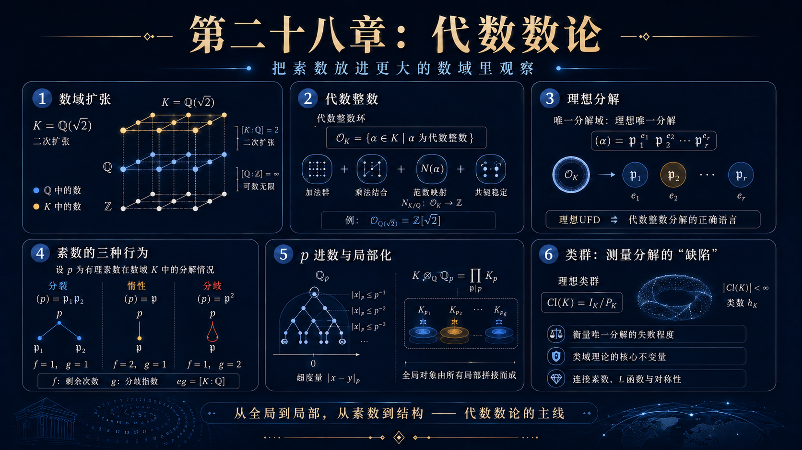
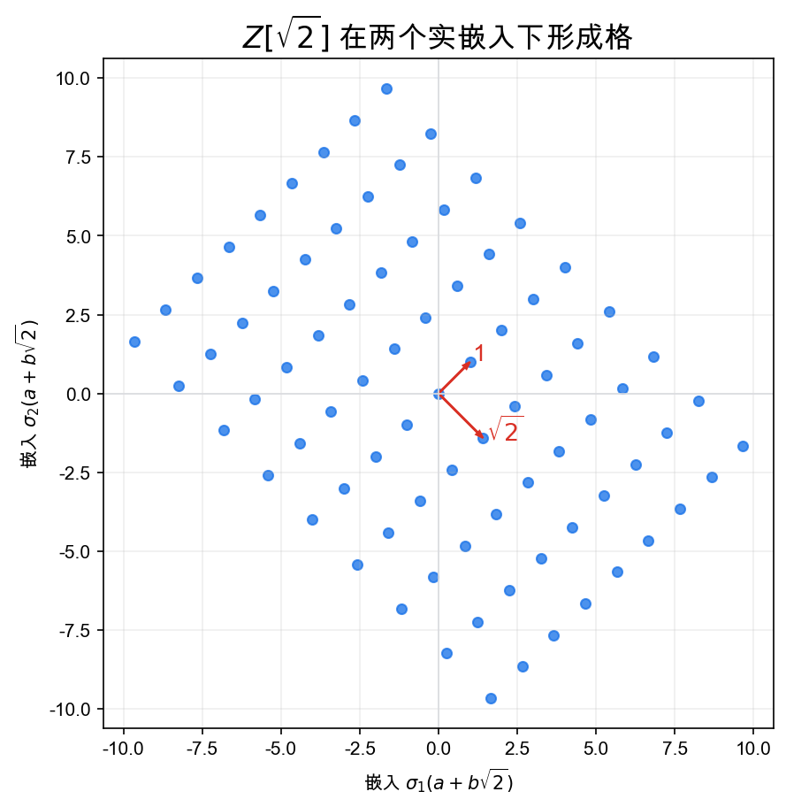
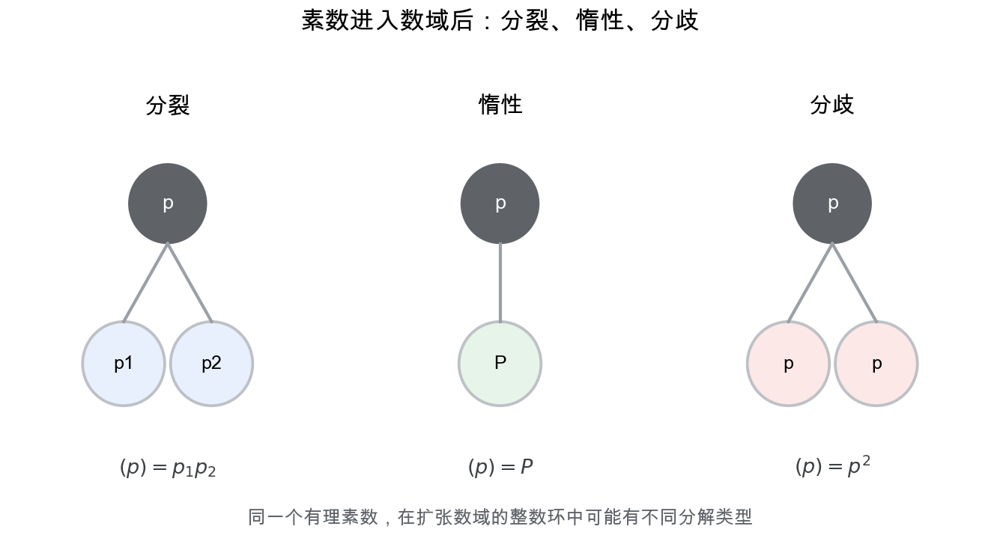
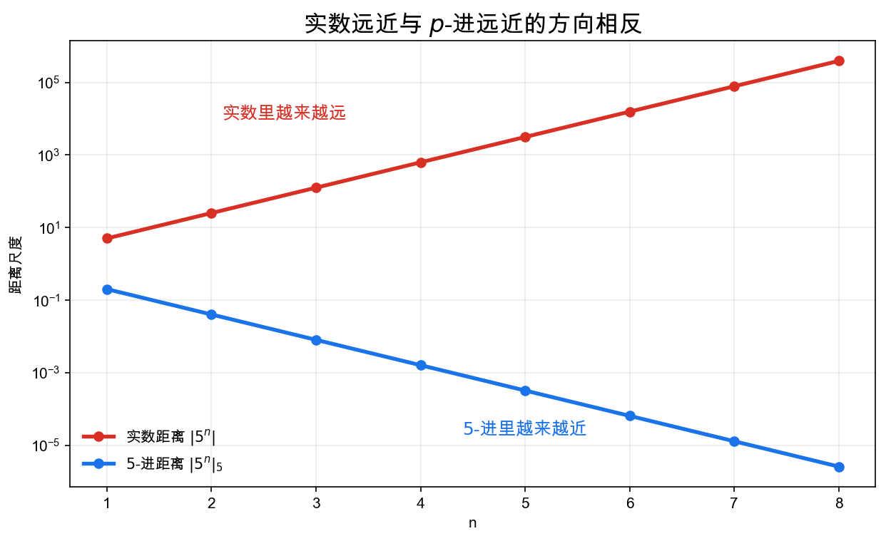

# 重学数学之二十八: 代数数论——把素数放进更大的数域里观察

## 一、为什么整数不够用？

数论最开始研究整数：

$$
\mathbb Z
$$

但很多方程的自然解不在整数里。例如：

$$
x^2+1=0
$$

需要加入 $i$。再比如：

$$
x^2-2=0
$$

需要加入 $\sqrt2$。

代数数论的第一步是扩张数域：

$$
K=\mathbb Q(\sqrt d)
$$

然后问：

> **在新的数域里，整数、素数、分解和同余会变成什么样？**

在 $\mathbb Q(\sqrt2)$ 中，形如：

$$
a+b\sqrt2
$$

的数构成一个二维格点结构。这让数论开始带上几何味道。

## 二、代数整数：谁才是新数域里的整数？

在数域 $K$ 中，不是所有元素都应该叫整数。

代数整数定义为：满足首一整系数多项式的数。

$\alpha$ 是代数整数，如果存在：

$$
\alpha^n+a_{n-1}\alpha^{n-1}+\cdots+a_0=0
$$

其中 $a_i\in\mathbb Z$。

数域 $K$ 中所有代数整数构成整数环：

$$
\mathcal O_K
$$

它是 $\mathbb Z$ 在 $K$ 中的正确推广。

为什么要求多项式“首一”？因为这样定义出来的元素在加法和乘法下能形成环，也保留了整数的整性直觉。比如 $1/2$ 满足 $2x-1=0$，但这个方程不是首一的，所以它不应该被叫作整数。

## 三、唯一分解为什么会失败？

在 $\mathbb Z$ 中，每个整数都能唯一分解成素数乘积。

但在一般整数环中，元素的唯一分解可能失败。

经典例子是：

$$
\mathbb Z[\sqrt{-5}]
$$

其中：

$$
6=2\cdot3=(1+\sqrt{-5})(1-\sqrt{-5})
$$

这两种分解本质不同。

代数数论的关键转向是：

> **元素分解会失败，但理想分解可以恢复唯一性。**

这里的失败不是因为我们没找到更聪明的分解方法，而是元素层面的“素数”概念本身不够稳。理想把“某个元素的倍数集合”推广成更柔性的对象，素理想才是在扩张数域里真正稳定的基本块。

## 四、理想：素数的正确推广

在整数环 $\mathcal O_K$ 中，一个理想 $\mathfrak a$ 可以分解为素理想的乘积：

$$
\mathfrak a=\mathfrak p_1^{e_1}\cdots\mathfrak p_r^{e_r}
$$

这恢复了唯一分解。

理想不是技术补丁，而是说明：素数在扩张数域里可能裂开、保持惰性，或发生分歧。

例如在二次数域中，一个有理素数 $p$ 的行为由多项式模 $p$ 的分解决定。

直观地说，把定义数域的多项式拿到模 $p$ 世界里看，如果它分裂成几个因子，$p$ 就会相应裂成几个素理想；如果仍然不可约，$p$ 往往保持惰性；如果出现重根，就对应分歧。素数在数域中的命运，可以从模 $p$ 的方程形状读出来。

## 五、局部化：一次只看一个素数

代数数论常用局部-整体思想。

与其一次看所有素数，不如固定一个素数 $p$，研究 $p$-进数：

$$
\mathbb Q_p
$$

$p$-进绝对值把“能被多少次 $p$ 整除”当成距离。

如果两个数差能被很高次的 $p$ 整除，它们在 $p$-进意义下就很近。

这和实数距离完全不同，却非常适合同余和整除问题。

例如在 $2$-进意义下，$1$ 和 $1025$ 很近，因为它们差 $1024=2^{10}$。实数距离关心数轴上的大小，$p$-进距离关心同余精度。越多位 $p$-进展开相同，两个数越近。

## 六、类群：唯一分解失败的量化

既然理想能唯一分解，我们还想知道：每个理想是否都是主理想？

如果所有理想都是主理想，元素唯一分解通常能恢复。

理想类群定义为：

$$
\mathrm{Cl}(K)=
\frac{\text{分式理想群}}{\text{主分式理想群}}
$$

它衡量整数环离唯一分解整环有多远。

类数 $h_K=|\mathrm{Cl}(K)|$ 是代数数论最重要的不变量之一。

如果类数是 1，所有理想都是主理想，理想唯一分解能降回元素唯一分解。类数越大，说明有越多理想不能由单个元素生成，元素分解失败的方式也越丰富。

## 七、Galois 群：数域扩张的对称性

数域扩张不只是“加入新数”。它还带来对称性。

例如 $K=\mathbb Q(\sqrt2)$ 有一个非平凡自同构：

$$
\sqrt2\mapsto -\sqrt2
$$

它固定 $\mathbb Q$，但交换方程 $x^2-2=0$ 的两个根。

所有这样的自同构组成 Galois 群：

$$
\mathrm{Gal}(K/\mathbb Q)
$$

Galois 理论的核心是：扩张域的中间域，对应 Galois 群的子群。

这种对应把“数域中有哪些中间层”翻译成“对称群中有哪些子群”。所以 Galois 群不是外加的对称性，而是方程根之间所有代数关系允许的重排方式。

这把“方程的根如何互相变换”变成了群论。后来的 Galois 表示则继续往前走：让绝对 Galois 群作用在线性空间上，把数论信息压进矩阵里。

## 八、素数的分解：分歧、惯性与剩余次数

有理素数 $p$ 在整数环 $\mathcal O_K$ 中的分解一般写成：

$$
p\mathcal O_K=\mathfrak p_1^{e_1}\cdots \mathfrak p_g^{e_g}
$$

这里有三个数字值得看。

$e_i$ 是分歧指数，表示素数在这个方向上重复了多少次；$f_i$ 是剩余次数，表示有限域扩张：

$$
\mathcal O_K/\mathfrak p_i
$$

相对于 $\mathbb F_p$ 的次数；$g$ 是裂成多少个素理想。

它们满足：

$$
\sum_i e_i f_i=[K:\mathbb Q]
$$

直觉上，一个素数进入数域后，总度数守恒，但可以用不同方式分配：完全裂开、保持惰性、发生分歧，或者混合。

分歧尤其重要。它说明扩张在某些素数处“不光滑”，就像代数几何里映射的临界点。判别式正是记录哪些素数会分歧的主要不变量。

## 九、adele 与 idele：把所有局部信息放在一起

局部化让我们一次看一个素数。但数论最终还要把所有素数和无穷远处的实/复嵌入放在一起。

adele 环 $\mathbb A_K$ 可以粗略理解为：

$$
\mathbb A_K = \prod_v' K_v
$$

这里 $v$ 遍历所有位置，$K_v$ 是对应完备化，撇号表示受限直积。

它把所有局部域装进一个对象里。idele 则是 adele 的可逆版本。

为什么要这么做？因为很多数论问题有局部-整体结构。局部看每个 $K_v$ 上都可解，整体上 $K$ 中未必可解；这个差距需要一个能同时管理所有局部信息的语言。

类域论、自守表示和 Langlands 纲领都离不开 adele。它让数论从“逐个素数分析”升级为“所有位置上的统一谐波分析”。

## 十、应用场景

| 领域 | 代数数论扮演的角色 |
|------|------------------|
| Diophantine 方程 | 用数域和理想研究整数解 |
| 密码学 | 椭圆曲线、格密码、类群算法 |
| 代数几何 | 算术曲线、概形、局部-整体原理 |
| 表示论 | Galois 表示、Langlands 纲领 |
| 编码理论 | 有限域、代数曲线码 |
| 计算数学 | 素性测试、因子分解、数域筛 |

代数数论把整数问题放进更大的代数环境中，让素数的行为变得可分解、可局部化、可几何化。

## 十一、与前几章的连接

1. **代数几何**：整数环的 Spec 是算术几何的基本空间。
2. **拓扑与上同调**：类群、Galois 上同调和局部-整体障碍。
3. **表示论**：Galois 群通过线性表示携带数论信息。
4. **信息论与密码学**：有限域和椭圆曲线支撑现代密码。
5. **范畴论**：局部化、完备化、谱空间都是结构化语言。

## 十二、前沿展望

### 12.1 Langlands 纲领

Langlands（1967）预言数域 $F$ 上的自守表示（L-函数、模形式、自守型）与其绝对 Galois 群 $\text{Gal}(\bar{F}/F)$ 的 $n$ 维复线性表示（Galois 表示）之间存在深刻对应。这个"宏大统一纲领"连接了：

- **局部 Langlands 对应**（Harris-Taylor 2001，Henniart 2000）：$p$-进域上的不可约光滑表示与 Weil-Deligne 表示的精确对应，是 Wiles 证明 Fermat 大定理的理论背景。
- **几何 Langlands 纲领**（第二十章前沿展望）：复曲线上代数 D-模与局部系的对应。
- **算术 Langlands**（Fargues-Fontaine 2021 曲线）：用完美拟 Adic 空间统一 $p$-进表示理论，推进 $p$-进 Langlands 对应。

### 12.2 Wiles 的证明与椭圆曲线

Wiles（1995）证明 Fermat 大定理的核心思路：将 $a^n+b^n=c^n$（$n\ge 3$）的假设解变成一条半稳定椭圆曲线，证明这条曲线必须是模的（对应模形式，由 Taniyama-Shimura 猜想），然后通过 Ribet 定理推出矛盾。技术核心是模性提升（modularity lifting），依赖 Galois 表示的环形论（Hecke 代数 vs 变形环），是近代数论最重要的定理。

### 12.3 算术统计

Cohen-Lenstra 启发式（1984）预测数域的理想类群的概率分布，连接了随机矩阵理论和 $p$-群的统计。Bhargava（2004-2014）的工作（Fields Medal 2014）用几何的方法计算二次域、三次域的类数分布，证明了 Cohen-Lenstra 预测的多个精确情形，并推进了椭圆曲线 Birch-Swinnerton-Dyer 猜想的统计平均版本。

### 12.4 密码学中的算术

椭圆曲线密码（ECC，Koblitz、Miller 1985）用有限域上椭圆曲线群 $E(\mathbb{F}_p)$ 的离散对数难题，实现与 RSA 相当安全性但密钥更短的公钥密码。配对密码（Boneh-Franklin 2001 的 IBE）利用超奇异椭圆曲线上的 Weil 配对（一种双线性映射 $E[l]\times E[l]\to \mu_l$），实现了基于身份的加密。**后量子密码**方向：格密码（CRYSTALS-Kyber，NIST 2024 标准）的安全性依赖代数数环（数域中的理想格）上的带误差学习（LWE）问题。

## 十三、总结

代数数论的核心结构：

1. **数域**：有理数的有限代数扩张。
2. **代数整数**：满足首一整系数多项式的元素。
3. **整数环**：数域中的整数对象。
4. **理想分解**：恢复唯一分解的正确语言。
5. **素理想**：素数在扩张数域中的新形态。
6. **局部化与完备化**：固定一个素数观察算术。
7. **类群**：量化唯一分解失败程度。
8. **Galois 群**：数域扩张的对称性。
9. **adele**：把所有局部域统一到一个全局对象中。

> **代数数论把整数放进数域中，用理想和局部化重新理解素数的分解行为。**

---

*代数数论把算术对象变成了代数结构。接下来进入算子代数，把无限维空间上的算子组织成代数，看看它们怎么描述量子系统、谱、状态和非交换几何。*
