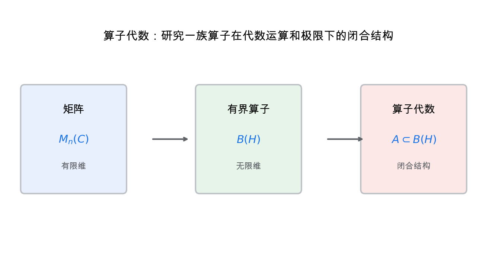
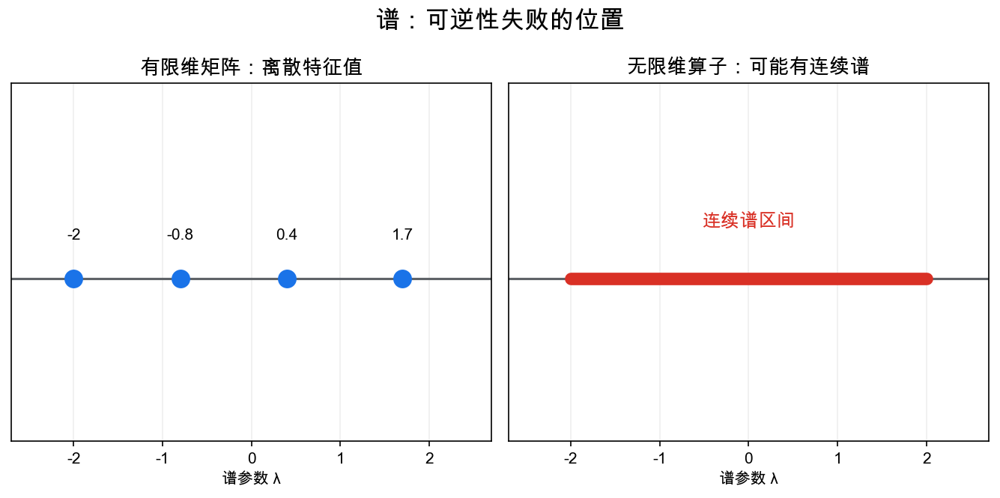
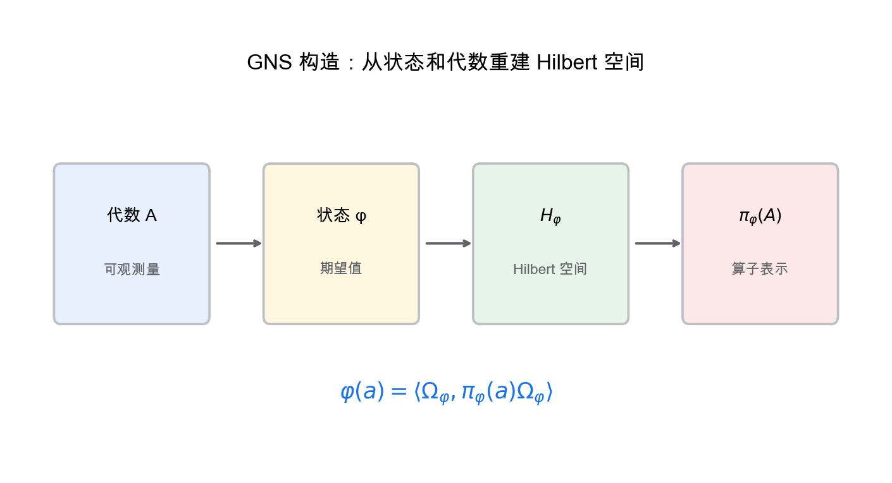

# 重学数学之二十九: 算子代数——把无限维线性变换当成非交换空间

## 一、从矩阵到算子

线性代数里，我们研究矩阵。矩阵可以相加、相乘、取伴随，也可以作用在向量上。

到了泛函分析，空间可能变成无限维 Hilbert 空间：

$$
\mathcal H
$$

矩阵被推广为有界线性算子：

$$
T:\mathcal H\to\mathcal H
$$

算子代数的想法是：

> **不要孤立研究一个算子，而要研究一整族算子在加法、乘法、伴随和极限下形成的代数。**

这里最重要的变化是：乘法通常不交换。

$$
AB\ne BA
$$

这让算子代数天然适合描述量子力学。

## 二、C*-代数：带范数和伴随的代数

一个 C*-代数是复 Banach 代数 $A$，带一个伴随运算 $*$，并满足：

$$
\|a^*a\|=\|a\|^2
$$

最典型例子是 Hilbert 空间上的有界算子代数：

$$
B(\mathcal H)
$$

C*-恒等式非常关键。它把代数结构、范数结构和伴随结构紧紧绑在一起。

这条恒等式看起来像技术条件，其实是在抽象化 Hilbert 空间算子的基本性质。它保证“大小”和“伴随”协调一致，让谱半径、正元素、函数演算这些分析工具能够在抽象代数里继续工作。

如果代数交换，Gelfand 表示告诉我们：

$$
A\cong C(X)
$$

交换 C*-代数是某个紧 Hausdorff 空间上的连续函数代数。

这个结论给出一个深刻反向：

> **非交换 C*-代数可以看成“非交换空间”上的函数代数。**

这句话的逻辑是：如果交换代数就是某个空间上的函数，那么非交换代数虽然不再对应普通点集空间，也可以被当成某种广义空间的函数代数来研究。非交换几何正是从这里出发。

## 三、谱：算子的几何影子

矩阵有特征值。无限维算子更自然的对象是谱：

$$
\sigma(a)=\left\{\lambda\mid a-\lambda I\ \text{不可逆}\right\}
$$

谱不是只属于单个算子的数值集合。它是算子代数内部几何的影子。

在无限维里，算子可能没有真正的特征向量，却仍然有谱。比如“乘以 $x$”这个算子在 $L^2[0,1]$ 上没有普通离散特征值，但它的谱是整个区间 $[0,1]$。谱比特征值更适合无限维。

在量子力学中，可观测量由自伴算子表示，测量可能结果由谱给出。

有限维里谱是离散点；无限维里可能出现连续谱。位置、动量、Hamiltonian 都需要这种语言。

## 四、von Neumann 代数：还要考虑弱闭包

C*-代数使用范数闭包。von Neumann 代数更强地依赖 Hilbert 空间表示，并要求在弱算子拓扑下闭合。

它们可以定义为：

$$
M=M''
$$

这里 $M'$ 是与 $M$ 中所有算子都交换的算子集合，叫交换子。

双交换子定理说明，von Neumann 代数是“在可观测意义下闭合”的算子代数。

弱算子拓扑可以理解成只关心所有矩阵元 $\langle Tx,y\rangle$ 的收敛。物理上，我们常通过态和观测量的期望值感知算子；在这种较弱意义下闭合，正适合处理无限自由度系统中的可观测量集合。

这在量子统计、量子场论和无穷自由度系统中非常重要。

## 五、状态：代数上的概率

在量子信息中，状态可以由密度矩阵表示。但在算子代数里，状态更一般地定义为正线性泛函：

$$
\varphi:A\to\mathbb C
$$

满足：

$$
\varphi(a^*a)\ge0,\quad \varphi(1)=1
$$

它给每个可观测量分配期望值。

这把概率论、泛函分析和量子理论放到同一个形式里。

在交换情形 $A=C(X)$ 中，状态就是概率测度：$\varphi(f)=\int_X f\,d\mu$。在非交换情形中，状态仍然是“期望”，只是可观测量不再能同时对角化。这个类比是算子代数的核心直觉。

## 六、GNS 构造：从状态重建 Hilbert 空间

Gelfand-Naimark-Segal 构造说，给定一个 C*-代数 $A$ 和状态 $\varphi$，可以构造：

1. 一个 Hilbert 空间 $\mathcal H_\varphi$。
2. 一个表示 $\pi_\varphi:A\to B(\mathcal H_\varphi)$。
3. 一个循环向量 $\Omega_\varphi$。

使得：

$$
\varphi(a)=\langle \Omega_\varphi,\pi_\varphi(a)\Omega_\varphi\rangle
$$

这一步很漂亮：我们不先假设 Hilbert 空间，而是从可观测量代数和状态中把 Hilbert 空间造出来。

GNS 的意义是把“代数观点”和“Hilbert 空间观点”接上。给定一套可观测量和一个状态，我们自动得到一个表示空间，在那里抽象代数重新变成具体算子。不同状态可能给出不同表示，这在无穷维量子系统里非常重要。

## 七、谱定理：自伴算子就是广义随机变量

有限维线性代数里，Hermitian 矩阵可以酉对角化：

$$
A=U\Lambda U^\dagger
$$

无限维里，对角化要换成谱测度。自伴算子 $T$ 可以写成：

$$
T=\int_{\sigma(T)} \lambda\,dE(\lambda)
$$

这里 $E$ 是投影值测度。

这句话的直觉是：自伴算子像一个随机变量，谱测度像它的取值分布。给定状态 $\varphi$，测量结果的概率分布由：

$$
\varphi(E(B))
$$

给出，其中 $B$ 是谱上的 Borel 集。

所以量子测量不是“算子有一个隐藏值”。它是状态和谱投影共同决定的概率结构。谱定理把这件事精确化。

## 八、因子与类型：无限维世界不只一种大小

von Neumann 代数的中心是：

$$
Z(M)=M\cap M'
$$

如果中心只有标量，就叫因子。

因子可以看成不能再按中心分解的基本块。Murray 和 von Neumann 发现，因子有不同类型：I 型、II 型、III 型。

中心大的代数可以按中心分解成互不相干的部分；中心只有标量，说明已经没有这种经典分解了。因子因此扮演 von Neumann 代数里的“不可约组成块”。

I 型最接近普通量子力学里的 $B(\mathcal H)$。II 型有迹，但投影维数可以是连续值。III 型没有正常的迹，常出现在量子场论的局部代数中。

这说明无限维量子系统的“自由度大小”不是只有维数这一个概念。代数结构本身会区分完全不同的量子世界。

## 九、KMS 状态：热平衡的代数定义

统计物理里，温度为 $\beta^{-1}$ 的 Gibbs 状态写成：

$$
\rho=\frac{e^{-\beta H}}{Z}
$$

但在无限系统中，$Z$ 可能不存在，Hamiltonian 也可能无法作为全局算子良好定义。

KMS 条件提供了更稳的定义。给定时间演化 $\alpha_t$，状态 $\varphi$ 满足 KMS 条件，大致表示：

$$
\varphi(a\alpha_{i\beta}(b))=\varphi(ba)
$$

严格说要用解析延拓表述。

它的意义是：热平衡不必依赖密度矩阵公式，而可以用代数和时间演化本身定义。

这正是算子代数强大的地方。它能处理有限维公式失效的极限系统，比如无限自旋链、量子场论和相变。

## 十、非交换概率：独立性也可以变形

在经典概率里，随机变量构成交换代数。算子代数里，可观测量不交换，于是概率论也变成非交换的。

状态 $\varphi$ 给出期望，元素 $a\in A$ 像随机变量，矩：

$$
\varphi(a^n)
$$

描述其分布。

自由概率把经典独立性替换成自由独立性。它最初看起来很抽象，但在大随机矩阵极限里自然出现：很多独立随机矩阵在维数趋于无穷时，会变成自由随机变量。

这让算子代数、随机矩阵和深度学习里的谱分析接上了线。

## 十一、应用场景

| 领域 | 算子代数扮演的角色 |
|------|------------------|
| 量子力学 | 可观测量、状态、谱和测量 |
| 量子场论 | 无穷自由度系统的局部代数 |
| 非交换几何 | 用非交换代数替代空间上的函数 |
| 动力系统 | crossed product 代数、遍历理论 |
| 统计物理 | KMS 状态、相变、热平衡 |
| 量子信息 | 通道、纠缠、算子系统 |

算子代数提供了一种更抽象但更稳定的量子语言：先有可观测量代数，再有表示和状态空间。

## 十二、与前几章的连接

1. **泛函分析**：算子代数建立在 Banach 空间和 Hilbert 空间上。
2. **量子信息**：密度矩阵、量子信道和测量都可放进算子代数。
3. **拓扑**：交换 C*-代数和拓扑空间对偶。
4. **表示论**：代数通过表示作用在 Hilbert 空间上。
5. **代数几何**：非交换几何延续“用函数环认识空间”的思想。

## 十三、前沿展望

### 13.1 自由概率论与随机矩阵

Voiculescu（1985）将自由概率论（free probability）作为非交换概率论发展：用**自由独立性**代替经典独立性，两个自由随机变量的合算矩可由各自矩组合得出（类似经典独立性中的独立性代数）。核心结果：大型随机矩阵（GUE、Wishart）的特征值经验分布在维度 $\to\infty$ 时收敛到自由概率分布（半圆律等），自由卷积描述独立大随机矩阵之和的谱。

这为随机矩阵理论（第十一章前沿）提供了代数框架，并应用于无线通信（容量分析）和机器学习（深层网络的谱分析）。

### 13.2 Connes 的非交换几何

Alain Connes（1994，*Noncommutative Geometry*）将黎曼几何的概念推广到非交换空间：用谱三元组 $(\mathcal{A}, \mathcal{H}, D)$（代数、Hilbert 空间、Dirac 算子）编码空间的"形状"，在代数非交换时仍能定义微积分、测地线、曲率。

标准模型物理（Connes-Chamseddine 1997）将粒子物理的标准模型理解为黎曼时空与一个有限离散非交换空间的"乘积空间"上的谱三元组——粒子谱（Higgs 场质量、费米子质量）从代数几何数据中导出，Higgs 场成为内部规范联络。

### 13.3 Connes 嵌入问题的解决

Connes 嵌入猜想（1976）：每个有迹因子 II₁ 都可以嵌入 $\mathcal{R}^\omega$（超滤 von Neumann 代数）。2020 年，Ji、Natarajan、Vidick、Wright 与 Yuen 证明 MIP* = RE（多证明者交互式证明系统等于可递归枚举语言），由此推出 Connes 嵌入猜想**为假**——这是算子代数与量子计算理论最惊人的交汇之一，利用了量子纠错和量子相关性的分离。

## 十四、总结

算子代数的核心结构：

1. **有界算子**：无限维线性变换的基本对象。
2. **C*-代数**：带范数和伴随的非交换代数。
3. **谱**：算子可逆性失败的位置。
4. **von Neumann 代数**：弱闭合的可观测量代数。
5. **状态**：代数上的正归一线性泛函。
6. **GNS 构造**：从状态重建 Hilbert 空间表示。
7. **非交换空间**：把非交换代数看成广义函数代数。
8. **谱定理与 KMS 状态**：用代数语言描述测量和热平衡。

> **算子代数把量子世界中的可观测量组织成非交换代数，并用代数本身重建空间、状态和谱。**

---

*算子代数把量子系统写成了可观测量的代数。接下来进入随机控制与强化学习，看看在不确定动力系统里，怎么通过策略、价值函数和动态规划做长期最优决策。*
