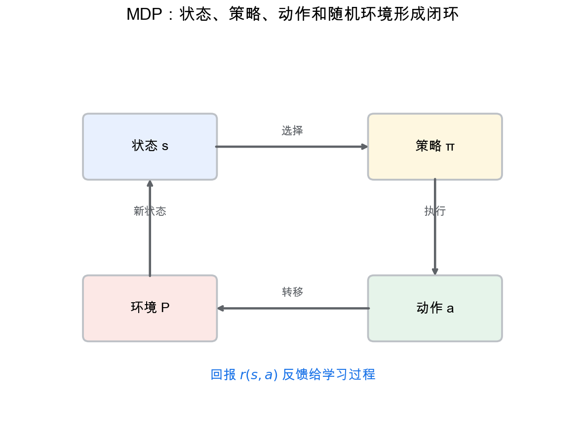
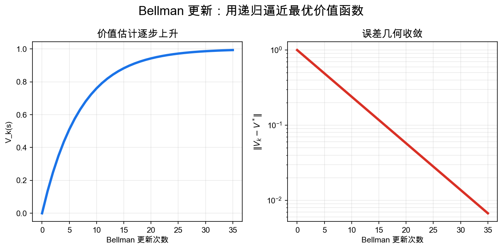
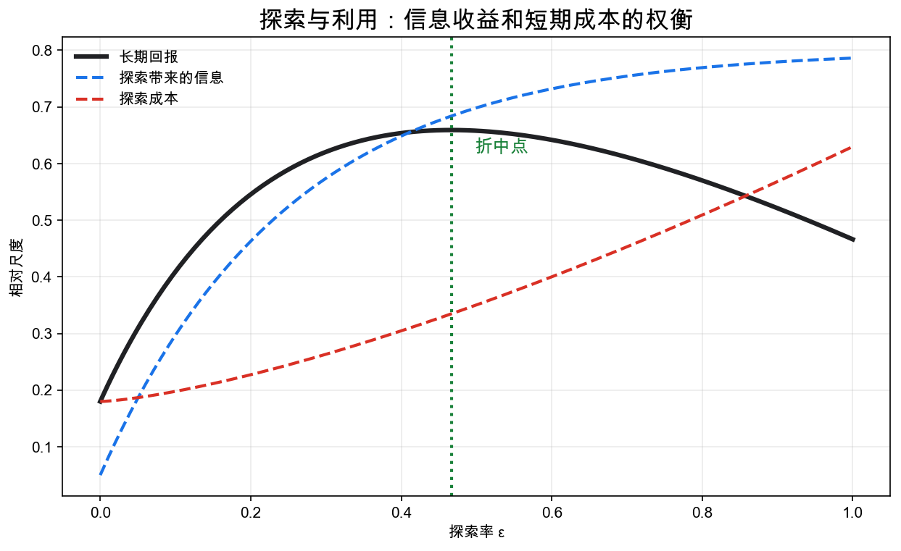

# 重学数学之三十: 随机控制与强化学习——在不确定世界里做长期决策

## 一、从一次选择到长期策略

优化问题通常问：

$$
\min_x f(x)
$$

但很多现实问题不是一次性选择，而是在时间中反复决策。

今天的动作会改变明天的状态，明天的状态又影响后天能做什么。更麻烦的是，环境还有随机性。

随机控制和强化学习共同研究这个问题：

> **在不确定动力系统中，怎样选择策略，让长期回报最优？**

最基本模型是 Markov 决策过程。

## 二、Markov 决策过程：决策版 Markov 链

一个 MDP 包含：

1. 状态空间 $S$。
2. 动作空间 $A$。
3. 转移概率 $P(s'|s,a)$。
4. 奖励函数 $r(s,a)$。
5. 折扣因子 $\gamma$。

策略是：

$$
\pi(a|s)
$$

它告诉我们在状态 $s$ 下选择动作 $a$ 的概率。

目标是最大化期望折扣回报：

$$
\mathbb E_\pi\left[\sum_{t=0}^\infty \gamma^t r(s_t,a_t)\right]
$$

Markov 性的含义是：给定当前状态和动作，未来不再依赖更早历史。

这句话要求状态 $s$ 已经包含了决策所需的全部历史信息。如果环境看起来依赖过去，通常说明状态定义不够完整，需要把速度、库存、记忆变量或信念状态也放进状态里。

折扣因子 $\gamma$ 有两个作用。建模上，它表示远期奖励的重要性降低；数学上，$\gamma<1$ 让无限和收敛，也让 Bellman 算子成为压缩映射。没有这个压缩结构，很多收敛保证会困难得多。

## 三、价值函数：一个状态到底值多少钱？

给定策略 $\pi$，状态价值函数定义为：

$$
V^\pi(s)=
\mathbb E_\pi
\left[
\sum_{t=0}^\infty \gamma^t r(s_t,a_t)
\mid s_0=s
\right]
$$

动作价值函数是：

$$
Q^\pi(s,a)
$$

它表示在状态 $s$ 先做动作 $a$，之后按策略 $\pi$ 行动时的长期价值。

价值函数把长期未来压缩成当前状态上的一个数。

## 四、Bellman 方程：最优性来自递归

Bellman 方程是随机控制的核心：

$$
V^\pi(s)=
\sum_a\pi(a|s)
\left[
r(s,a)+\gamma\sum_{s'}P(s'|s,a)V^\pi(s')
\right]
$$

最优价值函数满足：

$$
V^*(s)=
\max_a
\left[
r(s,a)+\gamma\sum_{s'}P(s'|s,a)V^*(s')
\right]
$$

这个式子的直觉非常强：

> **一个状态的价值 = 眼前奖励 + 下一状态价值的期望。**

动态规划就是反复使用这个递归结构。

Bellman 方程的厉害之处在于它把全局最优拆成局部递归。你不需要一次枚举整条未来轨迹，只要知道下一步之后还剩多少价值。价值函数正是把“所有未来可能性”压缩成一个可递归更新的对象。

## 五、探索与利用：学的时候不能只贪心

如果转移概率和奖励都已知，可以做规划。强化学习更难：环境模型未知，需要边行动边学习。

这带来探索-利用权衡。

- 利用：选择当前看起来最好的动作。
- 探索：尝试不确定但可能更好的动作。

如果只利用，可能卡在局部最优；如果只探索，长期回报很差。

这和统计学习中的泛化、贝叶斯中的不确定性、优化中的局部搜索都有联系。

探索不是随机乱试，而是在为减少未来不确定性付成本。一个动作眼下回报低，但能告诉你环境结构，长期可能值得尝试。强化学习的困难就在于，信息本身也有价值，但这种价值要通过未来回报间接体现。

## 六、连续时间随机控制

在连续时间中，状态可能满足随机微分方程：

$$
dX_t=b(X_t,u_t)dt+\sigma(X_t,u_t)dW_t
$$

目标是最小化期望成本：

$$
\mathbb E\left[
\int_0^T L(X_t,u_t)dt+g(X_T)
\right]
$$

动态规划导出 Hamilton-Jacobi-Bellman 方程：

$$
\partial_t V+\inf_u
\left[
L(x,u)+b(x,u)\cdot\nabla V
+\frac12\mathrm{tr}(\sigma\sigma^\top\nabla^2V)
\right]=0
$$

这把随机分析、PDE、优化和控制理论连在一起。

## 七、策略梯度：直接优化策略

在大状态空间中，精确价值迭代不可行。现代强化学习常用参数化策略：

$$
\pi_\theta(a|s)
$$

然后优化目标：

$$
J(\theta)=\mathbb E_{\pi_\theta}[R]
$$

策略梯度方法估计：

$$
\nabla_\theta J(\theta)
$$

并用随机梯度上升更新策略。

这和深度学习连接起来，就得到深度强化学习。

策略梯度的难点是方差。单条轨迹的回报可能很 noisy，直接用它估计梯度会很抖。baseline、advantage function、actor-critic 方法，本质上都在尽量保留无偏方向，同时降低梯度估计的方差。

## 八、策略迭代：先评估，再改进

Bellman 方程不仅给出定义，也给出算法。

策略迭代分两步。

第一步，策略评估。给定 $\pi$，解出：

$$
V^\pi
$$

第二步，策略改进。对每个状态选取更好的动作：

$$
\pi_{\text{new}}(s)\in
\arg\max_a
\left[
r(s,a)+\gamma\sum_{s'}P(s'|s,a)V^\pi(s')
\right]
$$

如果新策略没有变化，就达到最优。

价值迭代则把评估和改进揉在一起，反复应用最优 Bellman 算子。两者的共同核心是压缩映射：折扣因子 $\gamma<1$ 让 Bellman 更新不断收敛。

这也是 MDP 比一般序贯决策更可控的原因。Markov 性和折扣结构让“未来”可以被价值函数稳定压缩。

策略迭代的逻辑很像“先给当前策略定价，再按价格表改进策略”。如果定价准确，贪心改进不会变差；反复进行，就逐步接近最优策略。

## 九、鞅观点：最优策略下没有可白捡的未来收益

随机控制还有一种很有用的看法：最优价值函数会把过程变成鞅或超鞅。

对任意策略，若 $V^*$ 是最优价值，则：

$$
V^*(s_t)+\sum_{k=0}^{t-1}\gamma^k r(s_k,a_k)
$$

在合适折扣和记号下表现为超鞅；在最优策略下，它变成鞅。

直觉很简单：如果你已经用最优价值函数正确标价，那么非最优行动会让“当前收益 + 剩余价值”的期望下降；最优行动则没有可白捡的额外收益。

这把第八章的鞅和本章的 Bellman 最优性接到一起。在金融定价等特定模型里，Bellman 递推可以与离散时间的无套利条件对应；一般控制问题中的 Bellman 方程并不等同于无套利定价。

## 十、熵正则化：让控制问题更软

现代强化学习常在奖励中加入策略熵：

$$
J(\pi)=
\mathbb E_\pi\left[
\sum_t \gamma^t
\left(
r(s_t,a_t)+\alpha \mathcal H(\pi(\cdot|s_t))
\right)
\right]
$$

这样做有两个效果。

第一，鼓励探索，避免策略过早塌缩到单一动作。

第二，把硬最大值变成 softmax。软 Bellman 更新写成：

$$
V(s)=\alpha\log\sum_a
\exp\left(
\frac{Q(s,a)}{\alpha}
\right)
$$

当 $\alpha\to0$ 时回到普通最大值。

这条线把 RL、变分推断和统计物理连在一起。策略像 Boltzmann 分布，价值像负自由能，控制问题可以解释成推断问题。

## 十一、离线 RL 的风险：数据外动作最危险

离线强化学习只用已有数据，不再和环境交互。这很诱人，因为真实系统里的试错可能很贵，甚至危险。

难点在分布偏移。

如果学出的策略选择了数据集中很少出现的动作，Q 函数可能给出过高估计，而我们没有真实交互来纠正它。错误会在 Bellman 递推里一层层放大。

所以离线 RL 通常要保守。要么让策略不要偏离行为策略太远，要么压低数据外动作的价值估计。

这和统计学习里的泛化不同。监督学习预测错了一个样本，影响通常局部；强化学习里一个错误动作会改变后续状态分布，连数据从哪里来都变了。

这也是离线 RL 比行为克隆难的地方。行为克隆只模仿数据里的动作，通常保守但可能不够好；离线 RL 想超过数据里的行为，就必须评估没怎么见过的动作。保守约束正是在“改进策略”和“别走出数据支持”之间找平衡。

## 十二、应用场景

| 领域 | 随机控制与强化学习扮演的角色 |
|------|----------------------------|
| 机器人 | 运动规划、控制、抓取和导航 |
| 金融 | 投资组合、做市、风险控制 |
| 运筹 | 库存、排队、调度、资源分配 |
| 自动驾驶 | 序贯决策与不确定环境交互 |
| 游戏 AI | 策略搜索、自博弈、价值估计 |
| 科学实验 | 主动学习、实验设计、闭环优化 |

它们关心的不是一次预测，而是行动如何改变未来数据分布。

## 十三、与前几章的连接

1. **随机过程**：MDP、扩散过程和噪声驱动系统。
2. **优化**：动态规划、策略梯度和约束优化。
3. **PDE**：HJB 方程是连续时间控制的核心。
4. **统计学习**：从采样轨迹中估计价值和策略。
5. **因果推断**：行动是干预，策略改变状态分布。
6. **深度学习**：函数逼近让高维控制成为可能。

## 十四、前沿展望

### 14.1 深度强化学习的理论基础

PPO（Proximal Policy Optimization，Schulman 等 2017）通过截断重要性采样比率 $r_t(\theta) = \pi_\theta/\pi_{\theta_\text{old}}$ 限制每步策略更新幅度，在连续控制上显著优于早期方法。SAC（Soft Actor-Critic，Haarnoja 等 2018）将最大熵强化学习形式化：优化目标同时包含奖励和策略熵 $\mathbb{E}[\sum_t r_t + \alpha \mathcal{H}(\pi(\cdot|s_t))]$，自动平衡探索与利用，并与变分推断框架（ELBO）直接联系（Levine 2018 的控制即推断视角）。

### 14.2 离线强化学习与数据驱动策略

在线 RL 需要大量环境交互，代价高且有安全风险。**离线 RL**（Offline RL）从历史数据集学习策略，但面临分布偏移问题：策略访问的状态-动作对可能在数据集中稀缺，导致价值估计错误累积。代表方法：Conservative Q-Learning（CQL，Kumar 等 2020）通过惩罚 Q 函数在数据集外的值来保守估计，TD3+BC 在 TD3 基础上加入行为克隆正则项。

**决策 Transformer**（Chen 等 2021）将 RL 重新表述为序列建模问题：将轨迹（状态、动作、回报）作为序列，用 GPT 架构预测下一步动作，无需显式价值函数，直接继承了语言模型的规模化能力。

### 14.3 RLHF 与 LLM 对齐

**基于人类反馈的强化学习**（RLHF，Christiano 等 2017；InstructGPT 2022）是当前 LLM 对齐的主流方法：先训练奖励模型（RM）拟合人类偏好，再用 PPO 从 RM 信号微调模型。数学本质：在 KL 散度约束下最大化期望奖励，最优解满足 Bradley-Terry 模型。

**直接偏好优化**（DPO，Rafailov 等 2023）绕过显式 RM，将偏好对比写成参考模型相对概率的监督学习目标：在 Bradley-Terry 假设下等价于原始 RLHF，但计算更高效、更稳定。随后变体（SimPO、ORPO 等）持续改进训练效率和鲁棒性。

### 14.4 随机控制前沿：平均场 MDP

当 $N\to\infty$ 个相同 agent 在共同状态空间交互时，个体最优策略依赖其他 agent 的统计分布（平均场）而非个别状态——这是**平均场 MDP**（MF-MDP）。策略均衡由两个方程共同决定：前向 Fokker-Planck（分布演化）和后向 HJB（最优值函数），与平均场博弈（第十六章前沿）直接对应。深度学习求解器（MFGnet，Ruthotto 等 2020）使大规模 MF-MDP 可计算，应用于自动驾驶协作、金融市场竞争和流行病控制。

## 十五、总结

随机控制与强化学习的核心结构：

1. **状态**：当前足以预测未来的系统摘要。
2. **动作**：决策者对系统施加的干预。
3. **转移概率**：动作后的随机演化。
4. **策略**：从状态到动作分布的规则。
5. **价值函数**：长期回报的压缩表达。
6. **Bellman 方程**：最优性递归。
7. **探索-利用**：学习环境时的基本权衡。
8. **HJB 方程**：连续时间随机控制的 PDE 形式。
9. **策略迭代与熵正则化**：从硬最优到可探索、可优化的软控制。

> **随机控制与强化学习研究的是：在不确定动力系统中，如何通过策略把局部行动变成长期最优。**

---

*随机控制把概率、优化和行动串在了一起。接下来进入信息几何，把概率分布族看成流形，用 Fisher 信息度量、自然梯度和散度来理解统计模型的几何。*
