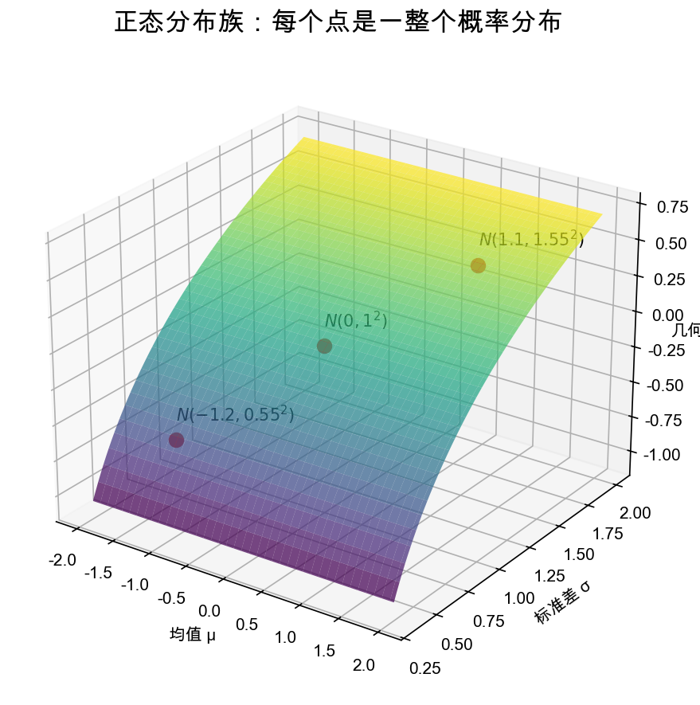
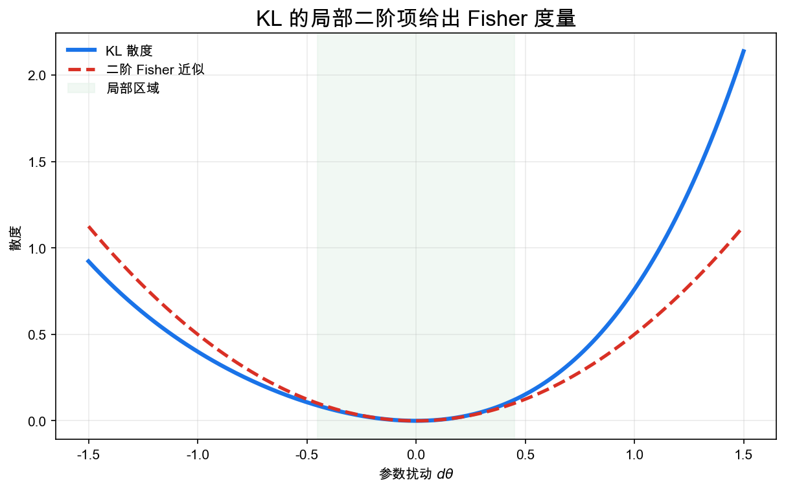
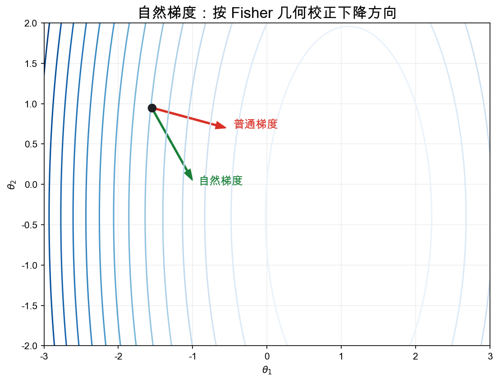

# 重学数学之三十一: 信息几何——把概率分布族看成弯曲空间
![[Pasted image 20260628174007.png]]
## 一、从“参数”到“分布的空间”

统计模型常写成参数化分布族：

$$
p(x|\theta)
$$

通常我们把 $\theta$ 看成坐标。但信息几何提醒我们：

> **真正的对象不是参数，而是参数对应的概率分布。**

不同参数化可能表示同一族分布。好的几何结构应该不依赖坐标选择。

例如正态分布族：

$$
\mathcal N(\mu,\sigma^2)
$$

可以看成一个二维流形，每个点是一整个概率分布。

## 二、Fisher 信息：统计模型上的度量

Fisher 信息矩阵定义为：

$$
g_{ij}(\theta)
=
\mathbb E_\theta
\left[
\partial_i\log p(X|\theta)
\partial_j\log p(X|\theta)
\right]
$$

它告诉我们：参数微小变化会让分布变化多少。

如果两个方向的参数变化几乎不改变分布，它们在统计意义上就短；如果会显著改变分布，它们就长。

信息几何的核心在于：

> **用分布可区分性定义几何距离。**

## 三、KL 散度：不是距离，却生成几何

KL 散度：

$$
D_{\mathrm{KL}}(p_\theta\|p_{\theta+d\theta})
$$

在二阶近似下给出 Fisher 度量：

$$
D_{\mathrm{KL}}(p_\theta\|p_{\theta+d\theta})
=
\frac12 g_{ij}d\theta^i d\theta^j+o(\|d\theta\|^2)
$$

KL 不对称，也不满足三角不等式，所以不是距离。但它的局部二阶结构确实定义了度量。

这和微分几何里的思想一致：局部二次型定义度量，全局距离再由路径长度得到。

## 四、自然梯度：沿统计几何最陡下降

普通梯度依赖参数坐标。换一个参数化，梯度方向可能变得很不自然。

自然梯度使用 Fisher 信息矩阵修正方向：

$$
\tilde\nabla L(\theta)=G(\theta)^{-1}\nabla L(\theta)
$$

它代表在分布空间里，而不是在参数坐标里，走最有效的下降方向。

这在机器学习中很有意义。模型参数只是坐标，真正关心的是模型分布怎么变化。

## 五、指数族：信息几何最干净的实验场

指数族写成：

$$
p(x|\eta)=h(x)\exp(\eta\cdot T(x)-A(\eta))
$$

其中 $\eta$ 是自然参数，$A(\eta)$ 是 log-partition 函数。

指数族有一套漂亮的对偶坐标：

$$
\eta \quad\text{和}\quad \mu=\mathbb E_\eta[T(X)]
$$

它们由 Legendre 变换联系。

这把凸分析、统计推断和微分几何连接起来。

## 六、投影：推断可以看成几何逼近

变分推断中，我们用一个简单分布族 $q_\phi$ 逼近复杂后验 $p$。

常见目标是最小化：

$$
D_{\mathrm{KL}}(q_\phi\|p)
$$

这可以理解为把 $p$ 投影到可处理的分布族上。

不同方向的 KL 投影会产生不同行为：一种倾向覆盖模式，一种倾向选择单个模式。

所以变分推断的很多现象，是散度几何的结果。

## 七、α-联络：同一个流形上不止一种“直线”

有了度量，还需要联络来谈“直线”和“平行移动”。

信息几何里有一族 $\alpha$-联络。两个最重要的端点是：

- $\alpha=1$，对应自然参数坐标下的 e-联络。
- $\alpha=-1$，对应期望参数坐标下的 m-联络。

它们互为对偶。

这不是为了制造复杂名词。它反映了统计模型里两种自然线性结构：一种来自指数族的自然参数，一种来自混合分布的凸组合。

同一个分布族，在一种坐标里看起来平直，在另一种坐标里可能弯曲。信息几何关心的正是这些坐标变化下仍能说清的结构。

## 八、对偶平坦：指数族为什么这么好用

指数族的特别之处在于，它通常是对偶平坦的。

自然参数 $\eta$ 和期望参数 $\mu$ 由 Legendre 变换联系：

$$
\mu=\nabla A(\eta)
$$

对应的对偶势函数满足：

$$
A(\eta)+A^\ast(\mu)=\eta\cdot\mu
$$

KL 散度在这个结构里变成 Bregman 散度。

这就是为什么最大熵、最大似然、变分推断和凸优化会在指数族里显得格外整齐。它不是运气好，而是统计流形的几何结构本来就和凸对偶匹配。

## 九、自然梯度的边界：几何正确不等于工程免费

自然梯度很漂亮，但直接使用并不容易。

Fisher 矩阵可能巨大、病态，甚至奇异。神经网络里还有大量参数对称性：交换隐藏单元、缩放相邻层权重，都可能不改变函数，却改变参数坐标。这些方向会让 Fisher 出现近零特征值。

所以实际算法常做近似：块对角、Kronecker 分解、低秩近似、阻尼项。

这并不削弱自然梯度的思想。它只是提醒我们：信息几何给出的是正确坐标下的方向，工程实现还要处理计算成本、噪声和近似误差。

## 十、Fisher 几何与 Wasserstein 几何：两种分布空间

同样是概率分布的几何，信息几何和最优传输很不一样。

Fisher 几何关心可区分性。两个分布如果在统计实验中很难区分，它们就近。

Wasserstein 几何关心质量移动。两个分布如果可以用很短的搬运路径互相变成，它们就近。

这导致两种几何适合不同问题。参数估计、渐近方差、自然梯度更偏 Fisher；生成模型、分布对齐、PDE 梯度流更偏 Wasserstein。

二者并不是竞争关系。它们像两副不同的眼镜：一副看“信息差异”，一副看“空间搬运”。很多现代问题，尤其是扩散模型和变分推断，正在同时使用这两种几何。

## 十一、Cramer-Rao 下界：几何限制了估计精度

Fisher 信息不只是一个度量，它还给出估计精度的下界。

对无偏估计量 $\hat\theta$，Cramer-Rao 下界说：

$$
\mathrm{Var}(\hat\theta)\ge I(\theta)^{-1}
$$

多参数情形里则是协方差矩阵意义下的半正定不等式。

直觉很清楚：如果分布对参数变化不敏感，样本就很难分辨参数，任何估计器都不可能太精确。Fisher 信息越大，统计流形在这个方向上越“陡”，参数越容易被识别。

这把统计估计和几何长度连起来了。估计难度不是由参数名字决定，而是由分布族在概率空间里的可区分性决定。

## 十二、EM 算法：交替投影的几何图像

含隐变量模型里，最大似然常常难算：

$$
\log p(x|\theta)=\log\int p(x,z|\theta)dz
$$

EM 算法通过两步迭代：

1. E 步，固定参数，计算隐变量后验。
2. M 步，固定后验，更新参数最大化期望完全数据对数似然。

从信息几何看，EM 可以理解为在两个结构之间交替投影：一个是由模型参数定义的分布族，一个是满足当前后验约束的分布族。

这解释了为什么 EM 单调提高似然，也解释了它的局限：如果几何形状弯曲、局部极值多，EM 可能稳定但慢，甚至停在不好的局部解。

## 十三、应用场景

| 领域 | 信息几何扮演的角色 |
|------|------------------|
| 统计推断 | Fisher 信息、Cramer-Rao 下界、有效估计 |
| 机器学习 | 自然梯度、优化预条件、概率模型训练 |
| 贝叶斯方法 | 变分推断、后验近似、散度投影 |
| 信息论 | KL、互信息、散度族的几何解释 |
| 神经网络 | 参数空间和函数空间之间的几何差异 |
| 最优传输 | 不同分布几何之间的比较 |

信息几何提醒我们：概率模型不是平直坐标表，而是有内在曲率的空间。

## 十四、与前几章的连接

1. **信息论**：KL 散度和熵是信息几何的局部来源。
2. **微分几何**：统计模型成为带度量的流形。
3. **优化**：自然梯度是几何化的梯度下降。
4. **统计学习**：模型复杂度和可区分性由 Fisher 信息控制。
5. **贝叶斯统计**：变分推断是分布空间中的投影问题。
6. **深度学习**：大模型训练中的参数化冗余需要几何视角。

## 十五、前沿展望

### 15.1 自然梯度与 K-FAC

Amari（1998）提出用 Fisher 信息矩阵的逆 $F^{-1}$ 对梯度进行预条件，得到**自然梯度**，在参数化冗余时仍能找到最陡方向。在神经网络中直接计算 $F^{-1}$ 的代价为 $O(p^3)$（$p$ 为参数量），不实用。

**K-FAC**（Kronecker-factored Approximate Curvature，Martens & Grosse 2015）通过 Kronecker 积分解近似 Fisher 矩阵的块结构，将复杂度降至 $O(p)$，实现了神经网络的高效自然梯度更新。在语言模型预训练中（K-FAC 变体如 Shampoo、Sophia），二阶优化方法在某些规模下收敛速度优于 Adam。

### 15.2 信息几何与扩散模型

**得分匹配**（Score Matching，Hyvärinen 2005）从信息几何视角解释：最小化 Fisher 散度 $\mathbb{E}[\|\nabla_x \log p_\theta - \nabla_x \log p_\text{data}\|^2]$ 等价于最小化关于 $p_\text{data}$ 的自然梯度方向上的 KL 散度。这为扩散模型（Song & Ermon 2020）中的得分估计提供了几何解释：每一步降噪对应在以 Fisher 度量为黎曼度量的分布流形上沿测地线方向移动。

### 15.3 量子信息几何

Petz（1996）将经典 Fisher 度量推广到量子情形：量子 Fisher 信息（QFI）和量子相对熵定义了密度矩阵空间上的黎曼度量。**量子 Cramér-Rao 界**：$\text{Var}(\hat\theta) \ge 1/F_Q(\theta)$，其中 $F_Q$ 为量子 Fisher 信息，给出量子态估计的终极精度极限。量子增强传感（如引力波探测器 LIGO 的量子压缩光）正是利用了量子 Fisher 信息超越经典 Fisher 信息的区间。

### 15.4 信息几何与深度学习理论

神经网络参数空间上的 Fisher 度量 $g_{ij}(\theta)$ 刻画了模型的局部可区分性。**参数冗余与平坦方向**：Fisher 矩阵的零特征值对应参数对模型输出无影响的方向（对称性）。**Fisher-Rao 范数**（Liang 等 2019）将模型复杂度定义为 Fisher 几何下的范数，给出与经典 VC 维或谱范数不同的泛化界，更好地解释了过参数化神经网络的泛化行为。

## 十六、总结

信息几何的核心结构：

1. **统计流形**：参数化概率分布族。
2. **Fisher 信息度量**：分布可区分性的局部二次型。
3. **KL 散度**：生成局部几何的非对称散度。
4. **自然梯度**：坐标不变的优化方向。
5. **指数族**：凸分析和统计几何的核心例子。
6. **散度投影**：推断和近似的几何解释。
7. **α-联络与对偶平坦**：解释指数族中的双重坐标和凸对偶结构。

> **信息几何把概率分布族看成流形，并用信息可区分性定义它的几何。**

---

*信息几何把概率模型变成了可测量的空间。接下来进入张量网络与现代物理数学，用张量分解、纠缠结构和图网络来理解高维量子系统与可压缩表示。*
