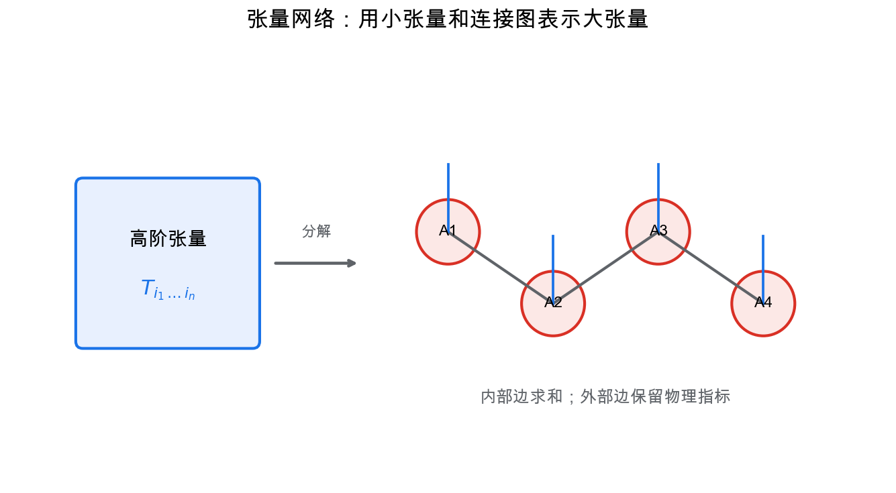
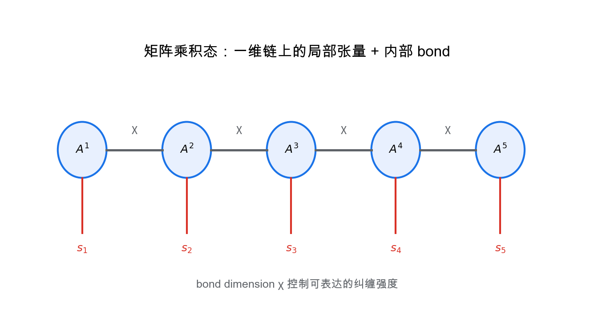
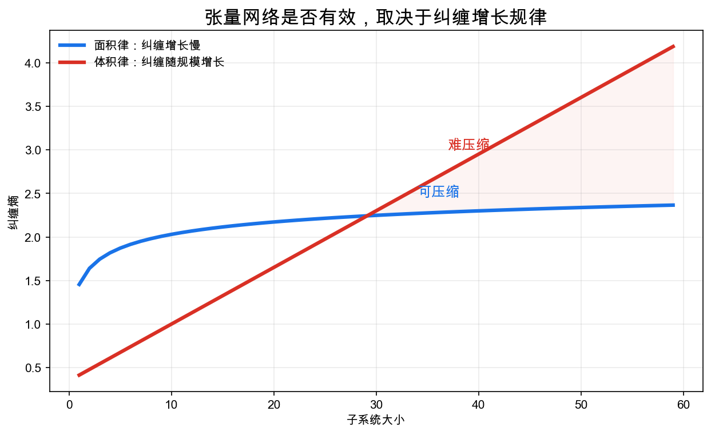

# 重学数学之三十二: 张量网络与现代物理数学——用纠缠结构压缩高维世界

## 一、为什么高维状态需要压缩？

一个 $n$ 个 qubit 的量子系统，状态向量生活在：

$$
(\mathbb C^2)^{\otimes n}
$$

维度是：

$$
2^n
$$

这意味着，只要 $n$ 稍微大一点，直接存储完整状态就不可行。

但物理系统并不是任意高维向量。许多低能态、局域相互作用系统和一维量子链有强结构：纠缠受到限制。

张量网络的想法是：

> **不要直接存整个高维张量，而是把它分解成许多低阶张量，并用网络连接记录收缩方式。**

这和深度学习中的表示学习、线性代数中的矩阵分解、量子信息中的纠缠结构是同一个主题：找到合适的压缩表示。

## 二、张量：多指标数组，也是一种多线性映射

矩阵有两个指标：

$$
A_{ij}
$$

三阶张量有三个指标：

$$
T_{ijk}
$$

更一般地，张量可以看成多线性映射，或者多维数组。

张量网络把大张量拆成小张量，然后沿共享指标求和。这个求和过程叫收缩。

例如：

$$
C_{ik}=\sum_j A_{ij}B_{jk}
$$

就是最熟悉的张量收缩：矩阵乘法。

张量网络图其实就是给这种求和做记账。没有连接出去的线叫开腿，对应结果里保留下来的指标；连接在两个张量之间的线叫内部腿，对应要被求和掉的指标。图画得复杂，本质仍然是“重复指标求和”这件事。

## 三、矩阵乘积态：一维量子系统的语言

一维量子链常用矩阵乘积态表示：

$$
|\psi\rangle
=
\sum_{s_1,\dots,s_n}
\mathrm{Tr}
\left(
A^{s_1}_1A^{s_2}_2\cdots A^{s_n}_n
\right)
|s_1\dots s_n\rangle
$$

每个局部物理指标 $s_i$ 对应一个小矩阵，矩阵之间的内部维度叫 bond dimension。

bond dimension 越大，可表示的纠缠越强；越小，表示越压缩。

可以把 bond dimension 粗略理解成矩阵分解里的秩。$D=1$ 时，链两边没有可传递的内部信息，态基本就是乘积态；$D$ 变大，割开链以后左右两边能共享的 Schmidt 通道变多，纠缠容量也随之增加。

MPS 成功的原因是，一维 gapped 系统的基态通常满足面积律：纠缠熵不随系统长度线性增长。

## 四、面积律：纠缠决定可压缩性

如果一个量子态的纠缠熵满足体积律，子系统熵随体积增长，那么压缩很难。

如果满足面积律，熵主要随边界增长，那么张量网络就很有效。

在一维链上，把系统切成左右两半时，边界只有一个切口，所以面积律意味着纠缠熵可以被一个与系统长度无关的量控制。体积律态就麻烦得多，想精确表示往往需要随系统大小指数增长的 $D$。

这说明张量网络不是随便选的格式。它的有效性来自物理系统的纠缠结构。

## 五、重整化：从局部到多尺度

张量网络也可以表达重整化思想。

MERA 这类网络用多尺度结构表示量子态。底层是局部自由度，高层逐渐合并成粗粒度自由度。

这和小波、多尺度分析、深度网络有强烈相似性：

1. 局部信息先组合。
2. 多尺度结构逐步形成。
3. 长程相关通过高层连接表达。

所以张量网络不仅是物理计算工具，也是一种多尺度表示理论。

## 六、与机器学习的交汇

张量网络和机器学习有多条连接：

- 用张量分解压缩神经网络权重。
- 用 MPS/Tensor Train 表示高维概率分布。
- 把注意力或图模型看成张量收缩。
- 用量子纠缠启发模型表达能力分析。

它们共同关心一个问题：

> **高维函数或分布的复杂度，是否能由局部低维结构有效表示？**

这也是整个系列反复出现的问题。

## 七、DMRG：在 MPS 流形上做变分优化

密度矩阵重整化群 DMRG 最初看起来像一个物理算法，后来人们意识到，它本质上是在 MPS 类中做变分优化。

给定 Hamiltonian $H$，目标是最小化能量：

$$
\min_{\psi\in \mathrm{MPS}_D}\langle\psi|H|\psi\rangle
$$

其中 $D$ 是 bond dimension。

算法逐个或逐两个站点优化局部张量，其余张量固定。每一步都是一个较小的线性代数问题，扫过整条链，反复迭代。

这和坐标下降很像，但约束空间是张量网络流形。MPS 的规范自由度还需要处理，否则同一个量子态会有很多不同张量表示，数值优化会变得很不稳定。

局部优化之所以能做得这么干净，靠的是 MPS 的规范形式。把当前优化位置以外的链化成近似正交的“环境”，局部张量看到的就不再是一个混乱的全局问题，而是一个条件较好的小型本征值问题。

DMRG 的成功告诉我们：真正可计算的不是完整 Hilbert 空间，而是被纠缠结构限制住的一小片有效流形。

## 八、PEPS 与 MERA：二维和临界系统的两条路

MPS 对一维系统非常有效。二维系统更自然的推广是 PEPS：

$$
\text{Projected Entangled Pair States}
$$

它把张量放在二维格点上，按格点边连接。PEPS 能表达二维面积律态，但收缩通常很难，精确收缩是计算复杂的。

MERA 则走另一条路。它用 disentangler 去掉短程纠缠，再用 coarse-graining 做多尺度压缩。临界系统有长程关联，普通 MPS 往往需要很大 bond dimension；MERA 用层级结构把尺度变换直接写进网络。

PEPS 难收缩的一个直接原因是二维网格里有大量环。收缩某一块以后，中间张量的边界会变长，指标数迅速增多，内存和时间都容易爆掉。MERA 用层级结构绕开一部分问题，但它也把网络设计变得更讲究。

这两种网络对应两种直觉：PEPS 强调空间局域性，MERA 强调尺度结构。

## 九、收缩复杂度：图结构决定计算是否可行

张量网络的表达能力来自图，计算难度也来自图。

一个网络要得到最终数值，必须选择收缩顺序。不同顺序的中间张量大小可能差别巨大。

找到最优收缩顺序本身也不是轻松问题。实际计算里常用启发式算法、局部搜索或近似 tree decomposition，先找到一个足够好的顺序，再真正开始收缩。

链状 MPS 容易收缩，二维 PEPS 难得多；树结构通常比有大量环的网络容易。

这和图论里的 treewidth 有关。粗略说，网络图越接近树，收缩越容易；图中环和二维网格结构越强，中间张量越可能爆炸。

所以设计张量网络不是只问“能不能表达”，还要问“能不能收缩”。这和机器学习模型设计很像：表达能力、归纳偏置和计算代价必须同时看。

## 十、量子线路与张量网络：同一张图的两种读法

量子线路可以看成张量网络。每个量子门是一个张量，输入输出线是指标，整个线路的振幅就是一次大收缩。

如果只想算某个输出比特串的振幅，可以把输入和输出边界都固定住，得到一个闭合网络的收缩问题。要恢复完整量子态就难得多，因为所有输出开腿都要保留下来，张量大小会随 qubit 数指数增长。

这给量子计算模拟提供了方法：如果线路纠缠不强、深度有限或图结构有低 treewidth，经典计算机可以有效收缩；如果纠缠快速增长，模拟就会变难。

反过来，张量网络也像一种受限制的量子线路。MERA 的层级结构尤其像量子电路中的多尺度制备过程。

这让张量网络站在一个很有意思的位置：它既是经典模拟量子系统的工具，也是理解量子计算复杂度的语言。

## 十一、规范形式：同一个 MPS 有很多写法

MPS 有一个容易忽略的问题：表示不唯一。

相邻两个张量之间可以插入：

$$
XX^{-1}
$$

物理态不变，但局部张量全变了。这种自由度叫规范自由度。

规范自由度改变的是内部坐标，不改变外部可观测的量子态。它有点像给同一个线性子空间换基：数学对象没变，计算时看到的矩阵条件数、正交性和误差传播却可能完全不同。

为了稳定计算，我们通常把 MPS 化成左规范、右规范或混合规范形式。比如左规范要求局部张量满足类似等距条件：

$$
\sum_s (A^s)^\dagger A^s=I
$$

这样做的好处是，环境张量会大幅简化，局部优化问题条件更好，纠缠谱也更容易从中心键上读出来。

这和线性代数里的 QR 分解、SVD 很像。好的坐标不是装饰，它直接决定数值算法是否稳定。

## 十二、截断误差：压缩不是免费的

张量网络计算中最常见的操作是 SVD 截断。

把某个矩阵展开做奇异值分解：

$$
M=U\Sigma V^\dagger
$$

只保留最大的 $D$ 个奇异值，就得到低秩近似。丢掉的奇异值平方和给出截断误差：

$$
\epsilon=\sum_{i>D}\sigma_i^2
$$

在量子态里，这些奇异值正是某个割上的 Schmidt 系数。截断误差因此有清楚的物理意义：你丢掉的是小权重纠缠通道。

所以 bond dimension 不是单纯的超参数。它决定你愿意保留多少纠缠，也决定计算成本。张量网络的艺术就在这里：在可承受的 $D$ 内，保留对目标问题真正重要的结构。

## 十三、应用场景

| 领域 | 张量网络扮演的角色 |
|------|------------------|
| 凝聚态物理 | DMRG、MPS、PEPS 计算量子多体基态 |
| 量子信息 | 纠缠结构、量子线路模拟、纠错码 |
| 统计物理 | 配分函数收缩、格点模型 |
| 机器学习 | 高维分布建模、参数压缩、结构化表示 |
| 数值线性代数 | Tensor Train、低秩近似、快速求解 |
| 量子计算 | 经典模拟、线路复杂度、纠缠增长分析 |

张量网络的核心价值，是用图结构管理指数级维度。

## 十四、与前几章的连接

1. **线性代数**：张量分解推广矩阵分解。
2. **量子信息**：纠缠熵决定张量网络可压缩性。
3. **图论与复杂系统**：网络结构决定张量收缩方式。
4. **信息论**：面积律是纠缠信息增长规律。
5. **深度学习**：多层网络和张量网络共享层次表示思想。
6. **算子代数**：无穷系统和局域可观测量需要代数语言。
7. **重整化与物理**：多尺度结构解释临界现象和有效理论。

## 十五、前沿展望

### 15.1 DMRG 与 MPS 的现代发展

密度矩阵重整化群（DMRG，White 1992）在处理一维量子链时达到了极高精度，等价于在矩阵乘积态（MPS）流形上的变分优化。现代实现（ITensor 库等）将 DMRG 推广到：
- **树张量网络**（Tree-TN）和**MERA**（多尺度纠缠重整化 Ansatz，Vidal 2007）处理二维和临界系统。
- **有限温度 DMRG**（finite-T DMRG）通过虚时间演化研究热平衡态。
- **时间演化块消减**（TEBD，Vidal 2003）实现 MPS 的实时演化，用于量子淬火动力学。
开源库 TenPy、Quimb 和 ITensor 使张量网络方法进入了标准量子化学和凝聚态物理工具箱。

### 15.2 张量网络机器学习

Stoudenmire 与 Schwab（2016）将 MPS 作为机器学习模型，用来分类图像数据——每个像素的特征映射到局部 Hilbert 空间，分类器是全局 MPS 对这些空间的收缩。这比标准神经网络少得多的参数，同时具有可解释性（奇异值截断 = 显式信息压缩）。

更广泛地，张量网络提供了一种**结构化的深度学习理解框架**：卷积神经网络等价于某类树张量网络（Cohen 等 2016，*Expressive Power of Deep Nets*），为网络深度与表达能力提供了精确的张量秩刻画。

### 15.3 AdS/CFT 与全息张量网络

Maldacena（1997）的 AdS/CFT 对偶将 $d+1$ 维 Anti-de Sitter 空间中的量子引力等价于 $d$ 维共形场论（CFT）。MERA 的结构与 AdS 几何的径向方向惊人地相似：

- 每一层的粗粒化操作对应沿 AdS 径向方向的推进。
- 在满足半经典、静态等适用条件时，纠缠熵满足 Ryu-Takayanagi 公式：CFT 子系统的纠缠熵等于 AdS 中极小曲面面积除以 $4G_N$，并可能带有量子修正。

这启发了 MERA 作为**全息张量网络**（HaPPY 码，Pastawski 等 2015；Perfect Tensor 网络）的构造，实现了批量-边界的完美张量映射，同时描述了全息量子纠错——CFT 中的逻辑量子比特被非局域地编码在 AdS 体态中，抵抗局部误差。

### 15.4 量子化学中的张量网络

量子化学中的电子结构问题是求解多电子 Schrödinger 方程，通用精确表示通常具有指数级规模。张量网络方法（DMRG 量子化学版本，Chan & Head-Gordon 2002）通过按相关性组织活性轨道并限制 MPS 键维，在许多强相关分子上取得接近或达到给定活性空间近似的精度。计算成本通常随系统大小呈多项式增长，但多项式次数、所需键维和误差都依赖体系；它是经典电子结构方法的重要工具，也常与 VQE 等量子算法比较。

## 十六、第三阶段收束

第 25 到第 32 章把路线推进到更高级的交汇区：

1. **微分拓扑**：只保留光滑结构，研究整体形状。
2. **辛几何**：用二形式描述相空间守恒结构。
3. **纤维丛**：解释局部平凡对象如何全局扭曲。
4. **代数数论**：用数域、理想和局部化理解素数。
5. **算子代数**：把量子可观测量组织成非交换代数。
6. **随机控制**：在不确定动力系统中做长期最优决策。
7. **信息几何**：把概率分布族看成带 Fisher 度量的流形。
8. **张量网络**：用纠缠和图结构压缩高维状态。

这八章共同说明一件事：越往现代数学和现代物理走，对象本身越少是“一个孤立的数或函数”，越多是带有结构的空间、代数、网络、流形或范畴。

## 十七、总结

张量网络的核心结构：

1. **高阶张量**：多指标数组或多线性映射。
2. **张量收缩**：沿共享指标求和。
3. **网络图**：记录张量之间的连接结构。
4. **MPS**：一维量子系统的压缩表示。
5. **bond dimension**：控制表达能力和纠缠容量。
6. **面积律**：解释为何许多物理态可压缩。
7. **多尺度网络**：把重整化思想变成表示结构。
8. **收缩复杂度**：网络图结构决定计算成本。

> **张量网络用局部张量和连接图，把指数级高维对象压缩成由纠缠结构控制的可计算表示。**

到这里，第三阶段可以收束。全系列目前形成了三层地图：基础结构、现代交汇、高级专题。后续如果继续扩展，可以进入更专门的方向，例如量子场论、Langlands 纲领、K 理论、随机偏微分方程、几何群论或高阶范畴论。
